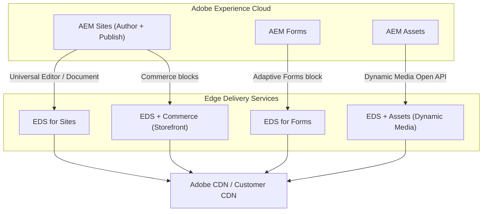

# Edge Delivery Services

Adobe **Edge Delivery Services (EDS)** -- formerly known as Project Helix / Franklin -- is
Adobe's modern content delivery platform. It pushes rendering to the CDN edge, decouples
authoring from delivery, and replaces the traditional Publish + Dispatcher stack for
sites that prioritise speed and a GitHub-first developer workflow. EDS is now a core
pillar of the AEM product family alongside AEM Sites, AEM Forms, and AEM Assets.

This section is a deep-dive into the platform: architecture, blocks (the component
model), customizing, the **helix5 Admin API**, Universal Editor authoring, Sidekick
Library, EDS for Forms, and EDS Commerce Storefront.

## Section map

This page is the entry point. The rest of the section is organised so that you can read
top-to-bottom for a full tour, or jump straight to the chapter you need.

| Chapter | What you'll find |
|---------|------------------|
| [Architecture](./architecture.mdx) | Content Bus, Delivery Pipeline, CDN, URL tiers, push-invalidation |
| [Authoring models](./authoring.mdx) | Document-based vs Universal Editor -- choosing one |
| [Blocks](./blocks.mdx) | The component model: decoration lifecycle, content keys, variations, options, library |
| [Customizing](./customizing.mdx) | `scripts.js`, `aem.js` overrides, `head.html`, fonts, plugins, response headers |
| [Universal Editor](./universal-editor.mdx) | `component-definition.json`, models, filters, `data-aue-*` instrumentation |
| [Development](./development.mdx) | Project bootstrap, `aem-cli`, `fstab.yaml`, `paths.yaml`, GitHub flow |
| [Sidekick](./sidekick.mdx) | Sidekick browser extension + the Sidekick Library plugin model |
| [Admin API (helix5)](./admin-api.mdx) | `admin.hlx.page` reference -- auth, endpoints, webhooks, workflows |
| [Experimentation](./experimentation.mdx) | Built-in A/B testing, audiences, edge-side resolution |
| [Performance](./performance.mdx) | LCP, eager / lazy / delayed loading, automatic optimisations |
| [Forms](./forms.mdx) | EDS for Forms -- Adaptive Forms block, document-based form authoring |
| [Commerce](./commerce.mdx) | EDS Commerce Storefront -- catalog, PDP, cart, checkout |
| [Best practices](./best-practices.mdx) | Hybrid AEM+EDS routing, common pitfalls, licensing, resources |

---

## Product landscape

EDS is not a single product -- it is a **delivery layer** that integrates with multiple
Adobe products. Understanding the variations helps you choose the right approach.

### EDS for Sites

The core offering. Content is authored via AEM + Universal Editor or document-based
authoring (SharePoint / Google Drive), transformed into clean HTML, and served at the
edge. This is what most teams adopt first.

### EDS for Forms

Adobe extended EDS to support **Adaptive Forms**. Authors build forms using the AEM Forms
UI or document-based spreadsheets, and EDS delivers them with the same edge performance.
Form submissions can be routed to AEM, external APIs, or SharePoint. See
[Forms](./forms.mdx).

### EDS + Commerce

A pre-built commerce storefront powered by EDS blocks and Adobe Commerce (Magento) or
third-party commerce backends. Catalog pages, cart, and checkout are rendered at the edge
while the commerce API handles transactions. See [Commerce](./commerce.mdx).

### EDS + Dynamic Media

EDS integrates with **AEM Assets as a Cloud Service** via the Dynamic Media Open API.
Assets are delivered with automatic format negotiation (WebP, AVIF), responsive sizing,
and smart crop -- all at the CDN edge, without a traditional Dispatcher.

---

## EDS vs traditional AEM Publish

| Aspect | Traditional AEM (Publish + Dispatcher) | Edge Delivery Services |
|--------|---------------------------------------|------------------------|
| **Rendering** | Server-side on AEM Publish (HTL + Sling) | Pre-rendered HTML at the edge |
| **CDN** | Dispatcher + optional CDN | Adobe CDN built-in (or BYO CDN) |
| **Lighthouse score** | Varies (typically 60-90) | 100 by design |
| **Authoring** | AEM Page Editor / SPA Editor | Universal Editor or Document-based |
| **Frontend** | HTL + Clientlibs or `ui.frontend` (webpack) | Vanilla JS + CSS in GitHub |
| **Deployment** | Cloud Manager pipeline | Git push -- live in seconds |
| **Component model** | AEM Components (JCR + Sling) | Blocks (HTML tables -- semantic HTML) |
| **Personalisation** | Target / ContextHub | Built-in experimentation (A/B, multivariate) |
| **Complexity** | High (OSGi, Sling, JCR, Dispatcher) | Low (HTML, CSS, JS, GitHub) |
| **Best for** | Complex enterprise sites, SPAs, portals | Marketing sites, landing pages, docs, storefronts |

---

## When to choose EDS

EDS shines for content where edge delivery, fast iteration, and Lighthouse-100 scores
matter:

- Marketing sites, brand sites, campaign landing pages
- Documentation and knowledge bases
- Blogs and content hubs
- Headless commerce storefronts where the cart / checkout state lives in an API
- Pages where authors are content writers (not AEM admins) and prefer
  Word / Google Docs

EDS is **not** the right fit (yet) for:

- Pages that require deep server-side personalisation tied to enterprise SSO
- Heavily authenticated app surfaces (account portals, dashboards)
- Sites that lean on existing AEM Sling Models / OSGi services for rendering
- Workflows that require complex JCR / Workflow integrations at request time

For these you keep AEM Publish, and use [hybrid routing](./best-practices.mdx) at the
CDN to mix the two.

---

## Licensing in one paragraph

EDS is included in **AEM Sites as a Cloud Service** -- there is no separate SKU. Page
views are covered under the AEM Sites tier; the Adobe-managed CDN is included; BYO CDN
traffic is the customer's responsibility; EDS for Forms may need an AEM Forms entitlement;
Commerce Storefront needs Adobe Commerce or a third-party backend. Full breakdown in
[Best practices](./best-practices.mdx#licensing).

---

## External Resources

- [Edge Delivery Services overview](https://experienceleague.adobe.com/docs/experience-manager-cloud-service/content/edge-delivery/overview.html) -- Adobe documentation
- [aem.live](https://www.aem.live/) -- developer docs, tutorials, block library
- [EDS Block Collection](https://www.aem.live/developer/block-collection) -- pre-built blocks
- [AEM Sidekick (Chrome)](https://chromewebstore.google.com/detail/aem-sidekick/igkmdomcgoebiipaifhmpfjhbjccggml)

## See also

- [Architecture](../architecture.mdx) -- traditional AEM architecture for comparison
- [AEM as a Cloud Service](../infrastructure/cloud-service.mdx)
- [Dispatcher Configuration](../infrastructure/dispatcher-configuration.mdx) -- traditional delivery layer
- [GraphQL](../content/graphql.mdx) -- headless content delivery for AEM
- [Content Fragments](../content/content-fragments.md) -- shared content between AEM and EDS
