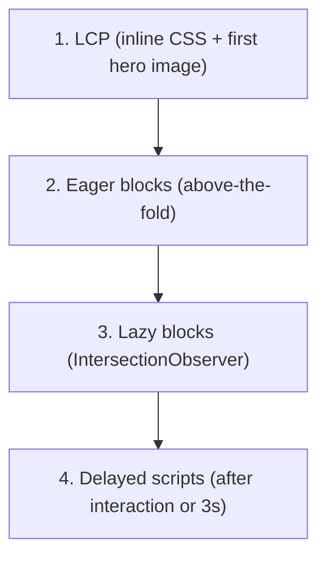

# Performance

EDS is designed to ship a **Lighthouse score of 100** out of the box. The pipeline,
the boilerplate, and the conventions all push you toward Core Web Vitals compliance
unless you actively work against them.

## Three-phase loading strategy



1. **LCP (Largest Contentful Paint)** -- critical CSS is inlined, hero images use
   `fetchpriority="high"` and `loading="eager"`, fonts use `font-display: swap`.
2. **Eager blocks** -- blocks above the fold load immediately so first paint is
   complete.
3. **Lazy blocks** -- below-the-fold blocks load via `IntersectionObserver` only as the
   visitor scrolls.
4. **Delayed scripts** -- analytics, chat widgets, A/B testing tags. Loaded only after
   user interaction (click, scroll, keydown) or after a 3-second timeout, whichever
   comes first.

The phases are wired in `scripts/scripts.js` via `loadEager()`, `loadLazy()`, and
`loadDelayed()` from `aem.js`. See [Blocks](./blocks.mdx#block-lifecycle) for how a
block participates and [Customizing](./customizing.mdx#decoration-overrides) for how
to extend each phase.

## What EDS does automatically

- **Image optimisation** -- format negotiation (WebP / AVIF), responsive `srcset`, lazy
  loading below the fold, `decoding="async"`.
- **CSS / JS code splitting** -- each block's styles and scripts load independently.
- **No render-blocking resources** -- everything outside the inline CSS is async or
  deferred.
- **Minimal DOM** -- clean semantic HTML with no framework overhead.
- **Aggressive caching** -- long cache TTLs with instant purge on publish.
- **Resource hints** -- the boilerplate `head.html` includes `preconnect` and
  `dns-prefetch` for the live origin.

## LCP optimisation

The single biggest determinant of Lighthouse score is the LCP element. EDS marks the
first `<picture>` in the first block as eager:

```html
<picture>
  <source type="image/webp" srcset="..." />
  
</picture>
```

Things that hurt LCP:

- Hero images served from a third-party domain (no preconnect)
- Custom fonts loaded synchronously
- Render-blocking client-side JS in the eager phase
- Block decoration that wipes and rewrites the DOM (each rewrite triggers a layout)

## Measuring on every PR

aem.live ships a **Lighthouse PR check** that fails if a PR drops the score below the
configured threshold. Configure it in `.github/workflows/lighthouse.yml` or use the
template provided by the boilerplate. A score below 100 should be investigated before
merging.

## The delayed-loading rule of thumb

Anything not needed for the first meaningful paint belongs in `delayed.js`:

- Analytics (Adobe Analytics, Adobe Launch, Google Analytics, Plausible, etc.)
- Chat widgets (Intercom, Drift)
- A/B testing scripts that run client-side
- Social-share widgets
- Cookie-consent bars (carefully -- some compliance regimes require these to render
  immediately)
- Recommendations / personalisation that doesn't drive layout

## Common performance regressions

| Symptom | Likely cause | Fix |
|---------|--------------|-----|
| LCP > 2.5s | Hero image not preloaded | Make sure the hero block is the first block on the page; check `<picture>` markup |
| CLS > 0.1 | Block decoration adds elements after layout | Reserve space with CSS (`min-height`, `aspect-ratio`) before decoration runs |
| TBT > 200ms | Heavy JS in eager phase | Move work to `lazy` or `delayed` |
| FCP slow | Render-blocking third-party script in `<head>` | Move it to `delayed.js` |
| Score drops on one page only | A specific block regressed | Bisect by removing blocks until score recovers |

## See also

- [Blocks](./blocks.mdx) -- block lifecycle and the eager / lazy / delayed phases
- [Customizing](./customizing.mdx) -- `head.html`, `scripts.js`, `delayed.js`
- [Architecture](./architecture.mdx) -- pipeline-level optimisations
