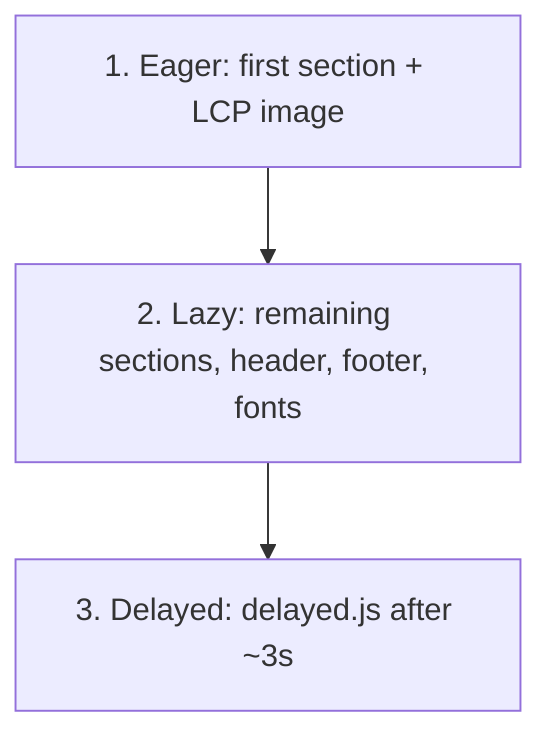

# Performance

EDS is designed to ship a **Lighthouse score of 100** out of the box. The pipeline,
the boilerplate, and the conventions all push you toward Core Web Vitals compliance
unless you actively work against them.

## Three-phase loading strategy


```mermaid
graph TD
    LCP["1. Eager: first section + LCP image"]
    Lazy["2. Lazy: remaining sections, header, footer, fonts"]
    Delayed["3. Delayed: delayed.js after ~3s"]

    LCP --> Lazy
    Lazy --> Delayed
```

The boilerplate splits page loading into three phases ("E-L-D"):

1. **Eager** - `styles.css` is loaded, the first section is decorated, and the runtime waits
   for the first image (the LCP candidate), switching it to `loading="eager"`. Keep the
   payload before LCP small: the aem.live guidance is roughly 100KB aggregated.
2. **Lazy** - right after LCP, the remaining sections and their blocks are decorated, the
   header and footer are loaded, and `lazy-styles.css` and fonts are fetched. Web fonts are
   normally loaded in this phase, with size-adjusted fallback fonts in `styles.css`, so they
   don't delay LCP or cause layout shift.
3. **Delayed** - `delayed.js` is imported by a fixed `setTimeout` (3 seconds by default) in
   `loadDelayed()`. Analytics, chat widgets, and marketing tags belong here.

The phases are wired in `scripts/scripts.js` via `loadEager()`, `loadLazy()`, and
`loadDelayed()` from `aem.js`. See [Blocks](./blocks.mdx#block-lifecycle) for how a
block participates and [Customizing](./customizing.mdx#decoration-overrides) for how
to extend each phase.

## What EDS does automatically

- **Image optimisation** - authored images are served from the media bus as WebP with a
  JPEG/PNG fallback, in several widths (`createOptimizedPicture()` builds the `<picture>` with
  `srcset` and `loading="lazy"` by default).
- **CSS / JS code splitting** - each block's styles and scripts load independently.
- **Small critical path** - only `styles.css`, `aem.js`, `scripts.js`, and the first
  section's block code are needed before LCP; everything else loads later.
- **Minimal DOM** - clean semantic HTML with no framework overhead.
- **Aggressive caching** - long CDN cache TTLs with push invalidation on publish.

## LCP optimisation

The single biggest determinant of Lighthouse score is the LCP element. The runtime waits for
the first image in the first section and switches it to eager loading. When you build your own
hero markup, keep that first image eager and consider `fetchpriority="high"`:

```html
<picture>
  <source type="image/webp" srcset="..." />
  
</picture>
```

Things that hurt LCP:

- Hero images served from a third-party domain (an extra connection on the critical path)
- Custom fonts loaded synchronously in the eager phase
- Render-blocking client-side JS in the eager phase
- Block decoration that wipes and rewrites the DOM (each rewrite triggers a layout)

## Measuring on every PR

Install the **AEM PSI Check** GitHub App on the repository. It runs PageSpeed Insights
against the branch preview URLs listed in the pull request description (the boilerplate's PR
template has a "Test URLs" section for this) and fails the check when the performance score
regresses. A score below 100 should be investigated before merging.

## The delayed-loading rule of thumb

Anything not needed for the first meaningful paint belongs in `delayed.js`:

- Analytics (Adobe Analytics, Adobe Launch, Google Analytics, Plausible, etc.)
- Chat widgets (Intercom, Drift)
- A/B testing scripts that run client-side
- Social-share widgets
- Cookie-consent bars (carefully - some compliance regimes require these to render
  immediately)
- Recommendations / personalisation that doesn't drive layout

## Common performance regressions

| Symptom | Likely cause | Fix |
|---------|--------------|-----|
| LCP > 2.5s | LCP image is not in the first section, or too much code runs before it | Make sure the hero block is the first block on the page; keep pre-LCP payload small |
| CLS > 0.1 | Block decoration adds elements after layout | Reserve space with CSS (`min-height`, `aspect-ratio`) before decoration runs |
| TBT > 200ms | Heavy JS in eager phase | Move work to `lazy` or `delayed` |
| FCP slow | Render-blocking third-party script in `<head>` | Move it to `delayed.js` |
| Score drops on one page only | A specific block regressed | Bisect by removing blocks until score recovers |

## See also

- [Blocks](./blocks.mdx) - block lifecycle and the eager / lazy / delayed phases
- [Customizing](./customizing.mdx) - `head.html`, `scripts.js`, `delayed.js`
- [Architecture](./architecture.mdx) - pipeline-level optimisations
- [Keeping it 100 (aem.live)](https://www.aem.live/developer/keeping-it-100) - official performance guidance and Core Web Vitals targets
- [web.dev Lighthouse](https://web.dev/measure/) - measure and analyse Lighthouse scores
- [Core Web Vitals (web.dev)](https://web.dev/articles/vitals) - LCP, CLS, INP reference
