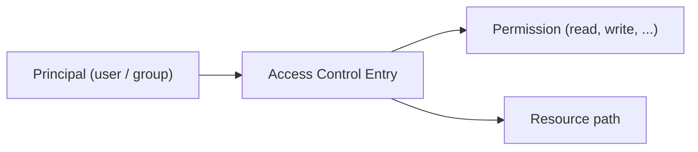
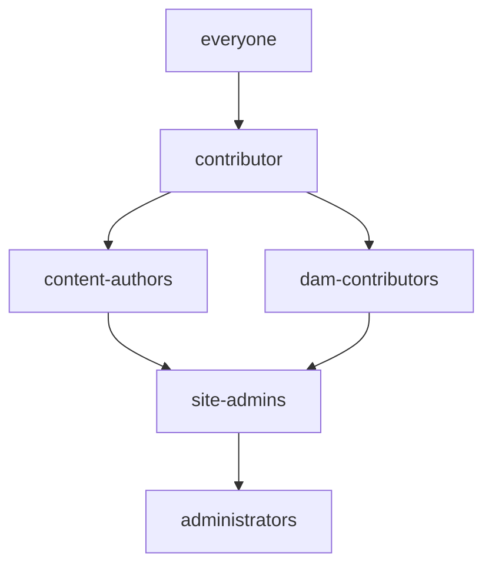

# ACLs and Permissions

AEM's permission model is built on **Jackrabbit Oak's access control** layer. Every read,
write, and delete operation on the JCR is governed by **Access Control Lists (ACLs)**
that map principals (users and groups) to permissions on specific paths. Getting
permissions right is critical for security, multi-tenancy, and operational stability.

This page covers the ACL model, `rep:policy` nodes, `rep:glob` patterns, repoinit scripts,
the **Netcentric ACL Tool**, service users, and practical permission patterns.



---

## Permission Model

### How ACLs work

Every JCR node can have a `rep:policy` child node containing **Access Control Entries
(ACEs)**. Each ACE grants or denies specific privileges to a principal:

```
/content/mysite/
└── rep:policy/
    ├── allow  (rep:GrantACE)
    │   ├── rep:principalName = "content-authors"
    │   └── rep:privileges = ["jcr:read", "rep:write", "crx:replicate"]
    └── deny   (rep:DenyACE)
        ├── rep:principalName = "restricted-editors"
        └── rep:privileges = ["jcr:removeNode"]
```

### Privilege reference

| Privilege                 | Covers                                      |
|---------------------------|---------------------------------------------|
| `jcr:read`                | Read nodes and properties                   |
| `rep:write`               | Create, modify, and delete nodes/properties |
| `jcr:addChildNodes`       | Create child nodes                          |
| `jcr:removeChildNodes`    | Delete child nodes                          |
| `jcr:removeNode`          | Delete the node itself                      |
| `jcr:modifyProperties`    | Modify properties                           |
| `crx:replicate`           | Activate / publish content                  |
| `jcr:readAccessControl`   | Read ACL policies                           |
| `jcr:modifyAccessControl` | Modify ACL policies                         |
| `jcr:lockManagement`      | Lock / unlock nodes                         |
| `jcr:versionManagement`   | Create and restore versions                 |
| `jcr:all`                 | All privileges (superuser)                  |

### Evaluation order

1. ACEs are evaluated **in order** (top to bottom within `rep:policy`)
2. **Deny** takes precedence over **allow** at the same path
3. ACEs on **child paths** override parent ACEs (most specific wins)
4. The `admin` user bypasses all ACL checks
5. `everyone` group applies to all authenticated users

---

## rep:glob Patterns

`rep:glob` restricts an ACE to a **subset of paths** below the ACE's location. This
is powerful for fine-grained control without creating ACEs on every node:

```
/content/mysite/
└── rep:policy/
    └── allow
        ├── rep:principalName = "content-authors"
        ├── rep:privileges = ["jcr:read"]
        └── rep:glob = "*/jcr:content*"
```

### Common glob patterns

| Pattern            | Matches                                                    |
|--------------------|------------------------------------------------------------|
| `""` (empty)       | Only the node itself                                       |
| `*`                | Direct children only                                       |
| `*/jcr:content`    | `jcr:content` of direct children                           |
| `*/jcr:content*`   | `jcr:content` and everything below it, for direct children |
| `/*/jcr:content/*` | Properties/children under `jcr:content` at depth 2         |

### Example: Read-only access to page properties

Allow reading `jcr:content` but not the page node itself (hides the page from navigation):

```
Path: /content/mysite/secret
rep:glob = "*/jcr:content*"
Privilege: jcr:read (allow)
```

---

## Repoinit Scripts (AEMaaCS)

On AEMaaCS, **Repository Initialisation (repoinit)** scripts are the standard way to
manage users, groups, service users, and ACLs declaratively:

```text title="ui.config/.../org.apache.sling.jcr.repoinit.RepositoryInitializer~myproject.cfg.json"
{
    "scripts": [
        "create service user myproject-service-user with path system/myproject",
        "",
        "set ACL for myproject-service-user",
        "    allow jcr:read on /content/mysite",
        "    allow rep:write on /content/mysite",
        "    allow jcr:read on /content/dam/mysite",
        "end",
        "",
        "create group content-authors with path /home/groups/myproject",
        "create group dam-contributors with path /home/groups/myproject",
        "",
        "set ACL for content-authors",
        "    allow jcr:read,rep:write,crx:replicate on /content/mysite",
        "    deny jcr:removeNode on /content/mysite",
        "    allow jcr:read on /content/dam/mysite",
        "end",
        "",
        "set ACL for dam-contributors",
        "    allow jcr:read,rep:write on /content/dam/mysite",
        "    deny crx:replicate on /content/dam/mysite",
        "end"
    ]
}
```

### Repoinit syntax reference

| Statement           | Example                                                           |
|---------------------|-------------------------------------------------------------------|
| Create service user | `create service user my-user with path system/myproject`          |
| Create group        | `create group my-group with path /home/groups/myproject`          |
| Add to group        | `add content-authors to group myproject-super-authors`            |
| Set ACL             | `set ACL for principal-name` ... `end`                            |
| Allow               | `allow jcr:read on /content/mysite`                               |
| Deny                | `deny rep:write on /content/mysite`                               |
| Glob restriction    | `allow jcr:read on /content restriction(rep:glob,*/jcr:content*)` |
| Create path         | `create path /content/mysite(sling:OrderedFolder)`                |

---

## Netcentric ACL Tool

The [Netcentric ACL Tool](https://github.com/Netcentric/accesscontroltool) is the
de facto standard for managing AEM permissions in enterprise projects. It provides a
**YAML-based, idempotent, version-controlled** approach to ACL management.

### Why use it?

| Feature              | Repoinit           | Netcentric ACL Tool                    |
|----------------------|--------------------|----------------------------------------|
| **Format**           | Custom DSL in JSON | YAML                                   |
| **Readability**      | Moderate           | Excellent                              |
| **Group management** | Basic              | Full (hierarchy, membership, profiles) |
| **ACL management**   | Full               | Full (with glob, restrictions, CUGs)   |
| **Idempotent**       | Yes                | Yes                                    |
| **Dump existing**    | No                 | Yes (`acl-dump`)                       |
| **Validation**       | Runtime only       | Pre-deploy validation                  |
| **AEMaaCS**          | Native             | Supported (via content package)        |
| **AEM 6.5**          | Requires config    | Fully supported                        |

### Installation

Add the ACL Tool to your project:

```xml title="all/pom.xml (embedded dependency)"
<dependency>
    <groupId>biz.netcentric.cq.tools.accesscontroltool</groupId>
    <artifactId>accesscontroltool-bundle</artifactId>
    <version>3.7.0</version>
</dependency>
<dependency>
    <groupId>biz.netcentric.cq.tools.accesscontroltool</groupId>
    <artifactId>accesscontroltool-package</artifactId>
    <version>3.7.0</version>
    <type>zip</type>
</dependency>
```

Embed it in your `all` package as a container dependency.

### YAML Configuration

ACL definitions are stored in YAML files under your `ui.config` or `ui.apps` package:

```yaml title="ui.apps/.../acl/myproject-groups.yaml"
# Group definitions
- group_config:
    - content-authors:
        name: "Content Authors"
        description: "Can author content on mysite"
        path: /home/groups/myproject
        isMemberOf: contributor
        members:

    - dam-contributors:
        name: "DAM Contributors"
        description: "Can upload and manage assets"
        path: /home/groups/myproject
        isMemberOf:
        members:

    - site-admins:
        name: "Site Administrators"
        description: "Full access to mysite"
        path: /home/groups/myproject
        isMemberOf: content-authors, dam-contributors
        members:
```

```yaml title="ui.apps/.../acl/myproject-acls.yaml"
# ACL definitions
- content-authors:

    # Content pages: read, write, replicate
    - path: /content/mysite
      permission: allow
      privileges: jcr:read,rep:write,crx:replicate
      actions:

    # DAM: read-only
    - path: /content/dam/mysite
      permission: allow
      privileges: jcr:read

    # Tags: read and create
    - path: /content/cq:tags/mysite
      permission: allow
      privileges: jcr:read,jcr:addChildNodes,jcr:modifyProperties

    # Deny deleting top-level pages
    - path: /content/mysite
      permission: deny
      privileges: jcr:removeNode
      repGlob: ""

    # Experience Fragments: read and write
    - path: /content/experience-fragments/mysite
      permission: allow
      privileges: jcr:read,rep:write

- dam-contributors:

    - path: /content/dam/mysite
      permission: allow
      privileges: jcr:read,rep:write

    # Deny publish (requires approval workflow)
    - path: /content/dam/mysite
      permission: deny
      privileges: crx:replicate

- site-admins:

    # Full access
    - path: /content/mysite
      permission: allow
      privileges: jcr:all

    - path: /content/dam/mysite
      permission: allow
      privileges: jcr:all

    - path: /content/experience-fragments/mysite
      permission: allow
      privileges: jcr:all
```

### Applying ACLs

The ACL Tool runs automatically on **package installation** (via an install hook) or
can be triggered manually:

```bash
# Via curl (on-prem / SDK)
curl -u admin:admin -X POST \
  "http://localhost:4502/system/console/jmx/biz.netcentric.cq.tools.accesscontroltool:type=ACTService/op/apply"
```

### Dumping existing permissions

Export the current ACL state to YAML for analysis or migration:

```bash
# Dump all permissions for a group
curl -u admin:admin \
  "http://localhost:4502/system/console/jmx/biz.netcentric.cq.tools.accesscontroltool:type=ACTService/op/getDump/java.lang.String" \
  -d "p0=content-authors"
```

Or use the **ACL Tool dump** page in the Felix console:
`/system/console/actool`

### Advanced YAML features

#### Glob restrictions

```yaml
- content-authors:
    - path: /content/mysite
      permission: allow
      privileges: jcr:read
      repGlob: "*/jcr:content*"
```

#### CUG (Closed User Group)

```yaml
- premium-users:
    - path: /content/mysite/premium
      permission: allow
      privileges: jcr:read
      actions: read

# Set CUG on the premium section
- cug_config:
    - path: /content/mysite/premium
      principalNames: premium-users
```

#### Conditional ACLs (per run mode)

```yaml
# Only apply on publish
- content-authors:
    - path: /content/mysite
      permission: allow
      privileges: jcr:read
      runModes: publish
```

---

## Service Users

**Service users** are system-level principals that OSGi services use to access the JCR.
They replace the deprecated `loginAdministrative()` approach.

### Creating a service user

**Repoinit (AEMaaCS):**

```text
create service user myproject-content-reader with path system/myproject

set ACL for myproject-content-reader
    allow jcr:read on /content/mysite
    allow jcr:read on /content/dam/mysite
end
```

**Netcentric ACL Tool:**

```yaml
- system_users:
    - myproject-content-reader:
        path: /home/users/system/myproject
        isMemberOf:

- myproject-content-reader:
    - path: /content/mysite
      permission: allow
      privileges: jcr:read
    - path: /content/dam/mysite
      permission: allow
      privileges: jcr:read
```

### Service user mapping

Map the service user to your bundle:

```json title="ui.config/.../config/org.apache.sling.serviceusermapping.impl.ServiceUserMapperImpl.amended~myproject.cfg.json"
{
    "user.mapping": [
        "com.myproject.core:content-reader=myproject-content-reader",
        "com.myproject.core:content-writer=myproject-content-writer"
    ]
}
```

### Using in code

```java
@Reference
private ResourceResolverFactory resolverFactory;

public void readContent() {
    Map<String, Object> authInfo = Map.of(
        ResourceResolverFactory.SUBSERVICE, "content-reader"
    );

    try (ResourceResolver resolver = resolverFactory.getServiceResourceResolver(authInfo)) {
        Resource resource = resolver.getResource("/content/mysite/en/home");
        // Read content with the service user's permissions
    } catch (LoginException e) {
        log.error("Service user login failed", e);
    }
}
```

---

## Group Hierarchy

Design a group hierarchy that follows the **principle of least privilege**:



### Recommended group structure

| Group                | Purpose                              | Key permissions                                      |
|----------------------|--------------------------------------|------------------------------------------------------|
| `content-authors`    | Author and publish content pages     | read, write, replicate on `/content/mysite`          |
| `dam-contributors`   | Upload and manage assets             | read, write on `/content/dam/mysite`                 |
| `dam-publishers`     | Publish assets                       | read, replicate on `/content/dam/mysite`             |
| `tag-administrators` | Manage the tag taxonomy              | read, write on `/content/cq:tags/mysite`             |
| `template-authors`   | Create and manage editable templates | read, write on `/conf/mysite/settings/wcm/templates` |
| `site-admins`        | Full access to a specific site       | all on `/content/mysite`, `/content/dam/mysite`      |
| `workflow-users`     | Start and participate in workflows   | read on `/var/workflow/models`                       |

---

## Closed User Groups (CUGs)

CUGs restrict **read access** to a subtree for specific groups. They are commonly used
for premium content, member-only sections, or intranets:

### Setting up a CUG

```xml title="CUG policy on a page"
<jcr:root xmlns:rep="internal"
    rep:cugPolicy="rep:CugPolicy"
    rep:principalNames="[premium-members]"/>
```

### Via repoinit

```text
create path /content/mysite/premium(cq:Page)
set CUG for /content/mysite/premium
    principalNames = premium-members
end
```

### How CUGs work

1. The `rep:cugPolicy` node restricts `jcr:read` to the listed principals
2. All other users (including anonymous) are denied read access
3. CUGs only affect **read access**; write access is controlled by regular ACLs
4. CUGs are inherited by child nodes

---

## Programmatic ACL Management

### Reading ACLs

```java
import javax.jcr.Session;
import javax.jcr.security.AccessControlManager;
import javax.jcr.security.AccessControlPolicy;
import javax.jcr.security.AccessControlList;
import javax.jcr.security.AccessControlEntry;

Session session = resolver.adaptTo(Session.class);
AccessControlManager acm = session.getAccessControlManager();

AccessControlPolicy[] policies = acm.getPolicies("/content/mysite");
for (AccessControlPolicy policy : policies) {
    if (policy instanceof AccessControlList) {
        AccessControlList acl = (AccessControlList) policy;
        for (AccessControlEntry ace : acl.getAccessControlEntries()) {
            log.info("Principal: {}, Privileges: {}",
                ace.getPrincipal().getName(),
                Arrays.toString(ace.getPrivileges()));
        }
    }
}
```

### Setting ACLs programmatically

```java
import org.apache.jackrabbit.api.security.JackrabbitAccessControlList;
import org.apache.jackrabbit.api.security.JackrabbitAccessControlManager;

JackrabbitAccessControlManager acm =
    (JackrabbitAccessControlManager) session.getAccessControlManager();

JackrabbitAccessControlList acl = null;
for (AccessControlPolicy policy : acm.getPolicies("/content/mysite")) {
    if (policy instanceof JackrabbitAccessControlList) {
        acl = (JackrabbitAccessControlList) policy;
        break;
    }
}

if (acl == null) {
    // Create a new ACL
    for (AccessControlPolicy policy : acm.getApplicablePolicies("/content/mysite")) {
        if (policy instanceof JackrabbitAccessControlList) {
            acl = (JackrabbitAccessControlList) policy;
            break;
        }
    }
}

// Add an allow ACE
Privilege[] privileges = new Privilege[]{
    acm.privilegeFromName("jcr:read"),
    acm.privilegeFromName("rep:write")
};

Principal principal = new PrincipalImpl("content-authors");
acl.addAccessControlEntry(principal, privileges);

// Apply
acm.setPolicy("/content/mysite", acl);
session.save();
```

---

## Testing Permissions

### Impersonation

Use **User Admin** or the Impersonate feature to test as a specific user:

1. Navigate to `/security/users.html`
2. Select a user
3. Click **Impersonate**
4. Browse the site as that user

### Permission checker

AEM provides a permission check endpoint:

```
GET /system/console/jcr?path=/content/mysite&user=content-author-user
```

### Groovy Console

```groovy
import javax.jcr.Session

def session = resourceResolver.adaptTo(Session.class)
def acm = session.accessControlManager

// Check if current user can read
def canRead = acm.hasPrivileges("/content/mysite",
    [acm.privilegeFromName("jcr:read")] as javax.jcr.security.Privilege[])
println "Can read /content/mysite: $canRead"

// Check if current user can write
def canWrite = acm.hasPrivileges("/content/mysite",
    [acm.privilegeFromName("rep:write")] as javax.jcr.security.Privilege[])
println "Can write /content/mysite: $canWrite"
```

---

## AEMaaCS Considerations

- **Repoinit** is the preferred approach for service users and baseline ACLs on AEMaaCS
- The Netcentric ACL Tool works on AEMaaCS (deployed as a content package)
- CRXDE Lite is not available in production; all permission management must be code-driven
- The Felix console is accessible via the **Developer Console** (limited)
- Cloud Manager pipelines run repoinit scripts on deployment
- Use **repoinit for service users** and **ACL Tool for content-level permissions**

---

## Best Practices

### Follow the principle of least privilege

Grant only the permissions a group needs. Start with nothing and add permissions
incrementally.

### Use groups, not users

Never assign permissions directly to users. Always create groups and assign users to
groups.

### Version-control all permissions

Whether using repoinit or the ACL Tool, all permission definitions should be in your
Git repository and deployed via CI/CD.

### Test on a lower environment first

Apply permission changes on dev/stage before production. Permission mistakes can lock
out users or expose restricted content.

### Use the ACL Tool dump for auditing

Periodically dump permissions and review them for drift from the code-defined baseline.

### Separate read and write permissions

Don't grant `rep:write` when only `jcr:read` is needed. Use `jcr:modifyProperties` if
users only need to edit existing content, not create or delete nodes.

---

## Common Pitfalls

| Pitfall                                    | Solution                                                                                  |
|--------------------------------------------|-------------------------------------------------------------------------------------------|
| Users can't see pages after deployment     | Check that the group has `jcr:read` on `/content` and all ancestor nodes                  |
| ACL Tool runs but permissions don't apply  | Verify the YAML is syntactically correct; check the ACL Tool log in Felix console         |
| Service user gets `LoginException`         | Check the service user mapping and ensure the user exists (repoinit must run first)       |
| Deny ACE has no effect                     | Deny is evaluated in order; ensure it comes after (or at the same level as) the allow ACE |
| CUG blocks all anonymous access            | CUGs deny `jcr:read` to everyone not in the principal list; verify the group membership   |
| `rep:glob` matches too broadly             | Test glob patterns carefully; empty string `""` matches only the node itself              |
| Permissions work on author but not publish | Ensure ACLs are also set for publish-side groups; check if CUGs are enabled on publish    |
| Repoinit script fails silently             | Check the error.log for repoinit execution errors after deployment                        |

## See also

- [Security Basics](./security.mdx) -- CSRF, XSS, referrer filter, and more
- [Sling Models and Services](../backend/sling-models.mdx) -- service user usage
- [Servlets](../backend/servlets.mdx) -- servlet security and ACL bypasses
- [AEM as a Cloud Service](./cloud-service.mdx) -- repoinit, immutable paths, Developer Console
- [Deployment](./deployment.mdx) -- deploying repoinit and ACL Tool configs
- [Groovy Console](../groovy-console.mdx) -- testing permissions interactively
- [Workflows](../backend/workflows.mdx) -- workflow service users
- [Render Conditions](../ui/render-conditions.mdx) -- UI-level permission checks
