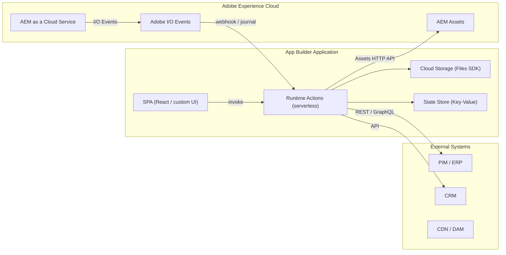
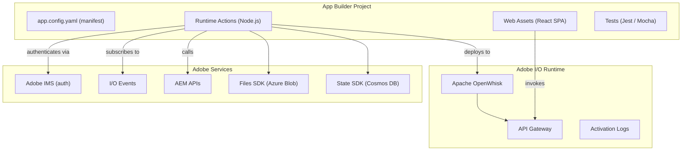
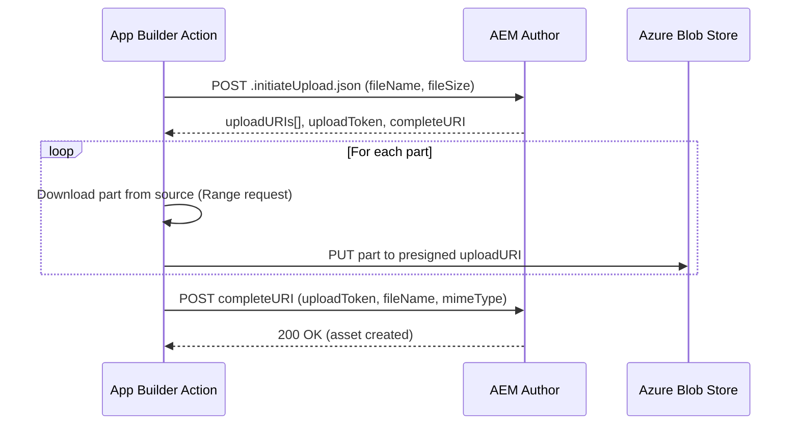
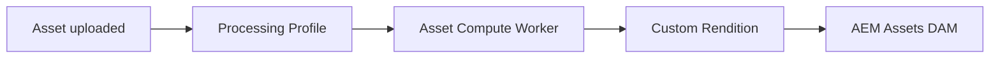

# Adobe I/O App Builder

**Adobe I/O App Builder** (formerly Project Firefly) is a serverless extensibility framework
for building custom integrations and microservices on top of the Adobe Experience Cloud. It
runs on **Adobe I/O Runtime** (an Apache OpenWhisk-based serverless platform) and provides
first-class integration with AEM as a Cloud Service, Adobe Commerce, Workfront, and other
Adobe products.

App Builder is the recommended way to extend AEMaaCS when you need logic that runs
**outside the JVM** -- event processing, third-party API integrations, asset pipelines,
custom webhooks, or backend-for-frontend services.



---

## When to Use App Builder

| Use case                                                                           | Why App Builder?                                                |
|------------------------------------------------------------------------------------|-----------------------------------------------------------------|
| **React to AEM events** (page publish, asset upload, CF changes)                   | I/O Events + Runtime Actions = event-driven, no AEM code needed |
| **Third-party integrations** (PIM sync, CRM enrichment, translation APIs)          | Serverless actions run outside AEM; no OSGi bundle deployment   |
| **Custom asset processing** (watermarking, metadata enrichment, format conversion) | Asset Compute workers extend the DAM processing pipeline        |
| **Backend-for-frontend** (custom APIs for SPAs or mobile apps)                     | Lightweight HTTP endpoints with built-in auth                   |
| **Custom AEM UIs** (admin panels, dashboards, content tools)                       | SPA hosted on Adobe CDN, integrated into AEM Shell              |
| **Bulk operations** (migration scripts, batch metadata updates)                    | Long-running orchestration without tying up AEM threads         |

### When NOT to use App Builder

- **Server-side rendering** that needs access to the JCR -- use Sling Models/Servlets instead
- **Author-time logic** (dialog validation, render conditions) -- use Granite UI / Coral UI
- **Simple OSGi configuration changes** -- deploy via Cloud Manager
- **Low-latency, high-frequency operations** -- serverless cold starts may add latency

---

## Architecture

### Core Components



| Component           | Description                                                                   |
|---------------------|-------------------------------------------------------------------------------|
| **Runtime Actions** | Serverless Node.js functions (max 60s default, 60 min with async)             |
| **Web Assets**      | Optional React SPA served from Adobe's CDN, embedded in AEM Shell             |
| **Files SDK**       | Cloud file storage (Azure Blob under the hood) for temporary/persistent files |
| **State SDK**       | Key-value store (Azure Cosmos DB) for caching, state, and configuration       |
| **I/O Events**      | Pub/sub event system -- AEM publishes events, actions consume them            |
| **Adobe IMS**       | OAuth 2.0 authentication and service-to-service tokens                        |

### Execution Model

Runtime Actions are **stateless, short-lived functions**. Each invocation:

1. Receives a JSON params object (HTTP request body + headers + runtime config)
2. Executes Node.js code (max memory: 256 MB default, configurable up to 2 GB)
3. Returns a JSON response
4. Logs are available via `aio app logs`

Cold starts typically add 100-500 ms on the first invocation. Warm containers reuse
for subsequent calls.

---

## Project Setup

### Prerequisites

- **Node.js** 18+ and npm
- **Adobe Developer Console** access with an App Builder workspace
- The **Adobe I/O CLI** (`aio`)

### Install the CLI

```bash
npm install -g @adobe/aio-cli
```

### Create a new project

```bash
# Log in to Adobe IMS
aio login

# Initialise a new App Builder project
aio app init my-aem-integration

# Follow the prompts:
# - Select your Adobe Org
# - Select or create a project in Developer Console
# - Choose a workspace (Stage / Production)
# - Select templates (e.g., "publish-events" or blank)
```

### Project structure

```
my-aem-integration/
├── app.config.yaml          # Deployment manifest
├── package.json
├── .env                     # Local environment variables (secrets)
├── .aio                     # CLI configuration (auto-generated)
├── src/
│   └── dx-excshell-1/       # Named "extension" (can have multiple)
│       ├── actions/          # Runtime Actions
│       │   ├── generic/
│       │   │   └── index.js  # A sample action
│       │   └── utils.js      # Shared utilities
│       ├── web-src/          # Optional SPA (React)
│       │   ├── src/
│       │   └── index.html
│       └── ext.config.yaml   # Extension-specific config
├── test/                     # Unit and integration tests
│   └── actions/
│       └── generic.test.js
└── e2e/                      # End-to-end tests
```

### app.config.yaml

The manifest defines actions, their runtime configuration, and event registrations:

```yaml title="app.config.yaml"
application:
  actions: actions
  web: web-src
```

```yaml title="src/dx-excshell-1/ext.config.yaml"
operations:
  view:
    - type: web
      impl: index.html

actions:
  asset-upload:
    function: actions/asset-upload/index.js
    web: 'yes'
    runtime:
      memory: 512        # MB
      timeout: 300000     # ms (5 min)
    inputs:
      AEM_HOST: $AEM_HOST
      AEM_TOKEN: $AEM_TOKEN
    annotations:
      require-adobe-auth: true  # Enforce IMS authentication
      final: true

  event-handler:
    function: actions/event-handler/index.js
    web: 'no'
    runtime:
      memory: 256
      timeout: 60000
    inputs:
      AEM_HOST: $AEM_HOST
    annotations:
      final: true
```

---

## Authentication

App Builder actions authenticate against AEM using **service-to-service OAuth** (technical
accounts) or **user tokens** (for UI-driven flows).

### Service-to-service (server-side actions)

For backend actions that run without a user context, use a **Technical Account** (also
called Service Credentials):

1. In the Adobe Developer Console, add the **AEM as a Cloud Service** API to your project
2. Generate a **Service Account (JWT)** credential or use **OAuth Server-to-Server** (recommended)
3. Store the credentials as environment variables

```bash title=".env (local development only)"
AEM_HOST=https://author-p12345-e67890.adobeaemcloud.com
AEM_TECHNICAL_ACCOUNT_ID=ABC123@techacct.adobe.com
AEM_CLIENT_ID=your-client-id
AEM_CLIENT_SECRET=your-client-secret
AEM_ORG_ID=your-org@AdobeOrg
AEM_IMS_ENDPOINT=https://ims-na1.adobelogin.com
```

In your action, use the Adobe I/O SDK to fetch an access token:

```js title="actions/utils.js"
const { Core } = require('@adobe/aio-sdk');
const fetch = require('node-fetch');

/**
 * Get a bearer token for AEM using OAuth Server-to-Server credentials.
 */
async function getAemAccessToken(params) {
    const response = await fetch(
        `${params.AEM_IMS_ENDPOINT}/ims/token/v3`, {
        method: 'POST',
        headers: { 'Content-Type': 'application/x-www-form-urlencoded' },
        body: new URLSearchParams({
            client_id: params.AEM_CLIENT_ID,
            client_secret: params.AEM_CLIENT_SECRET,
            grant_type: 'client_credentials',
            scope: 'AdobeID,openid,aem.author'
        })
    });

    const data = await response.json();
    return data.access_token;
}

module.exports = { getAemAccessToken };
```

### Local Developer Token (for testing)

During development, you can use a **Local Development Token** from the AEM Developer
Console (`https://author-pXXXXX-eYYYYY.adobeaemcloud.com/developer-console`):

1. Open the Developer Console for your AEM environment
2. Click **Integrations** → **Get Local Development Token**
3. Copy the token and use it as a bearer token

> Local Development Tokens expire after 24 hours and are tied to the user's permissions.
> Never use them in production.

---

## Adobe I/O Events Integration

I/O Events enable **event-driven architectures** where AEM publishes events and App
Builder actions react to them automatically.

### Common AEM event types

| Event Provider | Event Type | Triggered when |
|---------------|------------|----------------|
| AEM Assets | `asset_created` | A new asset is uploaded |
| AEM Assets | `asset_updated` | An asset is modified or reprocessed |
| AEM Assets | `asset_deleted` | An asset is removed |
| AEM Content Fragments | `content_fragment_created` | A new CF is created |
| AEM Content Fragments | `content_fragment_modified` | A CF is updated |
| AEM Content Fragments | `content_fragment_published` | A CF is published |
| AEM Content Fragments | `content_fragment_unpublished` | A CF is unpublished |
| AEM Pages | `page_published` | A page is activated |
| AEM Pages | `page_unpublished` | A page is deactivated |

### Registering an event consumer

1. In the **Adobe Developer Console**, add the **I/O Events** service to your project
2. Create an **Event Registration** for the desired event types
3. Point it at your Runtime Action (webhook) or use the **Journaling API** for polling

### Event handler action

```js title="actions/event-handler/index.js"
const { Core } = require('@adobe/aio-sdk');
const { getAemAccessToken } = require('../utils');

async function main(params) {
    const logger = Core.Logger('event-handler', { level: 'info' });

    try {
        // I/O Events delivers the event payload in params
        const event = params.event || params;
        const eventType = event.type || event['@type'];
        const eventData = event.data || event.activitystreams?.object;

        logger.info(`Received event: ${eventType}`);
        logger.info(`Resource: ${JSON.stringify(eventData)}`);

        // Example: react to asset creation
        if (eventType.includes('asset_created')) {
            const assetPath = eventData?.path;
            logger.info(`New asset created at: ${assetPath}`);

            // Fetch an access token and call AEM APIs
            const token = await getAemAccessToken(params);

            // Example: enrich metadata, notify a downstream system, etc.
            await enrichAssetMetadata(params.AEM_HOST, token, assetPath, logger);
        }

        return {
            statusCode: 200,
            body: { message: 'Event processed successfully' }
        };
    } catch (error) {
        logger.error(`Event processing failed: ${error.message}`);
        return {
            statusCode: 500,
            body: { error: error.message }
        };
    }
}

async function enrichAssetMetadata(host, token, assetPath, logger) {
    const fetch = require('node-fetch');

    // Read current metadata
    const metaUrl = `${host}${assetPath}/jcr:content/metadata.json`;
    const metaResponse = await fetch(metaUrl, {
        headers: { 'Authorization': `Bearer ${token}` }
    });
    const metadata = await metaResponse.json();

    // Add a custom property
    const updateUrl = `${host}${assetPath}/jcr:content/metadata`;
    await fetch(updateUrl, {
        method: 'POST',
        headers: {
            'Authorization': `Bearer ${token}`,
            'Content-Type': 'application/x-www-form-urlencoded'
        },
        body: new URLSearchParams({
            'processedByAppBuilder': 'true',
            'processingTimestamp': new Date().toISOString()
        })
    });

    logger.info(`Metadata enriched for: ${assetPath}`);
}

exports.main = main;
```

---

## Asset Upload via Direct Binary Access

A common App Builder use case is ingesting assets from external systems into AEM Assets.
AEMaaCS provides a **Direct Binary Upload API** that avoids sending large files through the
AEM servlet engine.

### How it works



The three API steps:

1. **Initiate Upload** -- AEM returns presigned blob storage URLs (one per part) and an upload token
2. **Upload Binary** -- upload each part directly to the blob store (no auth needed, URLs are presigned)
3. **Complete Upload** -- tell AEM the upload is done; AEM creates the `dam:Asset` node

### Full implementation

The following is a production-ready streaming implementation. It downloads the source file
in parts (using HTTP Range requests) and uploads each part to the presigned URLs, keeping
memory usage low even for multi-gigabyte files.

```js title="actions/asset-upload/streamAssetToAEM.js"
const fetch = require('node-fetch');

/**
 * Step 1: Initiate the upload.
 * @see https://experienceleague.adobe.com/en/docs/experience-manager-cloud-service/content/assets/admin/developer-reference-material-apis#initiate-upload
 */
async function initUpload({host, folderPath, fileName, fileSize, auth, logger = console}) {
    try {
        const url = `${host}/content/dam/${folderPath}.initiateUpload.json`;

        const formData = new URLSearchParams();
        formData.append('fileName', fileName);
        formData.append('fileSize', fileSize);

        const response = await fetch(url, {
            method: 'POST',
            headers: { 'Authorization': auth },
            body: formData
        });

        const data = await response.json();
        const cookies = response.headers.get('set-cookie');

        return {
            success: true,
            data,
            affinityCookie: cookies || null
        };
    } catch (error) {
        return { success: false, error: error.message };
    }
}

/**
 * Step 2: Upload a single binary part to the presigned URL.
 * @see https://experienceleague.adobe.com/en/docs/experience-manager-cloud-service/content/assets/admin/developer-reference-material-apis#upload-binary
 */
async function upload({uploadURL, binaryData, logger = console}) {
    try {
        const response = await fetch(uploadURL, {
            method: 'PUT',
            // No authentication needed -- URLs are presigned by AEM
            headers: { 'Content-Type': 'application/octet-stream' },
            body: binaryData
        });

        if (!response.ok) {
            throw new Error(`Upload failed with status: ${response.status}`);
        }

        return { success: true };
    } catch (error) {
        return { success: false, error: error.message };
    }
}

/**
 * Step 3: Complete the upload -- AEM creates the dam:Asset node.
 * @see https://experienceleague.adobe.com/en/docs/experience-manager-cloud-service/content/assets/admin/developer-reference-material-apis#complete-upload
 */
async function completeUpload({completeURI, uploadToken, fileName, mimeType, auth, affinityCookie, logger = console}) {
    try {
        const formData = new URLSearchParams();
        formData.append('fileName', fileName);
        formData.append('uploadToken', uploadToken);
        formData.append('mimeType', mimeType);

        const headers = {
            'Authorization': auth,
            'Content-Type': 'application/x-www-form-urlencoded'
        };

        if (affinityCookie) {
            headers['Cookie'] = affinityCookie;
        }

        const response = await fetch(completeURI, {
            method: 'POST',
            headers,
            body: formData
        });

        let responseText = '';
        try { responseText = await response.text(); } catch (e) { /* ignore */ }

        if (!response.ok) {
            throw new Error(`Complete upload failed: ${response.status} - ${responseText}`);
        }

        let responseData = {};
        try { responseData = responseText ? JSON.parse(responseText) : {}; } catch (e) { /* ignore */ }

        return { success: true, data: responseData };
    } catch (error) {
        return { success: false, error: error.message };
    }
}

/**
 * Downloads and uploads a single part using HTTP Range requests.
 */
async function downloadAndUploadPart({sourceUrl, uploadURL, partIndex, totalParts, partStart, partEnd, fileSize, logger = console}) {
    const partLength = partEnd - partStart + 1;
    if (partLength <= 0) {
        return {success: true, bytesProcessed: 0};
    }

    try {
        const partResponse = await fetch(sourceUrl, {
            method: 'GET',
            headers: { 'Range': `bytes=${partStart}-${partEnd}` }
        });

        if (!partResponse.ok && partResponse.status !== 206) {
            throw new Error(`Failed to download part ${partIndex + 1}: Status ${partResponse.status}`);
        }

        const partBuffer = await partResponse.buffer();

        const uploadResult = await upload({ uploadURL, binaryData: partBuffer, logger });
        if (!uploadResult.success) {
            throw new Error(`Failed to upload part ${partIndex + 1}: ${uploadResult.error}`);
        }

        return {success: true, bytesProcessed: partBuffer.length};
    } catch (error) {
        return {success: false, error: error.message};
    }
}

/**
 * Handles multi-part upload with configurable concurrency.
 * Downloads from source and uploads to blob store in batches.
 */
async function handleMultiPartUpload({sourceUrl, uploadURIs, fileSize, minPartSize, maxPartSize, logger = console, maxConcurrent = 5}) {
    try {
        const numParts = Math.max(uploadURIs.length, 1);
        const partSize = Math.max(
            minPartSize || Math.ceil(fileSize / numParts),
            Math.ceil(fileSize / numParts)
        );

        const parts = Array.from({length: numParts}, (_, i) => {
            const partStart = i * partSize;
            const partEnd = Math.min(partStart + partSize, fileSize) - 1;
            return {
                index: i,
                partStart,
                partEnd,
                length: partEnd - partStart + 1,
                uploadURL: uploadURIs[Math.min(i, uploadURIs.length - 1)]
            };
        });

        const validParts = parts.filter(part => part.length > 0);

        // Process in batches to limit concurrency
        const batches = [];
        for (let i = 0; i < validParts.length; i += maxConcurrent) {
            batches.push(validParts.slice(i, i + maxConcurrent));
        }

        for (let batchIndex = 0; batchIndex < batches.length; batchIndex++) {
            const batch = batches[batchIndex];

            const batchResults = await Promise.allSettled(
                batch.map(part => downloadAndUploadPart({
                    sourceUrl,
                    uploadURL: part.uploadURL,
                    partIndex: part.index,
                    totalParts: numParts,
                    partStart: part.partStart,
                    partEnd: part.partEnd,
                    fileSize,
                    logger
                }))
            );

            const failedParts = batchResults.filter(
                r => r.status === 'rejected' || (r.status === 'fulfilled' && !r.value.success)
            );

            if (failedParts.length > 0) {
                throw new Error(
                    `${failedParts.length}/${batch.length} parts failed in batch ${batchIndex + 1}`
                );
            }
        }

        return {success: true};
    } catch (error) {
        return {success: false, error: error.message};
    }
}

function createAbsoluteUrl(url, host) {
    if (url.startsWith('http')) return url;
    if (url.startsWith('/') && host.endsWith('/')) return `${host.slice(0, -1)}${url}`;
    if (!url.startsWith('/') && !host.endsWith('/')) return `${host}/${url}`;
    return `${host}${url}`;
}

/**
 * Main orchestrator: streams an asset from a URL into AEM Assets.
 *
 * @param {string} sourceUrl - The URL of the asset to download
 * @param {string} host - AEM host URL (e.g., https://author-pXXX-eYYY.adobeaemcloud.com)
 * @param {string} folderPath - Target folder in DAM (without /content/dam/)
 * @param {string} fileName - Target file name
 * @param {string} auth - Authorization header value (Bearer token)
 * @param {Object} [logger] - Optional logger
 */
async function streamAssetToAEM({sourceUrl, host, folderPath, fileName, auth, logger = console}) {
    try {
        // 1. HEAD request to get file size without downloading
        const headResponse = await fetch(sourceUrl, {method: 'HEAD'});
        const fileSize = parseInt(headResponse.headers.get('Content-Length'), 10);

        // 2. Initiate upload -- AEM returns presigned URLs
        const initResult = await initUpload({host, folderPath, fileName, fileSize, auth, logger});
        const {data, affinityCookie} = initResult;
        const fileInfo = data.files[0];

        // 3. Stream binary parts to blob store
        const uploadResult = await handleMultiPartUpload({
            sourceUrl,
            uploadURIs: fileInfo.uploadURIs,
            fileSize,
            minPartSize: fileInfo.minPartSize,
            maxPartSize: fileInfo.maxPartSize,
            logger
        });

        // 4. Complete the upload -- AEM creates the asset
        const completeURL = createAbsoluteUrl(data.completeURI, host);
        const completeResult = await completeUpload({
            completeURI: completeURL,
            uploadToken: fileInfo.uploadToken,
            fileName,
            mimeType: fileInfo.mimeType,
            auth,
            affinityCookie,
            logger
        });

        return {
            success: true,
            data: {
                ...completeResult.data,
                fileSize,
                assetPath: `${folderPath}/${fileName}`
            }
        };
    } catch (error) {
        return { success: false, error: error.message };
    }
}

module.exports = { streamAssetToAEM };
```

### Calling the upload

```js title="actions/asset-upload/index.js"
const { streamAssetToAEM } = require('./streamAssetToAEM');
const { Core } = require('@adobe/aio-sdk');

async function main(params) {
    const logger = Core.Logger('asset-upload', { level: 'info' });

    // Use AEM Technical Account or Local Developer Token
    const auth = `Bearer ${params.AEM_TOKEN}`;

    const result = await streamAssetToAEM({
        sourceUrl: params.sourceUrl,
        host: params.AEM_HOST,
        folderPath: params.folderPath || 'imports/app-builder',
        fileName: params.fileName || 'uploaded-asset.jpg',
        auth,
        logger
    });

    if (!result.success) {
        return {
            statusCode: 500,
            body: { error: result.error }
        };
    }

    const targetUrl = `${params.AEM_HOST}/content/dam/${result.data.assetPath}`;
    logger.info(`Asset uploaded to: ${targetUrl}`);

    return {
        statusCode: 200,
        body: {
            assetPath: result.data.assetPath,
            assetUrl: targetUrl,
            fileSize: result.data.fileSize
        }
    };
}

exports.main = main;
```

### Creating a DAM folder

Before uploading, you may need to ensure the target folder exists:

```js title="actions/utils/createDamFolder.js"
const fetch = require('node-fetch');

async function createDamFolder(host, folderPath, folderTitle, auth, logger = console) {
    const formData = new URLSearchParams();
    formData.append('./jcr:content/jcr:title', folderTitle);
    formData.append(':name', folderPath.split('/').pop());
    formData.append('./jcr:primaryType', 'sling:OrderedFolder');
    formData.append('./jcr:content/jcr:primaryType', 'nt:unstructured');
    formData.append('_charset_', 'UTF-8');

    const parentPath = folderPath.substring(0, folderPath.lastIndexOf('/'));
    const url = `${host}/content/dam/${parentPath}`;

    const response = await fetch(url, {
        method: 'POST',
        headers: {
            'Authorization': auth,
            'Content-Type': 'application/x-www-form-urlencoded'
        },
        body: formData
    });

    if (!response.ok && response.status !== 409) {
        // 409 = folder already exists (which is fine)
        throw new Error(`Failed to create folder: ${response.status}`);
    }

    logger.info(`Folder ready at /content/dam/${folderPath}`);
    return `/content/dam/${folderPath}`;
}

module.exports = { createDamFolder };
```

---

## Custom Asset Compute Workers

For AEMaaCS, **Asset Compute** workers are specialised App Builder actions that plug
into the DAM asset processing pipeline. They run automatically when assets are uploaded
and can generate custom renditions.



### Creating a worker

```bash
aio app init my-asset-worker --template @adobe/aio-cli-plugin-asset-compute
```

```js title="actions/worker/index.js"
const { worker } = require('@adobe/asset-compute-sdk');
const { serializeXmp } = require('@adobe/asset-compute-xmp');

exports.main = worker(async (source, rendition, params) => {
    // source.url -- presigned URL to the original asset
    // rendition.path -- local temp path for the output file

    // Example: generate a watermarked version using sharp
    const sharp = require('sharp');
    const response = await fetch(source.url);
    const buffer = await response.buffer();

    await sharp(buffer)
        .composite([{
            input: Buffer.from('<svg>...</svg>'),
            gravity: 'southeast'
        }])
        .toFile(rendition.path);
});
```

Register the worker as a **Processing Profile** in AEM Assets to trigger it on upload.

---

## Building Custom AEM UIs

App Builder can host **Single Page Applications** that integrate into the AEM Shell
(the top-level navigation frame in AEMaaCS):

```js title="web-src/src/App.js"
import React from 'react';
import { Provider, defaultTheme } from '@adobe/react-spectrum';
import { extensionRegistration } from '@adobe/uix-guest';

function App() {
    return (
        <Provider theme={defaultTheme}>
            <h1>My Custom Admin Tool</h1>
            {/* Your React UI here */}
        </Provider>
    );
}

export default App;
```

The SPA is deployed to Adobe's CDN and appears as an extension in the AEM navigation.

---

## Local Development and Testing

### Run locally

```bash
# Start the local development server
aio app run

# This starts:
# - Runtime Actions on http://localhost:9080
# - Web UI on http://localhost:9080 (with hot reload)
```

### Deploy to Stage

```bash
# Deploy to the Stage workspace
aio app deploy

# View deployment details
aio app get-url
```

### View logs

```bash
# Tail activation logs
aio app logs

# Or view a specific activation
aio rt activation get <activation-id>
```

### Testing

```bash
# Run unit tests
aio app test

# Run end-to-end tests
aio app test --e2e
```

Write unit tests using Jest:

```js title="test/actions/event-handler.test.js"
const action = require('../../src/dx-excshell-1/actions/event-handler/index.js');

describe('event-handler', () => {
    it('should process asset_created events', async () => {
        const params = {
            event: {
                type: 'asset_created',
                data: { path: '/content/dam/test/image.jpg' }
            },
            AEM_HOST: 'https://author-p123-e456.adobeaemcloud.com',
            AEM_TOKEN: 'test-token'
        };

        const result = await action.main(params);
        expect(result.statusCode).toBe(200);
    });
});
```

---

## Deployment and CI/CD

### Manual deployment

```bash
# Deploy to Production workspace
aio app use -w Production
aio app deploy
```

### GitHub Actions

```yaml title=".github/workflows/deploy.yml"
name: Deploy App Builder
on:
  push:
    branches: [main]

jobs:
  deploy:
    runs-on: ubuntu-latest
    steps:
      - uses: actions/checkout@v4
      - uses: actions/setup-node@v4
        with:
          node-version: 18

      - name: Install dependencies
        run: npm install

      - name: Install AIO CLI
        run: npm install -g @adobe/aio-cli

      - name: Deploy
        env:
          AIO_RUNTIME_NAMESPACE: ${{ secrets.AIO_RUNTIME_NAMESPACE }}
          AIO_RUNTIME_AUTH: ${{ secrets.AIO_RUNTIME_AUTH }}
          AIO_runtime_namespace: ${{ secrets.AIO_RUNTIME_NAMESPACE }}
          AIO_runtime_auth: ${{ secrets.AIO_RUNTIME_AUTH }}
        run: aio app deploy
```

---

## Security

### Input validation

Always validate incoming parameters -- Runtime Actions are exposed as HTTP endpoints:

```js
function validateParams(params) {
    const requiredParams = ['sourceUrl', 'folderPath', 'fileName'];
    const missing = requiredParams.filter(p => !params[p]);
    if (missing.length > 0) {
        throw new Error(`Missing required parameters: ${missing.join(', ')}`);
    }

    // SSRF prevention: validate sourceUrl against an allowlist
    const allowedHosts = ['cdn.example.com', 'assets.partner.com'];
    const url = new URL(params.sourceUrl);
    if (!allowedHosts.includes(url.hostname)) {
        throw new Error(`Source URL host not allowed: ${url.hostname}`);
    }

    // Path traversal prevention
    if (params.folderPath.includes('..') || params.fileName.includes('..')) {
        throw new Error('Path traversal detected');
    }
}
```

### Secrets management

- **Never** hardcode credentials in action code or `app.config.yaml`
- Use `.env` for local development (excluded from git via `.gitignore`)
- Use **Adobe Developer Console** environment variables for deployed actions
- Rotate tokens regularly; use short-lived OAuth tokens where possible

### Authentication enforcement

Add `require-adobe-auth: true` to action annotations to enforce IMS token validation:

```yaml
annotations:
  require-adobe-auth: true
```

This rejects requests without a valid Adobe IMS bearer token.

---

## Best Practices

### Keep actions focused

One action = one responsibility. Avoid building monolithic actions that handle multiple
event types or API endpoints. Use separate actions and orchestrate them.

### Handle timeouts gracefully

The default timeout is 60 seconds. For long-running operations (large file uploads, bulk
processing), increase the timeout in the manifest and implement progress tracking:

```yaml
runtime:
  timeout: 600000  # 10 minutes
```

### Use the State and Files SDKs

Don't re-implement caching or file storage. Use the provided SDKs:

```js
const { Files, State } = require('@adobe/aio-sdk');

// Store temporary files
const files = await Files.init();
await files.write('temp/processing.json', JSON.stringify(data));

// Cache API responses
const state = await State.init();
await state.put('cache:token', accessToken, { ttl: 3600 });
const cached = await state.get('cache:token');
```

### Implement retry logic

External API calls (including AEM) can fail transiently. Implement exponential backoff:

```js
async function fetchWithRetry(url, options, maxRetries = 3) {
    for (let attempt = 0; attempt <= maxRetries; attempt++) {
        try {
            const response = await fetch(url, options);
            if (response.ok || response.status < 500) return response;
        } catch (error) {
            if (attempt === maxRetries) throw error;
        }
        // Exponential backoff: 1s, 2s, 4s
        await new Promise(r => setTimeout(r, Math.pow(2, attempt) * 1000));
    }
}
```

### Log structured data

Use the provided logger for structured, searchable logs:

```js
const { Core } = require('@adobe/aio-sdk');
const logger = Core.Logger('my-action', { level: 'info' });

logger.info({ assetPath, fileSize, duration }, 'Asset upload complete');
```

---

## Common Pitfalls

| Pitfall | Solution |
|---------|----------|
| Action times out during large upload | Increase `timeout` in manifest; use multi-part upload with concurrency |
| `401 Unauthorized` when calling AEM | Token expired or wrong scope; regenerate or use OAuth Server-to-Server |
| Cold start latency is too high | Keep action bundles small; avoid heavy `require()` chains at the top level |
| `.env` file committed to git | Add `.env` to `.gitignore` immediately; rotate any exposed credentials |
| Event handler misses events | Use the **Journaling API** (polling) instead of webhooks for reliability |
| Action works locally but fails deployed | Check that all environment variables are configured in the Developer Console workspace |
| `413 Payload Too Large` from AEM | Use the Direct Binary Upload API (presigned URLs) instead of posting binary to AEM directly |
| Memory limit exceeded | Increase `memory` in manifest (max 2048 MB); process files in streaming chunks |
| Rate limiting from AEM | Implement throttling and batch processing; respect `Retry-After` headers |

---

## External Resources

- [App Builder documentation](https://developer.adobe.com/app-builder/docs/overview/) -- official docs
- [Adobe I/O Runtime](https://developer.adobe.com/runtime/docs/) -- serverless platform reference
- [I/O Events documentation](https://developer.adobe.com/events/docs/) -- event-driven architecture
- [Asset Compute SDK](https://experienceleague.adobe.com/docs/asset-compute/using/extend/develop-custom-application.html) -- custom asset workers
- [AEM Assets HTTP API](https://experienceleague.adobe.com/en/docs/experience-manager-cloud-service/content/assets/admin/developer-reference-material-apis) -- direct binary upload
- [Adobe Developer Console](https://developer.adobe.com/console/) -- project and credential management
- [AIO CLI reference](https://developer.adobe.com/app-builder/docs/getting_started/) -- CLI commands

## See also

- [Architecture](../architecture.mdx) -- how App Builder fits into the AEM landscape
- [AEM as a Cloud Service](./cloud-service.mdx) -- the platform App Builder extends
- [Edge Delivery Services](./helix.mdx) -- alternative delivery model
- [Deployment](./deployment.mdx) -- Cloud Manager pipelines (contrast with App Builder deploy)
- [Content Fragments](../content/content-fragments.md) -- content that I/O Events can react to
- [GraphQL](../content/graphql.mdx) -- headless content delivery from AEM
- [Security basics](./security.mdx) -- AEM security patterns
- [Dispatcher configuration](./dispatcher-configuration.mdx)
