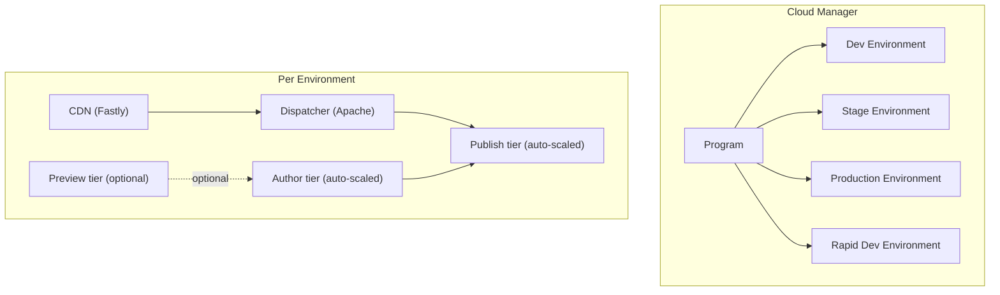
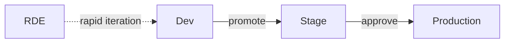
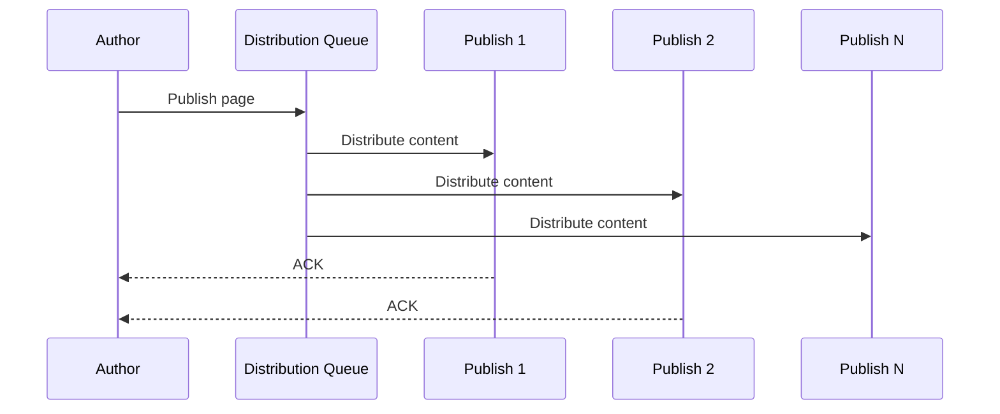
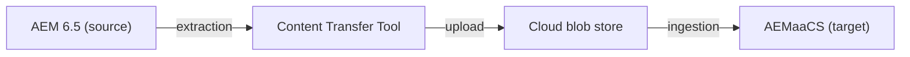

# AEM as a Cloud Service

**AEM as a Cloud Service (AEMaaCS)** is Adobe's cloud-native, fully managed version of
Adobe Experience Manager. It replaces the traditional on-premise and Adobe Managed Services
(AMS) hosting models with a platform that auto-scales, auto-updates, and enforces strict
separation between code and content. Understanding its constraints and capabilities is
essential -- many patterns that work on AEM 6.5 do not apply on AEMaaCS.



---

## Key Differences from AEM 6.5 / On-Premise

| Aspect                  | AEM 6.5 / On-Prem                       | AEMaaCS                                                      |
|-------------------------|-----------------------------------------|--------------------------------------------------------------|
| **Deployment**          | Package Manager, WebDAV, manual install | Cloud Manager pipelines only                                 |
| **Infrastructure**      | Self-managed servers                    | Fully managed, auto-scaled by Adobe                          |
| **Updates**             | Manual upgrades (months/years)          | Continuous updates (monthly, automatic)                      |
| **`/apps` and `/libs`** | Mutable at runtime                      | **Immutable** -- deployed via pipeline only                  |
| **`/etc/designs`**      | Design mode for component config        | **Deprecated** -- use editable templates and policies        |
| **Custom run modes**    | Any custom run mode name                | Only `author`, `publish`, `preview` + `dev`, `stage`, `prod` |
| **CRXDE Lite**          | Available in all environments           | Available on dev/RDE only, **not in stage/prod**             |
| **Repository access**   | Direct JCR access, WebDAV               | Developer Console for logs; no direct JCR in prod            |
| **Content replication** | Replication agents (manual config)      | **Content Distribution** (Sling, automatic)                  |
| **Pricing model**       | Perpetual license                       | Subscription (per program)                                   |
| **Scaling**             | Manual (add servers)                    | Automatic (horizontal auto-scaling)                          |

---

## Programs and Environments

### Cloud Manager programs

A **program** is the top-level organisational unit in Cloud Manager. Each program contains
a set of environments, pipelines, and configuration.

| Program type   | Purpose                                                                       |
|----------------|-------------------------------------------------------------------------------|
| **Production** | Full set of environments (dev, stage, prod) for a live site                   |
| **Sandbox**    | Trial and experimentation; auto-hibernates after inactivity; limited features |

### Environment types



| Environment         | Purpose                              | Key characteristics                                        |
|---------------------|--------------------------------------|------------------------------------------------------------|
| **Development**     | Day-to-day development and testing   | Mutable; CRXDE available; can install packages manually    |
| **Rapid Dev (RDE)** | Fast iteration without full pipeline | Deploy in seconds via CLI; no build step; limited lifespan |
| **Stage**           | Pre-production validation            | Mirrors prod topology; immutable; pipeline-only deployment |
| **Production**      | Live site                            | Immutable; auto-scaled; no CRXDE; no Package Manager       |
| **Preview**         | Content preview before publish       | Optional; separate tier for preview workflows              |

---

## Immutable vs Mutable Areas

The most fundamental constraint of AEMaaCS is the distinction between **immutable**
(code, deployed via pipeline) and **mutable** (content, managed at runtime) areas of the
repository.

### Immutable (deployed via pipeline)

These paths are overwritten on every deployment and cannot be changed at runtime:

| Path              | Contains                                                   |
|-------------------|------------------------------------------------------------|
| `/apps/`          | Component definitions, Sling Models, services, HTL scripts |
| `/libs/`          | AEM product code (never modify)                            |
| `/oak:index/`     | Custom Oak index definitions                               |
| `/apps/*/config/` | OSGi configurations                                        |
| `/apps/*/i18n/`   | i18n dictionaries                                          |

### Mutable (content, managed at runtime)

These paths persist across deployments and are managed by authors or at runtime:

| Path                | Contains                                                       |
|---------------------|----------------------------------------------------------------|
| `/content/`         | Pages, experience fragments                                    |
| `/content/dam/`     | Digital assets                                                 |
| `/content/cq:tags/` | Tags and taxonomies                                            |
| `/conf/`            | Editable templates, policies, cloud service configs, CA Config |
| `/var/`             | Workflows, audit logs, eventing                                |
| `/home/`            | Users and groups                                               |
| `/tmp/`             | Temporary data                                                 |

### Repoinit for bootstrap content

Since you cannot manually create nodes in `/apps` at runtime, use **Repository
Initialisation (repoinit)** scripts to bootstrap required structures:

```json title="ui.config/.../org.apache.sling.jcr.repoinit.RepositoryInitializer~myproject.cfg.json"
{
    "scripts": [
        "create path /content/mysite(sling:OrderedFolder)",
        "create path /content/dam/mysite(sling:OrderedFolder)",
        "",
        "create service user myproject-service with path system/myproject",
        "set ACL for myproject-service",
        "    allow jcr:read on /content/mysite",
        "    allow rep:write on /content/mysite",
        "end"
    ]
}
```

---

## Content Distribution (replacing replication)

AEMaaCS replaces the traditional replication agent model with **Sling Content
Distribution**. Content published on the author tier is distributed to publish instances
automatically -- there are no manually configured replication agents.



Key differences:
- **No replication agents** to configure or troubleshoot
- Content is distributed to **all publish instances** simultaneously
- Distribution is **asynchronous** -- there is a short delay (seconds to minutes)
- The distribution queue is visible in the **Distribution Agent** UI on author
- **Tree activation** distributes an entire subtree at once
- Failed distributions are retried automatically

### Invalidating the CDN/Dispatcher cache

On publish, AEMaaCS automatically invalidates the Dispatcher cache and purges the CDN
for the affected paths. You do not need to configure flush agents.

For Edge Delivery Services or custom CDN setups, configure **push invalidation** in the
CDN config.

---

## Rapid Development Environments (RDEs)

**RDEs** are lightweight environments designed for rapid iteration. Instead of running a
full Cloud Manager pipeline (which takes 30-60 minutes), you deploy directly from your
local machine in seconds using the Adobe I/O CLI.

### Setup

```bash
# Install the RDE plugin
aio plugins:install @adobe/aio-cli-plugin-aem-rde

# Login
aio login

# Select your org, program, and environment
aio aem:rde:setup
```

### Deploying to an RDE

```bash
# Deploy a content package
aio aem:rde:install target/myproject.ui.apps-1.0-SNAPSHOT.zip

# Deploy an OSGi bundle
aio aem:rde:install target/myproject.core-1.0-SNAPSHOT.jar

# Deploy Dispatcher configuration
aio aem:rde:install dispatcher/src --type dispatcher

# Deploy an OSGi config file
aio aem:rde:install ui.config/src/.../com.myproject.MyConfig.cfg.json --type osgi-config

# Check deployment status
aio aem:rde:status

# Reset the environment (clean slate)
aio aem:rde:reset
```

### When to use RDEs vs dev environments

| Scenario                     | RDE     | Dev environment |
|------------------------------|---------|-----------------|
| Quick feature iteration      | Best    | Slow (pipeline) |
| Testing OSGi config changes  | Best    | OK              |
| Full integration testing     | No      | Yes             |
| Load testing                 | No      | Yes             |
| Dispatcher testing           | Partial | Full            |
| Collaboration (shared state) | Limited | Yes             |

---

## Developer Console

The **Developer Console** replaces CRXDE Lite and the Felix Web Console for
non-development environments. It provides read-only access to diagnostics and
runtime information.

Access it at: `https://dev-console-<env-id>.adobeaemcloud.com/`

### Available features

| Feature                | Description                                                  |
|------------------------|--------------------------------------------------------------|
| **Status**             | Environment health, instance status, version info            |
| **Bundles**            | List OSGi bundles, check state (Active, Resolved, Installed) |
| **Components**         | List OSGi (Declarative Services) components and their state  |
| **Configurations**     | View OSGi configurations (read-only)                         |
| **Sling Models**       | List registered Sling Models and their adapters              |
| **Oak Indexes**        | View index definitions and reindexing status                 |
| **Repository browser** | Browse the JCR tree (read-only)                              |
| **Logs**               | Download or tail log files (error.log, request.log, etc.)    |
| **Query performance**  | View slow queries and index usage                            |

:::tip
For production debugging, the Developer Console log viewer is your primary tool. You
can filter by log level, logger name, and time range. Download full log files for
offline analysis.
:::

---

## Cloud SDK for Local Development

The **AEM as a Cloud Service SDK** lets you run a local AEM instance that matches the
cloud runtime. Always develop against the SDK to catch compatibility issues early.

### Downloading the SDK

1. Go to [Software Distribution](https://experience.adobe.com/#/downloads/content/software-distribution/en/aemcloud.html)
2. Download the latest `aem-sdk-quickstart-*.jar` and Dispatcher tools
3. The SDK is updated monthly in sync with AEMaaCS releases

### Running locally

```bash
# Start the author instance
java -jar aem-sdk-quickstart-*.jar -p 4502

# Start a publish instance
java -jar aem-sdk-quickstart-*.jar -p 4503 -r publish

# Run the Dispatcher SDK
cd dispatcher-tools
./bin/docker_run.sh ../dispatcher/src host.docker.internal:4503 8080
```

### SDK vs production differences

| Aspect                   | SDK               | AEMaaCS production         |
|--------------------------|-------------------|----------------------------|
| **Scaling**              | Single instance   | Auto-scaled cluster        |
| **CDN**                  | None (localhost)  | Fastly CDN                 |
| **Content Distribution** | Local replication | Sling Content Distribution |
| **Startup time**         | 2-5 minutes       | Managed by Adobe           |
| **Updates**              | Manual download   | Automatic                  |
| **Oak persistence**      | Segment tar       | Composite node store       |

---

## Content Migration

### Content Transfer Tool (CTT)

The **Content Transfer Tool** migrates content from AEM 6.x to AEMaaCS:



1. **Extraction** -- CTT reads content from the source AEM instance
2. **Upload** -- Content is uploaded to a cloud staging area (blob store)
3. **Ingestion** -- Content is imported into the target AEMaaCS environment

CTT supports incremental transfers (delta), so you can do a bulk initial migration
followed by smaller top-ups closer to go-live.

### Cloud Acceleration Manager (CAM)

**CAM** is a companion tool that helps plan and execute the migration:

- **Best Practice Analyzer (BPA)** -- scans your AEM 6.x instance and flags
compatibility issues (deprecated APIs, unsupported configs)
- **Repository Modernizer** -- restructures content packages to separate `/apps` (code)
from `/content` (mutable content)
- **Index Converter** -- converts AEM 6.x index definitions to the AEMaaCS format
- **Dispatcher Converter** -- converts AMS/on-prem Dispatcher configs to the AEMaaCS
structure

### Common migration challenges

| Challenge                             | Solution                                                       |
|---------------------------------------|----------------------------------------------------------------|
| Custom run modes                      | Map to standard run modes (`dev`, `stage`, `prod`)             |
| `/etc/designs`                        | Migrate to editable templates and policies                     |
| Custom login modules                  | Use AEM IMS (Adobe Identity Management)                        |
| Workflow launchers with `/libs` paths | Update to `/content` or `/var` paths                           |
| Large binary assets                   | Use CTT with streaming; plan for transfer time                 |
| Custom Oak indexes                    | Convert with Index Converter; deploy via `/oak:index/` in code |
| Custom replication agents             | Replace with Content Distribution (automatic)                  |

---

## Deprecated and Removed Features

These features available on AEM 6.5 are **not available** or **deprecated** on AEMaaCS:

| Feature                          | Status     | Replacement                                       |
|----------------------------------|------------|---------------------------------------------------|
| **CRXDE Lite** (prod)            | Removed    | Developer Console (read-only)                     |
| **Package Manager** (prod)       | Removed    | Cloud Manager pipelines                           |
| **Classic UI**                   | Deprecated | Touch UI                                          |
| **Design mode / `/etc/designs`** | Deprecated | Editable templates and policies                   |
| **Static templates**             | Deprecated | Editable templates                                |
| **Custom run modes**             | Removed    | `dev`, `stage`, `prod` only                       |
| **JSP scripting**                | Deprecated | HTL (Sightly)                                     |
| **Replication agents**           | Replaced   | Sling Content Distribution                        |
| **Workflow purge schedulers**    | Changed    | Adobe-managed maintenance windows                 |
| **`loginAdministrative()`**      | Removed    | Service users with `getServiceResourceResolver()` |
| **WebDAV access**                | Removed    | Assets HTTP API, AEM Desktop App                  |
| **VLT (FileVault)**              | Limited    | AEM Repo Tool, RDE CLI                            |

---

## OSGi Configuration on AEMaaCS

OSGi configurations on AEMaaCS follow a strict folder-based run mode structure:

```
ui.config/src/main/content/jcr_root/apps/myproject/osgiconfig/
├── config/                    ← All environments, all tiers
│   └── com.myproject.MyService.cfg.json
├── config.author/             ← Author tier only
│   └── com.myproject.AuthorOnlyService.cfg.json
├── config.publish/            ← Publish tier only
│   └── com.myproject.PublishOnlyService.cfg.json
├── config.dev/                ← Dev environment only
│   └── com.myproject.MyService~dev.cfg.json
├── config.stage/              ← Stage environment only
│   └── com.myproject.MyService~stage.cfg.json
├── config.prod/               ← Production only
│   └── com.myproject.MyService~prod.cfg.json
├── config.author.dev/         ← Author tier, dev environment
│   └── ...
└── config.publish.prod/       ← Publish tier, production
    └── ...
```

### Secret configurations

Sensitive values (API keys, passwords) must **not** be stored in code. Use
**Cloud Manager environment variables** or **secret configs**:

```json title="com.myproject.IntegrationService.cfg.json"
{
    "apiKey": "$[secret:MY_API_KEY]",
    "endpoint": "$[env:INTEGRATION_ENDPOINT]"
}
```

- `$[secret:NAME]` -- resolves from Cloud Manager secret variables (encrypted)
- `$[env:NAME]` -- resolves from Cloud Manager environment variables

Set them in Cloud Manager: **Environments > Environment Variables**.

---

## Auto-Scaling and Performance

AEMaaCS automatically scales both the author and publish tiers based on load:

- **Publish tier** -- scales horizontally (more instances) based on request volume
- **Author tier** -- scales vertically and horizontally for concurrent authoring
- **CDN** -- Fastly CDN with global PoPs handles edge caching automatically
- **Maintenance windows** -- Adobe runs compaction, garbage collection, and index
optimization during scheduled maintenance windows

### What you control

| Aspect                    | Your responsibility                                         |
|---------------------------|-------------------------------------------------------------|
| **Cache-Control headers** | Set appropriate TTLs for static and dynamic content         |
| **CDN configuration**     | `cdn.yaml` for redirects, transformations, origin selectors |
| **Dispatcher rules**      | Cache rules, filters, rewrite rules                         |
| **Oak indexes**           | Define custom indexes for query performance                 |
| **Asset processing**      | Configure processing profiles for image renditions          |

### What Adobe manages

| Aspect             | Adobe's responsibility                             |
|--------------------|----------------------------------------------------|
| **Infrastructure** | Servers, networking, storage, scaling              |
| **Updates**        | Monthly AEM updates, security patches              |
| **Monitoring**     | Uptime monitoring, alerting                        |
| **Backups**        | Automated backups, point-in-time recovery          |
| **SSL/TLS**        | Certificate management for `*.adobeaemcloud.com`   |
| **Maintenance**    | Compaction, garbage collection, index optimization |

---

## Networking

AEMaaCS environments run in isolated VPCs. By default, they can only make outbound
requests to public internet endpoints. For connecting to private services, Adobe offers
**Advanced Networking**:

| Networking type          | Use case                                                               |
|--------------------------|------------------------------------------------------------------------|
| **Flexible port egress** | Connect to external services on non-standard ports (e.g., SMTP on 587) |
| **Dedicated egress IP**  | Whitelist a fixed IP for outbound connections to firewalled services   |
| **VPN**                  | Site-to-site VPN for connecting to private corporate networks          |

Configure via Cloud Manager API or CLI:

```bash
# Enable flexible port egress
aio cloudmanager:set-environment-advanced-networking \
  --type flexiblePortEgress \
  --program-id 12345 \
  --environment-id 67890
```

For SMTP (email sending), flexible port egress with port forwarding is required. See
the [E-Mail Service](./email.md) page for a detailed setup guide.

---

## Best Practices

### Develop against the Cloud SDK from day one

Don't develop against AEM 6.5 and "migrate later." Use the Cloud SDK as your local
development runtime to catch incompatibilities immediately.

### Treat code and content as separate concerns

Code (`/apps`, OSGi configs, indexes) is deployed via pipelines. Content (`/content`,
`/conf`, `/var`) is managed at runtime. Never mix them in the same package.

### Use service users, not admin sessions

`loginAdministrative()` does not exist on AEMaaCS. All background operations must use
service users with explicitly granted permissions.

### Embrace repoinit for environment setup

Use repoinit scripts for creating service users, groups, ACLs, and required paths.
They run on every deployment and are idempotent.

### Keep Dispatcher configs simple and validated

Run `./bin/validator full` locally before every commit. Cloud Manager will reject
invalid Dispatcher configurations and block the entire deployment.

### Use RDEs for rapid iteration

Don't wait for 45-minute pipeline runs during development. Use RDEs to test changes
in seconds, then promote to dev via the pipeline.

### Plan your migration early

Run the Best Practice Analyzer (BPA) early in the project. Many compatibility issues
(custom run modes, deprecated APIs, `/etc/designs`) require architectural changes
that take time.

---

## Common Pitfalls

| Pitfall                                 | Solution                                                                                            |
|-----------------------------------------|-----------------------------------------------------------------------------------------------------|
| Code changes not reflected after deploy | Check that the pipeline completed; verify the bundle is active in Developer Console                 |
| `LoginException` for service users      | Ensure repoinit scripts run before service user mappings; check ACLs                                |
| Content missing after deployment        | Content packages must go into `ui.content`, not `ui.apps`; mutable content is not overwritten       |
| Custom run mode configs ignored         | AEMaaCS only supports standard run modes (`dev`, `stage`, `prod`, `author`, `publish`)              |
| Slow queries in production              | Define custom Oak indexes in `/oak:index/`; use the Developer Console query performance tool        |
| SMTP not working                        | Configure Advanced Networking (flexible port egress) for port 587; see [E-Mail Service](./email.md) |
| Assets not rendering                    | Check asset processing profiles; verify Dynamic Media configuration                                 |
| Dispatcher cache not invalidating       | Cache invalidation is automatic on AEMaaCS; check CDN cache if stale content persists               |
| `ClassNotFoundException` after update   | Adobe's monthly updates may remove deprecated APIs; check release notes and fix code                |
| CRXDE not available                     | Expected in stage/prod; use Developer Console repository browser (read-only)                        |

---

## See also

- [Architecture](../architecture.mdx) -- AEM's layered architecture
- [Local development setup](./aem-dev-setup.md) -- Cloud SDK setup guide
- [Deployment](./deployment.mdx) -- Cloud Manager pipelines, package structure
- [Dispatcher configuration](./dispatcher-configuration.mdx) -- CDN config, caching, filters
- [Performance](./performance.mdx) -- Oak indexes, caching strategies
- [Security basics](./security.mdx) -- CSRF, XSS, production-ready mode
- [ACLs and Permissions](./acl-permissions.md) -- repoinit, service users, Netcentric ACL Tool
- [Testing](./testing.mdx) -- Cloud Manager quality gates
- [Edge Delivery Services](./helix.mdx) -- alternative delivery model
- [Adobe I/O App Builder](./aio-app-builder.md) -- serverless extensions
- [E-Mail Service](./email.md) -- SMTP and Advanced Networking
- [OSGi configuration](../backend/osgi-configuration.mdx) -- run-mode based config structure
- [Templates and Policies](../components/templates-policies.md) -- replacing `/etc/designs`
- [Sling Jobs and Schedulers](../backend/sling-jobs.md) -- background processing on AEMaaCS
- [Context-Aware Configuration](../backend/context-aware-configuration.md) -- site-specific config
