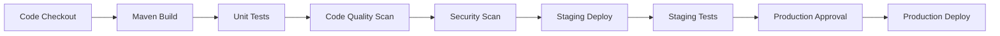

# Deployment

Deploying AEM projects varies significantly depending on the hosting model. **AEM as a Cloud Service (AEMaaCS)** relies on Cloud Manager pipelines with strict immutability rules. **Adobe Managed Services (AMS)** provides a middle ground with managed infrastructure but more flexibility. **On-premises** installations give full control but require manual orchestration and operational discipline.

Understanding the deployment model is critical because it determines how you structure packages, what paths are writable at runtime, and how rollbacks work.

## AEMaaCS Cloud Manager Pipelines

Cloud Manager is the sole deployment mechanism for AEMaaCS. You cannot install packages via CRX Package Manager or WebDAV in production — all code flows through pipelines.

### Pipeline Types

| Pipeline Type | What It Deploys | Typical Use Case |
|---|---|---|
| **Full-Stack** | Java bundles, OSGi configs, content packages, Dispatcher configs | Standard release of backend + frontend |
| **Frontend-Only** | Static assets from `ui.frontend` module | Rapid UI iteration without full build |
| **Config-Only** | CDN and Dispatcher configuration | Traffic routing, redirect rules, cache headers |
| **Web-Tier** | Dispatcher configuration only | Updating vhost or rewrite rules independently |

:::tip
Frontend-only pipelines can cut deployment times from ~45 minutes down to ~10 minutes when only CSS/JS changes are involved.
:::

### Pipeline Stages



Each stage acts as a quality gate. If unit tests or code quality scans fail, the pipeline stops. Production deployment requires explicit approval unless you configure auto-approval for non-production pipelines.

### Configuration

Pipelines are configured entirely through the **Cloud Manager UI** — there is no YAML or pipeline-as-code file. You select the Git branch, the environment targets, and the pipeline type. Triggers can be manual or on Git push.

## Package Structure

The [AEM Project Archetype](https://github.com/adobe/aem-project-archetype) generates a multi-module Maven project. Each module serves a specific purpose in the deployment.

| Module | Content Type | Deploy Target | Description |
|---|---|---|---|
| `all/` | Container | Author + Publish | Embeds all sub-packages into a single container package |
| `core/` | Immutable | Author + Publish | Java OSGi bundles (Sling models, servlets, workflows) |
| `ui.apps/` | **Immutable** | Author + Publish | Components, templates, clientlibs under `/apps` |
| `ui.config/` | **Immutable** | Author + Publish | OSGi configurations (runmode-specific) |
| `ui.content/` | **Mutable** | Author | Sample content, editable templates, policies |
| `ui.frontend/` | Immutable | Author + Publish | Webpack/Vite frontend build; output copied to `ui.apps` clientlibs |
| `dispatcher/` | Config | CDN/Dispatcher | Apache/Dispatcher configuration files |

:::warning
On AEMaaCS, **mutable content** (`ui.content`) is only deployed on first install or explicitly via `repoinit` scripts. Subsequent deployments will **not** overwrite content that authors have changed. Structure your packages accordingly.
:::

### Container Package (`all/`)

The `all` module uses `filevault-package-maven-plugin` to embed sub-packages:

```xml
<plugin>
    <groupId>org.apache.jackrabbit</groupId>
    <artifactId>filevault-package-maven-plugin</artifactId>
    <configuration>
        <embeddeds>
            <embedded>
                <groupId>com.mysite</groupId>
                <artifactId>mysite.core</artifactId>
                <target>/apps/mysite-packages/application/install</target>
            </embedded>
            <embedded>
                <groupId>com.mysite</groupId>
                <artifactId>mysite.ui.apps</artifactId>
                <target>/apps/mysite-packages/application/install</target>
            </embedded>
            <embedded>
                <groupId>com.mysite</groupId>
                <artifactId>mysite.ui.config</artifactId>
                <target>/apps/mysite-packages/application/install</target>
            </embedded>
        </embeddeds>
    </configuration>
</plugin>
```

## Maven Profiles for Local Deployment

The archetype includes several Maven profiles for deploying to a local AEM instance during development:

```bash
# Deploy everything to local author (port 4502)
mvn clean install -PautoInstallSinglePackage

# Deploy only the Java bundle (faster iteration for backend changes)
mvn clean install -PautoInstallBundle -pl core

# Deploy to a local publish instance (port 4503)
mvn clean install -PautoInstallSinglePackage -Daem.port=4503

# Deploy only the ui.apps package
mvn clean install -PautoInstallPackage -pl ui.apps

# Deploy with a custom host (e.g., Docker-based AEM)
mvn clean install -PautoInstallSinglePackage -Daem.host=localhost -Daem.port=4502
```

:::tip
Use `-PautoInstallBundle -pl core` during backend development — it skips the full package build and installs only the OSGi bundle, completing in seconds rather than minutes.
:::

## Content Package Filters

The `filter.xml` file in each content package declares which repository paths the package owns. It controls what gets installed and — critically — what gets removed during installation.

### filter.xml Example

```xml
<?xml version="1.0" encoding="UTF-8"?>
<workspaceFilter version="1.0">
    <!-- Immutable application content -->
    <filter root="/apps/mysite/components"/>
    <filter root="/apps/mysite/templates"/>
    <filter root="/apps/mysite/clientlibs"/>

    <!-- Include configs but exclude author-specific runmode on publish -->
    <filter root="/apps/mysite/config">
        <exclude pattern="/apps/mysite/config\.author/.*"/>
    </filter>

    <!-- Mutable content with selective includes -->
    <filter root="/content/mysite" mode="merge">
        <include pattern="/content/mysite"/>
        <include pattern="/content/mysite/us/en(/.*)?" />
        <exclude pattern="/content/mysite/us/en/user-generated(/.*)?" />
    </filter>
</workspaceFilter>
```

### Mutable vs Immutable Paths on AEMaaCS

| Path | Type | Behavior on Deploy |
|---|---|---|
| `/apps` | **Immutable** | Fully replaced on every deployment |
| `/libs` | **Immutable** | Owned by Adobe — never deploy here |
| `/content` | **Mutable** | Only deployed on first install; authors own this |
| `/conf` | **Mutable** | Editable templates, policies; merge on install |
| `/etc` | **Mutable** | Workflow models, designs (legacy) |
| `/var` | **Mutable** | Workflow instances, audit logs — never package |

:::warning
Deploying mutable content (e.g., `/content`) with `mode="replace"` in AEMaaCS will overwrite author changes. Always use `mode="merge"` or rely on `repoinit` scripts for content initialization.
:::

## Rapid Development Environments (RDE)

RDEs are lightweight AEMaaCS environments designed for fast iteration. They allow you to deploy code and content directly from the command line — bypassing the full Cloud Manager pipeline.

### When to Use RDEs

- Testing OSGi configurations in a cloud-like environment
- Validating Sling models and servlets before committing
- Debugging cloud-specific behavior not reproducible locally
- Rapid prototyping without waiting for a full pipeline

### CLI Commands

RDEs are managed through the Adobe I/O CLI with the AEM plugin:

```bash
# Install a content package to the RDE
aio aem:rde:install target/mysite.all-1.0-SNAPSHOT.zip

# Install only an OSGi bundle
aio aem:rde:install core/target/mysite.core-1.0-SNAPSHOT.jar

# Install an individual OSGi config file
aio aem:rde:install ui.config/src/main/content/jcr_root/apps/mysite/osgiconfig/config/com.mysite.MyService.cfg.json

# Check the status of the RDE
aio aem:rde:status

# Reset the RDE to a clean state (removes all custom code)
aio aem:rde:reset

# View logs from the RDE
aio aem:rde:logs --target author
```

:::tip
RDE deployments typically complete in **under 30 seconds**, compared to 30–60 minutes for a full Cloud Manager pipeline. Use them as your primary cloud testing tool during development.
:::

## On-Prem / AMS Deployment

For on-premises or AMS-hosted AEM, you have more deployment flexibility but also more operational responsibility.

### CRX Package Manager

The Package Manager (`/crx/packmgr`) allows manual upload and installation of content packages:

1. Navigate to `https://author.example.com/crx/packmgr/index.jsp`
2. Click **Upload Package** and select the `.zip` file
3. Click **Install** and review the import options
4. Verify the installation log for errors

:::warning
Never use CRX Package Manager for production deployments in a CI/CD workflow. It bypasses quality gates and leaves no audit trail. Reserve it for emergency hotfixes only.
:::

### Oak-Run for Repository Maintenance

`oak-run` is a Swiss-army-knife tool for repository operations on TarMK or MongoMK installations:

```bash
# Compact the TarMK segment store (offline only)
java -jar oak-run.jar compact /path/to/crx-quickstart/repository/segmentstore

# Check repository consistency
java -jar oak-run.jar check /path/to/crx-quickstart/repository/segmentstore

# Export node data for debugging
java -jar oak-run.jar explore /path/to/crx-quickstart/repository/segmentstore
```

### Blue-Green Deployment Pattern

For zero-downtime deployments on AMS or on-prem:

1. **Blue** environment serves live traffic
2. Deploy new version to **Green** environment
3. Run smoke tests against Green
4. Switch the load balancer from Blue to Green
5. Keep Blue available for rapid rollback

This requires duplicate infrastructure and load balancer integration, but eliminates downtime during releases.

## Rollback Strategies

| Strategy | When to Use | Speed | Risk |
|---|---|---|---|
| **Pipeline redeploy** | AEMaaCS — revert Git commit, trigger pipeline | ~45 min | Low — identical to any deployment |
| **Package uninstall** | On-prem/AMS — uninstall via Package Manager | Minutes | Medium — snapshot may be stale |
| **RDE reset** | RDE environments only | ~30 sec | Low — clean slate |
| **Blue-green switch** | On-prem/AMS with dual environments | Seconds | Low — previous version still running |
| **Git revert + redeploy** | Any environment | Varies | Low — uses standard pipeline |

:::tip
On AEMaaCS, the safest rollback is always **reverting the Git commit and redeploying** through the pipeline. Cloud Manager does not support "rollback to previous deployment" as a native action.
:::

## Common Pitfalls

### Deploying Mutable Content to Immutable Paths

The Cloud Manager build validator rejects packages that attempt to write mutable content into `/apps` or `/libs`. Ensure your `filter.xml` correctly separates mutable and immutable paths.

### Missing Filter Rules

If a path is not covered by `filter.xml`, it will not be included in the package — even if the files exist in your project. Always verify filters after adding new components or configurations.

### Large Packages Timing Out

Packages larger than ~500 MB can cause timeout issues during installation. Split large packages into smaller, focused sub-packages. Avoid including DAM assets in code packages.

### Forgetting Dispatcher Config Validation

Cloud Manager validates Dispatcher configurations before deployment. Run the local Dispatcher SDK validator before pushing:

```bash
# Validate Dispatcher config locally
./bin/docker_run.sh src/conf.d src/conf.dispatcher.d out host.docker.internal:4503 8080

# Or use the Adobe-provided validator
./bin/validator full dispatcher/src
```

### Not Testing with Dispatcher Locally

Many issues only surface behind the Dispatcher (caching, URL rewrites, header stripping). Always test your changes through the local Dispatcher Docker image before deploying to higher environments.

## See also

- [Architecture](../architecture.mdx)
- [Dispatcher configuration](./dispatcher-configuration.mdx)
- [AEM as a Cloud Service](./cloud-service.mdx)
- [Local development setup](./aem-dev-setup.md)
- [Performance](./performance.mdx)
- [Security basics](./security.mdx)
- [OSGi configuration](../backend/osgi-configuration.mdx)
- [Testing](./testing.mdx)
