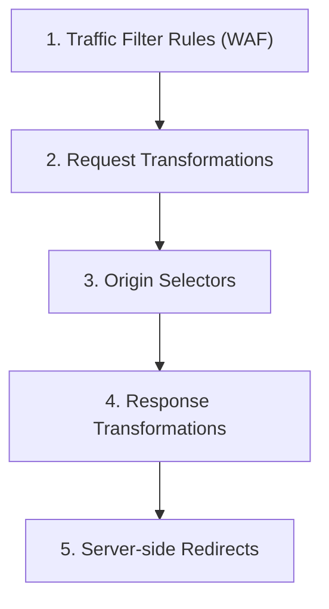

# Dispatcher Configuration

## Introduction

The AEM Dispatcher is an **Apache HTTP Server (`httpd`) module** that sits between the CDN/load balancer and the AEM Publish instances. It serves two critical functions:

1. **Caching** — stores rendered pages and static assets on the web server's filesystem so that subsequent requests are served directly from disk, bypassing the publish instance entirely.
2. **Security filtering** — acts as a request-level firewall that blocks access to internal paths, admin consoles, and unintended URL patterns before they ever reach AEM.

In an AEM as a Cloud Service (AEMaaCS) topology, every request to a Publish tier flows through the Dispatcher:

```
Client → CDN → Dispatcher (Apache httpd + mod_dispatcher) → AEM Publish
```

A well-tuned Dispatcher configuration can reduce publish-tier load by 80–95 %, dramatically improve response times, and harden the attack surface of your AEM installation.

:::tip
In AEMaaCS the Dispatcher configuration ships as part of your Git repository and is validated on every Cloud Manager pipeline run. Always test locally with the Dispatcher SDK before pushing.
:::

---

## Project Directory Structure

The AEMaaCS SDK ships a standard Dispatcher directory layout under `dispatcher/src/`. Understanding this tree is essential before making any changes.

```
dispatcher/src/
├── conf.d/                          # Apache httpd configuration
│   ├── available_vhosts/
│   │   └── default.vhost            # Default virtual host definition
│   ├── enabled_vhosts/
│   │   └── default.vhost -> ../available_vhosts/default.vhost
│   ├── dispatcher_vhost.conf        # Main vhost include file
│   ├── rewrites/
│   │   ├── rewrite.rules            # Custom Apache mod_rewrite rules
│   │   └── xforwarded_forcessl_rewrite.rules
│   └── variables/
│       ├── custom.vars              # Project-specific variables
│       └── global.vars              # Global environment variables
├── conf.dispatcher.d/               # Dispatcher module configuration
│   ├── available_farms/
│   │   └── default.farm             # Default farm definition
│   ├── enabled_farms/
│   │   └── default.farm -> ../available_farms/default.farm
│   ├── cache/
│   │   ├── rules.any                # Cache rules (what to cache)
│   │   └── invalidate.any           # Auto-invalidation rules
│   ├── clientheaders/
│   │   └── clientheaders.any        # Forwarded client headers
│   ├── filters/
│   │   └── filters.any              # Request filter rules
│   ├── renders/
│   │   └── renders.any              # Backend publish host definitions
│   └── virtualhosts/
│       └── virtualhosts.any         # Dispatcher-level virtual host matching
└── opt-in/
    └── USE_SOURCES_DIRECTLY         # Marker file for SDK opt-in
```

| Directory | Purpose | Key files |
|---|---|---|
| `conf.d/` | Standard Apache httpd directives — virtual hosts, rewrite rules, environment variables | `rewrite.rules`, `default.vhost`, `custom.vars` |
| `conf.dispatcher.d/` | Dispatcher module directives — farms, filters, cache, headers | `filters.any`, `rules.any`, `default.farm` |
| `opt-in/` | Feature flags consumed by the Dispatcher SDK tooling | `USE_SOURCES_DIRECTLY` |

:::warning
Do **not** rename or restructure the top-level directories. The Cloud Manager pipeline validator expects exactly this layout and will reject the deployment if files are missing or misplaced.
:::

---

## Farm Configuration

A **farm** is the Dispatcher's primary configuration unit. It binds incoming requests to a set of backend renders, filters, cache rules, and headers. The entry point is the farm file (e.g., `default.farm`), which includes the other `.any` files.

```apacheconf
# conf.dispatcher.d/available_farms/default.farm

/default {
    /clientheaders {
        $include "../clientheaders/clientheaders.any"
    }

    /virtualhosts {
        $include "../virtualhosts/virtualhosts.any"
    }

    /renders {
        $include "../renders/renders.any"
    }

    /filter {
        $include "../filters/filters.any"
    }

    /cache {
        /docroot "/mnt/var/www/html"
        /statfileslevel "2"
        /allowAuthorized "0"
        /rules {
            $include "../cache/rules.any"
        }
        /invalidate {
            $include "../cache/invalidate.any"
        }
    }

    /vanity_urls {
        /url    "/libs/granite/dispatcher/content/vanityUrls.html"
        /file   "/tmp/vanity_urls"
        /delay  300
    }
}
```

### Section Reference

| Section | Purpose |
|---|---|
| `/clientheaders` | Defines which HTTP headers from the client are forwarded to the publish instance |
| `/virtualhosts` | Restricts which `Host` header values this farm responds to |
| `/renders` | Backend publish hosts (hostname + port) |
| `/filter` | Request allow/deny rules evaluated top-to-bottom |
| `/cache` | Caching behaviour: document root, cache rules, invalidation, TTL |
| `/vanity_urls` | Enables AEM vanity URL resolution at the Dispatcher level |

### Renders

The `/renders` section tells the Dispatcher where to forward cache-miss requests:

```apacheconf
# conf.dispatcher.d/renders/renders.any

/rend01 {
    /hostname "localhost"
    /port "4503"
    /timeout "10000"
}
```

In AEMaaCS, the hostname and port are replaced at deployment time by environment-specific values — you should keep `localhost:4503` for local SDK testing.

---

## Filter Rules

Filter rules are evaluated **top-to-bottom**. The first matching rule wins. Always start with a global deny and then selectively allow known paths.

```apacheconf
# conf.dispatcher.d/filters/filters.any

# Deny everything by default
/0001 { /type "deny"  /url "*" }

# Allow content pages
/0002 { /type "allow" /url "/content/*" }

# Allow client libraries
/0003 { /type "allow" /url "/etc.clientlibs/*" }

# Allow static media
/0004 { /type "allow" /url "/content/dam/*" }

# Allow GraphQL persisted queries
/0005 { /type "allow" /url "/graphql/execute.json/*" }

# Allow Experience Fragments
/0006 { /type "allow" /url "/content/experience-fragments/*" }

# Deny access to admin and system paths
/0100 { /type "deny"  /url "/admin/*" }
/0101 { /type "deny"  /url "/system/*" }
/0102 { /type "deny"  /url "/apps/*" }
/0103 { /type "deny"  /url "/bin/*" }
/0104 { /type "deny"  /url "/crx/*" }
/0105 { /type "deny"  /url "/libs/*" }
/0106 { /type "deny"  /url "/etc/*" }

# Deny query strings that reveal selectors or suffixes
/0200 { /type "deny"  /method "GET" /query "debug=*" }
/0201 { /type "deny"  /method "GET" /query "wcmmode=*" }
```

### Common Paths to Allow or Deny

| Path | Action | Reason |
|---|---|---|
| `/content/*` | Allow | Published site content |
| `/etc.clientlibs/*` | Allow | Versioned client-side JS/CSS bundles |
| `/content/dam/*` | Allow | Digital assets (images, PDFs, videos) |
| `/graphql/execute.json/*` | Allow | Content Fragment GraphQL endpoint |
| `/libs/*` | Deny | Internal server-side libraries |
| `/apps/*` | Deny | Application code — never exposed publicly |
| `/system/*` | Deny | AEM system servlets |
| `/crx/*` | Deny | CRX/DE repository browser |
| `/bin/*` | Deny | Internal servlets and workflow triggers |

:::warning
Overly permissive filter rules (e.g., `/0002 { /type "allow" /url "/*" }`) are the **number-one cause** of Dispatcher security incidents. Always deny by default and only allow explicit, known paths.
:::

---

## Cache Rules

Cache rules determine which response types are stored on disk and served for subsequent requests.

### What to Cache

```apacheconf
# conf.dispatcher.d/cache/rules.any

# Cache HTML pages
/0000 { /glob "*"     /type "deny" }
/0001 { /glob "*.html" /type "allow" }
/0002 { /glob "*.css"  /type "allow" }
/0003 { /glob "*.js"   /type "allow" }
/0004 { /glob "*.json" /type "allow" }
/0005 { /glob "*.png"  /type "allow" }
/0006 { /glob "*.jpg"  /type "allow" }
/0007 { /glob "*.jpeg" /type "allow" }
/0008 { /glob "*.gif"  /type "allow" }
/0009 { /glob "*.svg"  /type "allow" }
/0010 { /glob "*.ico"  /type "allow" }
/0011 { /glob "*.woff2" /type "allow" }
/0012 { /glob "*.webp" /type "allow" }
```

### Auto-Invalidation Rules

Auto-invalidation tells the Dispatcher which cached files to mark stale when a flush event is received from AEM:

```apacheconf
# conf.dispatcher.d/cache/invalidate.any

/0000 { /glob "*"      /type "deny" }
/0001 { /glob "*.html" /type "allow" }
/0002 { /glob "*.json" /type "allow" }
```

When AEM publishes a page, the replication agent sends a flush request. The Dispatcher then touches the `.stat` file in the corresponding directory, which marks all sibling cached files as stale (they will be re-fetched on the next request).

### Grace Period

You can configure a **grace period** so that stale content is served while the Dispatcher re-fetches in the background:

```apacheconf
/cache {
    /gracePeriod "2"
    /enableTTL "1"
}
```

:::tip
A grace period of 2 seconds is usually sufficient to prevent a thundering-herd effect when a popular page is invalidated and dozens of requests arrive simultaneously.
:::

---

## Rewrite Rules

Apache `mod_rewrite` lets you shorten internal AEM paths to clean, SEO-friendly URLs. These rules live in `conf.d/rewrites/rewrite.rules`.

### Basic Content Path Shortening

Strip `/content/mysite` from URLs so that `/content/mysite/en/products.html` becomes `/en/products.html`:

```apacheconf
# conf.d/rewrites/rewrite.rules

RewriteEngine On

# Shorten /content/mysite to root
RewriteRule ^/content/mysite/(.*)$ /$1 [PT,L]

# Redirect old URLs to shortened form (301)
RewriteCond %{REQUEST_URI} ^/content/mysite/(.*)$
RewriteRule ^/content/mysite/(.*)$ /$1 [R=301,L]
```

### Append `.html` Extension

If your site omits `.html` in navigation links, add it transparently:

```apacheconf
# If the request has no extension and is not a known asset path, append .html
RewriteCond %{REQUEST_URI} !\..*$
RewriteCond %{REQUEST_URI} !^/(etc|content/dam|libs|graphql)
RewriteRule ^/(.*)$ /content/mysite/$1.html [PT,L]
```

### Trailing Slash Normalisation

```apacheconf
# Remove trailing slash (except root)
RewriteCond %{REQUEST_URI} ^(.+)/$
RewriteRule ^(.+)/$ $1 [R=301,L]
```

:::tip
Always test rewrite rules locally with `curl -v` against your Docker-based Dispatcher before pushing to Cloud Manager. Redirect loops are surprisingly easy to create.
:::

---

## Cache Invalidation

Understanding the `.stat` file mechanism is critical for keeping content fresh without sacrificing performance.

### How `.stat` Files Work

When the Dispatcher receives a **flush request** (typically from an AEM replication flush agent), it:

1. Locates the cache directory for the flushed path.
2. Creates or updates a hidden `.stat` file in that directory.
3. On the next request, the Dispatcher compares the cached file's `mtime` against the `.stat` file's `mtime`. If the `.stat` file is newer, the cached file is considered **stale** and is re-fetched from publish.

### `statfileslevel`

The `statfileslevel` setting controls how deep in the directory tree `.stat` files are created:

```apacheconf
/cache {
    /statfileslevel "2"
}
```

| Level | Behaviour | Trade-off |
|---|---|---|
| `"0"` | Single `.stat` at the docroot — every flush invalidates the entire cache | Simple but aggressive |
| `"1"` | `.stat` per first-level directory (e.g., `/content/mysite/`) | Balanced for single-site setups |
| `"2"` | `.stat` per second-level directory (e.g., `/content/mysite/en/`) | Good for multi-language sites |
| `"3"+` | Deeper granularity — only nearby cached files are invalidated | Precise but more `.stat` file overhead |

:::tip
For a typical multi-language site, `statfileslevel "2"` is a good starting point. It ensures that flushing an English page does not invalidate cached German pages.
:::

### Flush Agent Configuration

In AEMaaCS, flush agents are pre-configured. For on-premise or AMS environments, set up a flush agent on the **Author** instance:

```
Agent: Dispatcher Flush
Transport URI:  http://dispatcher-host:80/dispatcher/invalidate.cache
HTTP Method:    GET
HTTP Headers:
    CQ-Action: {action}
    CQ-Handle: {path}
    CQ-Path:   {path}
Triggers:       On Receive (replication events)
```

---

## TTL Caching

Beyond the `.stat`-based invalidation model, the Dispatcher supports **time-to-live (TTL) caching** driven by HTTP `Cache-Control` headers.

### Enable TTL

```apacheconf
/cache {
    /enableTTL "1"
}
```

When TTL is enabled, the Dispatcher respects the `max-age` or `s-maxage` directive in the response's `Cache-Control` header. A cached file whose age exceeds the TTL is re-fetched regardless of the `.stat` file.

### Setting Cache-Control Headers in AEM

Use a Sling Rewriter or an OSGi configuration to inject headers:

```java
// Example: Sling Filter that sets Cache-Control
@Component(service = Filter.class,
    property = {
        "sling.filter.scope=REQUEST",
        "service.ranking:Integer=700"
    })
public class CacheControlFilter implements Filter {

    @Override
    public void doFilter(ServletRequest request, ServletResponse response,
                         FilterChain chain) throws IOException, ServletException {
        chain.doFilter(request, response);
        if (response instanceof HttpServletResponse httpResp) {
            httpResp.setHeader("Cache-Control", "max-age=300, s-maxage=3600");
        }
    }
}
```

| Header | Who obeys it | Typical value |
|---|---|---|
| `max-age` | Browser + CDN + Dispatcher (if `enableTTL "1"`) | `300` (5 min for HTML) |
| `s-maxage` | CDN + Dispatcher only (overrides `max-age`) | `3600` (1 hour) |
| `stale-while-revalidate` | CDN (serves stale while re-fetching) | `60` |

### CDN Integration

In AEMaaCS, a CDN (Fastly) sits in front of the Dispatcher. The Dispatcher's `Cache-Control` headers flow through to the CDN, so a single header controls both layers:

```
Cache-Control: public, max-age=300, s-maxage=3600, stale-while-revalidate=60
```

:::warning
Never set long TTLs on personalized or authenticated content. Doing so caches user-specific data and serves it to other visitors. Use `Cache-Control: private, no-store` for such responses.
:::

---

## Local Testing with Dispatcher SDK

Adobe provides a Docker-based Dispatcher SDK so you can validate your configuration before deploying.

### Prerequisites

- Docker Desktop
- AEM as a Cloud Service SDK (download from the Software Distribution portal)
- A running local AEM Publish instance on port `4503`

### Running the Dispatcher Locally

```bash
# Extract the SDK
unzip aem-sdk-dispatcher-tools-*.zip -d dispatcher-sdk

# Validate the configuration
cd dispatcher-sdk
./bin/validator full dispatcher/src

# Run Dispatcher in Docker (forwards to local Publish on port 4503)
./bin/docker_run.sh dispatcher/src host.docker.internal:4503 8080
```

After the container starts, your site is available at `http://localhost:8080`. All Dispatcher caching, filtering, and rewrite rules are active.

### Validation Commands

| Command | Purpose |
|---|---|
| `./bin/validator full dispatcher/src` | Full validation of all Dispatcher configs (same checks as Cloud Manager) |
| `./bin/validator httpd dispatcher/src` | Validate Apache httpd configs only |
| `./bin/validator dispatcher dispatcher/src` | Validate Dispatcher module configs only |
| `./bin/docker_run.sh src host.docker.internal:4503 8080` | Start Dispatcher container on port 8080 |
| `docker logs -f <container_id>` | Tail Dispatcher/Apache logs in real time |

### Debugging Tips

Inspect the Dispatcher cache on disk inside the container:

```bash
# Enter the running container
docker exec -it <container_id> /bin/bash

# Check the cache directory
ls -la /mnt/var/www/html/content/mysite/en/

# View the .stat file timestamps
stat /mnt/var/www/html/content/mysite/.stat
```

:::tip
Run the validator as a Git pre-commit hook so that broken configurations never reach your remote branch:

```bash
#!/bin/sh
# .git/hooks/pre-commit
./dispatcher-sdk/bin/validator full dispatcher/src || exit 1
```
:::

---

## CDN Configuration (`cdn.yaml`)

In AEMaaCS, an **Adobe-managed CDN** (Fastly) sits in front of the Dispatcher. You can
configure its behaviour declaratively using a `cdn.yaml` file deployed via the
**Cloud Manager config pipeline**. This gives you control over request/response
transformations, server-side redirects, origin selection, and traffic filter rules --
all at the CDN edge, before traffic even reaches the Dispatcher.


### Setup

1. Create a file named `cdn.yaml` under a top-level `config/` folder in your Git repository
2. All rules share a common envelope:

```yaml
kind: "CDN"
version: "1"
data:
  # rule sections go here
  requestTransformations: ...
  responseTransformations: ...
  redirects: ...
  originSelectors: ...
```

3. Deploy via a **Config Pipeline** in Cloud Manager
4. The cumulative file size (including traffic filter rules) must not exceed **100 KB**

### Evaluation Order

When a request arrives at the CDN, rules are evaluated in this order:



---

### Request Transformations

Request transformations modify **incoming requests** before they reach the Dispatcher.
You can set, unset, or transform headers, paths, query parameters, and cookies.

```yaml
data:
  requestTransformations:
    removeMarketingParams: true
    rules:
      - name: set-custom-header
        when:
          reqProperty: path
          like: /api/*
        actions:
          - type: set
            reqHeader: x-api-version
            value: "2"

      - name: strip-html-extension
        when:
          reqProperty: path
          like: "*.html"
        actions:
          - type: transform
            reqProperty: path
            op: replace
            match: '\.html$'
            replacement: ""

      - name: lowercase-path
        when:
          reqProperty: path
          matches: ".*[A-Z].*"
        actions:
          - type: transform
            reqProperty: path
            op: tolower

      - name: unset-debug-params
        when:
          reqProperty: path
          like: "*"
        actions:
          - type: unset
            queryParamMatch: "^(debug|wcmmode|_=).*$"
```

**`removeMarketingParams: true`** automatically strips common tracking parameters
(`utm_*`, `fbclid`, `gclid`, etc.) from the query string, improving cache hit ratios.

#### Available actions

| Action | Properties | Description |
|--------|-----------|-------------|
| **set** | `reqHeader` / `reqProperty` / `queryParam` / `reqCookie` / `var`, `value` | Set a header, path, query param, cookie, or variable |
| **unset** | `reqHeader` / `queryParam` / `reqCookie` / `queryParamMatch` | Remove a header, param, or cookie. `queryParamMatch` accepts a regex |
| **transform** | `op: replace`, `match`, `replacement` | Regex replace on a property |
| **transform** | `op: tolower` | Lowercase a property value |

#### Variables

You can set variables during request transformations and reference them later in
response transformations or redirects:

```yaml
data:
  requestTransformations:
    rules:
      - name: extract-country
        when:
          reqProperty: path
          matches: "^/([a-zA-Z]{2})(/.*|$)"
        actions:
          - type: set
            var: country-code
            value:
              reqProperty: path
          - type: transform
            var: country-code
            op: replace
            match: "^/([a-zA-Z]{2})(/.*|$)"
            replacement: '\1'

  responseTransformations:
    rules:
      - name: set-country-header
        when:
          var: country-code
          equals: de
        actions:
          - type: set
            respHeader: x-country
            value: germany
```

---

### Response Transformations

Response transformations modify **outgoing responses** before they reach the client.
Set or remove headers, cookies, and even override the HTTP status code.

```yaml
data:
  responseTransformations:
    rules:
      - name: security-headers
        when: "*"
        actions:
          - type: set
            respHeader: X-Content-Type-Options
            value: nosniff
          - type: set
            respHeader: X-Frame-Options
            value: SAMEORIGIN
          - type: set
            respHeader: Referrer-Policy
            value: strict-origin-when-cross-origin

      - name: remove-server-header
        when: "*"
        actions:
          - type: unset
            respHeader: Server

      - name: set-cache-for-static
        when:
          reqProperty: path
          like: "/etc.clientlibs/*"
        actions:
          - type: set
            respHeader: Cache-Control
            value: "public, max-age=31536000, immutable"

      - name: set-cookie-with-attributes
        when:
          reqProperty: path
          like: /login
        actions:
          - type: set
            respCookie: session-hint
            value: active
            attributes:
              path: /
              secure: true
              httpOnly: true
```

#### Available actions

| Action | Properties | Description |
|--------|-----------|-------------|
| **set** | `respHeader` / `respCookie` / `respProperty`, `value` | Set a response header, cookie, or property (`status`) |
| **unset** | `respHeader` / `respCookie` | Remove a response header or cookie |

---

### Server-Side Redirects

Declare 301/302 redirects that are handled entirely at the CDN edge -- no request
reaches the Dispatcher or AEM:

```yaml
data:
  redirects:
    rules:
      - name: old-site-redirect
        when:
          reqProperty: path
          equals: "/old-page.html"
        action:
          type: redirect
          status: 301
          location: https://www.example.com/new-page

      - name: trailing-slash-redirect
        when:
          reqProperty: path
          matches: "^(.+)/$"
        action:
          type: redirect
          status: 301
          location:
            reqProperty: path
            transform:
              - op: replace
                match: "^(.+)/$"
                replacement: '\1'

      - name: www-redirect
        when:
          reqProperty: domain
          equals: "example.com"
        action:
          type: redirect
          status: 301
          location:
            reqProperty: url
            transform:
              - op: replace
                match: "^/(.*)$"
                replacement: 'https://www.example.com/\1'

      - name: country-redirect
        when:
          reqProperty: path
          equals: "/"
        action:
          type: redirect
          status: 302
          location:
            reqProperty: clientCountry
            transform:
              - op: replace
                match: "^(.*)$"
                replacement: 'https://www.example.com/\1/home'
              - op: tolower
```

The `location` can be a **static string** or a **dynamic value** derived from request
properties with optional transforms (regex replace, tolower).

| Property | Default | Description |
|----------|---------|-------------|
| `status` | `301` | HTTP status code. Allowed: 301, 302, 303, 307, 308 |
| `location` | (required) | Absolute or relative redirect target |

---

### Origin Selectors

Origin selectors let you **proxy traffic to different backends** based on request
properties. This is how you route paths to non-AEM services (external APIs, Edge
Delivery Services, etc.) through the same CDN domain.

```yaml
data:
  originSelectors:
    rules:
      - name: api-backend
        when:
          reqProperty: path
          like: /api/v2/*
        action:
          type: selectOrigin
          originName: api-server
          # skipCache: true

      - name: edge-delivery-content
        when:
          allOf:
            - reqProperty: tier
              equals: publish
            - reqProperty: path
              matches: "^(/scripts/.*|/styles/.*|/fonts/.*|/blocks/.*|/icons/.*|.*/media_.*)"
        action:
          type: selectOrigin
          originName: eds-origin

    origins:
      - name: api-server
        domain: api.example.com
        forwardHost: true
        timeout: 30

      - name: eds-origin
        domain: main--repo--owner.aem.live
        forwardHost: true
        forwardCookie: true
```

#### Proxying to Edge Delivery Services

A common pattern is serving some paths from traditional AEM Publish and others from
Edge Delivery Services (EDS), all under the same domain:

```yaml
origins:
  - name: aem-live
    domain: main--mysite--myorg.aem.live

rules:
  - name: eds-static-assets
    when:
      allOf:
        - reqProperty: tier
          equals: publish
        - reqProperty: domain
          equals: www.example.com
        - reqProperty: path
          matches: "^(/scripts/.*|/styles/.*|/fonts/.*|/blocks/.*|/icons/.*)"
    action:
      type: selectOrigin
      originName: aem-live
```

#### Proxying to AEM static tier

For static resources deployed via the front-end pipeline, use `selectAemOrigin`:

```yaml
rules:
  - name: static-assets
    when:
      reqProperty: domain
      equals: static.example.com
    action:
      type: selectAemOrigin
      originName: static
```

#### Origin properties

| Property | Default | Description |
|----------|---------|-------------|
| `domain` | (required) | Backend hostname (also used for SSL SNI) |
| `ip` | (auto) | Override DNS resolution with a fixed IP |
| `forwardHost` | `false` | Pass the original `Host` header to the backend |
| `forwardCookie` | `false` | Pass cookies to the backend |
| `forwardAuthorization` | `false` | Pass the `Authorization` header to the backend |
| `timeout` | `60` | Seconds to wait for the first response byte |

---

### Custom Log Properties

Add custom fields to your CDN logs for observability:

```yaml
data:
  requestTransformations:
    rules:
      - name: log-forwarded-host
        when: "*"
        actions:
          - type: set
            logProperty: forwarded_host
            value:
              reqHeader: x-forwarded-host

  responseTransformations:
    rules:
      - name: log-cache-status
        when: "*"
        actions:
          - type: set
            logProperty: cache_control
            value:
              respHeader: cache-control
```

The custom fields appear in your CDN log entries alongside the standard fields
(`timestamp`, `url`, `status`, `cache`, `pop`, etc.).

---

### Complete Example

Here is a production-ready `cdn.yaml` that combines several patterns:

```yaml
kind: "CDN"
version: "1"
data:
  requestTransformations:
    removeMarketingParams: true
    rules:
      - name: strip-html-extension
        when:
          reqProperty: path
          matches: "^/content/.*\\.html$"
        actions:
          - type: transform
            reqProperty: path
            op: replace
            match: '\.html$'
            replacement: ""

      - name: log-real-ip
        when: "*"
        actions:
          - type: set
            logProperty: real_ip
            value:
              reqHeader: x-forwarded-for

  responseTransformations:
    rules:
      - name: security-headers
        when: "*"
        actions:
          - type: set
            respHeader: X-Content-Type-Options
            value: nosniff
          - type: set
            respHeader: X-Frame-Options
            value: SAMEORIGIN
          - type: set
            respHeader: Strict-Transport-Security
            value: "max-age=63072000; includeSubDomains; preload"

      - name: long-cache-clientlibs
        when:
          reqProperty: path
          like: "/etc.clientlibs/*"
        actions:
          - type: set
            respHeader: Cache-Control
            value: "public, max-age=31536000, immutable"

  redirects:
    rules:
      - name: enforce-www
        when:
          reqProperty: domain
          equals: example.com
        action:
          type: redirect
          status: 301
          location:
            reqProperty: url
            transform:
              - op: replace
                match: "^/(.*)$"
                replacement: 'https://www.example.com/\1'

      - name: legacy-pages
        when:
          reqProperty: path
          equals: "/old-about.html"
        action:
          type: redirect
          status: 301
          location: /about
```

---

### CDN Configuration Best Practices

**Keep the file under 100 KB.** The CDN config file has a hard size limit. For large
redirect lists, consider moving them into a Sling redirect map or the Dispatcher rewrite
rules instead.

**Use `removeMarketingParams: true`.** This single setting strips `utm_*`, `fbclid`,
`gclid`, and similar tracking parameters, significantly improving CDN cache hit ratios.

**Add security headers at the CDN.** Headers like `Strict-Transport-Security`,
`X-Content-Type-Options`, and `X-Frame-Options` are best set at the edge so they apply
to all responses, including error pages and redirects.

**Test with the config pipeline.** Deploy CDN config changes through a dedicated config
pipeline in Cloud Manager. Changes take effect within minutes.

**Use variables for complex logic.** Extract values in request transformations and
reference them in response transformations to avoid duplicating match logic.

**Don't duplicate Dispatcher rules.** If a redirect or rewrite can be handled at the CDN
edge, do it there. Reserve Dispatcher rewrite rules for backend-specific transformations
that need access to the AEM response.

:::tip
For the full specification, see the [Adobe documentation on CDN traffic configuration](https://experienceleague.adobe.com/en/docs/experience-manager-cloud-service/content/implementing/content-delivery/cdn-configuring-traffic).
:::

---

## Common Pitfalls

### 1. Overly Broad Allow Rules

```apacheconf
# BAD — allows everything, defeating the purpose of the filter
/0001 { /type "deny"  /url "*" }
/0002 { /type "allow" /url "/*" }
```

Instead, enumerate only the paths your site actually needs.

### 2. Caching Personalised Content

If a page contains user-specific components (shopping cart, logged-in greeting), it **must not** be cached, or you risk serving one user's data to another:

```apacheconf
# Exclude personalised paths from caching
/nocache01 { /glob "/content/mysite/*/user-dashboard*" /type "deny" }
```

Also set `Cache-Control: private, no-store` in the response headers.

### 3. Missing `/etc.clientlibs` Rule

Forgetting to allow `/etc.clientlibs/*` causes all JavaScript and CSS to fail on the published site. This is one of the most common first-time Dispatcher issues:

```apacheconf
# Always include this
/0003 { /type "allow" /url "/etc.clientlibs/*" }
```

### 4. Forgetting to Invalidate

After deploying content changes, verify that your flush agents are active and that `.stat` files are being updated. A stale cache is invisible — the site looks fine but shows old content.

### 5. Not Testing with the Dispatcher During Development

Many issues (broken links, missing assets, redirect loops) only surface when the Dispatcher is in the request path. Run the Docker-based Dispatcher locally as part of your daily development workflow, not just before deployment.

### 6. Wrong `statfileslevel`

Setting `statfileslevel "0"` in a multi-site installation means **every flush nukes the entire cache** across all sites. Review the level carefully based on your content tree depth.

:::warning
Always run `./bin/validator full` before committing. Cloud Manager will reject deployments with invalid Dispatcher configs, and a broken pipeline blocks all teams from deploying.
:::

---

## See also

- [Architecture](../architecture.mdx)
- [Deployment](./deployment.mdx)
- [AEM as a Cloud Service](./cloud-service.mdx)
- [Local development setup](./aem-dev-setup.md)
- [Performance](./performance.mdx)
- [Security basics](./security.mdx)
- [Edge Delivery Services](./helix.mdx) -- CDN origin selectors for EDS integration
- [Testing](./testing.mdx)
- [Adobe CDN Traffic Configuration docs](https://experienceleague.adobe.com/en/docs/experience-manager-cloud-service/content/implementing/content-delivery/cdn-configuring-traffic)
