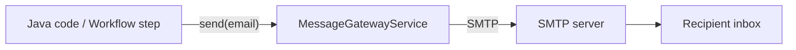

# Sending E-Mails in AEM

AEM provides a built-in e-mail infrastructure based on the **Day CQ Mail Service**
(`com.day.cq.mailer.DefaultMailService`). It wraps Apache Commons Email and exposes a
`MessageGatewayService` that OSGi components can inject to send plain-text, HTML, and
multi-part messages.

This page covers configuration, coding patterns, templated e-mails, testing with MailHog,
and AEMaaCS-specific networking requirements.



---

## OSGi Configuration

The mail service is configured via the **Day CQ Mail Service** factory PID.

### Local development (with MailHog)

[MailHog](https://github.com/mailhog/MailHog) is a lightweight SMTP test server that
captures all outgoing mail in a web UI -- no real mail provider needed.

Start MailHog with Docker:

```bash
docker run -d --name mailhog -p 1025:1025 -p 8025:8025 mailhog/mailhog
```

- **Port 1025** -- SMTP (for AEM to send to)
- **Port 8025** -- Web UI (open in browser to see captured mails)

```json title="ui.config/.../config.author/com.day.cq.mailer.DefaultMailService.cfg.json"
{
    "smtp.host": "localhost",
    "smtp.port": 1025,
    "smtp.user": "",
    "smtp.password": "",
    "from.address": "noreply@local.dev",
    "smtp.ssl": false,
    "smtp.starttls": false,
    "smtp.requiretls": false,
    "debug.email": false,
    "oauth.flow": false
}
```


### Stage / Production

For real environments, point at your SMTP relay (e.g. SendGrid, Amazon SES, corporate
mail server):

```json title="ui.config/.../config.publish/com.day.cq.mailer.DefaultMailService.cfg.json"
{
    "smtp.host": "$[secret:smtp_host]",
    "smtp.port": 587,
    "smtp.user": "$[secret:smtp_user]",
    "smtp.password": "$[secret:smtp_password]",
    "from.address": "noreply@example.com",
    "smtp.ssl": false,
    "smtp.starttls": true,
    "smtp.requiretls": true,
    "debug.email": false,
    "oauth.flow": false
}
```

> Use **secret environment variables** (`$[secret:...]`) in AEMaaCS to keep credentials
> out of the code repository. See the [OSGi configuration](../backend/osgi-configuration.mdx)
> page for details.

### Configuration reference

| Property | Type | Description |
|----------|------|-------------|
| `smtp.host` | String | SMTP server hostname |
| `smtp.port` | int | SMTP port (25, 465, 587) |
| `smtp.user` | String | SMTP authentication user |
| `smtp.password` | String | SMTP authentication password |
| `from.address` | String | Default "From" address |
| `smtp.ssl` | boolean | Use implicit SSL (port 465) |
| `smtp.starttls` | boolean | Upgrade to TLS after connecting (port 587) |
| `smtp.requiretls` | boolean | Fail if STARTTLS is not available |
| `debug.email` | boolean | Log full SMTP conversation (never enable in production) |
| `oauth.flow` | boolean | Use OAuth 2.0 for authentication (Microsoft 365, Google Workspace) |

---

## Sending a Simple Plain-Text E-Mail

The simplest case -- inject `MessageGatewayService`, build a `SimpleEmail`, and send it:

```java
import com.day.cq.mailer.MessageGateway;
import com.day.cq.mailer.MessageGatewayService;
import org.apache.commons.mail.Email;
import org.apache.commons.mail.SimpleEmail;
import org.osgi.service.component.annotations.Component;
import org.osgi.service.component.annotations.Reference;

import javax.mail.internet.InternetAddress;
import java.util.Collections;

@Component(service = SimpleMailSender.class)
public class SimpleMailSender {

    @Reference
    private MessageGatewayService messageGatewayService;

    public void sendTestMail(String to, String subject, String body) throws Exception {
        SimpleEmail email = new SimpleEmail();
        email.setFrom("noreply@example.com", "My AEM Site");
        email.addHeader("X-Mailer", "Adobe Experience Manager");
        email.setCharset("utf-8");
        email.setSubject(subject);
        email.setMsg(body);
        email.setTo(Collections.singletonList(new InternetAddress(to)));

        MessageGateway<Email> gateway = messageGatewayService.getGateway(Email.class);
        if (gateway != null) {
            gateway.send(email);
        } else {
            throw new IllegalStateException(
                "Mail gateway not available -- check DefaultMailService config");
        }
    }
}
```

> Always null-check the gateway. If the OSGi config is missing or invalid, `getGateway()`
> returns `null` rather than throwing.

---

## Sending HTML E-Mails

Use `HtmlEmail` to send rich HTML content with an automatic plain-text fallback:

```java
import org.apache.commons.mail.HtmlEmail;

public void sendHtmlMail(String to, String subject,
                         String htmlBody, String textFallback) throws Exception {

    HtmlEmail email = new HtmlEmail();
    email.setFrom("noreply@example.com", "My AEM Site");
    email.setCharset("utf-8");
    email.setSubject(subject);
    email.setHtmlMsg(htmlBody);
    email.setTextMsg(textFallback); // shown by plain-text clients

    email.addTo(to);

    MessageGateway<HtmlEmail> gateway =
        messageGatewayService.getGateway(HtmlEmail.class);
    if (gateway != null) {
        gateway.send(email);
    }
}
```

---

## Sending E-Mails with Attachments

Use `MultiPartEmail` or `HtmlEmail` with embedded attachments:

```java
import org.apache.commons.mail.EmailAttachment;
import org.apache.commons.mail.MultiPartEmail;

public void sendWithAttachment(String to, String subject, String body,
                               String attachmentPath) throws Exception {

    MultiPartEmail email = new MultiPartEmail();
    email.setFrom("noreply@example.com");
    email.setCharset("utf-8");
    email.setSubject(subject);
    email.setMsg(body);
    email.addTo(to);

    // Attach a file from the local filesystem or a URL
    EmailAttachment attachment = new EmailAttachment();
    attachment.setPath(attachmentPath);
    attachment.setDisposition(EmailAttachment.ATTACHMENT);
    attachment.setName("report.pdf");
    email.attach(attachment);

    MessageGateway<MultiPartEmail> gateway =
        messageGatewayService.getGateway(MultiPartEmail.class);
    if (gateway != null) {
        gateway.send(email);
    }
}
```

### Attaching DAM assets

To attach an asset from the JCR repository, stream it from the rendition:

```java
import com.day.cq.dam.api.Asset;
import com.day.cq.dam.api.Rendition;
import org.apache.commons.mail.ByteArrayDataSource;

Resource assetResource = resolver.getResource("/content/dam/myproject/report.pdf");
Asset asset = assetResource.adaptTo(Asset.class);
Rendition original = asset.getOriginal();

ByteArrayDataSource dataSource = new ByteArrayDataSource(
    original.getStream(),
    original.getMimeType()
);

email.attach(dataSource, "report.pdf", "Monthly report");
```

---

## Templated E-Mails

Hardcoding HTML in Java is fragile. AEM supports two common patterns for templated mails.

### Pattern 1: AEM page as e-mail template

Author the e-mail as a regular AEM page, then render it to HTML at send time:

```java
import com.day.cq.commons.mail.MailTemplate;
import org.apache.sling.api.resource.ResourceResolver;

import javax.jcr.Session;
import java.util.Map;

public void sendTemplatedMail(ResourceResolver resolver,
                              String templatePath,
                              Map<String, String> tokens,
                              String recipientEmail) throws Exception {

    Session session = resolver.adaptTo(Session.class);

    // Load the template from the JCR
    MailTemplate template = MailTemplate.create(templatePath, session);

    if (template == null) {
        throw new IllegalArgumentException("Template not found: " + templatePath);
    }

    // Replace ${placeholders} in the template with actual values
    HtmlEmail email = template.getEmail(
        MailTemplate.CHARSET_UTF8,
        HtmlEmail.class,
        tokens
    );

    email.setTo(Collections.singletonList(new InternetAddress(recipientEmail)));

    MessageGateway<HtmlEmail> gateway =
        messageGatewayService.getGateway(HtmlEmail.class);
    if (gateway != null) {
        gateway.send(email);
    }
}
```

The template file is a plain HTML file stored in the JCR (e.g., under
`/etc/notification/email/myproject/`), with `${variable}` placeholders:

```html title="Template: /etc/notification/email/myproject/welcome.html"
<!DOCTYPE html>
<html>
<head><meta charset="utf-8"/></head>
<body>
  <h1>Welcome, ${firstName}!</h1>
  <p>Your account on <strong>${siteName}</strong> has been created.</p>
  <p><a href="${loginUrl}">Log in now</a></p>
</body>
</html>
```

Usage:

```java
Map<String, String> tokens = Map.of(
    "firstName", "Jane",
    "siteName", "Acme Corp",
    "loginUrl", "https://acme.com/login"
);
sendTemplatedMail(resolver,
    "/etc/notification/email/myproject/welcome.html",
    tokens,
    "jane@acme.com");
```

### Pattern 2: HTL-rendered page

For richer templates, create an AEM component/page that renders the e-mail via HTL, then
fetch the rendered HTML with Sling's `SlingRequestProcessor`:

```java
import org.apache.sling.engine.SlingRequestProcessor;
import org.apache.sling.api.resource.ResourceResolver;

@Reference
private SlingRequestProcessor requestProcessor;

public String renderPageToHtml(ResourceResolver resolver, String pagePath)
        throws Exception {

    // Build an internal request to the page
    ContainerRequestWrapper request = new ContainerRequestWrapper(pagePath);
    ByteArrayOutputStream output = new ByteArrayOutputStream();
    ContainerResponseWrapper response = new ContainerResponseWrapper(output);

    requestProcessor.processRequest(request, response, resolver);

    return output.toString("utf-8");
}
```

> This approach lets authors edit e-mail templates visually in AEM, using components and
> the Style System.

---

## Reusable E-Mail Service

In real projects, wrap the gateway logic into a dedicated OSGi service:

```java
package com.myproject.core.services;

import java.util.List;

public interface EmailService {

    /**
     * Send a plain-text e-mail.
     */
    void sendPlainText(String from, List<String> to, String subject, String body)
        throws EmailException;

    /**
     * Send an HTML e-mail with an optional plain-text fallback.
     */
    void sendHtml(String from, List<String> to, String subject,
                  String html, String textFallback)
        throws EmailException;

    /**
     * Send a templated e-mail using an AEM mail template with token replacement.
     */
    void sendTemplated(String templatePath, java.util.Map<String, String> tokens,
                       List<String> to)
        throws EmailException;
}
```

```java
package com.myproject.core.services.impl;

import com.day.cq.mailer.MessageGateway;
import com.day.cq.mailer.MessageGatewayService;
import com.myproject.core.services.EmailService;
import org.apache.commons.mail.Email;
import org.apache.commons.mail.HtmlEmail;
import org.apache.commons.mail.SimpleEmail;
import org.osgi.service.component.annotations.Component;
import org.osgi.service.component.annotations.Reference;
import org.slf4j.Logger;
import org.slf4j.LoggerFactory;

import javax.mail.internet.InternetAddress;
import java.util.List;
import java.util.stream.Collectors;

@Component(service = EmailService.class)
public class EmailServiceImpl implements EmailService {

    private static final Logger LOG = LoggerFactory.getLogger(EmailServiceImpl.class);
    private static final String CHARSET = "utf-8";

    @Reference
    private MessageGatewayService gatewayService;

    @Override
    public void sendPlainText(String from, List<String> to,
                              String subject, String body) throws EmailException {

        SimpleEmail email = new SimpleEmail();
        email.setCharset(CHARSET);
        email.setFrom(from);
        email.setSubject(subject);
        email.setMsg(body);
        email.setTo(toAddresses(to));

        send(email, Email.class);
    }

    @Override
    public void sendHtml(String from, List<String> to, String subject,
                         String html, String textFallback) throws EmailException {

        HtmlEmail email = new HtmlEmail();
        email.setCharset(CHARSET);
        email.setFrom(from);
        email.setSubject(subject);
        email.setHtmlMsg(html);
        if (textFallback != null) {
            email.setTextMsg(textFallback);
        }
        email.setTo(toAddresses(to));

        send(email, HtmlEmail.class);
    }

    @Override
    public void sendTemplated(String templatePath,
                              java.util.Map<String, String> tokens,
                              List<String> to) throws EmailException {
        // See the MailTemplate pattern above
        // ...
    }

    private <T extends Email> void send(T email, Class<T> type) throws EmailException {
        MessageGateway<T> gateway = gatewayService.getGateway(type);
        if (gateway == null) {
            throw new EmailException(
                "Mail gateway unavailable. Check DefaultMailService OSGi config.");
        }
        try {
            gateway.send(email);
            LOG.info("E-mail sent: subject='{}', to={}",
                email.getSubject(), email.getToAddresses());
        } catch (Exception e) {
            LOG.error("Failed to send e-mail: {}", e.getMessage(), e);
            throw new EmailException("Failed to send e-mail", e);
        }
    }

    private List<InternetAddress> toAddresses(List<String> emails) throws EmailException {
        try {
            return emails.stream()
                .map(addr -> {
                    try { return new InternetAddress(addr); }
                    catch (Exception e) { throw new RuntimeException(e); }
                })
                .collect(Collectors.toList());
        } catch (RuntimeException e) {
            throw new EmailException("Invalid e-mail address", e.getCause());
        }
    }
}
```

---

## E-Mails in Workflow Steps

Workflows are a common trigger for sending e-mails (e.g., approval notifications, publish
confirmations). Use your `EmailService` inside a `WorkflowProcess`:

```java
@Component(
    service = WorkflowProcess.class,
    property = "process.label=Send Notification E-Mail"
)
public class NotificationEmailStep implements WorkflowProcess {

    @Reference
    private EmailService emailService;

    @Reference
    private ResourceResolverFactory resolverFactory;

    @Override
    public void execute(WorkItem workItem, WorkflowSession workflowSession,
                        MetaDataMap metaDataMap) throws WorkflowException {

        String payloadPath = workItem.getWorkflowData().getPayload().toString();
        String initiator = workItem.getWorkflow().getInitiator();

        try {
            emailService.sendPlainText(
                "noreply@example.com",
                List.of("admin@example.com"),
                "Content published: " + payloadPath,
                "Page " + payloadPath + " was published by " + initiator + "."
            );
        } catch (Exception e) {
            throw new WorkflowException("Failed to send notification", e);
        }
    }
}
```

See the [Workflows](../backend/workflows.mdx) page for more on custom workflow steps.

---

## AEMaaCS: Advanced Networking

On **AEM as a Cloud Service**, outbound SMTP traffic is blocked by default. You must
configure **Advanced Networking** to allow AEM to reach an external SMTP server.

### Setup steps

1. **Enable dedicated egress IP** in Cloud Manager (or flexible port egress)
2. **Add a port forwarding rule** for your SMTP server:

   | Name | Value |
   |------|-------|
   | Port forward name | `smtp_sendgrid` |
   | Protocol | TCP |
   | Port | 587 |
   | Destination host | `smtp.sendgrid.net` |

3. **Reference the forwarded port** in your OSGi config:

```json title="ui.config/.../config.publish/com.day.cq.mailer.DefaultMailService.cfg.json"
{
    "smtp.host": "localhost",
    "smtp.port": 30587,
    "smtp.user": "$[secret:smtp_user]",
    "smtp.password": "$[secret:smtp_password]",
    "from.address": "noreply@example.com",
    "smtp.ssl": false,
    "smtp.starttls": true,
    "smtp.requiretls": true
}
```

> On AEMaaCS, `smtp.host` is always `localhost` and `smtp.port` is the **forwarded port**
> (typically 30000 + original port, e.g., 30587 for port 587). The Cloud Manager
> infrastructure proxies the traffic to the actual SMTP host.

### OAuth 2.0 (Microsoft 365 / Google Workspace)

AEMaaCS supports OAuth 2.0 authentication for SMTP. This is required when connecting to
Microsoft 365 or Google Workspace, which have deprecated basic password authentication:

```json title="OAuth configuration"
{
    "smtp.host": "localhost",
    "smtp.port": 30587,
    "oauth.flow": true,
    "oauth.client.id": "$[secret:oauth_client_id]",
    "oauth.client.secret": "$[secret:oauth_client_secret]",
    "oauth.token.url": "https://login.microsoftonline.com/{tenant}/oauth2/v2.0/token",
    "oauth.scope": "https://outlook.office365.com/.default",
    "from.address": "noreply@example.com"
}
```

---

## Local Testing with MailHog

[MailHog](https://github.com/mailhog/MailHog) captures all outgoing SMTP traffic and
displays it in a web UI. No real mails are ever sent.

### Docker setup

```bash
# Run MailHog
docker run -d --name mailhog -p 1025:1025 -p 8025:8025 mailhog/mailhog

# Or with Docker Compose (add to your local AEM docker-compose.yml)
```

```yaml title="docker-compose.yml (excerpt)"
services:
  mailhog:
    image: mailhog/mailhog
    ports:
      - "1025:1025"  # SMTP
      - "8025:8025"  # Web UI
```

### MailHog features

| Feature | URL / Details |
|---------|--------------|
| Web UI | `http://localhost:8025` |
| SMTP | `localhost:1025` |
| REST API | `http://localhost:8025/api/v2/messages` |
| Search | Filter by sender, recipient, or subject in the UI |

### Alternative: Mailpit

[Mailpit](https://github.com/axllent/mailpit) is a modern, actively maintained alternative
to MailHog (which is no longer maintained):

```bash
docker run -d --name mailpit -p 1025:1025 -p 8025:8025 axllent/mailpit
```

Same ports, same OSGi config -- just a different Docker image. Mailpit offers a more modern
UI, mobile-responsive views, and better performance.

---

## Groovy Console: Quick E-Mail Test

Use the [Groovy Console](../groovy-console.mdx) to quickly verify your mail configuration
without deploying Java code:

```groovy
import com.day.cq.mailer.MessageGatewayService
import org.apache.commons.mail.SimpleEmail
import javax.mail.internet.InternetAddress

def gatewayService = getService(MessageGatewayService.class)
def gateway = gatewayService.getGateway(org.apache.commons.mail.Email.class)

def email = new SimpleEmail()
email.setFrom("test@local.dev")
email.setCharset("utf-8")
email.setSubject("Groovy Console Test")
email.setMsg("If you see this in MailHog, your config works!")
email.setTo([new InternetAddress("admin@test.com")])

gateway.send(email)

println "Mail sent successfully!"
```

---

## Common Mail Types at a Glance

| Class | Use case | Gateway type |
|-------|----------|-------------|
| `SimpleEmail` | Plain-text messages | `Email.class` |
| `HtmlEmail` | HTML with plain-text fallback | `HtmlEmail.class` |
| `MultiPartEmail` | Attachments | `MultiPartEmail.class` |
| `ImageHtmlEmail` | HTML with inline images | `HtmlEmail.class` |

All classes are from the `org.apache.commons.mail` package, bundled with AEM.

---

## Best Practices

### Use a dedicated `EmailService`

Don't scatter `MessageGatewayService` calls throughout the codebase. Centralise them in one
service with proper error handling, logging, and a consistent "from" address.

### Always check the gateway for null

```java
// Good
MessageGateway<Email> gw = gatewayService.getGateway(Email.class);
if (gw == null) {
    LOG.error("Mail gateway not configured");
    return;
}

// Bad -- NullPointerException if config is missing
gatewayService.getGateway(Email.class).send(email);
```

### Use secret variables for credentials

Never hardcode SMTP passwords in OSGi configs. Use `$[secret:...]` on AEMaaCS or
encrypted values on AEM 6.5.

### Test with MailHog / Mailpit first

Before pointing at a real SMTP server, always verify your code works with a local test
server. This avoids accidentally sending test mails to real recipients.

### Set `debug.email` carefully

Enabling `debug.email` logs the entire SMTP conversation, including potentially sensitive
headers and content. Never enable it in production.

### Provide a plain-text fallback

When sending `HtmlEmail`, always call `setTextMsg()` with a meaningful plain-text version.
Some mail clients and spam filters penalise HTML-only mails.

### Handle bounces and failures gracefully

The `send()` method is synchronous. If the SMTP server is slow or unreachable, it will
block the calling thread. Consider:

- Running mail sends **asynchronously** via Sling Jobs
- Setting a reasonable SMTP **connection timeout**
- Implementing **retry logic** for transient failures

---

## Common Pitfalls

| Pitfall | Solution |
|---------|----------|
| `MessageGateway` is null | OSGi config missing or invalid; verify in Felix console under **Day CQ Mail Service** |
| Mails sent locally but not on AEMaaCS | Configure Advanced Networking with port forwarding; `smtp.host` must be `localhost` |
| Authentication failure on Microsoft 365 | Microsoft deprecated basic auth; use `oauth.flow: true` with a registered app |
| Mails land in spam | Set proper SPF, DKIM, and DMARC DNS records for the sending domain |
| `javax.mail.AuthenticationFailedException` | Wrong credentials or wrong auth mechanism; check `smtp.user` and `smtp.password` |
| Mails not arriving on publish | Ensure the OSGi config exists for the publish run mode (`config.publish/`) |
| Attachment too large | Check your SMTP provider's size limits; consider linking to a download URL instead |
| Encoding issues in subject/body | Always call `email.setCharset("utf-8")` before setting content |

---

## External Resources

- [Adobe: E-mail Service in AEM](https://experienceleague.adobe.com/en/docs/experience-manager-learn/cloud-service/networking/examples/email-service)
- [Apache Commons Email](https://commons.apache.org/proper/commons-email/)
- [AEMaaCS Advanced Networking](https://experienceleague.adobe.com/en/docs/experience-manager-cloud-service/content/security/configuring-advanced-networking)
- [MailHog](https://github.com/mailhog/MailHog) / [Mailpit](https://github.com/axllent/mailpit)

## See also

- [OSGi configuration](../backend/osgi-configuration.mdx) -- run-mode configs and secrets
- [Workflows](../backend/workflows.mdx) -- triggering e-mails from workflow steps
- [Groovy Console](../groovy-console.mdx) -- quick mail testing
- [Deployment](./deployment.mdx) -- deploying OSGi configs
- [AEM as a Cloud Service](./cloud-service.mdx) -- advanced networking
- [Security basics](./security.mdx)
- [Sling Models and Services](../backend/sling-models.mdx) -- OSGi service patterns
