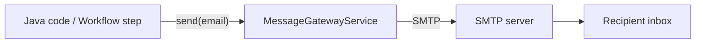

# Sending E-Mails in AEM

AEM provides a built-in e-mail infrastructure based on the **Day CQ Mail Service**
(`com.day.cq.mailer.DefaultMailService`). It wraps Apache Commons Email and exposes a
`MessageGatewayService` that OSGi components can inject to send plain-text, HTML, and
multi-part messages.

This page covers configuration, coding patterns, templated e-mails, testing with MailHog,
and AEMaaCS-specific networking requirements.


```mermaid
graph LR
    Code["Java code / Workflow step"]
    MGS["MessageGatewayService"]
    SMTP["SMTP server"]
    Inbox["Recipient inbox"]

    Code -->|"send(email)"| MGS
    MGS -->|SMTP| SMTP
    SMTP --> Inbox
```

---

## OSGi Configuration

The mail service is configured via the **Day CQ Mail Service** factory PID.

### Local development (with MailHog)

[MailHog](https://github.com/mailhog/MailHog) is a lightweight SMTP test server that
captures all outgoing mail in a web UI -- no real mail provider needed.

Start MailHog with Docker:

```bash
docker run -d --name mailhog -p 1025:1025 -p 8025:8025 mailhog/mailhog
```

- **Port 1025** -- SMTP (for AEM to send to)
- **Port 8025** -- Web UI (open in browser to see captured mails)

```json title="ui.config/.../config.author/com.day.cq.mailer.DefaultMailService.cfg.json"
{
    "smtp.host": "localhost",
    "smtp.port": 1025,
    "smtp.user": "",
    "smtp.password": "",
    "from.address": "noreply@local.dev",
    "smtp.ssl": false,
    "smtp.starttls": false,
    "smtp.requiretls": false,
    "debug.email": false,
    "oauth.flow": false
}
```


### Stage / Production

For real environments, point at your SMTP relay (e.g. SendGrid, Amazon SES, corporate
mail server):

```json title="ui.config/.../config.publish/com.day.cq.mailer.DefaultMailService.cfg.json"
{
    "smtp.host": "$[secret:smtp_host]",
    "smtp.port": 587,
    "smtp.user": "$[secret:smtp_user]",
    "smtp.password": "$[secret:smtp_password]",
    "from.address": "noreply@example.com",
    "smtp.ssl": false,
    "smtp.starttls": true,
    "smtp.requiretls": true,
    "debug.email": false,
    "oauth.flow": false
}
```

> Use **secret environment variables** (`$[secret:...]`) in AEMaaCS to keep credentials
> out of the code repository. See the [OSGi configuration](../backend/osgi-configuration.mdx)
> page for details.

### Configuration reference

| Property          | Type    | Description                                                        |
|-------------------|---------|--------------------------------------------------------------------|
| `smtp.host`       | String  | SMTP server hostname                                               |
| `smtp.port`       | int     | SMTP port (25, 465, 587)                                           |
| `smtp.user`       | String  | SMTP authentication user                                           |
| `smtp.password`   | String  | SMTP authentication password                                       |
| `from.address`    | String  | Default "From" address                                             |
| `smtp.ssl`        | boolean | Use implicit SSL (port 465)                                        |
| `smtp.starttls`   | boolean | Upgrade to TLS after connecting (port 587)                         |
| `smtp.requiretls` | boolean | Fail if STARTTLS is not available                                  |
| `debug.email`     | boolean | Log full SMTP conversation (never enable in production)            |
| `oauth.flow`      | boolean | Use OAuth 2.0 for authentication (Microsoft 365, Google Workspace) |

---

## Sending a Simple Plain-Text E-Mail

The simplest case -- inject `MessageGatewayService`, build a `SimpleEmail`, and send it:

```java
import com.day.cq.mailer.MessageGateway;
import com.day.cq.mailer.MessageGatewayService;
import org.apache.commons.mail.Email;
import org.apache.commons.mail.SimpleEmail;
import org.osgi.service.component.annotations.Component;
import org.osgi.service.component.annotations.Reference;

import javax.mail.internet.InternetAddress;
import java.util.Collections;

@Component(service = SimpleMailSender.class)
public class SimpleMailSender {

    @Reference
    private MessageGatewayService messageGatewayService;

    public void sendTestMail(String to, String subject, String body) throws Exception {
        SimpleEmail email = new SimpleEmail();
        email.setFrom("noreply@example.com", "My AEM Site");
        email.addHeader("X-Mailer", "Adobe Experience Manager");
        email.setCharset("utf-8");
        email.setSubject(subject);
        email.setMsg(body);
        email.setTo(Collections.singletonList(new InternetAddress(to)));

        MessageGateway<Email> gateway = messageGatewayService.getGateway(Email.class);
        if (gateway != null) {
            gateway.send(email);
        } else {
            throw new IllegalStateException(
                "Mail gateway not available -- check DefaultMailService config");
        }
    }
}
```

> Always null-check the gateway. If the OSGi config is missing or invalid, `getGateway()`
> returns `null` rather than throwing.

---

## Sending HTML E-Mails

Use `HtmlEmail` to send rich HTML content with an automatic plain-text fallback:

```java
import org.apache.commons.mail.HtmlEmail;

public void sendHtmlMail(String to, String subject,
                         String htmlBody, String textFallback) throws Exception {

    HtmlEmail email = new HtmlEmail();
    email.setFrom("noreply@example.com", "My AEM Site");
    email.setCharset("utf-8");
    email.setSubject(subject);
    email.setHtmlMsg(htmlBody);
    email.setTextMsg(textFallback); // shown by plain-text clients

    email.addTo(to);

    MessageGateway<HtmlEmail> gateway =
        messageGatewayService.getGateway(HtmlEmail.class);
    if (gateway != null) {
        gateway.send(email);
    }
}
```

---

## Sending E-Mails with Attachments

Use `MultiPartEmail` or `HtmlEmail` with embedded attachments:

```java
import org.apache.commons.mail.EmailAttachment;
import org.apache.commons.mail.MultiPartEmail;

public void sendWithAttachment(String to, String subject, String body,
                               String attachmentPath) throws Exception {

    MultiPartEmail email = new MultiPartEmail();
    email.setFrom("noreply@example.com");
    email.setCharset("utf-8");
    email.setSubject(subject);
    email.setMsg(body);
    email.addTo(to);

    // Attach a file from the local filesystem or a URL
    EmailAttachment attachment = new EmailAttachment();
    attachment.setPath(attachmentPath);
    attachment.setDisposition(EmailAttachment.ATTACHMENT);
    attachment.setName("report.pdf");
    email.attach(attachment);

    MessageGateway<MultiPartEmail> gateway =
        messageGatewayService.getGateway(MultiPartEmail.class);
    if (gateway != null) {
        gateway.send(email);
    }
}
```

### Attaching DAM assets

To attach an asset from the JCR repository, stream it from the rendition:

```java
import com.day.cq.dam.api.Asset;
import com.day.cq.dam.api.Rendition;
import org.apache.commons.mail.ByteArrayDataSource;

Resource assetResource = resolver.getResource("/content/dam/myproject/report.pdf");
Asset asset = assetResource.adaptTo(Asset.class);
Rendition original = asset.getOriginal();

ByteArrayDataSource dataSource = new ByteArrayDataSource(
    original.getStream(),
    original.getMimeType()
);

email.attach(dataSource, "report.pdf", "Monthly report");
```

---

## Templated E-Mails

Hardcoding HTML in Java is fragile. AEM supports two common patterns for templated mails.

### Pattern 1: HTML file + MailTemplate

Store the e-mail as an HTML file with `${placeholder}` tokens, then load it and replace the
tokens with real values at send time using `MailTemplate`:

```java
import com.day.cq.commons.mail.MailTemplate;
import com.day.cq.mailer.MessageGateway;
import com.day.cq.mailer.MessageGatewayService;
import org.apache.commons.mail.HtmlEmail;
import org.apache.sling.api.resource.ResourceResolver;

import javax.jcr.Session;
import javax.mail.internet.InternetAddress;
import java.util.Collections;
import java.util.Map;

public void sendTemplatedMail(ResourceResolver resolver,
                              String templatePath,
                              Map<String, String> tokens,
                              String recipientEmail) throws Exception {

    Session session = resolver.adaptTo(Session.class);

    // Load the template from the JCR
    MailTemplate template = MailTemplate.create(templatePath, session);

    if (template == null) {
        throw new IllegalArgumentException("Template not found: " + templatePath);
    }

    // Replace ${placeholders} in the template (both headers and body) with the
    // token values. Use the Map overload -- getEmail(StrLookup, Class) is deprecated.
    HtmlEmail email = template.getEmail(tokens, HtmlEmail.class);

    email.setTo(Collections.singletonList(new InternetAddress(recipientEmail)));

    MessageGateway<HtmlEmail> gateway =
        messageGatewayService.getGateway(HtmlEmail.class);
    if (gateway != null) {
        gateway.send(email);
    }
}
```

The template file is a plain HTML file stored in the JCR with `${variable}`
placeholders. It can start with an optional **header block** (`Subject`, `From`,
`To`, `CC`, `BCC`, `Reply-To`, `Bounce-To`) separated from the body by a blank line --
`MailTemplate` parses those headers and applies them to the `Email`, and placeholders
work in the headers too:

```html title="Template: /apps/myproject/templates/email/welcome.html"
Subject: Welcome to ${siteName}
From: ${siteName} <noreply@example.com>

<!DOCTYPE html>
<html>
<head><meta charset="utf-8"/></head>
<body>
  <h1>Welcome, ${firstName}!</h1>
  <p>Your account on <strong>${siteName}</strong> has been created.</p>
  <p><a href="${loginUrl}">Log in now</a></p>
</body>
</html>
```

> Where should this file live, and how does it get into the JCR? See
> [Managing HTML Templates with Placeholders](#managing-html-templates-with-placeholders)
> below for the full step-by-step.

Usage:

```java
Map<String, String> tokens = Map.of(
    "firstName", "Jane",
    "siteName", "Acme Corp",
    "loginUrl", "https://acme.com/login"
);
sendTemplatedMail(resolver,
    "/apps/myproject/templates/email/welcome.html",
    tokens,
    "jane@acme.com");
```

### Pattern 2: HTL-rendered page

For richer templates, create an AEM component/page that renders the e-mail via HTL, then
fetch the rendered HTML with Sling's `SlingRequestProcessor`:

```java
import org.apache.sling.api.SlingHttpServletRequest;
import org.apache.sling.api.request.builder.Builders;
import org.apache.sling.api.request.builder.SlingHttpServletResponseResult;
import org.apache.sling.api.resource.Resource;
import org.apache.sling.api.resource.ResourceResolver;
import org.apache.sling.engine.SlingRequestProcessor;

@Reference
private SlingRequestProcessor requestProcessor;

public String renderPageToHtml(ResourceResolver resolver, String pagePath)
        throws Exception {

    Resource page = resolver.getResource(pagePath);
    if (page == null) {
        throw new IllegalArgumentException("Page not found: " + pagePath);
    }

    // Build a synthetic internal request/response with the Sling request Builders API,
    // run it through the engine, and read the captured output
    SlingHttpServletRequest request = Builders.newRequestBuilder(page)
        .withRequestMethod("GET")
        .withExtension("html")
        .build();
    SlingHttpServletResponseResult response = Builders.newResponseBuilder().build();

    requestProcessor.processRequest(request, response, resolver);

    return response.getOutputAsString();
}
```

> This approach lets authors edit e-mail templates visually in AEM, using components and
> the Style System.

### Pattern 3: Properties-file template + StringSubstitutor

`MailTemplate` is convenient but rigid: one header block, one body, and its own parsing
rules. A more flexible approach -- and a common one in real projects -- is to store the
template as a Java **`.properties`** file with named sections and do the token replacement
yourself with Apache Commons `StringSubstitutor`. This keeps the subject, header, message,
and footer as separate, independently reusable fields.

```properties title="/apps/myproject/templates/email/task-assigned.txt"
subject=A task is waiting for you: ${taskName}

header=-----------------------------------------------------------\n\
Project: ${projectTitle}\n\
Assigned: ${eventTimestamp}\n\
-----------------------------------------------------------\n

message=\n\
Hi ${firstName},\n\
a new task has been assigned to you. Open it here:\n${host.prefix}${link.open}\n

footer=\n\
-----------------------------------------------------------\n\
This is an automatically generated message. Please do not reply.
```

Each value is a `${placeholder}` host; `\` continues a line within a property. Load the file
from its JCR `nt:file` node and substitute the tokens at send time:

```java title="PropertiesMailBuilder.java"
import com.day.cq.mailer.MessageGateway;
import com.day.cq.mailer.MessageGatewayService;
import org.apache.commons.mail.Email;
import org.apache.commons.mail.HtmlEmail;
import org.apache.commons.mail.SimpleEmail;
import org.apache.commons.text.StringSubstitutor; // from org.apache.commons.text (provided by AEM)
import org.apache.sling.api.resource.ResourceResolver;

import javax.jcr.Node;
import javax.jcr.Session;
import java.io.InputStream;
import java.nio.charset.StandardCharsets;
import java.util.Enumeration;
import java.util.Map;
import java.util.Properties;

/** Reads the template properties from a JCR nt:file. */
private Properties loadTemplate(String path, ResourceResolver resolver) throws Exception {
    Session session = resolver.adaptTo(Session.class);
    if (session == null || !session.itemExists(path)) {
        throw new IllegalArgumentException("Template not found: " + path);
    }
    Node node = (Node) session.getItem(path);
    Properties props = new Properties();
    try (InputStream is = node.getProperty("jcr:content/jcr:data").getBinary().getStream()) {
        Properties raw = new Properties();
        raw.load(is); // Properties.load ALWAYS decodes ISO-8859-1
        Enumeration<?> keys = raw.propertyNames();
        while (keys.hasMoreElements()) {
            String key = (String) keys.nextElement();
            // Re-encode ISO-8859-1 bytes as UTF-8 so umlauts/accents survive
            String value = new String(
                raw.getProperty(key).getBytes(StandardCharsets.ISO_8859_1),
                StandardCharsets.UTF_8);
            props.put(key, value);
        }
    }
    return props;
}

/** Builds an Email from the template, substituting ${tokens} from params. */
public Email buildEmail(String templatePath, Map<String, String> params,
                        ResourceResolver resolver) throws Exception {

    Properties template = loadTemplate(templatePath, resolver);
    StringSubstitutor sub = new StringSubstitutor(params);

    // .html templates render as HTML, everything else as plain text
    boolean html = templatePath.endsWith(".html");
    Email email = html ? new HtmlEmail() : new SimpleEmail();
    email.setCharset("utf-8");
    email.setSubject(sub.replace(template.getProperty("subject")));

    String body = sub.replace(template.getProperty("header", ""))
                + sub.replace(template.getProperty("message", ""))
                + sub.replace(template.getProperty("footer", ""));

    if (email instanceof HtmlEmail) {
        ((HtmlEmail) email).setHtmlMsg(body);
    } else {
        email.setMsg(body);
    }
    return email;
}
```

> **The encoding gotcha.** `java.util.Properties.load(InputStream)` always decodes the bytes
> as ISO-8859-1, never UTF-8. Without the re-encoding step above, any umlaut or accented
> character in the template comes out garbled. This is the single most common bug with
> properties-based mail templates.

**When to prefer this over `MailTemplate`:** you want named, independently reusable sections
(subject/header/message/footer), the subject to live inside the template, or full control over
parsing and encoding. The cost is that you own the loader and the encoding handling -- which is
exactly what the snippet above provides.

#### Combining with a separate `.html` body in the JCR

Rich HTML is awkward to keep inside a single `.properties` value -- the escaping and `\` line
continuations get unwieldy fast. A clean hybrid keeps the small metadata (subject, and a
pointer to the body) in the properties file, while the **HTML body lives in its own `.html`
file** in the JCR, carrying the same `${placeholder}` tokens. The body file is authorable and
lintable on its own, and you can inline CSS the way e-mail clients expect.

```properties title="/apps/myproject/templates/email/task-assigned.txt (metadata)"
subject=A task is waiting for you: ${taskName}
body=/apps/myproject/templates/email/task-assigned.html
```

```html title="/apps/myproject/templates/email/task-assigned.html (body with placeholders)"
<!DOCTYPE html>
<html>
<head><meta charset="utf-8"/></head>
<body style="font-family: Arial, sans-serif;">
  <h1>Hi ${firstName},</h1>
  <p>A new task is waiting in <strong>${projectTitle}</strong>.</p>
  <p><a href="${host.prefix}${link.open}">Open the task</a></p>
</body>
</html>
```

Load the metadata with the Pattern 3 loader, load the HTML body as a UTF-8 string, and run the
**same `StringSubstitutor`** over both:

```java title="Combine: properties metadata + HTML body file"
public Email buildHtmlEmail(String metaPath, Map<String, String> params,
                            ResourceResolver resolver) throws Exception {

    Properties meta = loadTemplate(metaPath, resolver);     // reuse the Pattern 3 loader
    String htmlBody = loadText(meta.getProperty("body"), resolver);
    StringSubstitutor sub = new StringSubstitutor(params);

    HtmlEmail email = new HtmlEmail();
    email.setCharset("utf-8");
    email.setSubject(sub.replace(meta.getProperty("subject")));
    email.setHtmlMsg(sub.replace(htmlBody));                // ${tokens} in the HTML are replaced
    email.setTextMsg("Open the task: "                      // plain-text fallback
        + params.get("host.prefix") + params.get("link.open"));
    return email;
}

/** Reads a JCR nt:file as a UTF-8 string. */
private String loadText(String path, ResourceResolver resolver) throws Exception {
    Session session = resolver.adaptTo(Session.class);
    Node node = (Node) session.getItem(path);
    try (InputStream is = node.getProperty("jcr:content/jcr:data").getBinary().getStream()) {
        return new String(is.readAllBytes(), StandardCharsets.UTF_8);
    }
}
```

> Reading the `.html` file **directly as UTF-8** sidesteps the `Properties.load` ISO-8859-1
> gotcha entirely -- it only applies to `.properties` parsing, not to a raw HTML stream. The
> placeholder mechanism is identical (`${...}` via `StringSubstitutor`), so the same `params`
> map drives the subject, the metadata, and the HTML body. Authors then edit the HTML file in
> the JCR without ever touching Java.

---

## Managing HTML Templates with Placeholders

The `MailTemplate` pattern above hinges on two decisions: **where the HTML template files
live** and **how they get to a place `MailTemplate` can read them**. `MailTemplate` reads a
template from one of two sources:

- a JCR `nt:file` node, via `MailTemplate.create(path, session)`
- any `InputStream`, via `new MailTemplate(stream, charset)` (e.g. a bundle resource)

This section walks through both, end to end.

### Step 1 -- Choose where the templates live

| Storage                          | Edit by         | Load with                          | Best for                                                   |
|----------------------------------|-----------------|------------------------------------|------------------------------------------------------------|
| `ui.apps` (`/apps/...`)          | Developers      | `MailTemplate.create(path, ...)`   | Code-owned templates, deployed and versioned with the app  |
| `ui.content` (`/content/...`)    | Authors         | `MailTemplate.create(path, ...)`   | Templates business users should tweak without a deployment |
| Bundle resource (`src/main/resources`) | Developers | `new MailTemplate(stream, charset)` | Simplest, unit-testable, no JCR lookup at all              |

> Avoid `/etc/notification/email/...` on AEM as a Cloud Service. `/etc` is deprecated and
> read-only there. Put developer-owned templates under `/apps/<project>/templates/email/`
> (immutable but readable at runtime) or ship them as bundle resources.

### Step 2 -- Write the template (header block + body + placeholders)

A template is a plain text/HTML file. An optional **header block** at the very top sets mail
headers; a blank line separates it from the body. `${placeholder}` tokens are allowed
anywhere -- including in the headers.

```html title="welcome.html"
Subject: Welcome to ${siteName}, ${firstName}!
From: ${siteName} <noreply@example.com>
Reply-To: support@example.com

<!DOCTYPE html>
<html>
<head><meta charset="utf-8"/></head>
<body>
  <h1>Welcome, ${firstName}!</h1>
  <p>Your account on <strong>${siteName}</strong> is ready.</p>
  <p><a href="${loginUrl}">Log in now</a></p>
</body>
</html>
```

Things worth knowing about the format:

- **Recognized headers:** `Subject`, `From`, `To`, `CC`, `BCC`, `Reply-To`, `Bounce-To`.
  Anything you set in the template you do not need to set again in code (and vice versa).
  Setting recipients in both the `To:` header and `email.setTo(...)` adds them twice, so
  pick one place per header.
- **HTML detection:** if the body contains an `<html>` tag, `MailTemplate` sends it as the
  HTML part; otherwise it is treated as plain text.
- **Missing tokens stay literal:** an unresolved `${foo}` is left in the output verbatim, so
  always pass every token the template uses.
- **Charset:** `create()` honors the node's `jcr:encoding` (default `utf-8`); the
  `InputStream` constructor takes the charset as its second argument.

### Step 3, Option A -- Store the template in the JCR (`ui.apps`)

Drop the file into your content package's `jcr_root` tree. FileVault imports any plain file
as an `nt:file` node automatically -- no `.content.xml` needed for the file itself.

```text title="ui.apps module layout"
ui.apps/src/main/content/jcr_root/apps/myproject/templates/email/
├── welcome.html
├── password-reset.html
└── order-confirmation.html
```

Make sure your filter covers the path so the file is actually deployed:

```xml title="ui.apps/src/main/content/META-INF/vault/filter.xml"
<filter root="/apps/myproject/templates/email"/>
```

After deployment the template is readable at
`/apps/myproject/templates/email/welcome.html`. Load it with a `Session`:

```java
Session session = resolver.adaptTo(Session.class);
MailTemplate template = MailTemplate.create(
    "/apps/myproject/templates/email/welcome.html", session);

if (template == null) {
    // create() returns null if the path is missing or not an nt:file
    throw new EmailException("Template not found or not an nt:file");
}
```

> `MailTemplate.create()` returns `null` when the path does not resolve to an `nt:file`
> node. Always null-check it -- a misspelled path fails silently otherwise.

### Step 3, Option B -- Ship the template as a bundle resource

If authors never touch the templates, the simplest option is to keep them inside the bundle
and load them from the classpath. No JCR lookup, no `Session`, and they are trivial to unit
test.

```text title="core module layout"
core/src/main/resources/email-templates/
└── welcome.html
```

```java
public MailTemplate loadFromBundle(String resourceName) throws IOException {
    try (InputStream in = getClass().getClassLoader()
            .getResourceAsStream("email-templates/" + resourceName)) {
        if (in == null) {
            throw new IOException("Bundle template not found: " + resourceName);
        }
        return new MailTemplate(in, "utf-8");
    }
}
```

### Step 4 -- Render the placeholders and send

Build the token map, render the template into a typed `Email`, fill in any per-recipient
details, and hand it to the gateway:

```java
public void sendWelcome(ResourceResolver resolver, String recipient,
                        String firstName, String siteName) throws Exception {

    Session session = resolver.adaptTo(Session.class);
    MailTemplate template = MailTemplate.create(
        "/apps/myproject/templates/email/welcome.html", session);
    if (template == null) {
        throw new EmailException("Template not found");
    }

    Map<String, String> tokens = Map.of(
        "firstName", firstName,
        "siteName", siteName,
        "loginUrl", "https://example.com/login"
    );

    // Subject and From come from the template's header block; tokens fill the gaps
    HtmlEmail email = template.getEmail(tokens, HtmlEmail.class);
    email.setTo(Collections.singletonList(new InternetAddress(recipient)));

    MessageGateway<HtmlEmail> gateway =
        messageGatewayService.getGateway(HtmlEmail.class);
    if (gateway != null) {
        gateway.send(email);
    }
}
```

### Step 5 -- Wire it into the reusable service

In a real project, route everything through the `EmailService.sendTemplated(...)` method
shown [below](#reusable-e-mail-service) so template loading, token replacement, and error
handling live in one place.

### Step 6 -- Verify the rendered output

- **Locally:** send against [MailHog / Mailpit](#local-testing-with-mailhog) and inspect the
  rendered HTML and headers in the web UI.
- **In a unit test:** load a bundle template with the `InputStream` constructor, call
  `getEmail(tokens, HtmlEmail.class)`, and assert on `email.getSubject()` /
  `getHtmlMsg()`. No running AEM required.

> **Escape user input.** Tokens are substituted verbatim into the HTML, so any value that
> originates from a user (names, free-text fields) must be HTML-escaped before it goes into
> the token map -- otherwise the template is open to HTML/markup injection.

> **Localization:** keep one template file per language
> (`welcome_de.html`, `welcome_en.html`, ...) and resolve the path from the recipient's
> locale at send time, rather than branching inside a single template.

---

## Reusable E-Mail Service

In real projects, wrap the gateway logic into a dedicated OSGi service:

```java
package com.myproject.core.services;

import org.apache.commons.mail.EmailException;

import java.util.List;
import java.util.Map;

public interface EmailService {

    /**
     * Send a plain-text e-mail.
     */
    void sendPlainText(String from, List<String> to, String subject, String body)
        throws EmailException;

    /**
     * Send an HTML e-mail with an optional plain-text fallback.
     */
    void sendHtml(String from, List<String> to, String subject,
                  String html, String textFallback)
        throws EmailException;

    /**
     * Send a templated e-mail using an AEM mail template with token replacement.
     */
    void sendTemplated(String templatePath, Map<String, String> tokens,
                       List<String> to)
        throws EmailException;
}
```

```java
package com.myproject.core.services.impl;

import com.day.cq.commons.mail.MailTemplate;
import com.day.cq.mailer.MessageGateway;
import com.day.cq.mailer.MessageGatewayService;
import com.myproject.core.services.EmailService;
import org.apache.commons.mail.Email;
import org.apache.commons.mail.EmailException;
import org.apache.commons.mail.HtmlEmail;
import org.apache.commons.mail.SimpleEmail;
import org.apache.sling.api.resource.ResourceResolver;
import org.apache.sling.api.resource.ResourceResolverFactory;
import org.osgi.service.component.annotations.Component;
import org.osgi.service.component.annotations.Reference;
import org.slf4j.Logger;
import org.slf4j.LoggerFactory;

import javax.jcr.Session;
import javax.mail.internet.InternetAddress;
import java.util.Collections;
import java.util.List;
import java.util.Map;
import java.util.stream.Collectors;

@Component(service = EmailService.class)
public class EmailServiceImpl implements EmailService {

    private static final Logger LOG = LoggerFactory.getLogger(EmailServiceImpl.class);
    private static final String CHARSET = "utf-8";
    private static final String MAIL_SERVICE_USER = "myproject-mail-service";

    @Reference
    private MessageGatewayService gatewayService;

    @Reference
    private ResourceResolverFactory resolverFactory;

    @Override
    public void sendPlainText(String from, List<String> to,
                              String subject, String body) throws EmailException {

        SimpleEmail email = new SimpleEmail();
        email.setCharset(CHARSET);
        email.setFrom(from);
        email.setSubject(subject);
        email.setMsg(body);
        email.setTo(toAddresses(to));

        send(email, Email.class);
    }

    @Override
    public void sendHtml(String from, List<String> to, String subject,
                         String html, String textFallback) throws EmailException {

        HtmlEmail email = new HtmlEmail();
        email.setCharset(CHARSET);
        email.setFrom(from);
        email.setSubject(subject);
        email.setHtmlMsg(html);
        if (textFallback != null) {
            email.setTextMsg(textFallback);
        }
        email.setTo(toAddresses(to));

        send(email, HtmlEmail.class);
    }

    @Override
    public void sendTemplated(String templatePath, Map<String, String> tokens,
                              List<String> to) throws EmailException {

        Map<String, Object> auth =
            Collections.singletonMap(ResourceResolverFactory.SUBSERVICE, MAIL_SERVICE_USER);

        HtmlEmail email;
        // Build the e-mail inside the try-with-resources, then send after the resolver
        // is closed -- the template is fully read by then.
        try (ResourceResolver resolver = resolverFactory.getServiceResourceResolver(auth)) {
            Session session = resolver.adaptTo(Session.class);

            MailTemplate template = MailTemplate.create(templatePath, session);
            if (template == null) {
                throw new EmailException(
                    "Template not found or not an nt:file: " + templatePath);
            }

            // Replaces ${placeholders}; Subject/From can come from the template headers
            email = template.getEmail(tokens, HtmlEmail.class);
            email.setTo(toAddresses(to));
        } catch (EmailException e) {
            throw e;
        } catch (Exception e) {
            throw new EmailException("Failed to build templated e-mail: " + templatePath, e);
        }

        send(email, HtmlEmail.class);
    }

    private <T extends Email> void send(T email, Class<T> type) throws EmailException {
        MessageGateway<T> gateway = gatewayService.getGateway(type);
        if (gateway == null) {
            throw new EmailException(
                "Mail gateway unavailable. Check DefaultMailService OSGi config.");
        }
        try {
            gateway.send(email);
            LOG.info("E-mail sent: subject='{}', to={}",
                email.getSubject(), email.getToAddresses());
        } catch (Exception e) {
            LOG.error("Failed to send e-mail: {}", e.getMessage(), e);
            throw new EmailException("Failed to send e-mail", e);
        }
    }

    private List<InternetAddress> toAddresses(List<String> emails) throws EmailException {
        try {
            return emails.stream()
                .map(addr -> {
                    try { return new InternetAddress(addr); }
                    catch (Exception e) { throw new RuntimeException(e); }
                })
                .collect(Collectors.toList());
        } catch (RuntimeException e) {
            throw new EmailException("Invalid e-mail address", e.getCause());
        }
    }
}
```

> `sendTemplated` reads the template from the JCR, so it needs a `ResourceResolver`. It uses
> a **service user** rather than an administrative session. Map a subservice named
> `myproject-mail-service` (with read access to your template path) via a
> `org.apache.sling.serviceusermapping.impl.ServiceUserMapperImpl.amended` config. See the
> [OSGi configuration](../backend/osgi-configuration.mdx) page. Templates shipped as bundle
> resources skip this entirely -- they need no resolver at all.

---

## Sending to AEM Users and Groups

So far recipients have been raw address strings. In practice you usually know the recipients
as AEM **users and groups** (`Authorizable`s) -- a workflow participant, a project group, the
members of a role. It is cleaner to let the service resolve addresses from the user profile
and expand groups itself, so callers pass principals rather than e-mail strings.

```java title="Resolving an address from an Authorizable"
import org.apache.jackrabbit.api.security.user.Authorizable;
import org.apache.jackrabbit.api.security.user.Group;
import org.apache.commons.lang3.StringUtils;

import javax.jcr.Value;
import java.util.ArrayList;
import java.util.Iterator;
import java.util.List;

/** Reads the e-mail address from the user's profile/email property. */
private String emailOf(Authorizable user) throws Exception {
    if (user == null || user.isGroup()) {
        return null;
    }
    Value[] values = user.getProperty("profile/email");
    return (values != null && values.length > 0) ? values[0].getString() : null;
}

/** Expands a group to its member users; a user resolves to itself. */
private List<Authorizable> resolveUsers(Authorizable principal) throws Exception {
    List<Authorizable> users = new ArrayList<>();
    if (principal == null) {
        return users;
    }
    if (principal.isGroup()) {
        Iterator<Authorizable> members = ((Group) principal).getMembers(); // transitive members
        while (members.hasNext()) {
            Authorizable member = members.next();
            if (!member.isGroup()) {
                users.add(member);
            }
        }
    } else {
        users.add(principal);
    }
    return users;
}
```

With those helpers, send **one mail per recipient** rather than putting everyone on a single
`To`. A per-recipient loop keeps addresses private, lets each message carry per-recipient
tokens (e.g. `${participantId}`), and -- importantly -- means one bad address or send failure
is logged and skipped instead of aborting the whole batch:

```java title="Per-recipient send loop"
public void sendToAuthorizables(String templatePath, Map<String, String> params,
                                List<Authorizable> recipients, ResourceResolver resolver) {
    MessageGateway<Email> gateway = gatewayService.getGateway(
        templatePath.endsWith(".html") ? HtmlEmail.class : SimpleEmail.class);
    if (gateway == null) {
        LOG.error("Mail gateway not configured");
        return;
    }
    for (Authorizable user : recipients) {
        try {
            String address = emailOf(user);
            if (StringUtils.isBlank(address)) {
                LOG.warn("No address for {}, skipping", user.getID());
                continue;
            }
            // per-recipient token, then build a fresh Email for this address
            params.put("participantId", user.getID());
            Email email = buildEmail(templatePath, params, resolver);
            email.setTo(Collections.singleton(new InternetAddress(address)));
            gateway.send(email);
        } catch (Exception e) {
            LOG.error("Failed to send to {}", user, e); // skip, do not abort the batch
        }
    }
}
```

> Obtain the `ResourceResolver` (and a `UserManager` to look principals up by id) through the
> `myproject-mail-service` service user described above, not an administrative session.

---

## E-Mails in Workflow Steps

Workflows are a common trigger for sending e-mails (e.g., approval notifications, publish
confirmations). Use your `EmailService` inside a `WorkflowProcess`:

```java
@Component(
    service = WorkflowProcess.class,
    property = "process.label=Send Notification E-Mail"
)
public class NotificationEmailStep implements WorkflowProcess {

    @Reference
    private EmailService emailService;

    @Reference
    private ResourceResolverFactory resolverFactory;

    @Override
    public void execute(WorkItem workItem, WorkflowSession workflowSession,
                        MetaDataMap metaDataMap) throws WorkflowException {

        String payloadPath = workItem.getWorkflowData().getPayload().toString();
        String initiator = workItem.getWorkflow().getInitiator();

        try {
            emailService.sendPlainText(
                "noreply@example.com",
                List.of("admin@example.com"),
                "Content published: " + payloadPath,
                "Page " + payloadPath + " was published by " + initiator + "."
            );
        } catch (Exception e) {
            throw new WorkflowException("Failed to send notification", e);
        }
    }
}
```

See the [Workflows](../backend/workflows.mdx) page for more on custom workflow steps.

### Config-driven, reusable step

Hardcoding the template and recipients in Java means a new step (and a deployment) for every
notification. A better pattern is **one generic step** whose template path and recipients come
from the workflow model's `PROCESS_ARGS`. The same compiled step is then reused across many
models, and authors change behaviour by editing the model.

```java title="Generic, parameterized workflow step"
@Component(
    service = WorkflowProcess.class,
    property = "process.label=Send Templated E-Mail"
)
public class TemplatedEmailStep implements WorkflowProcess {

    @Reference private EmailService emailService;
    @Reference private ResourceResolverFactory resolverFactory;
    @Reference private Externalizer externalizer;

    @Override
    public void execute(WorkItem workItem, WorkflowSession session,
                        MetaDataMap metaData) throws WorkflowException {

        // PROCESS_ARGS = "sendTo:project.group.editor,emailTemplate:/apps/.../published.txt"
        String args = metaData.get("PROCESS_ARGS", String.class);
        Map<String, String> argMap = parseArgs(args);          // -> sendTo, emailTemplate
        String templatePath = argMap.get("emailTemplate");
        String payloadPath = workItem.getWorkflowData().getPayload().toString();

        Map<String, Object> auth =
            Collections.singletonMap(ResourceResolverFactory.SUBSERVICE, "myproject-mail-service");
        try (ResourceResolver resolver = resolverFactory.getServiceResourceResolver(auth)) {

            Map<String, String> params = new HashMap<>();
            params.put("link.open", "/editor.html" + payloadPath + ".html");
            params.put("modelTitle", workItem.getWorkflow().getWorkflowModel().getTitle());
            params.put("eventTimestamp", workItem.getTimeStarted().toString());
            // absolute host prefix so links work in mail clients
            params.put("host.prefix", externalizer.externalLink(resolver, Externalizer.LOCAL, ""));

            List<Authorizable> recipients = resolveRecipients(argMap.get("sendTo"), resolver);
            emailService.sendToAuthorizables(templatePath, params, recipients, resolver);
        } catch (Exception e) {
            throw new WorkflowException("Failed to send workflow e-mail", e);
        }
    }
}
```

The matching step in the workflow model carries the configuration:

```xml title="Workflow model step (PROCESS_ARGS)"
<node
    jcr:primaryType="cq:WorkflowNode"
    jcr:title="Notify editors"
    sling:resourceType="cq/workflow/components/model/process">
    <metaData
        jcr:primaryType="nt:unstructured"
        PROCESS="com.myproject.core.workflows.TemplatedEmailStep"
        PROCESS_ARGS="sendTo:project.group.editor,emailTemplate:/apps/myproject/templates/email/published.txt"
        PROCESS_AUTO_ADVANCE="true"/>
</node>
```

> Workflows are not the only trigger. To e-mail someone when they are added to a group, register
> an Oak `AuthorizableActionProvider` and react in `AbstractGroupAction.onMemberAdded(...)` --
> the same `EmailService` call, driven by a repository event instead of a workflow.

---

## AEMaaCS: Advanced Networking

On **AEM as a Cloud Service**, outbound SMTP traffic is blocked by default. You must
configure **Advanced Networking** to allow AEM to reach an external SMTP server.

### Setup steps

1. **Enable dedicated egress IP** in Cloud Manager (or flexible port egress)
2. **Add a port forwarding rule** for your SMTP server:

| Name              | Value              |
|-------------------|--------------------|
| Port forward name | `smtp_sendgrid`    |
| Protocol          | TCP                |
| Port              | 587                |
| Destination host  | `smtp.sendgrid.net`|

3. **Reference the forwarded port** in your OSGi config:

```json title="ui.config/.../config.publish/com.day.cq.mailer.DefaultMailService.cfg.json"
{
    "smtp.host": "localhost",
    "smtp.port": 30587,
    "smtp.user": "$[secret:smtp_user]",
    "smtp.password": "$[secret:smtp_password]",
    "from.address": "noreply@example.com",
    "smtp.ssl": false,
    "smtp.starttls": true,
    "smtp.requiretls": true
}
```

> On AEMaaCS, `smtp.host` is always `localhost` and `smtp.port` is the **forwarded port**
> (typically 30000 + original port, e.g., 30587 for port 587). The Cloud Manager
> infrastructure proxies the traffic to the actual SMTP host.

### OAuth 2.0 (Microsoft 365 / Google Workspace)

AEMaaCS supports OAuth 2.0 authentication for SMTP. This is required when connecting to
Microsoft 365 or Google Workspace, which have deprecated basic password authentication:

```json title="OAuth configuration"
{
    "smtp.host": "localhost",
    "smtp.port": 30587,
    "oauth.flow": true,
    "oauth.client.id": "$[secret:oauth_client_id]",
    "oauth.client.secret": "$[secret:oauth_client_secret]",
    "oauth.token.url": "https://login.microsoftonline.com/{tenant}/oauth2/v2.0/token",
    "oauth.scope": "https://outlook.office365.com/.default",
    "from.address": "noreply@example.com"
}
```

---

## Local Testing with MailHog

[MailHog](https://github.com/mailhog/MailHog) captures all outgoing SMTP traffic and
displays it in a web UI. No real mails are ever sent.

### Docker setup

```bash
# Run MailHog
docker run -d --name mailhog -p 1025:1025 -p 8025:8025 mailhog/mailhog

# Or with Docker Compose (add to your local AEM docker-compose.yml)
```

```yaml title="docker-compose.yml (excerpt)"
services:
  mailhog:
    image: mailhog/mailhog
    ports:
      - "1025:1025"  # SMTP
      - "8025:8025"  # Web UI
```

### MailHog features

| Feature  | URL / Details                                     |
|----------|---------------------------------------------------|
| Web UI   | `http://localhost:8025`                           |
| SMTP     | `localhost:1025`                                  |
| REST API | `http://localhost:8025/api/v2/messages`           |
| Search   | Filter by sender, recipient, or subject in the UI |

### Alternative: Mailpit

[Mailpit](https://github.com/axllent/mailpit) is a modern, actively maintained alternative
to MailHog (which is no longer maintained):

```bash
docker run -d --name mailpit -p 1025:1025 -p 8025:8025 axllent/mailpit
```

Same ports, same OSGi config -- just a different Docker image. Mailpit offers a more modern
UI, mobile-responsive views, and better performance.

---

## Groovy Console: Quick E-Mail Test

Use the [Groovy Console](../groovy-console.mdx) to quickly verify your mail configuration
without deploying Java code:

```groovy
import com.day.cq.mailer.MessageGatewayService
import org.apache.commons.mail.SimpleEmail
import javax.mail.internet.InternetAddress

def gatewayService = getService(MessageGatewayService.class)
def gateway = gatewayService.getGateway(org.apache.commons.mail.Email.class)
assert gateway != null : "Mail gateway not configured -- check DefaultMailService"

def email = new SimpleEmail()
email.setFrom("test@local.dev")
email.setCharset("utf-8")
email.setSubject("Groovy Console Test")
email.setMsg("If you see this in MailHog, your config works!")
email.setTo([new InternetAddress("admin@test.com")])

gateway.send(email)

println "Mail sent successfully!"
```

---

## Common Mail Types at a Glance

| Class            | Use case                      | Gateway type           |
|------------------|-------------------------------|------------------------|
| `SimpleEmail`    | Plain-text messages           | `Email.class`          |
| `HtmlEmail`      | HTML with plain-text fallback | `HtmlEmail.class`      |
| `MultiPartEmail` | Attachments                   | `MultiPartEmail.class` |
| `ImageHtmlEmail` | HTML with inline images       | `HtmlEmail.class`      |

All classes are from the `org.apache.commons.mail` package, bundled with AEM.

---

## Best Practices

### Use a dedicated `EmailService`

Don't scatter `MessageGatewayService` calls throughout the codebase. Centralize them in one
service with proper error handling, logging, and a consistent "from" address.

### Always check the gateway for null

```java
// Good
MessageGateway<Email> gw = gatewayService.getGateway(Email.class);
if (gw == null) {
    LOG.error("Mail gateway not configured");
    return;
}

// Bad -- NullPointerException if config is missing
gatewayService.getGateway(Email.class).send(email);
```

### Use secret variables for credentials

Never hardcode SMTP passwords in OSGi configs. Use `$[secret:...]` on AEMaaCS or
encrypted values on AEM 6.5.

### Test with MailHog / Mailpit first

Before pointing at a real SMTP server, always verify your code works with a local test
server. This avoids accidentally sending test mails to real recipients.

### Set `debug.email` carefully

Enabling `debug.email` logs the entire SMTP conversation, including potentially sensitive
headers and content. Never enable it in production.

### Provide a plain-text fallback

When sending `HtmlEmail`, always call `setTextMsg()` with a meaningful plain-text version.
Some mail clients and spam filters penalize HTML-only mails.

### Handle bounces and failures gracefully

The `send()` method is synchronous. If the SMTP server is slow or unreachable, it will
block the calling thread. Consider:

- Running mail sends **asynchronously** via Sling Jobs
- Setting a reasonable SMTP **connection timeout**
- Implementing **retry logic** for transient failures

---

## Common Pitfalls

| Pitfall                                    | Solution                                                                              |
|--------------------------------------------|---------------------------------------------------------------------------------------|
| `MessageGateway` is null                   | OSGi config missing or invalid; verify in Felix console under **Day CQ Mail Service** |
| Mails sent locally but not on AEMaaCS      | Configure Advanced Networking with port forwarding; `smtp.host` must be `localhost`   |
| Authentication failure on Microsoft 365    | Microsoft deprecated basic auth; use `oauth.flow: true` with a registered app         |
| Mails land in spam                         | Set proper SPF, DKIM, and DMARC DNS records for the sending domain                    |
| `javax.mail.AuthenticationFailedException` | Wrong credentials or wrong auth mechanism; check `smtp.user` and `smtp.password`      |
| Mails not arriving on publish              | Ensure the OSGi config exists for the publish run mode (`config.publish/`)            |
| Attachment too large                       | Check your SMTP provider's size limits; consider linking to a download URL instead    |
| Encoding issues in subject/body            | Always call `email.setCharset("utf-8")` before setting content                        |
| Garbled umlauts from `.properties` templates | `Properties.load` decodes ISO-8859-1; re-encode each value to UTF-8 (see Pattern 3)  |

---

## External Resources

- [Adobe: E-mail Service in AEM](https://experienceleague.adobe.com/en/docs/experience-manager-learn/cloud-service/networking/examples/email-service)
- [Apache Commons Email](https://commons.apache.org/proper/commons-email/)
- [AEMaaCS Advanced Networking](https://experienceleague.adobe.com/en/docs/experience-manager-cloud-service/content/security/configuring-advanced-networking)
- [MailHog](https://github.com/mailhog/MailHog) / [Mailpit](https://github.com/axllent/mailpit)

## See also

- [OSGi configuration](../backend/osgi-configuration.mdx) -- run-mode configs and secrets
- [Workflows](../backend/workflows.mdx) -- triggering e-mails from workflow steps
- [Groovy Console](../groovy-console.mdx) -- quick mail testing
- [Deployment](./deployment.mdx) -- deploying OSGi configs
- [AEM as a Cloud Service](./cloud-service.mdx) -- advanced networking
- [Security basics](./security.mdx)
- [Sling Models and Services](../backend/sling-models.mdx) -- OSGi service patterns
