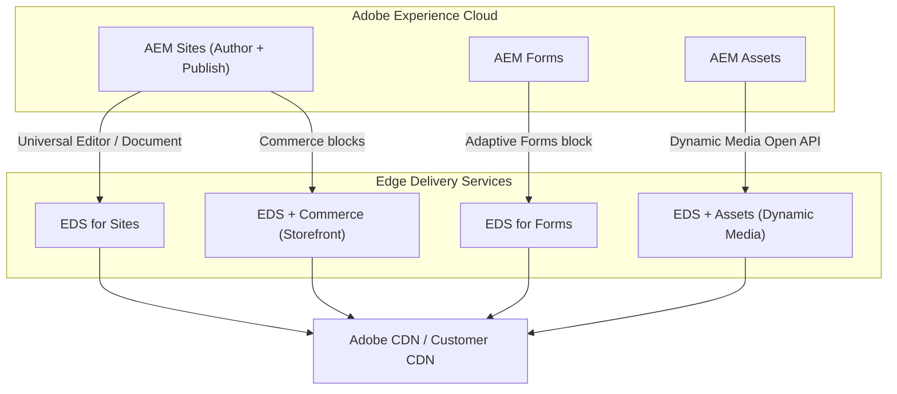
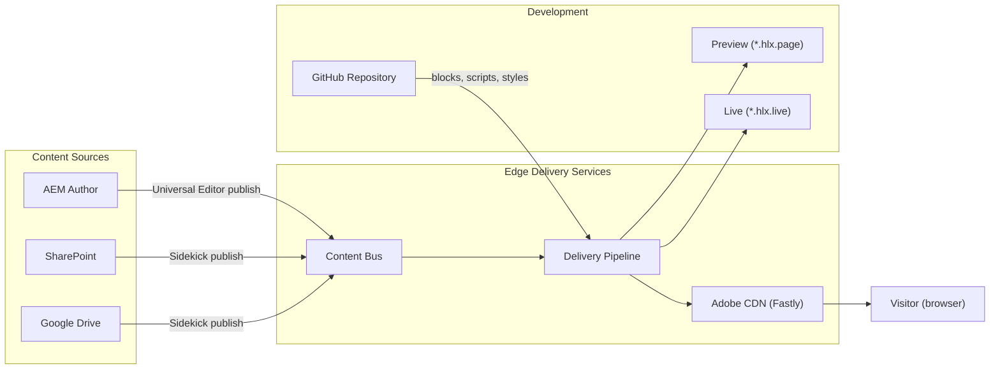
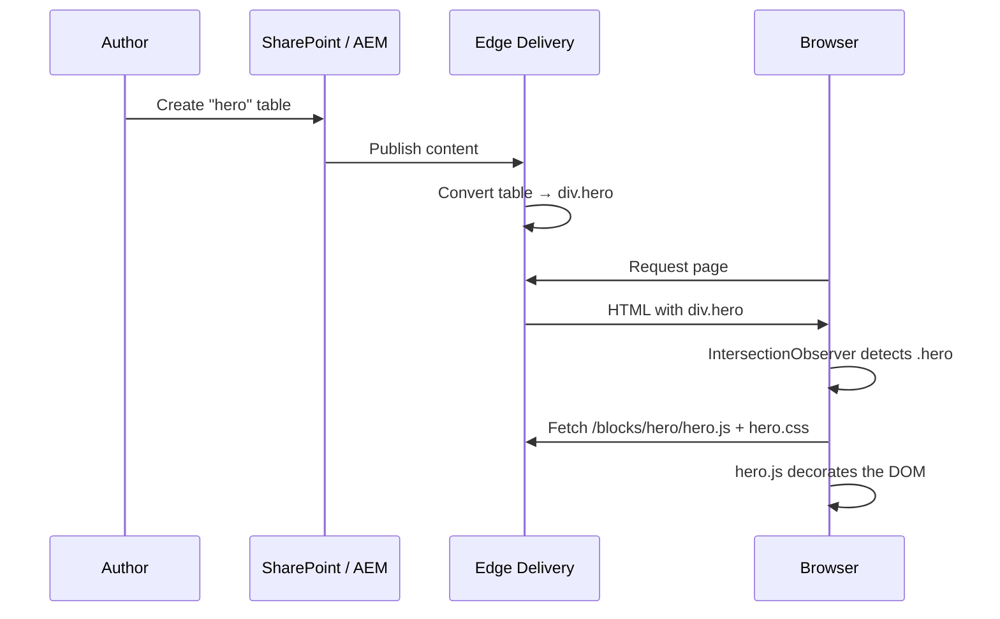
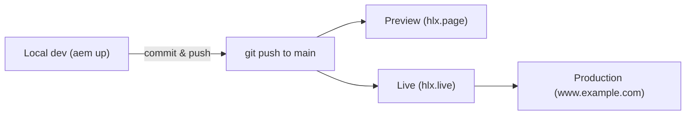
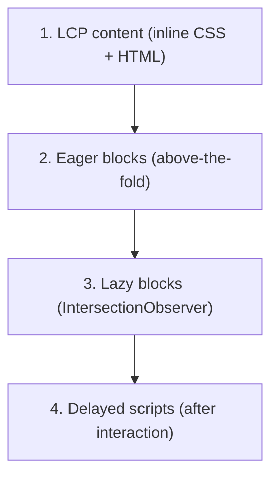

# Adobe Edge Delivery Services

Adobe **Edge Delivery Services (EDS)** -- formerly known as Project Helix / Franklin -- is far
more than a rebrand. It is Adobe's modern content delivery platform that pushes rendering
to the CDN edge, enabling near-instant page loads and a radically simpler development
workflow. EDS is now a core pillar of the AEM product family, sitting alongside AEM Sites,
AEM Forms, and AEM Assets.

This page covers the architecture, product variations, authoring models, development
workflow, blocks, and how EDS relates to traditional AEM.

---

## Product Landscape and Offerings

EDS is not a single product -- it is a **delivery layer** that integrates with multiple
Adobe products. Understanding the variations helps you choose the right approach.



### EDS for Sites

The core offering. Content is authored via AEM + Universal Editor or document-based
authoring (SharePoint / Google Drive), transformed into clean HTML, and served at the edge.
This is what most teams adopt first.

### EDS for Forms

Adobe extended EDS to support **Adaptive Forms**. Authors build forms using the AEM Forms
UI or document-based spreadsheets, and EDS delivers them with the same edge performance.
Form submissions can be routed to AEM, external APIs, or SharePoint.

### EDS + Commerce (Commerce Storefront)

A pre-built commerce storefront powered by EDS blocks and Adobe Commerce (Magento) or
third-party commerce backends. Product catalogue pages, cart, and checkout are rendered
at the edge while the commerce API handles transactions.

### EDS + Dynamic Media

EDS integrates with **AEM Assets as a Cloud Service** via the Dynamic Media Open API.
Assets are delivered with automatic format negotiation (WebP, AVIF), responsive sizing,
and smart crop -- all at the CDN edge, without a traditional Dispatcher.

### Comparison: EDS vs Traditional AEM Publish

| Aspect | Traditional AEM (Publish + Dispatcher) | Edge Delivery Services |
|--------|---------------------------------------|----------------------|
| **Rendering** | Server-side on AEM Publish (HTL + Sling) | Pre-rendered HTML at the edge |
| **CDN** | Dispatcher + optional CDN | Adobe CDN built-in (or BYO CDN) |
| **Lighthouse score** | Varies (typically 60-90) | 100 by design |
| **Authoring** | AEM Page Editor / SPA Editor | Universal Editor or Document-based |
| **Frontend** | HTL + Clientlibs or ui.frontend (webpack) | Vanilla JS + CSS in GitHub |
| **Deployment** | Cloud Manager pipeline | Git push → live in seconds |
| **Component model** | AEM Components (JCR + Sling) | Blocks (HTML tables → semantic HTML) |
| **Personalisation** | Target / ContextHub | Experimentation built-in (A/B, multivariate) |
| **Complexity** | High (OSGi, Sling, JCR, Dispatcher) | Low (HTML, CSS, JS, GitHub) |
| **Best for** | Complex enterprise sites, SPAs, portals | Marketing sites, landing pages, docs, storefronts |

---

## Architecture

### High-level overview



### Content Bus

The **Content Bus** is the central content store. When an author publishes from AEM,
SharePoint, or Google Drive, the content is normalised into a simple HTML + metadata
representation and stored in the Content Bus. This decouples authoring from delivery.

### Delivery Pipeline

The delivery pipeline combines the content from the Content Bus with the frontend code
from GitHub:

1. **Content fetch** -- HTML fragments from the Content Bus
2. **Block decoration** -- each block's JavaScript/CSS is loaded on demand
3. **Optimisation** -- HTML is minified, images are lazy-loaded, CSS/JS is inlined where needed
4. **Caching** -- aggressive CDN caching with instant purge on publish

### CDN Layer

EDS uses **Fastly** as its built-in CDN (Adobe-managed). You can also bring your own CDN
(Akamai, Cloudflare, etc.) and place it in front of the `*.hlx.live` origin.

Key CDN behaviours:
- **Stale-while-revalidate** for near-zero latency on cache misses
- **Instant purge** when content or code changes
- **Edge-side personalisation** via experimentation framework
- **Bot detection** and traffic management

### URL Tiers

| Tier | URL Pattern | Purpose |
|------|-------------|---------|
| **Preview** | `https://main--{repo}--{org}.hlx.page/` | Author preview, not cached |
| **Live** | `https://main--{repo}--{org}.hlx.live/` | Production-ready, cached, used as CDN origin |
| **Production** | `https://www.example.com/` | Custom domain via CDN (Adobe or BYO) |

---

## Authoring Models

EDS supports two authoring approaches. Both produce the same output.

### Document-based Authoring

Authors create content in **Microsoft Word** (via SharePoint) or **Google Docs** (via
Google Drive). Structured content is authored using simple tables that map to blocks.

```
| Hero                    |
|-------------------------|
|   |
| Welcome to our site     |
| [Get started](/start)   |
```

This table becomes a `hero` block in HTML. The Sidekick browser extension provides
preview and publish actions.

**Strengths:**
- Zero learning curve for authors (Word / Google Docs)
- No AEM authoring UI needed
- Great for marketing teams, campaigns, landing pages

**Limitations:**
- Less control over component structure
- No in-context WYSIWYG preview during editing
- Harder for complex, deeply nested layouts

### AEM Authoring + Universal Editor

Authors use the AEM content repository and the **Universal Editor** -- a modern,
framework-agnostic visual editor that replaces the classic Page Editor for EDS.

**Strengths:**
- Visual, in-context editing (true WYSIWYG)
- Full AEM content model (structured content, content fragments, experience fragments)
- Familiar for AEM authors migrating from traditional Sites
- Works with any frontend framework (not tied to HTL)

**Limitations:**
- Requires AEM as a Cloud Service
- More setup than document-based authoring

### Choosing an authoring model

| Criterion | Document-based | Universal Editor |
|-----------|---------------|-----------------|
| Author skill level | Low (Word / Docs) | Medium (AEM UI) |
| Content complexity | Simple pages, blogs, landing pages | Complex layouts, reusable fragments |
| Governance | Loose (anyone can edit a doc) | Structured (permissions, workflows) |
| Preview fidelity | Approximate (Sidekick) | Exact (visual editor) |
| Infrastructure | SharePoint or Google Workspace | AEM as a Cloud Service |

---

## Blocks: The Component Model

In EDS, **blocks** replace AEM components. A block is a folder in your GitHub repository
containing a JavaScript file and a CSS file:

```
/blocks/
  /hero/
    hero.js
    hero.css
  /cards/
    cards.js
    cards.css
  /columns/
    columns.js
    columns.css
```

### How blocks work

1. The author creates a table in their document or selects a block in the Universal Editor
2. EDS converts the table into a `<div>` with a class matching the block name
3. The block's JS/CSS is **lazy-loaded** only when the block appears in the viewport
4. The JS receives the block's DOM element and decorates it



### Block JavaScript

Every block exports a default `decorate` function:

```javascript title="/blocks/hero/hero.js"
export default function decorate(block) {
  // block is the <div class="hero"> element
  const image = block.querySelector('picture');
  const heading = block.querySelector('h1, h2, h3');
  const cta = block.querySelector('a');

  // Restructure for semantic HTML
  block.innerHTML = '';

  const content = document.createElement('div');
  content.classList.add('hero-content');
  if (heading) content.append(heading);
  if (cta) {
    cta.classList.add('hero-cta', 'button', 'primary');
    content.append(cta);
  }

  if (image) block.append(image);
  block.append(content);
}
```

### Block CSS

```css title="/blocks/hero/hero.css"
.hero {
  position: relative;
  min-height: 400px;
  display: flex;
  align-items: center;
}

.hero picture img {
  position: absolute;
  inset: 0;
  width: 100%;
  height: 100%;
  object-fit: cover;
}

.hero .hero-content {
  position: relative;
  z-index: 1;
  padding: 2rem;
  max-width: 600px;
}
```

### Block variations

Block variations are declared by appending the variation name in the authoring table:

```
| Hero (dark, centered) |
|------------------------|
| ...                    |
```

This produces `<div class="hero dark centered">`, allowing CSS-only variants:

```css
.hero.dark { background: #1a1a1a; color: white; }
.hero.centered .hero-content { text-align: center; margin: 0 auto; }
```

### Common block library

EDS provides a **block library** with pre-built, production-ready blocks:

| Block | Purpose |
|-------|---------|
| `hero` | Full-width hero banner with image and CTA |
| `cards` | Card grid layout |
| `columns` | Multi-column layout |
| `tabs` | Tabbed content |
| `accordion` | Expandable sections |
| `carousel` | Image/content slider |
| `embed` | YouTube, Vimeo, or iframe embeds |
| `fragment` | Include another page as a fragment |
| `header` / `footer` | Site-wide navigation |

Browse the full library at [aem.live/developer/block-collection](https://www.aem.live/developer/block-collection).

---

## Development Workflow

EDS embraces a **GitHub-first** workflow. There are no Maven builds, no Cloud Manager
pipelines, and no OSGi bundles.

### Project structure

```
my-eds-project/
├── blocks/              # Block JS and CSS
│   ├── hero/
│   ├── cards/
│   └── ...
├── scripts/             # Global scripts
│   ├── aem.js           # EDS runtime (provided)
│   ├── scripts.js       # Global initialisation
│   └── delayed.js       # Deferred scripts (analytics, etc.)
├── styles/              # Global styles
│   ├── styles.css       # Main stylesheet
│   └── fonts.css        # Font declarations
├── head.html            # Custom <head> content
├── 404.html             # Custom 404 page
├── fstab.yaml           # Content source configuration
└── paths.yaml           # URL mapping / redirects
```

### Key files

| File | Purpose |
|------|---------|
| `fstab.yaml` | Maps content sources (SharePoint URL, Google Drive ID, or AEM instance) to the project |
| `paths.yaml` | URL rewriting and redirect rules |
| `head.html` | Additional `<head>` tags (meta, preload, third-party scripts) |
| `scripts/aem.js` | EDS runtime: block loading, lazy loading, LCP optimisation |
| `scripts/scripts.js` | Your global initialisation code |
| `scripts/delayed.js` | Scripts loaded after page interaction (analytics, chat widgets) |

### fstab.yaml

```yaml title="fstab.yaml"
mountpoints:
  /: https://adobe-my.sharepoint.com/:f:/g/personal/user/EaBC123...
```

Or for AEM authoring:

```yaml title="fstab.yaml"
mountpoints:
  /: https://author-p12345-e67890.adobeaemcloud.com/
```

### Local development

```bash
# Install the AEM CLI
npm install -g @adobe/aem-cli

# Start local dev server
aem up
```

This starts a local proxy at `http://localhost:3000` that serves your blocks/scripts/styles
from the local filesystem and fetches content from the configured content source.

### Deployment: Git push to production



There is no build step. Pushing to `main` instantly updates preview and live. The CDN
picks up changes within seconds.

---

## Sidekick

The **AEM Sidekick** is a browser extension that gives authors and developers quick
access to EDS actions:

| Action | Description |
|--------|-------------|
| **Preview** | Renders the current document on `*.hlx.page` |
| **Publish** | Pushes content to `*.hlx.live` (production) |
| **Edit** | Opens the document source (SharePoint / Google Drive) |
| **Delete** | Removes the page from the Content Bus |
| **Bulk Publish** | Publish multiple pages at once |

Install it from the [Chrome Web Store](https://chromewebstore.google.com/detail/aem-sidekick/igkmdomcgoebiipaifhmpfjhbjccggml).

---

## Experimentation and Personalisation

EDS has **built-in experimentation** (A/B testing, multivariate testing) without any
third-party tool:

### Setting up an experiment

Define experiments in a spreadsheet (the "experiments" sheet):

| Experiment | Page | Variant | Split |
|------------|------|---------|-------|
| hero-test | /home | /experiments/hero-v2 | 50 |

- **Page** -- the URL being tested
- **Variant** -- an alternative page that replaces the original for the test group
- **Split** -- percentage of traffic that sees the variant

### Audiences

Target content to specific audiences using the "audiences" sheet:

| Audience | Condition |
|----------|-----------|
| mobile | device = mobile |
| returning | returning-visitor = true |
| germany | geo.country = DE |

Audience resolution happens **at the CDN edge**, so there is no client-side flicker.

---

## Performance Architecture

EDS is designed to achieve a **Lighthouse score of 100** out of the box. Here's how:

### Loading strategy



1. **LCP (Largest Contentful Paint)** -- critical CSS is inlined, hero images use
   `fetchpriority="high"` and `loading="eager"`
2. **Eager blocks** -- blocks visible in the first viewport are loaded immediately
3. **Lazy blocks** -- below-the-fold blocks are loaded via `IntersectionObserver`
4. **Delayed scripts** -- analytics, chat widgets, and other non-essential scripts
   load only after user interaction (click, scroll, keydown) or after 3 seconds

### What EDS does automatically

- **Image optimisation** -- format negotiation (WebP/AVIF), responsive `srcset`, lazy loading
- **CSS/JS code splitting** -- each block's styles and scripts load independently
- **No render-blocking resources** -- everything is async or deferred
- **Minimal DOM** -- clean, semantic HTML with no framework overhead
- **Aggressive caching** -- long cache TTLs with instant purge on publish

---

## Integrating EDS with Traditional AEM

EDS and traditional AEM Sites can coexist. Common patterns:

### Hybrid: EDS for marketing, AEM for the app

Route marketing pages (homepage, landing pages, blog) through EDS, while authenticated
app pages (account, dashboard) remain on traditional AEM Publish:

```
www.example.com/           → EDS (marketing homepage)
www.example.com/blog/      → EDS (blog)
www.example.com/account/   → AEM Publish (authenticated)
www.example.com/api/       → AEM Publish (servlets)
```

This is configured at the CDN layer with path-based routing rules.

### Shared content

Content Fragments created in AEM can be consumed by both traditional AEM components
(via Sling Models) and EDS pages (via the Content Fragment API or GraphQL).

### Migration strategy

Most teams migrate incrementally:

1. **Start with EDS** for new marketing pages or a redesign
2. **Keep existing AEM Sites** for pages that depend on complex server-side logic
3. **Gradually move** pages to EDS as blocks mature
4. **Retire Publish + Dispatcher** for fully migrated sites

---

## Custom Domain and CDN Setup

### Adobe-managed CDN

For the simplest setup, let Adobe manage DNS and TLS:

1. Add your domain in the AEM Cloud Manager or EDS admin
2. Create a CNAME record pointing to `*.hlx.live`
3. TLS certificates are provisioned automatically

### Bring Your Own CDN (BYO CDN)

For enterprises that require Akamai, Cloudflare, or another CDN:

1. Set `*.hlx.live` as the origin in your CDN
2. Forward the `Host` header or set `X-Forwarded-Host`
3. Configure cache TTLs to match EDS defaults (long TTL + purge)
4. Pass through `X-Push-Invalidation` headers for instant purge

### push-invalidation (instant purge)

When content is published, EDS sends a purge request to the CDN. If you use a BYO CDN,
configure it to accept push-invalidation webhooks so pages update within seconds.

---

## AEMaaCS + EDS Licensing

EDS is included in **AEM Sites as a Cloud Service** licenses. There is no separate SKU
for EDS -- it is an integrated capability of the platform.

Key licensing aspects:

| Aspect | Details |
|--------|---------|
| **Included with** | AEM Sites as a Cloud Service |
| **Page views** | Covered under the AEM Sites page-view tier |
| **CDN traffic** | Adobe-managed CDN included; BYO CDN is the customer's responsibility |
| **Authoring** | AEM authoring or document-based (SharePoint / Google Drive included) |
| **Forms** | EDS for Forms may require a separate AEM Forms license |
| **Commerce** | Commerce storefront requires Adobe Commerce or a third-party backend |

---

## Best Practices

### Keep blocks small and focused

Each block should do one thing. Avoid creating a "super block" that handles multiple
layouts -- use block variations or separate blocks instead.

### Validate content structure early

Define a clear content model for each block. If a block expects a heading, an image,
and a CTA in that order, document it and validate during authoring.

### Performance on every PR

Use the built-in Lighthouse CI integration to check performance on every pull request.
A score below 100 should be investigated before merging.

### Progressive enhancement

Write blocks that work without JavaScript first (the raw HTML from the Content Bus should
be readable). Then enhance with JS for interactivity.

### Use `scripts/delayed.js` aggressively

Anything that is not needed for the first meaningful paint belongs in `delayed.js`:
analytics (Adobe Analytics, Google Analytics), chat widgets, A/B testing scripts, social
embeds.

### Minimise third-party scripts

Every external script is a potential performance regression. Load them lazily and measure
their impact on Core Web Vitals.

---

## Common Pitfalls

| Pitfall | Solution |
|---------|----------|
| Lighthouse score drops below 100 | Check for render-blocking third-party scripts; move them to `delayed.js` |
| Block JS runs before DOM is ready | The `decorate()` function receives the block element after it is in the DOM; no need for `DOMContentLoaded` |
| Content changes not reflected on production | Ensure the author clicked **Publish** in the Sidekick (not just Preview) |
| Custom domain shows stale content | Verify push-invalidation is configured on your BYO CDN |
| Authors see broken layout in Word/Docs | The authoring table structure must match what the block expects; provide a content guide |
| Block CSS leaks to other blocks | Scope all selectors under `.blockname`; avoid global styles in block CSS |
| Large client-side bundle | Split functionality across blocks; never bundle everything into `scripts.js` |
| EDS and AEM Publish return different content for the same URL | Use path-based routing at the CDN to separate EDS and AEM Publish traffic |

---

## External Resources

- [Edge Delivery Services overview](https://experienceleague.adobe.com/docs/experience-manager-cloud-service/content/edge-delivery/overview.html) -- Adobe documentation
- [aem.live](https://www.aem.live/) -- developer docs, tutorials, and block library
- [EDS Block Collection](https://www.aem.live/developer/block-collection) -- pre-built blocks
- [AEM Sidekick](https://chromewebstore.google.com/detail/aem-sidekick/igkmdomcgoebiipaifhmpfjhbjccggml) -- Chrome extension
- [Experimentation documentation](https://www.aem.live/docs/experimentation) -- A/B testing guide
- [EDS for Forms](https://experienceleague.adobe.com/docs/experience-manager-cloud-service/content/edge-delivery/build-forms/overview.html) -- Forms integration
- [Universal Editor](https://experienceleague.adobe.com/docs/experience-manager-cloud-service/content/implementing/developing/universal-editor/introduction.html) -- visual authoring for EDS

## See also

- [Architecture](../architecture.mdx) -- traditional AEM architecture for comparison
- [AEM as a Cloud Service](./cloud-service.mdx)
- [Deployment](./deployment.mdx)
- [GraphQL](../content/graphql.mdx) -- headless content delivery
- [Content Fragments](../content/content-fragments.md) -- shared content between AEM and EDS
- [Client Libraries](../client-libraries.mdx) -- traditional AEM frontend (contrast with EDS blocks)
- [Performance](./performance.mdx) -- traditional AEM performance tuning
- [Security basics](./security.mdx)
- [Dispatcher Configuration](./dispatcher-configuration.mdx) -- traditional delivery layer (replaced by EDS CDN)
