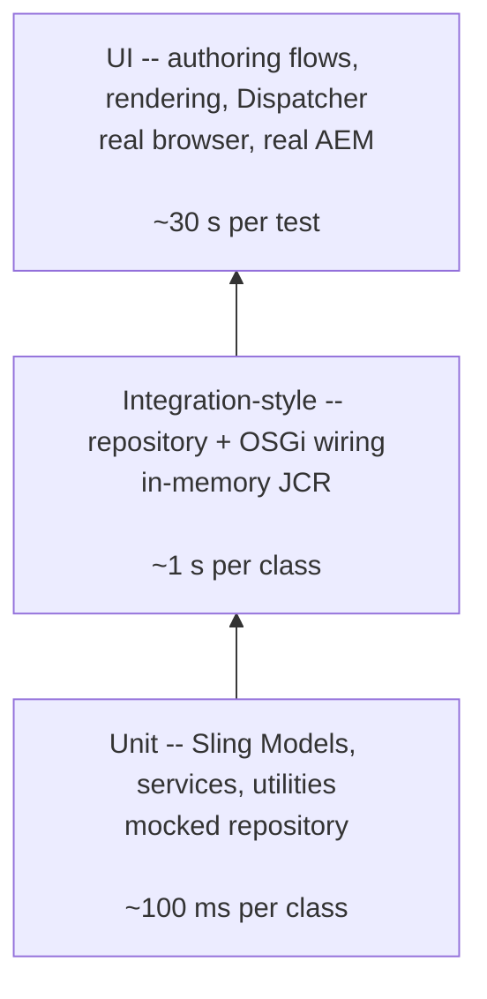

# Testing AEM

Testing an AEM project normally combines three layers: **unit tests** against Sling Models and
services (fast, in-JVM), **integration-style tests** that exercise the repository and OSGi wiring
(still in-JVM, just more realistic), and **UI tests** that drive the authoring UI and published
pages in a real browser.

This page covers the tooling choices, the `AemContext` lifecycle, loading test content, and the
patterns you actually need in a project.

## Test pyramid for AEM



Rule of thumb: if it can be a unit test, make it a unit test. Integration tests are for behaviour
that only emerges once the repository is involved (resource resolution, queries, inheritance). UI
tests are for flows where the authoring chrome, HTL rendering, and Dispatcher have to be exercised
end-to-end.

## Tooling choices

| Purpose | Library | Notes |
|---------|---------|-------|
| Unit test runner | **JUnit 5** (`junit-jupiter`) | Use `@ExtendWith(AemContextExtension.class)` for AEM-aware tests |
| AEM + Sling mocks | **wcm.io AEM Mocks** (`io.wcm.testing.mock.aem-junit5`) | Bundles Apache Sling Mocks + OSGi Mock + AEM-specific extensions. De facto standard |
| Matching / assertions | **AssertJ** or plain JUnit | AssertJ chaining (`assertThat(model).isNotNull().extracting(...)...`) reads better for deep objects |
| Mocking collaborators | **Mockito** | Use for external services; prefer `AemContext.registerService` for Sling/OSGi services |
| HTTP mocking | **WireMock** | Stubs external APIs your Sling Models call |
| UI tests | **Selenium / WebDriver** via the AEM Archetype `ui.tests` module, **Cypress**, or **Playwright** | Hobbes.js is deprecated - avoid starting new tests on it |
| Dispatcher config | **`dispatcher-cloud-optimized`** CLI | Validates `dispatcher.any` structure offline |

:::info AEM Mocks vs Sling Mocks - what's the difference?
**Sling Mocks** is the upstream Apache project. It gives you a Sling-aware in-memory environment
(`SlingContext`, resource resolution, adaptable, OSGi service registry).

**AEM Mocks** (`io.wcm.testing.mock.aem`) wraps Sling Mocks and preloads the AEM-specific
classloader state: Page / PageManager, Tag / TagManager, `com.day.cq.commons.jcr` utilities,
Designer stubs, and so on. The `AemContext` class you see in nearly every example **is** the
AEM-Mocks extension of `SlingContext`.

Use AEM Mocks by default. Drop to plain Sling Mocks only for pure Sling/OSGi code that never
touches `com.day.cq.*`.
:::

## `AemContext` - the building block

Most of your test surface is a single `AemContext` instance:

```java
import io.wcm.testing.mock.aem.junit5.AemContext;
import io.wcm.testing.mock.aem.junit5.AemContextExtension;
import org.apache.sling.resourceresolver.ResourceResolverType;

@ExtendWith(AemContextExtension.class)
class MyModelTest {

    // Default: ResourceResolverType.RESOURCERESOLVER_MOCK
    private final AemContext ctx = new AemContext();
}
```

`AemContext` exposes the pieces you need:

| API | Purpose |
|-----|---------|
| `ctx.resourceResolver()` | A live `ResourceResolver` backed by the chosen mock type |
| `ctx.pageManager()` | `com.day.cq.wcm.api.PageManager` for creating pages in tests |
| `ctx.load()` | Load JSON, XML, or binary resources into the repository |
| `ctx.create()` | Fluent builder for resources, pages, assets |
| `ctx.registerService(...)` / `registerInjectActivateService(...)` | Register mocks / real services in the OSGi mock registry |
| `ctx.addModelsForClasses(...)` / `addModelsForPackage(...)` | Register Sling Models for resolution in this test |
| `ctx.request()`, `ctx.response()` | Mutable `MockSlingHttpServletRequest` / `Response` |
| `ctx.currentResource("/path")` / `currentPage("/path")` | Drive the request's context |

### Picking a `ResourceResolverType`

```java
new AemContext(ResourceResolverType.JCR_MOCK);
```

| Type | Backing store | Queries | Use when |
|------|---------------|---------|----------|
| `RESOURCERESOLVER_MOCK` *(default)* | In-memory map | **No** JCR queries | 95% of Sling Model unit tests - fastest |
| `JCR_MOCK` | Fake JCR | Limited | You need `Node.getProperty()` style JCR API but not real queries |
| `JCR_OAK` | Real Oak (segment store, in-memory) | **Yes** (JCR-SQL2, XPath) | Anything that runs a QueryBuilder / SQL2 query |
| `JCR_JACKRABBIT` | Real Jackrabbit 2 | **Yes** | Rare - only for legacy integration with Jackrabbit-specific APIs |

The trade-off is speed: `RESOURCERESOLVER_MOCK` starts in milliseconds, `JCR_OAK` takes hundreds
of milliseconds per class. If a test doesn't need queries, keep the default.

## Loading test content

Hand-built resources (`ctx.create().resource(...)`) are fine for a handful of properties. For
realistic content trees, load JSON or XML fixtures.

### JSON fixtures

```java
@BeforeEach
void setUp() {
    ctx.load().json("/content/teaser.json", "/content/site/en");
    ctx.addModelsForClasses(TeaserModel.class);
}
```

```json title="src/test/resources/content/teaser.json"
{
  "jcr:primaryType": "cq:Page",
  "jcr:content": {
    "jcr:primaryType": "cq:PageContent",
    "sling:resourceType": "myproject/components/page",
    "cq:template": "/conf/myproject/settings/wcm/templates/page",
    "root": {
      "jcr:primaryType": "nt:unstructured",
      "teaser": {
        "jcr:primaryType": "nt:unstructured",
        "sling:resourceType": "myproject/components/teaser",
        "title": "My Teaser",
        "link": "/content/site/en/page",
        "image": {
            "jcr:primaryType": "nt:unstructured",
            "fileReference": "/content/dam/images/hero.jpg"
        }
      }
    }
  }
}
```

The path on disk (first argument) is relative to `src/test/resources`. The second argument is the
root path in the test repository where the tree is mounted.

### Filevault XML fixtures (content packages)

For fixtures you already author in CRXDE, `.content.xml` snapshots work too:

```java
ctx.load().filevault("/content/teaser-tree", "/content/site/en");
```

The source folder must be a standard Jackrabbit FileVault tree (`.content.xml` at the root of the
fragment).

### Binary content

```java
ctx.load().binaryFile("/dam/hero.jpg", "/content/dam/images/hero.jpg/jcr:content/renditions/original");
```

## Patterns

### Testing a Sling Model

```java
@ExtendWith(AemContextExtension.class)
class TeaserModelTest {

    private final AemContext ctx = new AemContext();

    @BeforeEach
    void setUp() {
        ctx.load().json("/content/teaser.json", "/content/site/en");
        ctx.addModelsForClasses(TeaserModel.class);
    }

    @Test
    void readsTitleAndLink() {
        Resource resource = ctx.resourceResolver()
                .getResource("/content/site/en/jcr:content/root/teaser");
        TeaserModel model = resource.adaptTo(TeaserModel.class);

        assertNotNull(model, "Model should resolve -- if null, check @Model adaptables and addModelsForClasses");
        assertEquals("My Teaser", model.getTitle());
        assertEquals("/content/site/en/page", model.getLink());
    }

    @Test
    void applyDefaultsWhenMissing() {
        ctx.create().resource("/content/site/en/jcr:content/root/empty",
                "sling:resourceType", "myproject/components/teaser");
        Resource resource = ctx.resourceResolver()
                .getResource("/content/site/en/jcr:content/root/empty");
        TeaserModel model = resource.adaptTo(TeaserModel.class);

        assertEquals("Learn more", model.getLinkText()); // default from @Default(values = "Learn more")
    }
}
```

:::tip `adaptTo` returned `null`? Run this checklist.
- `addModelsForClasses(Foo.class)` - Sling Models aren't auto-scanned in tests.
- `@Model(adaptables = ...)` - a test adapting from `Resource` won't match a model declared
  `adaptables = SlingHttpServletRequest.class`.
- Required injections - a missing `@ValueMapValue(...)` without a default causes adaptation to
  fail silently. Check the test log: wcm.io writes the reason at DEBUG.
:::

### Testing a Sling Model that needs the request

When a model adapts from `SlingHttpServletRequest` (selectors, query params, current resource),
drive the request directly:

```java
@Test
void readsSelector() {
    ctx.currentResource("/content/site/en/jcr:content/root/teaser");
    ctx.requestPathInfo().setSelectorString("print");

    TeaserModel model = ctx.request().adaptTo(TeaserModel.class);
    assertTrue(model.isPrintVariant());
}
```

### Testing an OSGi service

Services come in two shapes: **registered-and-wired** (use `registerInjectActivateService`) and
**manually constructed** (you new-up the impl and inject `@Reference` fields yourself - usually
a sign the service should be simpler).

```java
@BeforeEach
void setUp() {
    ctx.registerInjectActivateService(new FeatureServiceImpl(),
            "enabled", true,
            "threshold", 10);
}

@Test
void featureIsEnabled() {
    FeatureService service = ctx.getService(FeatureService.class);
    assertTrue(service.isEnabled());
    assertEquals(10, service.getThreshold());
}
```

`registerInjectActivateService` wires `@Reference` dependencies from the mock OSGi registry,
activates with the provided OSGi config, and registers under every service interface the impl
declares.

### Testing service-user resource resolvers

Code that calls `resolverFactory.getServiceResourceResolver(...)` needs a mapping in the test.
`AemContext` pre-registers a `ResourceResolverFactory`, so just tell it which sub-service to
allow:

```java
@BeforeEach
void setUp() {
    ctx.registerService(ResourceResolverFactory.class,
            ctx.getService(ResourceResolverFactory.class));
    // ... or rely on the built-in factory; in AEM Mocks all sub-service calls succeed.
}

@Test
void writesWithServiceUser() throws Exception {
    var service = ctx.registerInjectActivateService(new MyWriterService());
    service.writeMessage("/content/site/en", "Hello");

    Resource written = ctx.resourceResolver().getResource("/content/site/en/message");
    assertEquals("Hello", written.getValueMap().get("value", String.class));
}
```

In AEM Mocks the sub-service check is permissive - every request for a service resolver
succeeds. That matches what you want in unit tests (you're testing the write logic, not the
repoinit config). Sub-service mapping correctness belongs in an integration test against a real
SDK instance.

### Testing a servlet

```java
@ExtendWith(AemContextExtension.class)
class GreetServletTest {

    private final AemContext ctx = new AemContext();
    private GreetServlet servlet;

    @BeforeEach
    void setUp() {
        servlet = ctx.registerInjectActivateService(new GreetServlet());
    }

    @Test
    void respondsWithJson() throws Exception {
        ctx.request().setParameterMap(Map.of("name", "Ada"));
        servlet.doGet(ctx.request(), ctx.response());

        assertEquals(200, ctx.response().getStatus());
        assertEquals("application/json", ctx.response().getContentType());
        assertTrue(ctx.response().getOutputAsString().contains("\"greeting\":\"Hello, Ada\""));
    }

    @Test
    void rejectsMissingName() throws Exception {
        servlet.doGet(ctx.request(), ctx.response());
        assertEquals(400, ctx.response().getStatus());
    }
}
```

### Testing JCR-SQL2 queries

Queries need a real query engine, so switch to `JCR_OAK`:

```java
@ExtendWith(AemContextExtension.class)
class FragmentFinderTest {

    private final AemContext ctx = new AemContext(ResourceResolverType.JCR_OAK);

    @BeforeEach
    void setUp() {
        ctx.load().json("/content/fragments.json", "/content/experience-fragments");
    }

    @Test
    void findsFragmentsByResourceType() {
        FragmentFinder finder = ctx.registerInjectActivateService(new FragmentFinder());
        List<Resource> results = finder.findByType("myproject/components/fragment");

        assertEquals(3, results.size());
    }
}
```

:::warning Oak mocks are slow to boot
Each `AemContext(JCR_OAK)` class pays a 200-500 ms startup cost. Batch query-dependent tests into
one class rather than sprinkling them across your suite.
:::

### Testing Context-Aware Configuration

Register the config explicitly - AEM Mocks ships a `ConfigurationResolver` that reads from the
test resource tree:

```java
@BeforeEach
void setUp() {
    MockContextAwareConfig.registerAnnotationClasses(ctx, SiteConfig.class);
    MockContextAwareConfig.writeConfiguration(ctx, "/content/site/en",
            SiteConfig.class,
            "analyticsId", "GA-TEST-123");
}

@Test
void readsSiteConfig() {
    Resource resource = ctx.resourceResolver().getResource("/content/site/en/jcr:content");
    SiteConfig config = resource.adaptTo(ConfigurationBuilder.class).as(SiteConfig.class);
    assertEquals("GA-TEST-123", config.analyticsId());
}
```

### Stubbing external HTTP with WireMock

```java
@ExtendWith({AemContextExtension.class, WireMockExtension.class})
class WeatherServiceTest {

    private final AemContext ctx = new AemContext();

    @RegisterExtension
    static WireMockExtension wm = WireMockExtension.newInstance()
            .options(wireMockConfig().dynamicPort())
            .build();

    @BeforeEach
    void setUp() {
        wm.stubFor(get("/forecast?city=Berlin")
                .willReturn(okJson("{\"tempC\":12}")));

        ctx.registerInjectActivateService(new WeatherServiceImpl(),
                "apiBaseUrl", wm.baseUrl());
    }

    @Test
    void parsesForecast() {
        WeatherService svc = ctx.getService(WeatherService.class);
        assertEquals(12, svc.getTemperature("Berlin"));
    }
}
```

## Integration tests (UI.tests module)

The AEM Maven Archetype scaffolds a `ui.tests` module that runs Selenium-based tests against a
live instance (local SDK or a deployed environment). It's the successor to the deprecated
Hobbes.js tests.

```text title="Project structure"
myproject/
├── core/                 # Java, where Sling Model unit tests live
├── ui.apps/              # ui.apps package
├── ui.tests/
│   ├── test-module/      # Selenium TypeScript tests
│   └── wdio.conf.ts      # WebdriverIO config: base URL, capabilities
└── ui.frontend/
```

Typical WebdriverIO test:

```typescript title="ui.tests/test-module/specs/teaser.spec.ts"
describe("Teaser component", () => {
    it("renders title and link", async () => {
        await browser.url("/content/myproject/us/en/home.html");
        const teaser = await $(".cmp-teaser");
        await expect(teaser).toBeDisplayed();
        await expect(await teaser.$(".cmp-teaser__title")).toHaveText("Welcome");
    });
});
```

Run against the local SDK:

```bash
mvn clean verify -PfedDev \
    -Dsling.it.instance.url=http://localhost:4502 \
    -Dsling.it.instance.runmode=author
```

For Cypress / Playwright setups, point the `baseUrl` at your AEM Publish (or the Dispatcher, if
you want to exercise the full stack) and keep tests to happy paths - long UI suites become the
slowest stage in CI.

## Dispatcher config validation

Dispatcher configs regress easily - a misplaced `/allow` in `filters.any` can silently expose
`/system/console`. Run the Adobe-provided validator on every PR:

```bash title="scripts/validate-dispatcher.sh"
#!/usr/bin/env bash
set -euo pipefail

DIS_SDK=${DISPATCHER_SDK_HOME:?set DISPATCHER_SDK_HOME to the extracted SDK path}
"$DIS_SDK/bin/validate.sh" dispatcher/src
```

Wire it into CI as a pre-merge gate. See the dedicated
[Dispatcher Configuration](./dispatcher-configuration.mdx) page for authoring guidance and
auto-invalidation rules.

## Code coverage

JaCoCo integrates cleanly with the AEM archetype. Add to the `core/pom.xml`:

```xml
<plugin>
    <groupId>org.jacoco</groupId>
    <artifactId>jacoco-maven-plugin</artifactId>
    <executions>
        <execution>
            <goals><goal>prepare-agent</goal></goals>
        </execution>
        <execution>
            <id>report</id>
            <phase>test</phase>
            <goals><goal>report</goal></goals>
        </execution>
    </executions>
</plugin>
```

Report lands in `core/target/site/jacoco/index.html`. Aim for meaningful coverage of Sling Models
and services - don't chase 100% for HTL or generated code.

## Smoke-test checklist (pre-release)

- [ ] Create a page with every custom component; save and reopen each dialog.
- [ ] Publish a content page and verify rendering on Publish.
- [ ] Exercise Dispatcher by requesting a page twice - second request should be a cache hit
      (check `X-Cache-Info` or the `cache/` directory).
- [ ] Hit `/system/console/*` through Dispatcher from outside - must return 404.
- [ ] Verify clientlibs load without 404s (check the Network tab).
- [ ] Run `validate.sh` against the current Dispatcher config.

## CI pipeline tips

- **Unit tests** on every commit - they're fast, they should never block a PR for infrastructure
  reasons.
- **Integration tests** (`JCR_OAK`-backed query tests) on every PR to `main`.
- **Dispatcher validation** as a merge gate - it's a 2-second check with a high blast radius.
- **UI tests** against an ephemeral test environment, ideally not on every PR. Run nightly or on
  merge to `main`.
- Publish the **JaCoCo report** as a build artifact so reviewers can see coverage deltas.

## Common pitfalls

- **Forgetting `addModelsForClasses`** - `adaptTo` returns `null` and the test fails with a
  confusing NPE three lines later.
- **Wrong `ResourceResolverType`** - a JCR-SQL2 query silently returns zero results under
  `RESOURCERESOLVER_MOCK`. The test "passes" for the wrong reason.
- **Relying on real tag resolution** - `TagManager.resolve()` works in `JCR_OAK` but is stubbed
  under `RESOURCERESOLVER_MOCK`. Load tags into `/content/cq:tags/...` or use `JCR_OAK`.
- **Testing against hardcoded `admin` in integration tests** - mirrors a real antipattern. Use
  service users; they need to work in tests too.
- **Coupling tests to property order** - `ValueMap` iteration order is not guaranteed.
- **Leaving `println` / `LOG.debug` breadcrumbs** - harmless locally, noise in CI logs. Use
  AssertJ's descriptive failures instead.

## See also

- [Architecture](../architecture.mdx)
- [Sling Models](../backend/sling-models.mdx)
- [Servlets](../backend/servlets.mdx)
- [Context-Aware Configuration](../backend/context-aware-configuration.md)
- [Dispatcher Configuration](./dispatcher-configuration.mdx)
- [Local development setup](./aem-dev-setup.md)
- [AEM as a Cloud Service](./cloud-service.mdx)
- [Deployment](./deployment.mdx)
- [Security basics](./security.mdx)
- [Java best practices](../backend/java-best-practices.mdx)
