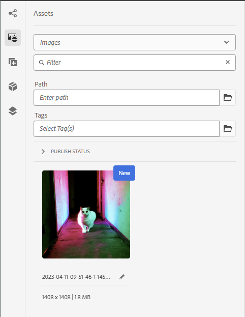

# Assets Siderail - SearchRoot

By default, the AEM Sites `Assets Siderail` (the left side option / drag & drop asset widget) search and displays alls
assets below the fixed path `/content/dam`. This will lead to many cases of undesired images being displayed, e.g.
thumbnails from projects etc.



For reference, the product code can be found here
`/libs/cq/gui/components/authoring/editors/clientlibs/core/js/assetController/image/ImageAssetPanel.js`.

The assets-siderails searchRoot can be easily customized, as follows:

1. Create a new ClientLibrary
2. Add this `categories` array: `categories="[cq.authoring.dialog,cq.authoring.editor]"`
3. Add a `js.txt` that references your custom searchRoot overwrite
    - e.g `searchRoot.js`
4. Create `js/searchRoot.js`
    - Overwrite the registered searchRoot as follows:
      `ns.ui.assetFinder.registry.Images.searchRoot = "/content/dam/<your custom path>`
    - See below for a full file example

Example ClientLibraryFolder `.content.xml`:

```xml
<?xml version="1.0" encoding="UTF-8"?>
<jcr:root xmlns:jcr="http://www.jcp.org/jcr/1.0" xmlns:cq="http://www.day.com/jcr/cq/1.0"
          jcr:primaryType="cq:ClientLibraryFolder"
          allowProxy="{Boolean}true"
          categories="[cq.authoring.dialog,cq.authoring.editor]"
          jsProcessor="[default:none,min:none;languageIn=ECMASCRIPT_2021;languageOut=ECMASCRIPT6]"
/>
```

Example js overwrite `searchRoot.js`:

```javascript
(function (window, document, ns) {
    const customSearchRoot = "/content/dam/custom/path";
    ns.ui.assetFinder.registry.Images.searchRoot = customSearchRoot;
    console.debug("Overwrote Assets Siderail searchRoot to ", customSearchRoot);
}(window, document, Granite.author));
```
