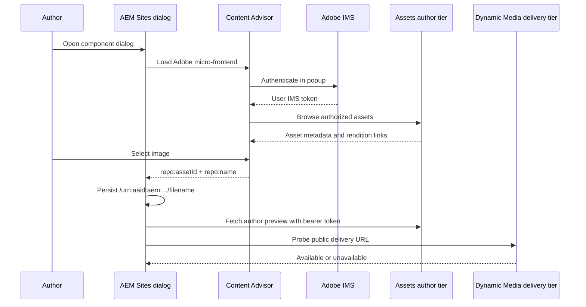

# Integrating Content Advisor into an AEM Component Dialog

Adobe Content Advisor -- formerly called Asset Selector -- is a micro-frontend for browsing and selecting assets from an AEM Assets as a Cloud Service repository. It can run inside an Adobe or non-Adobe application, including a custom AEM Sites component dialog.

A useful integration separates three concerns:

1. Authors browse the **Assets author tier**, where they can see assets according to their permissions.
2. The component stores a stable remote asset reference rather than copying a binary into Sites.
3. Core Image v3 renders the asset through the public **Dynamic Media with OpenAPI delivery tier**.

This article walks through that architecture, including IMS authentication, a reusable Granite include, author-tier previews, delivery availability feedback, local HTTPS, and the configuration needed in AEM as a Cloud Service.

:::note Naming
Adobe renamed Asset Selector to Content Advisor. The package and CDN locations still contain `assets-selectors`, and older API names remain available as aliases. New integrations should prefer `ContentAdvisor` API names.
:::

## Architecture



The selected component property looks like this:

```text
/urn:aaid:aem:11111111-2222-3333-4444-555555555555/hero-image.jpg
```

Core Components Image v3 recognizes references beginning with `/urn:` and builds the public delivery URL from the configured repository and Dynamic Media path templates.

## Why author and delivery tiers are separate

The repository tier changes what authors can see and what visitors can render.

| Tier | Typical hostname | Assets visible | Authentication | Intended use |
|---|---|---|---|---|
| Author | `author-p<program>-e<environment>.adobeaemcloud.com` | Published and unpublished assets allowed by the user's ACLs | IMS bearer token | Search, selection, metadata, author preview |
| Delivery | `delivery-p<program>-e<environment>.adobeaemcloud.com` | Approved assets available through Dynamic Media with OpenAPI | Public asset URL | Website rendering |

Selecting from author does not guarantee that the image is publicly available. The dialog should tell the author when the corresponding delivery URL cannot load.

## Provisioning prerequisites

Content Advisor does not work with an arbitrary OAuth client created in Adobe Developer Console. An AEM program administrator must request provisioning from Adobe Support.

Provide Adobe with:

- AEM Assets program and environment IDs
- IMS organization ID
- every application origin that will embed Content Advisor
- the local HTTPS origin used by developers

Adobe returns:

- `imsClientId`
- `imsScope`
- confirmed redirect origins

The commonly provisioned scope is:

```text
AdobeID,openid,additional_info.projectedProductContext,read_organizations
```

The application must run over HTTPS, including local development. `localhost` should not be used unless Adobe explicitly allow-lists it. A dedicated hostname is easier to register:

```text
https://content-advisor.local.example:8443
```

Each author also needs:

- membership in the correct IMS organization
- the Assets author-tier product profile
- read access to the required DAM folders
- browser popups enabled for the Sites author origin

## Configure the Assets author allow-list

Author-tier requests are rejected unless the provisioned Content Advisor client is accepted by the Assets environment.

A Cloud Manager Config pipeline can deploy an `api.yaml` like this:

```yaml
kind: "API"
version: "1"
metadata:
  envTypes: ["dev"]
data:
  allowedClientIDs:
    author:
      - "aemcs-example-assetselector"
```

Deploy this configuration to the **Assets environment being browsed**, not merely to the Sites environment that embeds the widget.

A missing allow-list entry commonly appears as:

- `403` from `/adobe/discovery/repository`
- a generic Content Advisor network error
- an empty repository list after IMS login

## Configure Dynamic Media with OpenAPI in Sites

Recent AEM versions provide this service out of the box:

```text
com.adobe.cq.ui.wcm.commons.internal.services.NextGenDynamicMediaConfigImpl
```

Configure the Adobe service rather than registering another implementation of `NextGenDynamicMediaConfig`. Duplicate implementations can produce ambiguous OSGi bindings and difficult-to-diagnose component states.

Example author configuration:

```json title="ui.config/.../config.author/com.adobe.cq.ui.wcm.commons.internal.services.NextGenDynamicMediaConfigImpl.cfg.json"
{
    "enabled": true,
    "repositoryId": "$[env:ASSET_DELIVERY_REPOSITORY_ID;default=delivery-p00000-e000000.adobeaemcloud.com]",
    "imsClient": "$[env:ASSET_DELIVERY_IMS_CLIENT;default=aemcs-example-assetselector]",
    "imsOrg": "$[env:ASSET_DELIVERY_IMS_ORG;default=YOUR_ORG_ID@AdobeOrg]"
}
```

The repository configured here is the **delivery** repository. The dialog can derive the corresponding author hostname for installations that follow Adobe's standard `delivery-` / `author-` naming convention.

The Adobe service also supplies supported defaults such as:

```text
Environment:       PROD
Content Advisor:   https://experience.adobe.com/solutions/CQ-assets-selectors/static-assets/resources/assets-selectors.js
Image delivery:    /adobe/assets/{asset-id}/as/{seo-name}.{format}
Metadata:          /adobe/assets/{asset-id}/metadata
Original binary:   /adobe/assets/{asset-id}/original/as/{seo-name}
Video player:      /adobe/assets/{asset-id}/play
```

`PROD` identifies the Adobe IMS/service endpoint. It is unrelated to whether the AEM environment itself is called development, stage, or production.

## Expose public configuration to the dialog

The browser needs public identifiers and repository hostnames, but it should not know about OSGi APIs. A small author-only servlet provides a stable boundary.

```java title="core/.../servlets/ContentAdvisorConfigServlet.java"
@Component(service = Servlet.class)
@SlingServletPaths(ContentAdvisorConfigServlet.SERVLET_PATH)
public class ContentAdvisorConfigServlet extends SlingSafeMethodsServlet {

    public static final String SERVLET_PATH = "/bin/example/content-advisor/config";

    @Reference
    private transient NextGenDynamicMediaConfig dynamicMediaConfig;

    @Reference
    private transient SiteConfigurationService siteConfigurationService;

    @Override
    protected void doGet(SlingHttpServletRequest request,
                         SlingHttpServletResponse response) throws IOException {
        response.setContentType("application/json");
        response.setCharacterEncoding(StandardCharsets.UTF_8.name());
        response.setHeader("Cache-Control", "no-store");
        response.setHeader("X-Content-Type-Options", "nosniff");

        if (!siteConfigurationService.isAuthor()) {
            response.sendError(404);
            return;
        }

        String deliveryRepository = normalize(dynamicMediaConfig.getRepositoryId());
        String authorRepository = deliveryRepository.replaceFirst("^delivery-", "author-");

        JsonObject json = new JsonObject();
        json.addProperty("imsClientId", dynamicMediaConfig.getImsClient());
        json.addProperty("imsOrg", dynamicMediaConfig.getImsOrg());
        json.addProperty("env", dynamicMediaConfig.getEnv());
        json.addProperty("repositoryId", deliveryRepository);
        json.addProperty("authorRepositoryId", authorRepository);
        json.addProperty("assetSelectorsJsUrl", dynamicMediaConfig.getAssetSelectorsJsUrl());

        response.getWriter().write(json.toString());
    }
}
```

Only expose values intended for browser use. Never return an IMS token, client secret, private key, or server credential.

## Build a reusable Granite include

A reusable include prevents each component from duplicating buttons, hidden fields, preview markup, and client-side logic.

```xml title="ui.apps/.../widgets/contentadvisor/.content.xml"
<?xml version="1.0" encoding="UTF-8"?>
<jcr:root xmlns:granite="http://www.adobe.com/jcr/granite/1.0"
          xmlns:jcr="http://www.jcp.org/jcr/1.0"
          xmlns:nt="http://www.jcp.org/jcr/nt/1.0"
          xmlns:sling="http://sling.apache.org/jcr/sling/1.0"
          jcr:primaryType="nt:unstructured">
    <contentAdvisor
        granite:class="example-content-advisor-widget"
        jcr:primaryType="nt:unstructured"
        sling:resourceType="granite/ui/components/coral/foundation/container">
        <granite:data
            jcr:primaryType="nt:unstructured"
            config-url="${{configUrl:/bin/example/content-advisor/config}}"
            file-reference-name="${{fileReferenceName:./fileReference}}"/>
        <items jcr:primaryType="nt:unstructured">
            <selectedAsset
                granite:class="example-content-advisor-name"
                jcr:primaryType="nt:unstructured"
                sling:resourceType="granite/ui/components/coral/foundation/form/textfield"
                fieldLabel="${{fieldLabel:Selected asset}}"
                readonly="{Boolean}true"/>
            <open
                granite:class="example-content-advisor-open"
                jcr:primaryType="nt:unstructured"
                sling:resourceType="granite/ui/components/coral/foundation/button"
                text="${{openButtonText:Open Content Advisor}}"
                type="button"
                variant="primary"/>
            <clear
                granite:class="example-content-advisor-clear"
                jcr:primaryType="nt:unstructured"
                sling:resourceType="granite/ui/components/coral/foundation/button"
                text="${{clearButtonText:Clear selection}}"
                type="button"/>
            <fileReference
                jcr:primaryType="nt:unstructured"
                sling:resourceType="granite/ui/components/coral/foundation/form/hidden"
                name="${{fileReferenceName:./fileReference}}"/>
        </items>
    </contentAdvisor>
</jcr:root>
```

The `${{name:default}}` syntax is provided by ACS Include and allows each consuming dialog to override field names and labels.

### Include it in a component dialog

```xml
<contentAdvisor
    jcr:primaryType="nt:unstructured"
    sling:resourceType="acs-include/granite/ui/components/include"
    path="example/widgets/contentadvisor/contentAdvisor">
    <parameters
        jcr:primaryType="nt:unstructured"
        fileReferenceName="./fileReference"
        fieldLabel="Selected remote asset"
        configUrl="/bin/example/content-advisor/config"/>
</contentAdvisor>
```

The consuming dialog also loads the shared category:

```xml
extraClientlibs="[example.author.content-advisor]"
```

Store the clientlib next to the widget and enable proxying:

```xml
<jcr:root xmlns:cq="http://www.day.com/jcr/cq/1.0"
          xmlns:jcr="http://www.jcp.org/jcr/1.0"
          jcr:primaryType="cq:ClientLibraryFolder"
          allowProxy="{Boolean}true"
          categories="[example.author.content-advisor]"
          dependencies="[cq.jquery]"/>
```

## Load and authenticate Content Advisor

Load the Adobe UMD bundle only when the widget needs it. Validate the configured origin before inserting the script.

```javascript
function loadContentAdvisorScript(url) {
    if (window.PureJSSelectors) {
        return Promise.resolve(window.PureJSSelectors);
    }

    const parsedUrl = new URL(url, window.location.origin);
    if (parsedUrl.protocol !== 'https:'
            || parsedUrl.hostname !== 'experience.adobe.com') {
        return Promise.reject(new Error('Untrusted Content Advisor script URL.'));
    }

    return new Promise((resolve, reject) => {
        const script = document.createElement('script');
        script.src = parsedUrl.href;
        script.async = true;
        script.onload = () => resolve(window.PureJSSelectors);
        script.onerror = () => reject(new Error('Content Advisor failed to load.'));
        document.head.appendChild(script);
    });
}
```

Prefer the new API names while retaining aliases when you support older bundles:

```javascript
const registerAuth = PureJSSelectors.registerContentAdvisorAuthService
    || PureJSSelectors.registerAssetsSelectorsAuthService;
const renderWithAuth = PureJSSelectors.renderContentAdvisorWithAuthFlow
    || PureJSSelectors.renderAssetSelectorWithAuthFlow;
```

Register authentication once per page:

```javascript
const imsService = registerAuth({
    imsClientId: config.imsClientId,
    imsScope: config.imsScope,
    imsOrg: config.imsOrg || undefined,
    redirectUrl: window.location.origin,
    env: config.env || 'PROD',
    modalMode: true,
});
```

Never print the token or include it in a URL.

## Render the author-tier picker

```javascript
renderWithAuth(container, {
    imsOrg: config.imsOrg || undefined,
    repositoryId: config.authorRepositoryId,
    aemTierType: ['author'],
    selectionType: 'single',
    hideTreeNav: false,
    dialogSize: 'fullscreenTakeover',
    handleSelection: handleSelection,
    onClose: closePicker,
});
```

Normalize the selected payload defensively:

```javascript
function normalizeSelection(asset) {
    const assetId = asset['repo:assetId'] || asset.assetId || asset.id;
    const name = asset['repo:name'] || asset.name;
    const mimeType = asset['dc:format'] || asset.mimetype || asset.mimeType;

    if (!/^urn:aaid:aem:[0-9a-f-]+$/i.test(assetId)) {
        throw new Error('Invalid AEM asset identifier.');
    }
    if (!name || name.includes('/') || name.includes('\\')) {
        throw new Error('Invalid asset filename.');
    }
    if (mimeType && !mimeType.startsWith('image/')) {
        throw new Error('Please select an image.');
    }

    return {
        assetId,
        name,
        fileReference: `/${assetId}/${name}`,
    };
}
```

Use Granite's field API so the dialog save lifecycle sees the new value:

```javascript
const input = widget.querySelector('[name="./fileReference"]');
const field = $(input).adaptTo('foundation-field');
field.setValue(selection.fileReference);
$(input).trigger('change');
```

## Render an authenticated author preview

Author-tier rendition URLs generally require the user's bearer token. A normal `` cannot add an `Authorization` header, so fetch the rendition and render a Blob URL.

```javascript
async function fetchAuthorPreview(renditionUrl, imsService, signal) {
    const token = await Promise.resolve(imsService.getImsToken());
    if (!token) {
        throw new Error('Sign in to load the author preview.');
    }

    const response = await fetch(renditionUrl, {
        mode: 'cors',
        credentials: 'omit',
        signal,
        headers: {
            Authorization: `Bearer ${token}`,
        },
    });

    if (!response.ok) {
        throw new Error(`Preview failed (${response.status}).`);
    }

    const blob = await response.blob();
    if (blob.type && !blob.type.startsWith('image/')) {
        throw new Error('The preview response is not an image.');
    }

    return URL.createObjectURL(blob);
}
```

Choose a static image rendition near the desired preview size from the asset's rendition links. Fall back to the primary link or an author-tier `/adobe/assets/...` URL.

Validate that every preview URL:

- uses HTTPS
- points to the configured author repository
- returns an image MIME type
- stays below a reasonable preview size

Treat the preview as decorative confirmation and use `alt=""`; the actual component alternative text is a separate author field.

Always clean up:

```javascript
URL.revokeObjectURL(previousPreviewUrl);
abortController.abort();
```

Do that when the selection changes, the author clears it, or the dialog closes.

## Show publication and approval state

Publication and approval are related, but they are not the same fact.

### Approval metadata

If Content Advisor includes `dam:status`, read it from the asset or metadata object:

```javascript
const approval = asset['dam:status']
    || asset.assetMetadata?.['dam:status']
    || asset.metadata?.['dam:status'];
```

Only call the asset approved when that value explicitly equals `approved`. If the property is missing, display that approval status is unavailable.

### Delivery availability

Build the exact public URL Core Image will use:

```javascript
const deliveryUrl = `https://${deliveryRepository}`
    + `/adobe/assets/${assetId}/as/${encodeURIComponent(filename)}`
    + '?width=640&preferwebp=true';
```

Probe it with a detached image instead of `fetch`. This avoids requiring readable CORS response headers:

```javascript
function probeDelivery(url) {
    return new Promise((resolve) => {
        const image = new Image();
        image.referrerPolicy = 'no-referrer';
        image.onload = () => resolve('available');
        image.onerror = () => resolve('unavailable');
        image.src = url;
    });
}
```

Useful combined labels are:

| Approval metadata | Delivery probe | Author-facing message |
|---|---|---|
| Approved | Available | **Approved and available on delivery** |
| Approved | Unavailable | **Approved, but not currently available on delivery** |
| Not approved | Available | **Available on delivery, but not approved** |
| Not approved | Unavailable | **Unpublished / unapproved** |
| Unknown | Available | **Published; approval status unavailable** |
| Unknown | Unavailable | **Not available on delivery; approval status unavailable** |

A failed delivery probe can also mean network failure or propagation delay, so avoid presenting it as an authoritative workflow state by itself.

## Make rendering a Core Image proxy

The consuming component can delegate rendering to Core Components Image v3:

```xml title="ui.apps/.../components/remote-image/.content.xml"
<jcr:root xmlns:cq="http://www.day.com/jcr/cq/1.0"
          xmlns:jcr="http://www.jcp.org/jcr/1.0"
          xmlns:sling="http://sling.apache.org/jcr/sling/1.0"
          jcr:primaryType="cq:Component"
          jcr:title="Remote Image"
          sling:resourceSuperType="core/wcm/components/image/v3/image"
          componentGroup="Example - Content"/>
```

Do not reimplement the internal Dynamic Media URL builder. The Core Image model already understands the `/urn:...` reference and keeps your component compatible with future Core Components fixes.

Configure an Image policy with appropriate rendition widths and lazy-loading behavior. Without a policy, remote delivery can still work, but responsive `srcset` output may be limited.

## CORS for author previews

The Assets author environment must permit the application origin to fetch authenticated renditions.

Allow only the exact origins you need, for example:

```json
{
    "alloworigin": [
        "https://content-advisor.local.example:8443",
        "https://author-p<sites-program>-e<sites-environment>.adobeaemcloud.com"
    ],
    "allowedpaths": [".*"],
    "supportedheaders": [
        "Authorization",
        "Origin",
        "Accept",
        "Content-Type",
        "X-Requested-With"
    ],
    "supportedmethods": ["GET", "HEAD"]
}
```

Deploy the policy to the repository serving the author rendition. Avoid wildcard origins for authenticated requests.

## Local HTTPS with Nginx

The IMS redirect allow-list usually requires a stable HTTPS hostname. A small local reverse proxy can expose AEM Author without changing the AEM SDK itself.

```nginx
server {
    listen 8443 ssl;
    server_name content-advisor.local.example;

    ssl_certificate /etc/ssl/certs/content-advisor.local.example.crt;
    ssl_certificate_key /etc/ssl/private/content-advisor.local.example.key;

    location / {
        proxy_pass http://host.docker.internal:4502;
        proxy_http_version 1.1;
        proxy_set_header Host $http_host;
        proxy_set_header X-Forwarded-Host $http_host;
        proxy_set_header X-Forwarded-Port $server_port;
        proxy_set_header X-Forwarded-Proto $scheme;
        proxy_set_header X-Forwarded-For $proxy_add_x_forwarded_for;
    }
}
```

Preserving the external port in forwarded headers is important. Otherwise AEM can redirect the browser from `:8443` to `:443`, which no longer matches the IMS redirect origin.

Mount private keys at runtime rather than baking them into an image:

```yaml
services:
    reverseproxy:
        build: .
        ports:
            - "8443:8443"
        volumes:
            - ./.tls/content-advisor.crt:/etc/ssl/certs/content-advisor.local.example.crt:ro
            - ./.tls/content-advisor.key:/etc/ssl/private/content-advisor.local.example.key:ro
```

Exclude `.tls`, `.key`, `.pem`, and `.der` files from both Git and the Docker build context.

## Verification checklist

### AEM services

Confirm that:

- `NextGenDynamicMediaConfigImpl` is active
- the author-only configuration servlet is registered
- no duplicate custom `NextGenDynamicMediaConfig` implementation is installed

### Browser

Verify that:

- the Content Advisor UMD bundle loads from `experience.adobe.com`
- the IMS popup returns to the exact allow-listed origin
- repository discovery returns `200`, not `403`
- the picker displays only assets the current user may read
- selecting an unpublished image still produces an author preview
- the delivery indicator changes when the same asset becomes publicly available

### Persistence

After saving the dialog, verify that:

- `fileReference` has the canonical `/urn:aaid:aem:.../<filename>` form
- no token, Blob URL, raw selector payload, or cached publication flag was persisted
- the rendered page uses the configured `delivery-.../adobe/assets/...` URL

## Troubleshooting

### Unsatisfied `NextGenDynamicMediaConfig` reference

- Deploy the `ui.config` package with the bundle and component package.
- Configure Adobe's built-in `NextGenDynamicMediaConfigImpl` PID.
- Remove duplicate custom service implementations.
- Check OSGi logs for service registration and configuration interpolation.

### Configuration endpoint returns 503

Check that all of these values resolve:

- `enabled = true`
- delivery repository ID
- IMS client ID
- Content Advisor JavaScript URL

### 403 from repository discovery

- Deploy the IMS client allow-list to the Assets author environment.
- Confirm the user has the author-tier product profile.
- Confirm DAM ACLs permit access to the selected folders.

### IMS redirect fails

- Use HTTPS.
- Use the exact registered hostname and port.
- Preserve the external port through proxy redirects.
- Allow browser popups.

### Author preview fails

- Confirm the selected payload contains author rendition links.
- Confirm the auth service returns a token.
- Check CORS on the Assets author environment.
- Allow the `Authorization` header.
- Never log the token while debugging.

### Image works in the dialog but not on the page

The author rendition and delivery asset have different availability rules. Approve/publish the asset, wait for propagation, and verify the public delivery URL directly.

## Security notes

- IMS client IDs and organization IDs are public configuration, not secrets.
- IMS tokens stay in memory and must never be logged or persisted.
- Validate repository and script hostnames before using URLs from configuration or selection payloads.
- Fetch author renditions with an abort signal and a conservative size limit.
- Revoke Blob URLs after use.
- Do not inline SVG markup from the remote repository.
- Keep CORS origins exact.
- Never commit TLS private keys.
- Do not create broad publish Dispatcher rules for `/bin/*`, `/apps/*`, or `/adobe/*` just to support authoring.

## References

- [Adobe Content Advisor overview](https://experienceleague.adobe.com/en/docs/experience-manager-cloud-service/content/assets/manage/asset-selector/overview-asset-selector)
- [Content Advisor properties](https://experienceleague.adobe.com/en/docs/experience-manager-cloud-service/content/assets/content-advisor/content-advisor-properties)
- [Content Advisor integration examples](https://github.com/adobe/aem-assets-selectors-mfe-examples)
- [Dynamic Media with OpenAPI integration](https://experienceleague.adobe.com/en/docs/experience-manager-cloud-service/content/assets/manage/asset-selector/asset-selector-integration/integrate-asset-selector-dynamic-media-open-api)

## Key takeaways

- Browse author assets, but render delivery assets.
- Persist a stable asset identifier, not a rendition URL or token.
- Let Core Image v3 build Dynamic Media URLs.
- Treat approval metadata and delivery availability as separate signals.
- Package the authoring experience as a reusable Granite include and shared clientlib.
- Keep IMS tokens and local TLS keys out of content, logs, source control, and Docker layers.
