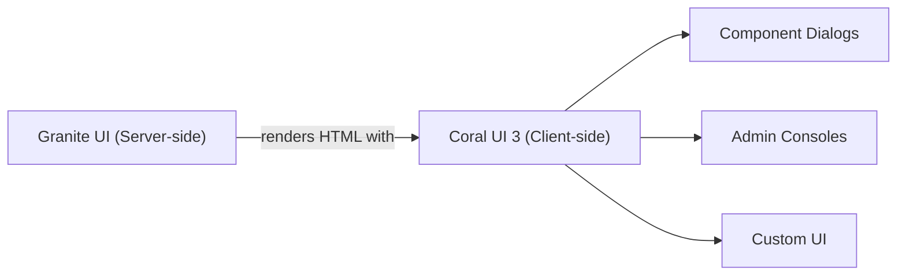

# Coral UI

Coral UI is Adobe's **web component library** that powers the entire AEM Touch UI -- dialogs, the
Sites console, the DAM console, the page editor toolbar, and every admin interface. When you build
custom dialog fields, admin consoles, or author-facing UI in AEM, you use Coral UI components.

Coral UI 3 is built on standard [Web Components](https://developer.mozilla.org/en-US/docs/Web/API/Web_components)
(Custom Elements v1). Components are used as HTML elements with the `is="coral-*"` attribute or as
standalone tags like `<coral-dialog>`.



## Granite UI vs Coral UI

These two terms are often confused. They work together but at different layers:

| Layer | Framework | Where it runs | What it does |
|-------|-----------|--------------|--------------|
| **Granite UI** | Server-side (Sling) | AEM server | Reads dialog XML, renders HTML markup with Coral classes and attributes |
| **Coral UI 3** | Client-side (JS/CSS) | Browser | Provides interactive web components (buttons, dialogs, selects, etc.) |

When you write dialog XML like `sling:resourceType="granite/ui/components/coral/foundation/form/textfield"`,
Granite UI renders the server-side HTML, and Coral UI's JavaScript enhances it into an interactive
text field in the browser.

:::tip
You interact with Granite UI when writing **dialog XML** (server-side). You interact with Coral UI
when writing **client-side JavaScript** for dialog customisation, custom fields, or admin pages.
:::

---

## Component Library Reference

AEM ships with Coral UI 3. The full API is browsable on your local instance:

| Resource | URL |
|----------|-----|
| **Coral UI component examples** | `http://localhost:4502/libs/granite/ui/components/coral/foundation/form/field.html` |
| **Coral UI 3 API docs** | `http://localhost:4502/libs/granite/ui/references/coral-ui/coralui3/` |
| **Granite UI server-side docs** | `http://localhost:4502/libs/granite/ui/content/dumplibs.html` |

### Commonly used Coral UI components

| Component | HTML | Purpose |
|-----------|------|---------|
| `coral-button` | `<button is="coral-button">` | Buttons with icons and variants |
| `coral-textfield` | `<input is="coral-textfield">` | Text input fields |
| `coral-textarea` | `<textarea is="coral-textarea">` | Multi-line text input |
| `coral-select` | `<coral-select>` | Dropdown select |
| `coral-checkbox` | `<coral-checkbox>` | Checkbox toggle |
| `coral-radio` | `<coral-radio>` | Radio button |
| `coral-switch` | `<coral-switch>` | Toggle switch |
| `coral-dialog` | `<coral-dialog>` | Modal dialog |
| `coral-alert` | `<coral-alert>` | Alert / notification banner |
| `coral-table` | `<coral-table>` | Data table |
| `coral-tabs` | `<coral-tablist>` + `<coral-panelstack>` | Tabbed interface |
| `coral-accordion` | `<coral-accordion>` | Collapsible sections |
| `coral-tag` | `<coral-tag>` | Tag / chip |
| `coral-tooltip` | `<coral-tooltip>` | Tooltip on hover |
| `coral-popover` | `<coral-popover>` | Popover content |
| `coral-progress` | `<coral-progress>` | Progress bar |
| `coral-wait` | `<coral-wait>` | Loading spinner |
| `coral-icon` | `<coral-icon>` | Icon (from the Coral icon set) |
| `coral-masonry` | `<coral-masonry>` | Masonry grid layout (card view) |
| `coral-columnview` | `<coral-columnview>` | Column / Miller columns view |
| `coral-shell` | `<coral-shell>` | AEM shell (global navigation) |

---

## Setup and Integration

To use Coral UI components in a custom page or template (outside of standard dialogs), load the
Coral UI libraries via a clientlib dependency.

### 1. Create a clientlib with Coral dependencies

```xml title="ui.apps/.../clientlibs/clientlib-coral-custom/.content.xml"
<?xml version="1.0" encoding="UTF-8"?>
<jcr:root xmlns:jcr="http://www.jcp.org/jcr/1.0" xmlns:cq="http://www.day.com/jcr/cq/1.0"
    jcr:primaryType="cq:ClientLibraryFolder"
    allowProxy="{Boolean}true"
    dependencies="[coralui3,granite.ui.coral.foundation]"
    categories="[myproject.coral-custom]"/>
```

| Dependency | Provides |
|-----------|---------|
| `coralui3` | Core Coral UI 3 library (all components, JS, CSS) |
| `granite.ui.coral.foundation` | Granite UI foundation components (form fields, containers) |
| `granite.ui.shell` | AEM shell framework (only needed if building full admin pages) |

### 2. Load the clientlib in your HTL template

```html title="body.html"
<sly data-sly-use.clientlib="/libs/granite/sightly/templates/clientlib.html">
    <sly data-sly-call="${clientlib.all @ categories='myproject.coral-custom'}"/>
</sly>

<div class="myproject-custom-ui">
    <button is="coral-button" variant="primary" icon="add">Add Item</button>
</div>
```

The `dependencies` in the clientlib XML ensures Coral UI 3 is loaded before your custom code runs.

---

## Using Coral UI Components

### Buttons

```html
<!-- Primary action button -->
<button is="coral-button" variant="primary" icon="check">Save</button>

<!-- Secondary / quiet button -->
<button is="coral-button" variant="quiet" icon="edit">Edit</button>

<!-- Warning button -->
<button is="coral-button" variant="warning" icon="delete">Delete</button>

<!-- Button with only an icon (no label) -->
<button is="coral-button" variant="quietaction" icon="more" iconsize="S"
        title="More options"></button>

<!-- Disabled button -->
<button is="coral-button" variant="primary" disabled>Unavailable</button>

<!-- Button sizes -->
<button is="coral-button" variant="primary" size="M">Medium</button>
<button is="coral-button" variant="primary" size="L">Large</button>
```

Button variants: `default`, `primary`, `secondary`, `warning`, `quiet`, `minimal`, `quietaction`, `action`

### Alerts

```html
<!-- Info alert -->
<coral-alert variant="info">
    <coral-alert-header>Information</coral-alert-header>
    <coral-alert-content>This component has unsaved changes.</coral-alert-content>
</coral-alert>

<!-- Success alert -->
<coral-alert variant="success">
    <coral-alert-header>Saved</coral-alert-header>
    <coral-alert-content>Your changes have been saved successfully.</coral-alert-content>
</coral-alert>

<!-- Warning alert -->
<coral-alert variant="warning">
    <coral-alert-header>Warning</coral-alert-header>
    <coral-alert-content>This action cannot be undone.</coral-alert-content>
</coral-alert>

<!-- Error alert -->
<coral-alert variant="error">
    <coral-alert-header>Error</coral-alert-header>
    <coral-alert-content>Failed to save. Please try again.</coral-alert-content>
</coral-alert>
```

Alert variants: `info`, `success`, `warning`, `error`, `help`

### Dialogs

```html
<!-- Define a dialog -->
<coral-dialog id="myDialog" variant="default">
    <coral-dialog-header>Confirm Action</coral-dialog-header>
    <coral-dialog-content>
        <p>Are you sure you want to delete this item?</p>
    </coral-dialog-content>
    <coral-dialog-footer>
        <button is="coral-button" variant="default" coral-close>Cancel</button>
        <button is="coral-button" variant="primary" id="confirmBtn">Delete</button>
    </coral-dialog-footer>
</coral-dialog>
```

```javascript title="Opening and handling dialogs"
// Open the dialog
var dialog = document.getElementById('myDialog');
dialog.show();

// Handle the confirm button
document.getElementById('confirmBtn').addEventListener('click', function() {
    // Perform the action
    dialog.hide();
});

// Listen for dialog close
dialog.on('coral-overlay:close', function() {
    console.log('Dialog closed');
});
```

Dialog variants: `default`, `error`, `warning`, `success`, `help`, `info`

### Select / Dropdown

```html
<coral-select name="category" placeholder="Select a category">
    <coral-select-item value="news">News</coral-select-item>
    <coral-select-item value="blog">Blog</coral-select-item>
    <coral-select-item value="product" selected>Product</coral-select-item>
    <coral-select-item value="event">Event</coral-select-item>
</coral-select>
```

```javascript title="Reading the selected value"
var select = document.querySelector('coral-select[name="category"]');
select.on('change', function() {
    console.log('Selected:', select.value);
});
```

### Tables

```html
<coral-table selectable>
    <coral-table-head>
        <coral-table-row>
            <coral-table-headercell>Name</coral-table-headercell>
            <coral-table-headercell>Status</coral-table-headercell>
            <coral-table-headercell>Modified</coral-table-headercell>
        </coral-table-row>
    </coral-table-head>
    <coral-table-body>
        <coral-table-row>
            <coral-table-cell>Homepage</coral-table-cell>
            <coral-table-cell><coral-status variant="success">Published</coral-status></coral-table-cell>
            <coral-table-cell>2025-01-15</coral-table-cell>
        </coral-table-row>
        <coral-table-row>
            <coral-table-cell>About Us</coral-table-cell>
            <coral-table-cell><coral-status variant="warning">Draft</coral-status></coral-table-cell>
            <coral-table-cell>2025-01-20</coral-table-cell>
        </coral-table-row>
    </coral-table-body>
</coral-table>
```

### Tabs

```html
<coral-tablist>
    <coral-tab>General</coral-tab>
    <coral-tab selected>Advanced</coral-tab>
    <coral-tab>Permissions</coral-tab>
</coral-tablist>
<coral-panelstack>
    <coral-panel>
        <p>General settings content</p>
    </coral-panel>
    <coral-panel selected>
        <p>Advanced settings content</p>
    </coral-panel>
    <coral-panel>
        <p>Permissions settings content</p>
    </coral-panel>
</coral-panelstack>
```

### Icons

Coral UI includes a comprehensive icon set. Use the `icon` attribute on buttons or the `<coral-icon>`
element:

```html
<!-- Standalone icon -->
<coral-icon icon="edit" size="S"></coral-icon>
<coral-icon icon="delete" size="M"></coral-icon>
<coral-icon icon="check" size="L"></coral-icon>

<!-- Common icons -->
<coral-icon icon="add"></coral-icon>         <!-- + -->
<coral-icon icon="close"></coral-icon>       <!-- × -->
<coral-icon icon="search"></coral-icon>      <!-- 🔍 -->
<coral-icon icon="settings"></coral-icon>    <!-- ⚙ -->
<coral-icon icon="infoCircle"></coral-icon>  <!-- ℹ -->
<coral-icon icon="alert"></coral-icon>       <!-- ⚠ -->
<coral-icon icon="folder"></coral-icon>
<coral-icon icon="image"></coral-icon>
<coral-icon icon="globe"></coral-icon>
<coral-icon icon="user"></coral-icon>
<coral-icon icon="link"></coral-icon>
<coral-icon icon="code"></coral-icon>
```

Browse all available icons at:
`http://localhost:4502/libs/granite/ui/references/coral-ui/coralui3/Coral.Icon.html`

---

## Coral UI in Dialog Clientlibs

The most common use of Coral UI in custom code is **dialog clientlibs** -- JavaScript that runs
inside component dialogs to add custom behaviour (show/hide fields, validation, dynamic defaults).

### Show/hide fields based on a dropdown value

```javascript title="ui.apps/.../clientlibs/clientlib-dialog/js/showhide.js"
(function($, Coral) {
    'use strict';

    // Run when the dialog loads
    $(document).on('dialog-ready', function() {
        initShowHide();
    });

    function initShowHide() {
        // Find the trigger select field
        var $select = $('[name="./layoutType"]');
        if (!$select.length) return;

        // Get the Coral select component
        Coral.commons.ready($select[0], function(selectEl) {
            // Initial state
            toggleFields(selectEl.value);

            // Listen for changes
            selectEl.on('change', function() {
                toggleFields(selectEl.value);
            });
        });
    }

    function toggleFields(value) {
        var $imageField = $('[name="./backgroundImage"]').closest('.coral-Form-fieldwrapper');
        var $colorField = $('[name="./backgroundColor"]').closest('.coral-Form-fieldwrapper');

        if (value === 'image') {
            $imageField.show();
            $colorField.hide();
        } else if (value === 'color') {
            $imageField.hide();
            $colorField.show();
        } else {
            $imageField.show();
            $colorField.show();
        }
    }

})(jQuery, Coral);
```

### Custom validation

```javascript title="ui.apps/.../clientlibs/clientlib-dialog/js/validation.js"
(function($, Coral) {
    'use strict';

    // Register a custom validator
    $(window).adaptTo('foundation-registry').register(
        'foundation.validation.validator',
        {
            // CSS selector to match the field
            selector: '[data-validation="url-pattern"]',

            // Validation function
            validate: function(el) {
                var value = el.value;
                if (!value) return; // Skip empty (use 'required' for that)

                var urlPattern = /^https?:\/\/.+/;
                if (!urlPattern.test(value)) {
                    return 'Please enter a valid URL starting with http:// or https://';
                }
            }
        }
    );

})(jQuery, Coral);
```

Add the validator to a dialog field via `granite:data`:

```xml
<linkUrl
    jcr:primaryType="nt:unstructured"
    sling:resourceType="granite/ui/components/coral/foundation/form/textfield"
    fieldLabel="Link URL"
    name="./linkUrl"
    validation="url-pattern"/>
```

### Setting default values dynamically

```javascript title="Setting a default date to today"
(function($, Coral) {
    'use strict';

    $(document).on('dialog-ready', function() {
        var $dateField = $('[name="./publishDate"]');
        if (!$dateField.length) return;

        Coral.commons.ready($dateField[0], function(datePicker) {
            // Only set if the field is empty (new component)
            if (!datePicker.value) {
                var today = new Date().toISOString().split('T')[0];
                datePicker.value = today;
            }
        });
    });

})(jQuery, Coral);
```

### Loading the dialog clientlib

Register your dialog clientlib with the `cq.authoring.dialog` category or reference it
as an `extraClientlibs` property on the component:

```xml title="ui.apps/.../clientlibs/clientlib-dialog/.content.xml"
<?xml version="1.0" encoding="UTF-8"?>
<jcr:root xmlns:jcr="http://www.jcp.org/jcr/1.0" xmlns:cq="http://www.day.com/jcr/cq/1.0"
    jcr:primaryType="cq:ClientLibraryFolder"
    allowProxy="{Boolean}true"
    categories="[cq.authoring.dialog]"
    dependencies="[coralui3]"/>
```

:::tip
The `cq.authoring.dialog` category is loaded for **all** dialogs. If your script should only run
for a specific component, scope it by checking for a field unique to that dialog:

```javascript
$(document).on('dialog-ready', function() {
    var $myField = $('[name="./myUniqueFieldName"]');
    if (!$myField.length) return; // Not our dialog
    // ... custom logic ...
});
```
:::

---

## Coral UI JavaScript API Patterns

### `Coral.commons.ready()`

Wait for a Coral component to be fully initialised before interacting with it:

```javascript
var element = document.querySelector('coral-select');
Coral.commons.ready(element, function(readyElement) {
    // Component is fully initialised and ready
    console.log('Selected value:', readyElement.value);
});
```

### Event handling with `.on()`

Coral components extend HTMLElement and support standard DOM events plus Coral-specific events:

```javascript
// Coral event
dialog.on('coral-overlay:open', function() { /* dialog opened */ });
dialog.on('coral-overlay:close', function() { /* dialog closed */ });

// Standard DOM event on Coral element
select.on('change', function() { /* value changed */ });

// jQuery-style with delegation
$(document).on('change', 'coral-select[name="./category"]', function(e) {
    console.log('Category changed:', e.target.value);
});
```

### Common Coral events

| Event | Component | Fires when |
|-------|-----------|-----------|
| `change` | Select, Checkbox, Radio, Switch | Value changes |
| `coral-overlay:open` | Dialog, Popover | Overlay opens |
| `coral-overlay:close` | Dialog, Popover | Overlay closes |
| `coral-overlay:beforeopen` | Dialog, Popover | Before overlay opens (cancellable) |
| `coral-overlay:beforeclose` | Dialog, Popover | Before overlay closes (cancellable) |
| `coral-collection:add` | Multifield, TagList | Item added |
| `coral-collection:remove` | Multifield, TagList | Item removed |
| `click` | Button | Button clicked |
| `input` | Textfield, Textarea | User types |

### `foundation-registry`

The Granite UI registry is used for validators, adapters, and other extension points:

```javascript
var registry = $(window).adaptTo('foundation-registry');

// Register a validator
registry.register('foundation.validation.validator', { ... });

// Register a condition (for show/hide)
registry.register('foundation.condition', { ... });

// Register an adapter
registry.register('foundation.adapters', { ... });
```

### `foundation-contentloaded`

Fires when new content is loaded into the DOM (e.g., a dialog opens, a multifield item is added):

```javascript
$(document).on('foundation-contentloaded', function(e) {
    // New content was loaded into e.target
    // Re-initialise any custom logic for dynamically added fields
    var $newContent = $(e.target);
    $newContent.find('[data-my-widget]').each(function() {
        initMyWidget(this);
    });
});
```

---

## Building a Custom Dialog Field

For requirements that Coral UI's built-in fields don't cover, you can create a custom Granite UI
field component that renders Coral UI markup:

### Server-side (Granite UI field)

```html title="ui.apps/apps/myproject/components/fields/color-picker/color-picker.html"
<sly data-sly-use.field="com.adobe.granite.ui.components.Field"/>
<div class="coral-Form-fieldwrapper"
     data-sly-use.cfg="com.adobe.granite.ui.components.Config">

    <label class="coral-Form-fieldlabel"
           data-sly-test="${cfg.fieldLabel}">${cfg.fieldLabel}</label>

    <div class="myproject-color-picker">
        <input is="coral-textfield"
               name="${field.name}"
               value="${field.value}"
               type="text"
               class="myproject-color-picker__input"
               placeholder="${cfg.emptyText || '#000000'}"/>
        <div class="myproject-color-picker__preview"
             style="background-color: ${field.value || '#000000'}"></div>
    </div>

    <coral-icon icon="infoCircle"
                size="S"
                class="coral-Form-fieldinfo"
                data-sly-test="${cfg.fieldDescription}"
                title="${cfg.fieldDescription}"></coral-icon>
</div>
```

### Client-side (JavaScript enhancement)

```javascript title="ui.apps/.../clientlibs/clientlib-dialog/js/color-picker.js"
(function($, Coral) {
    'use strict';

    $(document).on('foundation-contentloaded', function() {
        $('.myproject-color-picker').each(function() {
            var $picker = $(this);
            var $input = $picker.find('.myproject-color-picker__input');
            var $preview = $picker.find('.myproject-color-picker__preview');

            // Update preview on input change
            $input.on('input', function() {
                $preview.css('background-color', $input.val() || '#000000');
            });
        });
    });

})(jQuery, Coral);
```

### Using the custom field in a dialog

```xml
<backgroundColor
    jcr:primaryType="nt:unstructured"
    sling:resourceType="myproject/components/fields/color-picker"
    fieldLabel="Background Color"
    fieldDescription="Enter a hex color code"
    emptyText="#ffffff"
    name="./backgroundColor"/>
```

---

## Theming and CSS Classes

Coral UI uses a set of CSS utility classes for layout and spacing:

### Layout classes

| Class | Purpose |
|-------|---------|
| `coral-Form-fieldwrapper` | Wraps a form field (label + input + description) |
| `coral-Form-fieldlabel` | Field label text |
| `coral-Form-fieldinfo` | Help icon / description |
| `coral-Form-field` | The input element itself |
| `coral--dark` | Dark theme (applied to a container) |
| `coral--light` | Light theme |
| `coral--largest` | Largest text size |
| `coral--large` | Large text size |

### Spacing with `u-coral-*`

```html
<!-- Margin -->
<div class="u-coral-margin">Standard margin</div>
<div class="u-coral-marginTop">Top margin only</div>
<div class="u-coral-marginBottom">Bottom margin only</div>

<!-- Padding -->
<div class="u-coral-padding">Standard padding</div>
<div class="u-coral-noPadding">Remove padding</div>

<!-- Text alignment -->
<div class="u-coral-textAlignCenter">Centred text</div>
<div class="u-coral-textAlignRight">Right-aligned text</div>

<!-- Visibility -->
<div class="u-coral-screenReaderOnly">Hidden visually, accessible to screen readers</div>
```

---

## Best Practices

### Use `Coral.commons.ready()` before accessing components

Coral components initialise asynchronously. Always use `Coral.commons.ready()` or the
`foundation-contentloaded` event before reading values or attaching listeners.

### Scope dialog scripts to avoid conflicts

Dialog clientlibs with category `cq.authoring.dialog` run for every dialog. Always check for a
unique field name before executing your logic.

### Don't manipulate Coral DOM internals

Coral components manage their own internal DOM structure (shadow DOM). Don't rely on or manipulate
internal elements -- use the component's JavaScript API instead:

```javascript
// ❌ Bad: manipulating internal DOM
select.querySelector('.coral-Select-trigger').style.color = 'red';

// ✅ Good: using the component API
select.variant = 'warning';
select.disabled = true;
```

### Use `granite:data` for custom data attributes

Pass custom data from dialog XML to your client-side JavaScript:

```xml
<myField
    jcr:primaryType="nt:unstructured"
    sling:resourceType="granite/ui/components/coral/foundation/form/textfield"
    name="./title">
    <granite:data
        jcr:primaryType="nt:unstructured"
        max-words="{Long}50"
        show-counter="{Boolean}true"/>
</myField>
```

```javascript
// Read in JS
var maxWords = $field.data('max-words');     // 50
var showCounter = $field.data('show-counter'); // true
```

### Prefer built-in Granite UI fields

Before building a custom field, check if an existing Granite UI field type or Coral component covers
your need. Custom fields add maintenance overhead and may break on AEM upgrades.

---

## Common Pitfalls

| Pitfall | Solution |
|---------|----------|
| `Coral is not defined` | Ensure your clientlib has `coralui3` as a dependency |
| Component API methods return `undefined` | Use `Coral.commons.ready()` -- the component isn't initialised yet |
| Dialog script runs for wrong component | Scope your script by checking for a unique field name |
| Styles break after AEM upgrade | Don't rely on internal Coral DOM structure; use the public API |
| `foundation-contentloaded` fires multiple times | Normal -- it fires for each new content load (dialog open, multifield add); make your init logic idempotent |
| Custom field not saving values | Ensure the `<input>` has a `name` attribute matching `./propertyName` |
| jQuery `$` not available | Use `(function($, Coral) { ... })(jQuery, Coral);` wrapper |

## External Resources

- [Coral UI 3 Documentation](https://developer.adobe.com/experience-manager/reference-materials/6-5/coral-ui/coralui3/)
- [Granite UI Foundation Components](https://developer.adobe.com/experience-manager/reference-materials/6-5/granite-ui/api/jcr_root/libs/granite/ui/components/coral/foundation/server.html)
- [Coral Spectrum (open-source successor)](https://opensource.adobe.com/coral-spectrum/documentation/)
- [Adobe Spectrum Design System](https://spectrum.adobe.com/)

## See also

- [Touch UI (Author UI)](./touch-ui.mdx) -- Touch UI architecture
- [Overlays](./overlays.mdx) -- customising existing AEM UI
- [Render Conditions](./render-conditions.mdx) -- showing/hiding UI elements
- [Component Dialogs](../component-dialogs.mdx) -- dialog field types and XML structure
- [Client Libraries](../client-libraries.mdx) -- loading clientlibs
- [Custom Component Guide](../custom-component.mdx) -- building components with dialog clientlibs
- [HTL Templates](../htl-templates.mdx) -- server-side rendering
