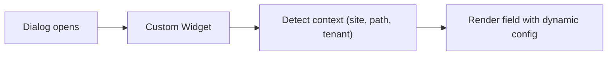
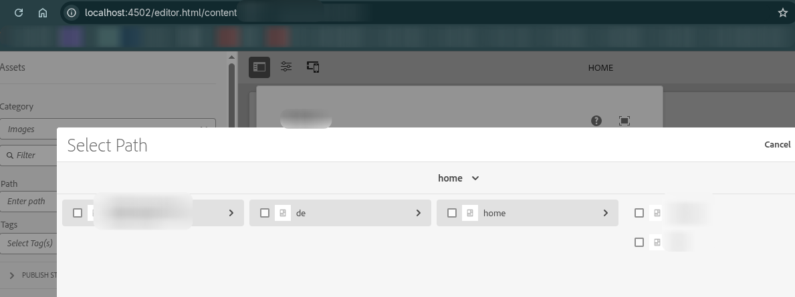
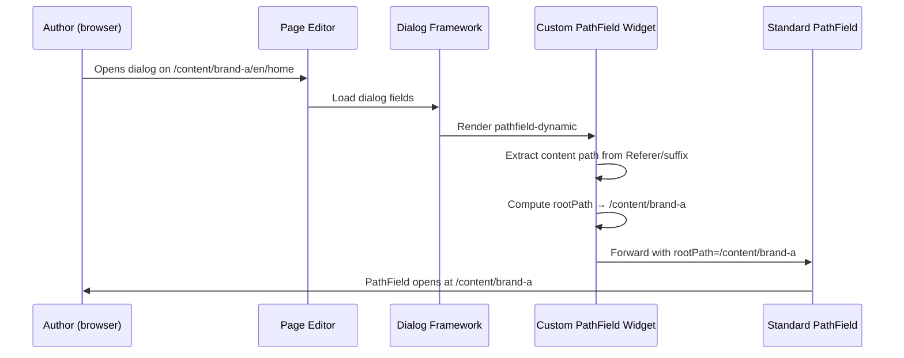
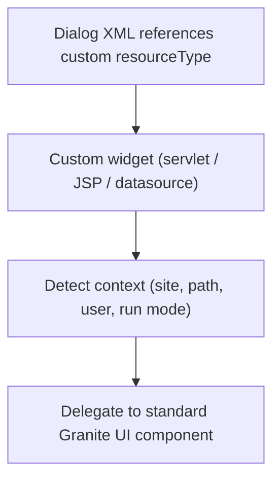

# Custom Dialog Widgets

AEM's Granite UI provides a rich set of dialog fields, but multi-site and multi-tenant projects often
need **context-aware** widgets that adapt their behaviour based on the page being edited -- for
example, a PathField that automatically roots itself to the current site's DAM folder, or an asset
finder that only shows assets belonging to the current brand.

This page covers techniques for building custom, dynamic dialog widgets that go beyond what static
dialog XML can achieve.



---

## Dynamic PathField Root Path

### The problem

The Granite [PathField](https://developer.adobe.com/experience-manager/reference-materials/6-5/granite-ui/api/jcr_root/libs/granite/ui/components/coral/foundation/form/pathfield/index.html)
has a `rootPath` property that determines where the path browser opens. In a standard dialog, this
is hardcoded in the XML:

```xml
<link jcr:primaryType="nt:unstructured"
      sling:resourceType="granite/ui/components/coral/foundation/form/pathfield"
      fieldLabel="Select page"
      rootPath="/content/my-site"
      name="./linkPath"/>
```

This works fine for a single site, but in **multi-site projects** (where `/content/brand-a`,
`/content/brand-b`, etc. share the same components), you need the root path to change dynamically
based on which site the author is currently editing.

The `rootPath` property is read server-side when the dialog renders. It **cannot** be changed via
client-side JavaScript.



### Solution: Custom Granite UI field component

Create a custom resource type that **wraps** the standard PathField and computes the `rootPath`
at render time based on the current content path.

#### 1. Reference the custom widget in your dialog

```xml title="ui.apps/.../components/my-component/_cq_dialog/.content.xml (excerpt)"
<link jcr:primaryType="nt:unstructured"
      sling:resourceType="myproject/widgets/pathfield-dynamic"
      fieldLabel="Internal Link"
      name="./linkPath"/>
```

#### 2. Create the widget component

```xml title="ui.apps/.../widgets/pathfield-dynamic/.content.xml"
<?xml version="1.0" encoding="UTF-8"?>
<jcr:root xmlns:sling="http://sling.apache.org/jcr/sling/1.0"
          xmlns:nt="http://www.jcp.org/jcr/nt/1.0"
          xmlns:jcr="http://www.jcp.org/jcr/1.0"
    jcr:primaryType="nt:unstructured"
    sling:resourceSuperType="granite/ui/components/coral/foundation/form/pathfield"/>
```

The `sling:resourceSuperType` inherits all PathField behaviour. Your custom rendering script
intercepts the request, computes the `rootPath`, and forwards to the original PathField.

#### 3. Implement the rendering logic

**Option A: Sling Servlet (recommended)**

A proper OSGi servlet with testable logic:

```java title="core/.../servlets/DynamicPathFieldServlet.java"
package com.myproject.core.servlets;

import org.apache.commons.lang3.StringUtils;
import org.apache.sling.api.SlingHttpServletRequest;
import org.apache.sling.api.SlingHttpServletResponse;
import org.apache.sling.api.resource.Resource;
import org.apache.sling.api.resource.ResourceWrapper;
import org.apache.sling.api.resource.ValueMap;
import org.apache.sling.api.servlets.SlingSafeMethodsServlet;
import org.apache.sling.api.wrappers.ValueMapDecorator;
import org.osgi.service.component.annotations.Component;

import javax.servlet.RequestDispatcher;
import javax.servlet.Servlet;
import javax.servlet.ServletException;
import java.io.IOException;
import java.util.HashMap;

@Component(
    service = Servlet.class,
    property = {
        "sling.servlet.resourceTypes=myproject/widgets/pathfield-dynamic",
        "sling.servlet.methods=GET"
    }
)
public class DynamicPathFieldServlet extends SlingSafeMethodsServlet {

    private static final String DEFAULT_ROOT = "/content";

    @Override
    protected void doGet(SlingHttpServletRequest request,
                         SlingHttpServletResponse response)
            throws ServletException, IOException {

        Resource fieldResource = request.getResource();
        String computedRootPath = computeRootPath(request);

        // Create a wrapped resource with the overridden rootPath
        Resource wrappedResource = createWrappedResource(fieldResource, computedRootPath);

        // Forward to the standard pathfield renderer
        RequestDispatcher dispatcher = request.getRequestDispatcher(wrappedResource);
        if (dispatcher != null) {
            request.setAttribute("org.apache.sling.api.include.resource", wrappedResource);
            dispatcher.include(request, response);
        }
    }

    /**
     * Compute the root path based on the content being edited.
     * Extracts the site root (e.g., /content/brand-a) from the editor URL.
     */
    private String computeRootPath(SlingHttpServletRequest request) {
        String contentPath = getContentPath(request);

        if (StringUtils.isNotBlank(contentPath) && contentPath.startsWith("/content/")) {
            String[] parts = contentPath.split("/");
            // /content/{site-root} → extract first two levels
            if (parts.length >= 3) {
                return "/" + parts[1] + "/" + parts[2];
            }
        }

        return DEFAULT_ROOT;
    }

    /**
     * Extract the content path from the editor URL.
     * The page editor sends it via the Referer header or the 'item' parameter.
     */
    private String getContentPath(SlingHttpServletRequest request) {
        // Try the suffix (used by Granite UI for the content path)
        String suffix = request.getRequestPathInfo().getSuffix();
        if (StringUtils.isNotBlank(suffix)) {
            return suffix;
        }

        // Try the Referer header (editor.html/{content-path})
        String referer = request.getHeader("Referer");
        if (StringUtils.isNotBlank(referer) && referer.contains("/editor.html/")) {
            int startIdx = referer.indexOf("/editor.html/") + "/editor.html".length();
            String path = referer.substring(startIdx);
            int queryIdx = path.indexOf('?');
            if (queryIdx > 0) {
                path = path.substring(0, queryIdx);
            }
            return path;
        }

        // Try the 'item' request parameter
        String item = request.getParameter("item");
        if (StringUtils.isNotBlank(item)) {
            return item;
        }

        return null;
    }

    private Resource createWrappedResource(Resource original, String rootPath) {
        ValueMap originalMap = original.getValueMap();
        HashMap<String, Object> modified = new HashMap<>();

        for (String key : originalMap.keySet()) {
            modified.put(key, originalMap.get(key));
        }
        modified.put("rootPath", rootPath);

        ValueMap wrappedMap = new ValueMapDecorator(modified);

        return new ResourceWrapper(original) {
            @Override
            public ValueMap getValueMap() {
                return wrappedMap;
            }

            @Override
            @SuppressWarnings("unchecked")
            public <AdapterType> AdapterType adaptTo(Class<AdapterType> type) {
                if (type == ValueMap.class) {
                    return (AdapterType) wrappedMap;
                }
                return super.adaptTo(type);
            }
        };
    }
}
```

**Option B: JSP (simpler, less testable)**

For projects where a servlet feels like overkill, a JSP achieves the same result:

```jsp title="ui.apps/.../widgets/pathfield-dynamic/pathfield-dynamic.jsp"
<%@page session="false"
        import="org.apache.commons.lang3.StringUtils,
                org.apache.sling.api.SlingHttpServletRequest,
                org.apache.sling.api.resource.Resource,
                org.apache.sling.api.resource.ResourceWrapper,
                org.apache.sling.api.resource.ValueMap,
                org.apache.sling.api.wrappers.ValueMapDecorator,
                java.util.HashMap" %>
<%@taglib prefix="sling" uri="http://sling.apache.org/taglibs/sling/1.0" %>
<%@taglib prefix="cq" uri="http://www.day.com/taglibs/cq/1.0" %>
<cq:defineObjects/>
<sling:defineObjects/>
<%
    final String computedRootPath = computeRootPath(slingRequest);
    final ValueMap original = resource.getValueMap();
    final HashMap<String, Object> modified = new HashMap<>();

    for (String key : original.keySet()) {
        modified.put(key, original.get(key));
    }
    modified.put("rootPath", computedRootPath);
    final ValueMap wrappedMap = new ValueMapDecorator(modified);

    final Resource wrappedResource = new ResourceWrapper(resource) {
        @Override
        public ValueMap getValueMap() { return wrappedMap; }

        @Override
        public <AdapterType> AdapterType adaptTo(Class<AdapterType> type) {
            if (type == ValueMap.class) return (AdapterType) wrappedMap;
            return super.adaptTo(type);
        }
    };
%><sling:include resource="<%= wrappedResource %>"
    resourceType="granite/ui/components/coral/foundation/form/pathfield"/><%!

    private String computeRootPath(SlingHttpServletRequest request) {
        String contentPath = getContentPath(request);
        if (StringUtils.isNotBlank(contentPath) && contentPath.startsWith("/content/")) {
            String[] parts = contentPath.split("/");
            if (parts.length >= 3) {
                return "/" + parts[1] + "/" + parts[2];
            }
        }
        return "/content";
    }

    private String getContentPath(SlingHttpServletRequest request) {
        String referer = request.getHeader("Referer");
        if (StringUtils.isNotBlank(referer) && referer.contains("/editor.html/")) {
            int start = referer.indexOf("/editor.html/") + "/editor.html".length();
            String path = referer.substring(start);
            int end = path.indexOf('?');
            return end > 0 ? path.substring(0, end) : path;
        }
        String item = request.getParameter("item");
        return StringUtils.isNotBlank(item) ? item : null;
    }
%>
```

### How it works



### Customising the root path logic

The `computeRootPath` method can be adapted to any multi-site structure:

```java
// Two-level site root: /content/{brand}
return "/" + parts[1] + "/" + parts[2];
// → /content/brand-a

// Three-level site root: /content/{brand}/{language}
return "/" + parts[1] + "/" + parts[2] + "/" + parts[3];
// → /content/brand-a/en

// DAM root matching the site: /content/dam/{brand}
return "/content/dam/" + parts[2];
// → /content/dam/brand-a

// Configurable via OSGi: inject a service that maps site paths to root paths
return siteConfigService.getDamRoot(contentPath);
```

### Passing additional configuration

Your custom widget inherits all standard PathField properties. You can add custom properties too:

```xml title="Dialog usage with extra configuration"
<link jcr:primaryType="nt:unstructured"
      sling:resourceType="myproject/widgets/pathfield-dynamic"
      fieldLabel="Internal Link"
      name="./linkPath"
      filter="hierarchyNotFile"
      rootPathDepth="{Long}2"
      fallbackRoot="/content/my-site"/>
```

Read them in the servlet via `Config`:

```java
Config config = new Config(request.getResource());
int depth = config.get("rootPathDepth", 2);
String fallback = config.get("fallbackRoot", "/content");
```

---

## Dynamic Assets Side Panel Root

### The problem

The AEM page editor's **Assets side panel** (the left-side drag-and-drop asset finder) defaults to
searching under `/content/dam`. In multi-site projects, this shows assets from all sites, making it
hard for authors to find the right images.

### Solution: Override the search root via clientlib

The asset finder controllers register their `searchRoot` property on the global
`Granite.author.ui.assetFinder.registry` object. Override it in a clientlib:

```javascript title="ui.apps/.../clientlibs/clientlib-authoring/js/assetSearchRoot.js"
;(function(window, document, ns) {
    'use strict';

    /**
     * Dynamically set the Assets side panel search root based on the current page.
     * Extracts the site name from the editor URL and maps it to a DAM path.
     */
    function getCustomSearchRoot() {
        var pathname = window.location.pathname;

        // Extract site from /editor.html/content/{site}/...
        if (pathname.indexOf('/editor.html/content/') >= 0) {
            var contentPath = pathname.replace('/editor.html', '');
            var parts = contentPath.split('/');
            if (parts.length >= 3) {
                // Map /content/{site}/... → /content/dam/{site}
                return '/content/dam/' + parts[2];
            }
        }

        return '/content/dam';
    }

    // Wait for the asset finder to be available, then override
    var checkInterval = setInterval(function() {
        if (ns && ns.ui && ns.ui.assetFinder && ns.ui.assetFinder.registry) {
            var customRoot = getCustomSearchRoot();

            // Override for all asset types
            var registry = ns.ui.assetFinder.registry;
            if (registry.Images) {
                registry.Images.searchRoot = customRoot;
            }
            if (registry.Documents) {
                registry.Documents.searchRoot = customRoot;
            }
            if (registry.Video) {
                registry.Video.searchRoot = customRoot;
            }
            if (registry.Audio) {
                registry.Audio.searchRoot = customRoot;
            }

            clearInterval(checkInterval);
            console.debug('Asset finder searchRoot set to:', customRoot);
        }
    }, 100);

}(window, document, Granite.author));
```

### Simple static override

If you just need a fixed custom path (not dynamic), the override is even simpler:

```javascript title="ui.apps/.../clientlibs/clientlib-authoring/js/assetSearchRoot.js"
;(function(window, document, ns) {
    'use strict';

    var customSearchRoot = '/content/dam/myproject';
    ns.ui.assetFinder.registry.Images.searchRoot = customSearchRoot;
    console.debug('Asset finder searchRoot set to:', customSearchRoot);

}(window, document, Granite.author));
```

### Clientlib setup

```xml title="ui.apps/.../clientlibs/clientlib-authoring/.content.xml"
<?xml version="1.0" encoding="UTF-8"?>
<jcr:root xmlns:jcr="http://www.jcp.org/jcr/1.0" xmlns:cq="http://www.day.com/jcr/cq/1.0"
    jcr:primaryType="cq:ClientLibraryFolder"
    allowProxy="{Boolean}true"
    categories="[cq.authoring.dialog,cq.authoring.editor]"/>
```

```text title="js.txt"
#base=js
assetSearchRoot.js
```

The `cq.authoring.editor` category ensures the script loads when the page editor opens.

---

## Dynamic DataSource for Select Fields

Another common need is a dropdown whose **options** change based on context. Use a DataSource
servlet to generate options dynamically:

```java title="core/.../servlets/SiteTagsDataSourceServlet.java"
@Component(
    service = Servlet.class,
    property = {
        "sling.servlet.resourceTypes=myproject/datasource/site-tags",
        "sling.servlet.methods=GET"
    }
)
public class SiteTagsDataSourceServlet extends SlingSafeMethodsServlet {

    @Override
    protected void doGet(SlingHttpServletRequest request,
                         SlingHttpServletResponse response) {

        ResourceResolver resolver = request.getResourceResolver();
        String suffix = request.getRequestPathInfo().getSuffix();

        // Determine the site from the content path
        String siteName = extractSiteName(suffix);
        String tagRoot = "/content/cq:tags/" + siteName;

        List<Map.Entry<String, String>> options = new ArrayList<>();
        Resource tagResource = resolver.getResource(tagRoot);
        if (tagResource != null) {
            for (Resource tag : tagResource.getChildren()) {
                options.add(Map.entry(
                    tag.getName(),
                    tag.getValueMap().get("jcr:title", tag.getName())
                ));
            }
        }

        // Convert to DataSource (see Servlets page for the full pattern)
        DataSource ds = new SimpleDataSource(
            new TransformIterator<>(options.iterator(), entry -> {
                ValueMap vm = new ValueMapDecorator(new HashMap<>());
                vm.put("value", entry.getKey());
                vm.put("text", entry.getValue());
                return new ValueMapResource(resolver, new ResourceMetadata(),
                    JcrConstants.NT_UNSTRUCTURED, vm);
            })
        );
        request.setAttribute(DataSource.class.getName(), ds);
    }

    private String extractSiteName(String suffix) {
        if (suffix != null && suffix.startsWith("/content/")) {
            String[] parts = suffix.split("/");
            if (parts.length >= 3) return parts[2];
        }
        return "global";
    }
}
```

```xml title="Usage in dialog"
<category
    jcr:primaryType="nt:unstructured"
    sling:resourceType="granite/ui/components/coral/foundation/form/select"
    fieldLabel="Category"
    name="./category">
    <datasource
        jcr:primaryType="nt:unstructured"
        sling:resourceType="myproject/datasource/site-tags"/>
</category>
```

---

## The Custom Widget Pattern

All the techniques above follow the same pattern:



### When to use which approach

| Technique | Server / Client | Use case |
|-----------|----------------|----------|
| **Custom PathField widget** (servlet/JSP) | Server-side | Dynamic `rootPath` for PathField or PathBrowser |
| **Asset finder searchRoot override** | Client-side (JS) | Dynamic root for the asset side panel |
| **DataSource servlet** | Server-side | Dynamic options for Select, Autocomplete, TagField |
| **Render Condition** | Server-side | Show/hide entire fields based on context |
| **Dialog clientlib show/hide** | Client-side (JS) | Toggle field visibility based on other field values |

---

## Best Practices

### Prefer server-side for security-sensitive logic

The PathField `rootPath` and DataSource options should be computed server-side. Client-side overrides
can be bypassed by a knowledgeable user.

### Make root path logic configurable

Hardcoding path patterns (e.g., "first two segments") is fragile. Consider an OSGi service that
maps content paths to root paths, configurable per run mode:

```java
@ObjectClassDefinition(name = "Site Path Configuration")
@interface SitePathConfig {
    @AttributeDefinition(name = "Content root depth",
        description = "Number of path segments for the content root")
    int contentRootDepth() default 2;

    @AttributeDefinition(name = "DAM root pattern",
        description = "Pattern for DAM root. Use {site} as placeholder.")
    String damRootPattern() default "/content/dam/{site}";
}
```

### Test with multiple sites

Custom widgets should be tested in the context of different sites to verify the path computation
works correctly for all tenants.

### Use `sling:resourceSuperType` for custom fields

Always extend the original Granite UI component via `sling:resourceSuperType` rather than
reimplementing it. This ensures your widget inherits all future improvements and bug fixes from
Adobe.

### Provide a fallback

Always return a sensible default if the context path can't be determined:

```java
// Good: fallback to a safe default
return StringUtils.isNotBlank(rootPath) ? rootPath : "/content";

// Bad: return null (will break the PathField)
return rootPath;
```

---

## Common Pitfalls

| Pitfall | Solution |
|---------|----------|
| Custom PathField shows `/content` for all sites | Check that the Referer header or suffix contains the content path; verify `computeRootPath` logic |
| Widget works in CRXDE but not after deploy | Ensure the widget component and servlet are included in the content package and `filter.xml` |
| Asset finder override doesn't work | Verify the clientlib category is `cq.authoring.editor`; check that `Granite.author.ui.assetFinder.registry` exists before overriding |
| PathField still uses the hardcoded rootPath | Make sure the dialog references your custom `sling:resourceType`, not the standard `granite/.../pathfield` |
| DataSource returns empty options | Check that the suffix path is correctly extracted; log the computed tag root |
| Custom widget breaks on AEM upgrade | Because you use `sling:resourceSuperType`, upgrades to the parent component are inherited automatically |

## See also

- [Component Dialogs](../component-dialogs.mdx) -- all dialog field types including PathField
- [Servlets](../backend/servlets.mdx) -- DataSource servlet patterns
- [Overlays](./overlays.mdx) -- customising product UI
- [Render Conditions](./render-conditions.mdx) -- conditionally showing fields
- [Coral UI](./coral-ui.mdx) -- client-side dialog scripting
- [Touch UI](./touch-ui.mdx)
- [Client Libraries](../client-libraries.mdx) -- loading authoring clientlibs
- [Multi-Tenancy UI Frontend](./multi-tenancy-support-ui-frontend.mdx) -- multi-tenant frontend patterns
