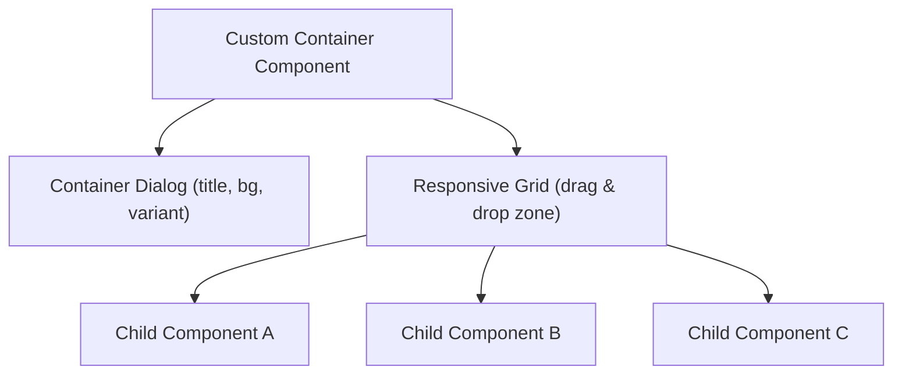
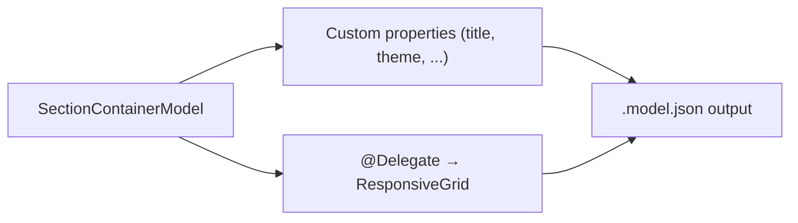

# Extending the Responsive Grid

AEM's responsive grid (also called **Layout Container** or the modern replacement for the classic
parsys) is the core drag-and-drop container that powers the AEM page editor. It handles child
component placement, responsive breakpoints, and column layout out of the box.

Sometimes you need more than a plain container -- you need a container component that **also has its
own dialog properties** (a title, a background image, a layout variant, etc.) while still letting
authors drag and drop child components into it. This guide shows how to extend the responsive grid
to build custom container components.



## When to Use a Custom Container

| Scenario | Approach |
|----------|---------|
| Simple component, no children | Standard component with dialog |
| Container with no extra properties | Use the built-in Layout Container (`wcm/foundation/components/responsivegrid`) |
| Container with custom properties + children | **Extend the responsive grid** (this guide) |
| Container with fixed child slots (no drag & drop) | Use `@ChildResource` + `data-sly-resource` in HTL |

Common real-world examples:
- **Footer quicklinks container** -- title + logo + *n* link column children
- **Accordion / Tab container** -- variant selector + *n* panel children
- **Section container** -- background image, colour theme, anchor ID + *n* content children
- **Carousel** -- autoplay settings, transition effect + *n* slide children

---

## How the Responsive Grid Works

The responsive grid is backed by the `ResponsiveGrid` Sling Model and the `wcm/foundation/components/responsivegrid`
component. It provides:

- A 12-column CSS grid system (`aem-Grid--12`)
- Responsive breakpoints (phone, tablet, desktop) configurable via template policies
- Column class names for each child (`aem-GridColumn--default--6`, etc.)
- Drag & drop zones in the page editor
- JSON export of child components and layout metadata for SPA scenarios

When you create a custom container, you **inherit** all of this by making the responsive grid your
`sling:resourceSuperType`.

---

## Step-by-Step: Building a Custom Container

### 1. Component definition

```xml title="ui.apps/.../components/section-container/.content.xml"
<?xml version="1.0" encoding="UTF-8"?>
<jcr:root xmlns:cq="http://www.day.com/jcr/cq/1.0"
          xmlns:jcr="http://www.jcp.org/jcr/1.0"
          xmlns:sling="http://sling.apache.org/jcr/sling/1.0"
    cq:icon="layoutContainer"
    jcr:description="A section container with configurable background and child components."
    jcr:primaryType="cq:Component"
    jcr:title="Section Container"
    sling:resourceSuperType="wcm/foundation/components/responsivegrid"
    componentGroup="My Project - Containers"/>
```

The key is `sling:resourceSuperType="wcm/foundation/components/responsivegrid"` -- this gives your
component all the responsive grid functionality.

### 2. Dialog

Add a dialog for the container's own properties:

```xml title="ui.apps/.../components/section-container/_cq_dialog/.content.xml"
<?xml version="1.0" encoding="UTF-8"?>
<jcr:root xmlns:jcr="http://www.jcp.org/jcr/1.0"
          xmlns:sling="http://sling.apache.org/jcr/sling/1.0"
          xmlns:cq="http://www.day.com/jcr/cq/1.0"
          xmlns:granite="http://www.adobe.com/jcr/granite/1.0"
    jcr:primaryType="nt:unstructured"
    jcr:title="Section Container"
    sling:resourceType="cq/gui/components/authoring/dialog">
    <content jcr:primaryType="nt:unstructured"
             sling:resourceType="granite/ui/components/coral/foundation/container">
        <items jcr:primaryType="nt:unstructured">
            <tabs jcr:primaryType="nt:unstructured"
                  sling:resourceType="granite/ui/components/coral/foundation/tabs">
                <items jcr:primaryType="nt:unstructured">
                    <properties jcr:primaryType="nt:unstructured"
                                jcr:title="Properties"
                                sling:resourceType="granite/ui/components/coral/foundation/container"
                                margin="{Boolean}true">
                        <items jcr:primaryType="nt:unstructured">
                            <sectionTitle
                                jcr:primaryType="nt:unstructured"
                                sling:resourceType="granite/ui/components/coral/foundation/form/textfield"
                                fieldLabel="Section Title"
                                name="./sectionTitle"/>
                            <anchorId
                                jcr:primaryType="nt:unstructured"
                                sling:resourceType="granite/ui/components/coral/foundation/form/textfield"
                                fieldLabel="Anchor ID"
                                fieldDescription="Used for in-page navigation links (e.g., #features)"
                                name="./anchorId"/>
                            <backgroundImage
                                jcr:primaryType="nt:unstructured"
                                sling:resourceType="granite/ui/components/coral/foundation/form/pathfield"
                                fieldLabel="Background Image"
                                rootPath="/content/dam"
                                name="./backgroundImage"/>
                            <theme
                                jcr:primaryType="nt:unstructured"
                                sling:resourceType="granite/ui/components/coral/foundation/form/select"
                                fieldLabel="Theme"
                                name="./theme">
                                <items jcr:primaryType="nt:unstructured">
                                    <light jcr:primaryType="nt:unstructured"
                                           text="Light" value="light" selected="{Boolean}true"/>
                                    <dark jcr:primaryType="nt:unstructured"
                                          text="Dark" value="dark"/>
                                    <accent jcr:primaryType="nt:unstructured"
                                            text="Accent" value="accent"/>
                                </items>
                            </theme>
                            <fullWidth
                                jcr:primaryType="nt:unstructured"
                                sling:resourceType="granite/ui/components/coral/foundation/form/checkbox"
                                text="Full-width layout"
                                name="./fullWidth"
                                value="{Boolean}true"/>
                        </items>
                    </properties>
                </items>
            </tabs>
        </items>
    </content>
</jcr:root>
```

### 3. HTL template

The HTL template renders your custom properties and delegates child rendering to the responsive grid:

```html title="ui.apps/.../components/section-container/section-container.html"
<sly data-sly-use.model="com.myproject.core.models.SectionContainerModel"/>
<section class="section-container section-container--${model.theme}"
         id="${model.anchorId}"
         data-sly-test="${!model.empty}"
         style="${model.backgroundImage ? 'background-image: url(' + model.backgroundImage + ')' : ''}">

    <div class="section-container__inner ${model.fullWidth ? 'section-container__inner--full' : ''}">
        <h2 data-sly-test="${model.sectionTitle}"
            class="section-container__title">${model.sectionTitle}</h2>

        <!--/* Render the responsive grid (child components) via resource super type */-->
        <sly data-sly-resource="${resource @ resourceSuperType='wcm/foundation/components/responsivegrid'}"/>
    </div>
</section>

<!--/* Empty placeholder for the page editor */-->
<sly data-sly-test="${model.empty && wcmmode.edit}">
    <div class="cq-placeholder" data-emptytext="Section Container -- Drag components here"></div>
</sly>
```

The critical line is:
```html
<sly data-sly-resource="${resource @ resourceSuperType='wcm/foundation/components/responsivegrid'}"/>
```

This delegates the rendering of child components to the responsive grid's HTL, which outputs the
drag-and-drop zone in edit mode and the child components with their grid CSS classes.

### 4. Sling Model (HTL rendering)

A simple Sling Model for the HTL-rendered (non-SPA) approach:

```java title="core/.../models/SectionContainerModel.java"
package com.myproject.core.models;

import org.apache.commons.lang3.StringUtils;
import org.apache.sling.api.SlingHttpServletRequest;
import org.apache.sling.api.resource.Resource;
import org.apache.sling.models.annotations.DefaultInjectionStrategy;
import org.apache.sling.models.annotations.Model;
import org.apache.sling.models.annotations.injectorspecific.SlingObject;
import org.apache.sling.models.annotations.injectorspecific.ValueMapValue;

@Model(
    adaptables = SlingHttpServletRequest.class,
    defaultInjectionStrategy = DefaultInjectionStrategy.OPTIONAL
)
public class SectionContainerModel {

    @ValueMapValue
    private String sectionTitle;

    @ValueMapValue
    private String anchorId;

    @ValueMapValue
    private String backgroundImage;

    @ValueMapValue
    private String theme;

    @ValueMapValue
    private Boolean fullWidth;

    @SlingObject
    private Resource resource;

    public String getSectionTitle() { return sectionTitle; }
    public String getAnchorId() { return anchorId; }
    public String getBackgroundImage() { return backgroundImage; }
    public String getTheme() { return theme != null ? theme : "light"; }
    public boolean isFullWidth() { return Boolean.TRUE.equals(fullWidth); }

    public boolean isEmpty() {
        return StringUtils.isAllBlank(sectionTitle, backgroundImage)
            && !resource.hasChildren();
    }
}
```

### 5. Template policy (allowed components)

Configure which child components are allowed inside your container via the template editor:

1. Open your editable template
2. Click on the Section Container in the structure
3. Open the **Policy** dialog
4. Under **Allowed Components**, select the component groups or individual components
5. Configure the **Layout** (responsive breakpoints and column count)

---

## SPA / Headless: JSON Export with ContainerExporter

For SPA Editor (React/Angular) or headless scenarios, your container must export its custom
properties **and** the responsive grid metadata (child items, column classes, grid classes) as JSON.

### The `@Delegate` pattern

The challenge is that `ContainerExporter` has methods like `getExportedItems()`,
`getExportedItemsOrder()`, `getColumnClassNames()`, etc. that are already implemented by the
`ResponsiveGrid` model. Instead of reimplementing them, use Lombok's `@Delegate` to forward
those methods automatically:



```java title="core/.../models/SectionContainerExporter.java"
package com.myproject.core.models;

import com.adobe.cq.export.json.ComponentExporter;
import com.adobe.cq.export.json.ContainerExporter;
import com.adobe.cq.export.json.ExporterConstants;
import com.day.cq.wcm.foundation.model.responsivegrid.ResponsiveGrid;
import com.day.cq.wcm.foundation.model.responsivegrid.export.ResponsiveGridExporter;
import com.fasterxml.jackson.annotation.JsonIgnore;
import com.fasterxml.jackson.annotation.JsonProperty;
import lombok.experimental.Delegate;
import org.apache.sling.api.SlingHttpServletRequest;
import org.apache.sling.models.annotations.DefaultInjectionStrategy;
import org.apache.sling.models.annotations.Exporter;
import org.apache.sling.models.annotations.Model;
import org.apache.sling.models.annotations.Via;
import org.apache.sling.models.annotations.injectorspecific.Self;
import org.apache.sling.models.annotations.injectorspecific.ValueMapValue;
import org.apache.sling.models.annotations.via.ResourceSuperType;

@Model(
    adaptables = SlingHttpServletRequest.class,
    adapters = {SectionContainerExporter.class, ComponentExporter.class, ContainerExporter.class},
    resourceType = SectionContainerExporter.RESOURCE_TYPE,
    defaultInjectionStrategy = DefaultInjectionStrategy.OPTIONAL
)
@Exporter(name = ExporterConstants.SLING_MODEL_EXPORTER_NAME,
          extensions = ExporterConstants.SLING_MODEL_EXTENSION)
public class SectionContainerExporter implements ComponentExporter, ContainerExporter {

    public static final String RESOURCE_TYPE = "myproject/components/section-container";

    // --- Exclude getExportedType() so we return OUR resource type, not the grid's ---
    interface ExcludedMethods {
        String getExportedType();
    }

    // --- Delegate all ContainerExporter / ResponsiveGridExporter methods to the parent ---
    @Self
    @Via(type = ResourceSuperType.class)
    @Delegate(types = ResponsiveGridExporter.class, excludes = ExcludedMethods.class)
    @JsonIgnore  // don't serialise the field itself; its methods are already delegated
    private ResponsiveGrid responsiveGrid;

    // --- Custom properties ---
    @ValueMapValue
    private String sectionTitle;

    @ValueMapValue
    private String anchorId;

    @ValueMapValue
    private String backgroundImage;

    @ValueMapValue
    private String theme;

    @ValueMapValue
    private Boolean fullWidth;

    // --- Getters ---
    @JsonProperty("sectionTitle")
    public String getSectionTitle() { return sectionTitle; }

    public String getAnchorId() { return anchorId; }
    public String getBackgroundImage() { return backgroundImage; }
    public String getTheme() { return theme != null ? theme : "light"; }
    public boolean isFullWidth() { return Boolean.TRUE.equals(fullWidth); }

    @Override
    public String getExportedType() {
        return RESOURCE_TYPE;
    }
}
```

### How `@Delegate` works here

| Annotation | Purpose |
|-----------|---------|
| `@Self` | Injects from the current adaptable (the request) |
| `@Via(type = ResourceSuperType.class)` | Adapts via the resource super type (`wcm/foundation/components/responsivegrid`) |
| `@Delegate(types = ResponsiveGridExporter.class, excludes = ExcludedMethods.class)` | Lombok generates forwarding methods for all `ResponsiveGridExporter` methods except `getExportedType()` |
| `@JsonIgnore` | Prevents Jackson from serialising the `responsiveGrid` field directly (the delegated methods handle serialisation) |

The `ExcludedMethods` interface is critical -- without it, `getExportedType()` would return
`wcm/foundation/components/responsivegrid` instead of your custom resource type, breaking
SPA component mapping.

### JSON output

Requesting `.model.json` on the component produces:

```json
{
    "sectionTitle": "Our Features",
    "anchorId": "features",
    "backgroundImage": "/content/dam/myproject/images/features-bg.jpg",
    "theme": "dark",
    "fullWidth": true,
    "columnClassNames": {
        "card1": "aem-GridColumn aem-GridColumn--default--4",
        "card2": "aem-GridColumn aem-GridColumn--default--4",
        "card3": "aem-GridColumn aem-GridColumn--default--4"
    },
    "columnCount": 12,
    "gridClassNames": "aem-Grid aem-Grid--12 aem-Grid--default--12",
    ":type": "myproject/components/section-container",
    ":itemsOrder": ["card1", "card2", "card3"],
    ":items": {
        "card1": {
            "title": "Feature One",
            ":type": "myproject/components/feature-card"
        },
        "card2": {
            "title": "Feature Two",
            ":type": "myproject/components/feature-card"
        },
        "card3": {
            "title": "Feature Three",
            ":type": "myproject/components/feature-card"
        }
    }
}
```

Your custom properties (`sectionTitle`, `theme`, etc.) sit alongside the grid metadata
(`columnClassNames`, `:items`, `:itemsOrder`).

---

## SPA Frontend: React Component

For SPA Editor projects, the React component extends `ResponsiveGrid` from Adobe's editable
components library:

```jsx title="ui.frontend/src/components/SectionContainer/SectionContainer.js"
import React from 'react';
import {
    MapTo,
    ResponsiveGrid,
    withComponentMappingContext
} from '@adobe/aem-react-editable-components';

const SectionContainerConfig = {
    emptyLabel: 'Section Container',
    isEmpty: (props) => {
        return !props || !props[':itemsOrder'] || props[':itemsOrder'].length === 0;
    }
};

class SectionContainer extends ResponsiveGrid {

    get containerAttrs() {
        const attrs = super.containerProps || {};
        return {
            ...attrs,
            className: `${attrs.className || ''} section-container section-container--${this.props.theme || 'light'}`.trim(),
            id: this.props.anchorId || undefined,
        };
    }

    render() {
        if (SectionContainerConfig.isEmpty(this.props)) {
            return (
                <div className="section-container section-container--empty">
                    <p>Section Container -- Drag components here</p>
                </div>
            );
        }

        const backgroundStyle = this.props.backgroundImage
            ? { backgroundImage: `url(${this.props.backgroundImage})` }
            : {};

        return (
            <section
                className={`section-container section-container--${this.props.theme || 'light'}`}
                id={this.props.anchorId}
                style={backgroundStyle}
            >
                <div className={`section-container__inner ${this.props.fullWidth ? 'section-container__inner--full' : ''}`}>
                    {this.props.sectionTitle && (
                        <h2 className="section-container__title">{this.props.sectionTitle}</h2>
                    )}

                    {/* Render the responsive grid children */}
                    <div {...this.containerProps}>
                        {this.childComponents}
                        {this.placeholderComponent}
                    </div>
                </div>
            </section>
        );
    }
}

export default MapTo('myproject/components/section-container')(
    withComponentMappingContext(SectionContainer),
    SectionContainerConfig
);
```

### Key React patterns

| Pattern | Purpose |
|---------|---------|
| `extends ResponsiveGrid` | Inherits all grid rendering logic (child placement, edit mode placeholders) |
| `this.childComponents` | Renders all child components placed by the author |
| `this.placeholderComponent` | Renders the drag-and-drop placeholder in edit mode |
| `this.containerProps` | Props for the grid container div (CSS classes, data attributes) |
| `MapTo('resource/type')` | Maps the React component to the AEM resource type for SPA Editor |
| `withComponentMappingContext` | Enables child component resolution in nested containers |

---

## Alternative: Without Lombok

If your project doesn't use Lombok, you can manually delegate the `ContainerExporter` methods:

```java title="Manual delegation (no Lombok)"
@Model(
    adaptables = SlingHttpServletRequest.class,
    adapters = {ManualContainerModel.class, ComponentExporter.class, ContainerExporter.class},
    resourceType = ManualContainerModel.RESOURCE_TYPE,
    defaultInjectionStrategy = DefaultInjectionStrategy.OPTIONAL
)
@Exporter(name = ExporterConstants.SLING_MODEL_EXPORTER_NAME,
          extensions = ExporterConstants.SLING_MODEL_EXTENSION)
public class ManualContainerModel implements ComponentExporter, ContainerExporter {

    public static final String RESOURCE_TYPE = "myproject/components/manual-container";

    @Self
    @Via(type = ResourceSuperType.class)
    private ResponsiveGrid responsiveGrid;

    @ValueMapValue
    private String title;

    public String getTitle() { return title; }

    // --- Manually delegate ContainerExporter methods ---

    @Override
    public Map<String, ? extends ComponentExporter> getExportedItems() {
        return responsiveGrid.getExportedItems();
    }

    @Override
    public String[] getExportedItemsOrder() {
        return responsiveGrid.getExportedItemsOrder();
    }

    // --- Manually delegate ResponsiveGridExporter methods ---

    public Map<String, String> getColumnClassNames() {
        return responsiveGrid.getColumnClassNames();
    }

    public int getColumnCount() {
        return responsiveGrid.getColumnCount();
    }

    public String getGridClassNames() {
        return responsiveGrid.getGridClassNames();
    }

    @Override
    public String getExportedType() {
        return RESOURCE_TYPE;
    }
}
```

:::tip
The Lombok `@Delegate` approach is significantly less boilerplate. If you're already using Lombok in
your project (most AEM projects do), prefer it over manual delegation.
:::

---

## Configuring Responsive Breakpoints

The responsive grid breakpoints and column count are configured via **template policies**, not in
component code. This is an authoring/template concern:

1. Open your editable template in **Template Editor**
2. Switch to **Structure** mode
3. Click on the container component
4. Open the **Policy** dialog
5. Configure:

| Setting | Default | Description |
|---------|---------|-------------|
| **Column count** | 12 | Number of grid columns |
| **Phone breakpoint** | 768px | Below this width, use phone layout |
| **Tablet breakpoint** | 1200px | Below this width, use tablet layout |
| **Allowed components** | (all) | Component groups/names allowed as children |

The CSS classes generated by the grid follow the pattern:

```text
aem-Grid--{columns}                    → aem-Grid--12
aem-Grid--default--{columns}           → aem-Grid--default--12
aem-GridColumn--default--{span}        → aem-GridColumn--default--6
aem-GridColumn--phone--{span}          → aem-GridColumn--phone--12
aem-GridColumn--offset--default--{n}   → aem-GridColumn--offset--default--1
```

### Including the grid CSS

The responsive grid CSS must be included on your page for the layout to work:

```html title="customheaderlibs.html"
<!--/* Load the responsive grid CSS */-->
<sly data-sly-use.clientlib="/libs/granite/sightly/templates/clientlib.html"
     data-sly-call="${clientlib.css @ categories='wcm.foundation.components.responsivegrid'}"/>
```

Or embed it in your site's clientlib:

```text title="css.txt"
#base=css
grid.css
```

```css title="grid.css"
@import url('/etc.clientlibs/wcm/foundation/clientlibs/grid/grid.css');
```

---

## JCR Node Structure

The JCR structure for a container component with children:

```text
/content/myproject/en/home/jcr:content/root/container/section-container
├── sling:resourceType = "myproject/components/section-container"
├── sectionTitle = "Our Features"
├── theme = "dark"
├── backgroundImage = "/content/dam/myproject/images/bg.jpg"
├── anchorId = "features"
├── fullWidth = true
├── cq:responsive                    ← Responsive layout data
│   ├── default
│   └── phone
├── card1                            ← First child component
│   ├── sling:resourceType = "myproject/components/feature-card"
│   ├── title = "Feature One"
│   └── ...
├── card2                            ← Second child component
│   ├── sling:resourceType = "myproject/components/feature-card"
│   └── ...
└── card3                            ← Third child component
    ├── sling:resourceType = "myproject/components/feature-card"
    └── ...
```

The `cq:responsive` node stores the responsive layout information (column spans per breakpoint) that
the author sets via the Layout mode in the page editor.

---

## Best Practices

### Use `sling:resourceSuperType` consistently

Always point to `wcm/foundation/components/responsivegrid`. Don't copy the grid's HTL or JS -- inherit
it via the resource super type chain.

### Restrict allowed child components

Use template policies to limit which components can be dragged into your container. An unrestricted
container leads to chaotic content structures.

### Keep container models thin

Container models should only hold the container's own properties. Don't try to iterate over or
process child components in the container model -- let the grid framework handle child rendering.

### Test with multiple breakpoints

Always verify your container looks correct at all responsive breakpoints. Authors can set different
column spans per breakpoint, and your container's wrapper HTML must not break the grid CSS.

### Provide meaningful edit placeholders

In edit mode, show a helpful placeholder that tells authors what to do:

```html
<div data-sly-test="${wcmmode.edit && model.empty}" class="cq-placeholder"
     data-emptytext="Drag feature cards here"></div>
```

### Avoid nesting containers deeply

Nested responsive grids (a container inside a container inside a container) work but create complex
12-within-12-within-12 column math. Limit nesting to two levels maximum.

---

## Common Pitfalls

| Pitfall | Solution |
|---------|----------|
| Children don't appear in edit mode | Ensure `data-sly-resource` delegates to `resourceSuperType='wcm/foundation/components/responsivegrid'` |
| Grid CSS classes missing | Include the `wcm.foundation.components.responsivegrid` clientlib on the page |
| JSON export missing `:items` and `:itemsOrder` | Implement `ContainerExporter`; ensure `@Delegate` or manual delegation includes `getExportedItems()` and `getExportedItemsOrder()` |
| `:type` in JSON shows `responsivegrid` instead of custom type | Exclude `getExportedType()` from the `@Delegate` and return your own `RESOURCE_TYPE` |
| Layout mode not available | Container must extend `responsivegrid`; check that the template policy enables layout mode |
| Authors can drop any component | Configure allowed components in the template policy |
| Container renders child markup twice | Don't manually iterate children AND delegate to the grid; use one approach |
| Responsive layout data lost on rollout (MSM) | `cq:responsive` nodes are handled by the standard rollout config; verify the rollout configuration includes `contentUpdate` |

## External Resources

- [AEM Responsive Grid System](https://adobe-marketing-cloud.github.io/aem-responsivegrid/)
- [Responsive Layout Documentation](https://experienceleague.adobe.com/docs/experience-manager-cloud-service/sites/authoring/features/responsive-layout.html)
- [Adobe SPA Editor: Custom Container Components](https://experienceleague.adobe.com/docs/experience-manager-learn/getting-started-with-aem-headless/spa-editor/react/custom-component.html)
- [Lombok @Delegate](https://projectlombok.org/features/experimental/Delegate)

## See also

- [Architecture](../architecture.mdx) -- Sling resource resolution and component rendering
- [Custom Component Guide](../custom-component.mdx) -- step-by-step component creation
- [Component Dialogs](../component-dialogs.mdx) -- dialog field types
- [Components Overview](../components/overview.mdx) -- component types and lifecycle
- [Core Components](../components/core-components.mdx) -- AEM Core Component library
- [Client Libraries](../client-libraries.mdx) -- including grid CSS
- [Sling Models](../backend/sling-models.mdx) -- `@Self`, `@Via`, `@Delegate`
- [HTL Templates](../htl-templates.mdx) -- `data-sly-resource` and `resourceSuperType`
- [Touch UI](./touch-ui.mdx) -- page editor and authoring experience
- [Multi-Tenancy UI Frontend](./multi-tenancy-support-ui-frontend.mdx)
