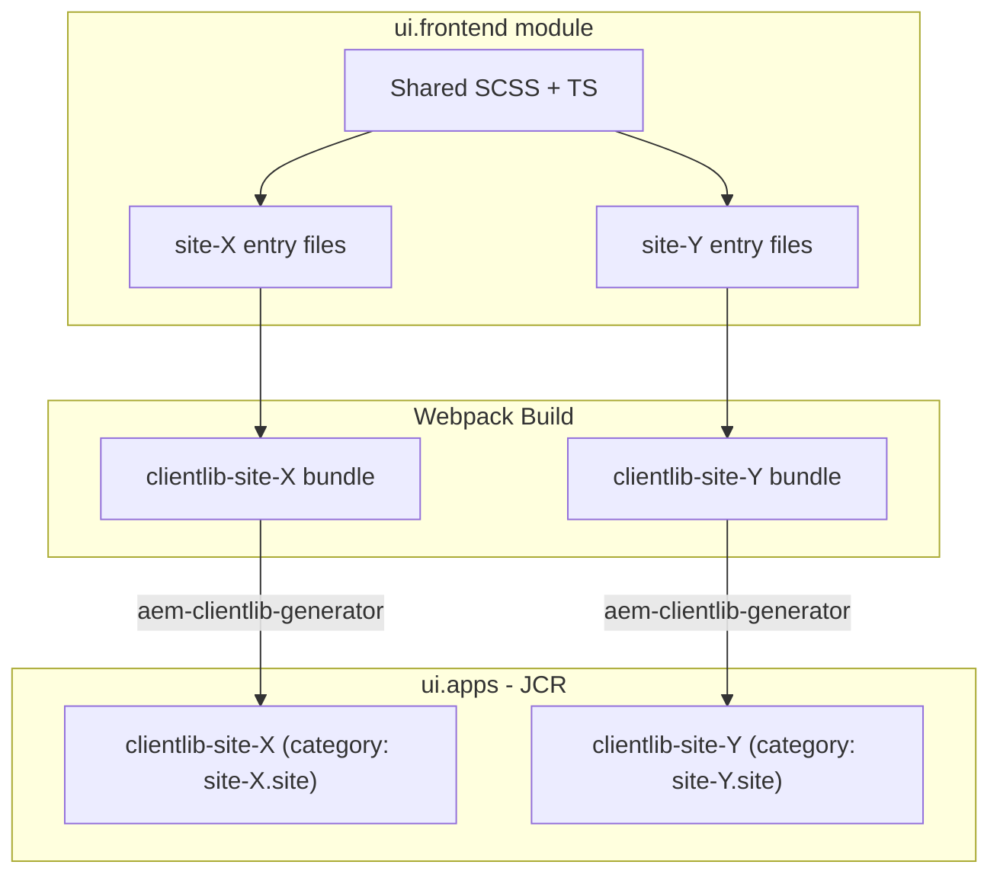

# Multi-Tenancy Theme Support for the UI Frontend Module

When an AEM project serves multiple brands, sites, or tenants from a single codebase, each tenant typically
needs its own visual identity -- colours, typography, spacing, component variants, and sometimes even
different JavaScript behaviour. This guide explains how to configure the `ui.frontend` module to generate
**separate Client Libraries per tenant** while sharing a common component codebase.

The result: one Maven build produces multiple tenant-specific clientlibs (`clientlib-site-x`,
`clientlib-site-y`, ...) that are loaded by the corresponding page templates. Backend components and
HTL templates remain shared.

:::info Prerequisites
This guide assumes familiarity with [AEM Client Libraries](../client-libraries.mdx) and basic
webpack/Node.js tooling. If you're new to clientlibs, read the clientlibs page first.
:::

## Architecture Overview



The key idea:
1. **Shared code** lives in common directories (variables, mixins, utilities, shared components)
2. **Per-tenant entry files** import the shared code plus tenant-specific overrides
3. **Webpack** produces separate bundles per tenant in `/dist`
4. **`aem-clientlib-generator`** turns each bundle into a separate AEM Client Library
5. **Page templates** reference the correct tenant clientlib via its category

## Why Multi-Tenancy?

| Approach | Pros | Cons |
|----------|------|------|
| **One clientlib for all tenants** | Simple build | Large bundle, unused CSS/JS per tenant, no visual separation |
| **Separate codebases per tenant** | Full isolation | Code duplication, maintenance nightmare |
| **Multi-tenancy (this guide)** | Shared components, small per-tenant bundles, visual isolation | Slightly more complex build config |

Common use cases:
- **Multiple brands** in one AEM instance (e.g. brand-A.com, brand-B.com)
- **Regional sites** with different visual identities (US vs. APAC)
- **Light / dark mode** as separate clientlibs
- **White-label products** where clients get customised styling
- **Microsites** that share the same components but have distinct designs

## Project Structure

A typical multi-tenant `ui.frontend` directory structure:

```text
ui.frontend/
├── clientlib.config.js          <-- aem-clientlib-generator config
├── webpack.common.js            <-- webpack shared config
├── webpack.dev.js
├── webpack.prod.js
├── package.json
└── src/main/webpack/
    ├── shared/                  <-- shared across all tenants
    │   ├── _variables.scss      <-- default design tokens
    │   ├── _mixins.scss
    │   ├── _reset.scss
    │   └── _utilities.scss
    ├── components/              <-- component styles & scripts
    │   ├── header/
    │   │   ├── _header.scss     <-- shared header base styles
    │   │   ├── site-X/
    │   │   │   └── _header.scss <-- site-X header overrides
    │   │   └── site-Y/
    │   │       └── _header.scss <-- site-Y header overrides
    │   └── teaser/
    │       ├── _teaser.scss
    │       ├── teaser.ts
    │       ├── site-X/
    │       │   └── _teaser.scss
    │       └── site-Y/
    │           └── _teaser.scss
    ├── site-X/                  <-- site-X entry files
    │   ├── main.ts
    │   └── main.scss
    ├── site-Y/                  <-- site-Y entry files
    │   ├── main.ts
    │   └── main.scss
    └── resources/               <-- static assets (fonts, images)
        ├── site-X/
        │   ├── favicon.ico
        │   └── fonts/
        └── site-Y/
            ├── favicon.ico
            └── fonts/
```

### Design token strategy

Each tenant overrides shared design tokens. The shared file defines defaults; tenants override selectively:

```scss title="src/main/webpack/shared/_variables.scss"
// Default design tokens (can be overridden per tenant)
$color-primary: #0066cc;
$color-secondary: #333333;
$color-background: #ffffff;
$color-text: #1a1a1a;

$font-family-base: 'Helvetica Neue', Arial, sans-serif;
$font-size-base: 16px;
$line-height-base: 1.5;

$spacing-unit: 8px;
$border-radius: 4px;
$max-content-width: 1200px;
```

```scss title="src/main/webpack/site-X/_variables.scss"
// Site-X brand overrides
$color-primary: #e63946;
$color-secondary: #1d3557;
$font-family-base: 'Roboto', sans-serif;
$border-radius: 8px;
```

```scss title="src/main/webpack/site-Y/_variables.scss"
// Site-Y brand overrides
$color-primary: #2a9d8f;
$color-secondary: #264653;
$font-family-base: 'Open Sans', sans-serif;
$border-radius: 0;
```

## Step-by-Step Configuration

### 1. Tenant entry files

Each tenant has a **SCSS entry** and a **TypeScript entry**. These files import the shared code
first, then the tenant-specific overrides.

```scss title="src/main/webpack/site-X/main.scss"
// 1. Tenant-specific variables (overrides shared defaults)
@import './variables';

// 2. Shared base styles (uses the overridden variables)
@import '../shared/variables';  // defaults for anything site-X didn't override
@import '../shared/reset';
@import '../shared/mixins';
@import '../shared/utilities';

// 3. Shared component styles
@import '../components/header/header';
@import '../components/teaser/teaser';

// 4. Tenant-specific component overrides
@import '../components/header/site-X/header';
@import '../components/teaser/site-X/teaser';
```

:::tip SCSS import order
Import **tenant variables first**, then shared code. This way, the shared stylesheets use the
tenant's overridden `$color-primary` etc. If a tenant doesn't override a variable, the shared
default applies.
:::

```typescript title="src/main/webpack/site-X/main.ts"
// Import stylesheets (webpack processes SCSS via loaders)
import './main.scss';

// Shared TypeScript components
import '../components/header/header';
import '../components/teaser/teaser';

// Tenant-specific TypeScript (optional)
import '../components/teaser/site-X/teaser';
```

### 2. Webpack configuration

Modify `webpack.common.js` to produce separate bundles per tenant. Three areas need changes:
**entry points**, **output filenames**, and **static asset copying**.

```javascript title="ui.frontend/webpack.common.js"
const path = require('path');
const { CleanWebpackPlugin } = require('clean-webpack-plugin');
const MiniCssExtractPlugin = require('mini-css-extract-plugin');
const CopyWebpackPlugin = require('copy-webpack-plugin');

// Define all tenants
const SITES = ['site-X', 'site-Y'];

// === 1. Entry points: one per tenant ===
const entry = {};
SITES.forEach(site => {
    entry[site] = path.resolve(__dirname, `src/main/webpack/${site}/main.ts`);
});

module.exports = {
    entry,

    // === 2. Output: separate directories per tenant ===
    output: {
        filename: (chunkData) => {
            return chunkData.chunk.name === 'dependencies'
                ? 'clientlib-dependencies/[name].js'
                : `clientlib-${chunkData.chunk.name}/${chunkData.chunk.name}.js`;
        },
        path: path.resolve(__dirname, 'dist'),
    },

    module: {
        rules: [
            {
                test: /\.tsx?$/,
                use: 'ts-loader',
                exclude: /node_modules/,
            },
            {
                test: /\.scss$/,
                use: [
                    MiniCssExtractPlugin.loader,
                    'css-loader',
                    'postcss-loader',
                    'sass-loader',
                ],
            },
        ],
    },

    plugins: [
        new CleanWebpackPlugin(),

        // Extract CSS into separate files per tenant
        new MiniCssExtractPlugin({
            filename: (chunkData) => {
                return `clientlib-${chunkData.chunk.name}/${chunkData.chunk.name}.css`;
            },
        }),

        // === 3. Copy static assets per tenant ===
        new CopyWebpackPlugin({
            patterns: SITES.map(site => ({
                from: path.resolve(__dirname, `src/main/webpack/resources/${site}`),
                to: `clientlib-${site}/resources`,
                noErrorOnMissing: true,
            })),
        }),
    ],

    resolve: {
        extensions: ['.ts', '.tsx', '.js'],
    },
};
```

After running `npm run build`, the `/dist` directory looks like:

```text
dist/
├── clientlib-site-X/
│   ├── site-X.js
│   ├── site-X.css
│   └── resources/
│       ├── favicon.ico
│       └── fonts/
└── clientlib-site-Y/
    ├── site-Y.js
    ├── site-Y.css
    └── resources/
        ├── favicon.ico
        └── fonts/
```

### 3. Client Library generation

The `aem-clientlib-generator` plugin reads the webpack output and creates AEM Client Library
folder structures that are copied to `ui.apps`.

```javascript title="ui.frontend/clientlib.config.js"
const path = require('path');

// Base configuration shared by all clientlibs
const libsBaseConfig = {
    allowProxy: true,
    serializationFormat: 'xml',
    cssProcessor: ['default:none', 'min:none'],
    jsProcessor: ['default:none', 'min:none'],
};

// Define tenants
const SITES = ['site-X', 'site-Y'];

// Generate a clientlib config for each tenant
const CLIENT_LIBS = SITES.map(siteName => ({
    ...libsBaseConfig,
    name: `clientlib-${siteName}`,
    categories: [`${siteName}.site`],
    dependencies: ['myproject.dependencies'],  // shared vendor dependencies
    assets: {
        js: {
            cwd: `clientlib-${siteName}`,
            files: ['**/*.js'],
            flatten: false,
        },
        css: {
            cwd: `clientlib-${siteName}`,
            files: ['**/*.css'],
            flatten: false,
        },
        resources: {
            cwd: `clientlib-${siteName}`,
            files: ['**/*.*'],
            flatten: true,   // flatten resources for consistent sub-paths
            ignore: ['**/*.js', '**/*.css'],
        },
    },
}));

// Shared dependencies clientlib (vendor libraries like jQuery, etc.)
CLIENT_LIBS.push({
    ...libsBaseConfig,
    name: 'clientlib-dependencies',
    categories: ['myproject.dependencies'],
    assets: {
        js: {
            cwd: 'clientlib-dependencies',
            files: ['**/*.js'],
            flatten: false,
        },
    },
});

module.exports = {
    context: path.resolve(__dirname, 'dist'),
    clientLibRoot: path.resolve(__dirname, '..', 'ui.apps',
        'src', 'main', 'content', 'jcr_root', 'apps', 'myproject', 'clientlibs'),
    libs: CLIENT_LIBS,
};
```

:::info Flatten resources
Setting `flatten: true` on the resources section copies all static files (fonts, images, favicons)
into the clientlib's root `resources/` folder. This ensures that relative paths like
`url('../resources/fonts/roboto.woff2')` work the same across all tenant clientlibs.
:::

### 4. Loading tenant clientlibs in page templates

Each tenant's page template references its own clientlib category. In your page component's
`customheaderlibs.html` and `customfooterlibs.html`:

```html title="ui.apps/.../page/customheaderlibs.html"
<!--/* Load tenant-specific CSS in the <head> */-->
<sly data-sly-use.clientLib="/libs/granite/sightly/templates/clientlib.html"
     data-sly-call="${clientLib.css @ categories='site-X.site'}"/>
```

```html title="ui.apps/.../page/customfooterlibs.html"
<!--/* Load tenant-specific JS before </body> */-->
<sly data-sly-use.clientLib="/libs/granite/sightly/templates/clientlib.html"
     data-sly-call="${clientLib.js @ categories='site-X.site'}"/>
```

For a truly dynamic approach, store the clientlib category in the **editable template policy** so
that template authors can select the theme without code changes:

```html title="ui.apps/.../page/customheaderlibs.html (dynamic)"
<sly data-sly-use.clientLib="/libs/granite/sightly/templates/clientlib.html"
     data-sly-use.model="com.myproject.core.models.PageModel"/>

<!--/* Read the clientlib category from the template policy */-->
<sly data-sly-call="${clientLib.css @ categories=model.themeCategory}"/>
```

```java title="core/.../models/PageModel.java"
@Model(adaptables = SlingHttpServletRequest.class,
       defaultInjectionStrategy = DefaultInjectionStrategy.OPTIONAL)
public class PageModel {

    @ScriptVariable
    private Style currentStyle;

    /**
     * Returns the clientlib category from the template policy.
     * Authors configure this in the template editor's page policy.
     */
    public String getThemeCategory() {
        if (currentStyle != null) {
            return currentStyle.get("themeClientLibCategory", "site-X.site");
        }
        return "site-X.site";
    }
}
```

## Adding a New Tenant

Adding a third tenant (`site-Z`) requires only four steps:

1. **Add to the `SITES` array** in both `webpack.common.js` and `clientlib.config.js`:
   ```javascript
   const SITES = ['site-X', 'site-Y', 'site-Z'];
   ```

2. **Create entry files** at `src/main/webpack/site-Z/main.ts` and `main.scss`

3. **Add tenant-specific overrides** in `src/main/webpack/components/*/site-Z/` (only for components
   that differ from the shared base)

4. **Create or update the page template** to reference `site-Z.site` as its clientlib category

No changes to backend code, components, or HTL templates are needed.

## Integration with the AEM Style System

The multi-tenancy approach works well with AEM's Style System. Shared components define style
variations via BEM classes, and tenant-specific stylesheets provide the visual implementation:

```scss title="Shared component: src/main/webpack/components/teaser/_teaser.scss"
// Base teaser styles (shared across all tenants)
.cmp-teaser {
    padding: $spacing-unit * 3;
    border-radius: $border-radius;

    &__title {
        font-family: $font-family-base;
        font-size: 1.5rem;
        color: $color-text;
    }

    &__description {
        line-height: $line-height-base;
    }

    // Style System variant: "featured"
    &--featured {
        border-left: 4px solid $color-primary;
    }

    // Style System variant: "compact"
    &--compact {
        padding: $spacing-unit;

        .cmp-teaser__title {
            font-size: 1.125rem;
        }
    }
}
```

```scss title="Site-X override: src/main/webpack/components/teaser/site-X/_teaser.scss"
// Site-X teaser customisations
.cmp-teaser {
    box-shadow: 0 2px 8px rgba(0, 0, 0, 0.1);

    &--featured {
        background: linear-gradient(135deg, lighten($color-primary, 40%), #fff);
    }
}
```

The Style System classes (e.g. `cmp-teaser--featured`) are shared across tenants, but each
tenant's stylesheet provides its own visual interpretation. Authors don't need to know which
tenant they're on -- they just pick "Featured" in the Style System dropdown.

## Using Vite Instead of Webpack

For new projects, [Vite](https://vitejs.dev/) is a faster alternative to webpack. The same
multi-tenancy concept applies -- you just configure it differently:

```javascript title="ui.frontend/vite.config.js"
import { defineConfig } from 'vite';
import path from 'path';

const SITES = ['site-X', 'site-Y'];

// Build separate entry points per tenant
const input = {};
SITES.forEach(site => {
    input[site] = path.resolve(__dirname, `src/main/webpack/${site}/main.ts`);
});

export default defineConfig({
    build: {
        rollupOptions: {
            input,
            output: {
                entryFileNames: `clientlib-[name]/[name].js`,
                assetFileNames: (assetInfo) => {
                    if (assetInfo.name?.endsWith('.css')) {
                        return `clientlib-[name]/[name].css`;
                    }
                    return `clientlib-[name]/resources/[name][extname]`;
                },
            },
        },
        outDir: 'dist',
    },
    css: {
        preprocessorOptions: {
            scss: {
                additionalData: `@import "src/main/webpack/shared/variables";`,
            },
        },
    },
});
```

The `aem-clientlib-generator` configuration remains the same regardless of whether you use
webpack or Vite -- it only cares about the `/dist` output structure.

## Common Shared Dependencies

To avoid bundling large libraries (jQuery, polyfills, vendor code) into every tenant bundle, extract
them into a shared `clientlib-dependencies`:

```javascript title="webpack.common.js (optimization section)"
module.exports = {
    // ...existing config...

    optimization: {
        splitChunks: {
            cacheGroups: {
                dependencies: {
                    test: /[\\/]node_modules[\\/]/,
                    name: 'dependencies',
                    chunks: 'all',
                    // Vendor code goes to clientlib-dependencies
                },
            },
        },
    },
};
```

In the page template, load the dependencies clientlib before the tenant clientlib:

```html
<sly data-sly-call="${clientLib.js @ categories='myproject.dependencies'}"/>
<sly data-sly-call="${clientLib.js @ categories='site-X.site'}"/>
```

Or use the `dependencies` property in the tenant clientlib definition so AEM loads them automatically:

```javascript
// In clientlib.config.js
categories: ['site-X.site'],
dependencies: ['myproject.dependencies'],
```

## Best Practices and Common Pitfalls

### Keep tenant overrides minimal

Tenant stylesheets should only contain **differences** from the shared base. If you find yourself
duplicating large blocks of CSS across tenants, extract them into the shared layer instead.

### Use design tokens consistently

All colours, fonts, spacings, and other visual properties should come from SCSS variables. This makes
it easy to re-theme a site by changing a handful of variables rather than hunting through hundreds
of CSS rules.

### Avoid tenant-specific HTML

If a component needs fundamentally different markup for different tenants, that's a sign it should be
two separate components rather than two themes of one component. Multi-tenancy works best when the
**HTML and logic are shared** and only the **visual presentation differs**.

### Watch the bundle size

After adding several tenants, monitor the CSS/JS bundle sizes. Use webpack-bundle-analyzer or
Vite's built-in analysis to ensure you're not accidentally bundling the same code into multiple
tenant bundles:

```bash
# Webpack
npx webpack --profile --json > stats.json
npx webpack-bundle-analyzer stats.json

# Vite
npx vite build --report
```

### Test all tenants

When making changes to shared components, verify that all tenant builds still produce correct output.
Add a CI step that builds all tenants and checks for CSS/JS errors:

```bash
npm run build
# Verify all expected clientlib directories exist
for site in site-X site-Y; do
    test -d "dist/clientlib-${site}" || (echo "Missing ${site}" && exit 1)
done
```

### Don't mix tenant styles at runtime

Ensure that only **one** tenant clientlib is loaded per page. Loading multiple tenant clientlibs
simultaneously causes CSS conflicts and unpredictable styling. Use page template policies to
enforce the correct category.

### AEMaaCS considerations

On AEM as a Cloud Service, the `ui.frontend` build runs during the Cloud Manager pipeline. The same
multi-tenancy configuration works without changes. Ensure that:

- All npm dependencies are listed in `package.json` (the pipeline runs `npm install`)
- The `aem-clientlib-generator` is configured as a build step in the `package.json` scripts
- Static assets (fonts) use relative paths that work with the clientlib `allowProxy` mechanism

## See also

- [Architecture](../architecture.mdx)
- [Custom Component Guide](../custom-component.mdx)
- [Client Libraries](../client-libraries.mdx) -- full clientlib reference
- [Components Overview](../components/overview.mdx)
- [Core Components](../components/core-components.mdx)
- [Touch UI](./touch-ui.mdx)
- [Coral UI](./coral-ui.mdx)
- [Extending the Responsive Grid](./extending-responsive-grid.md)
