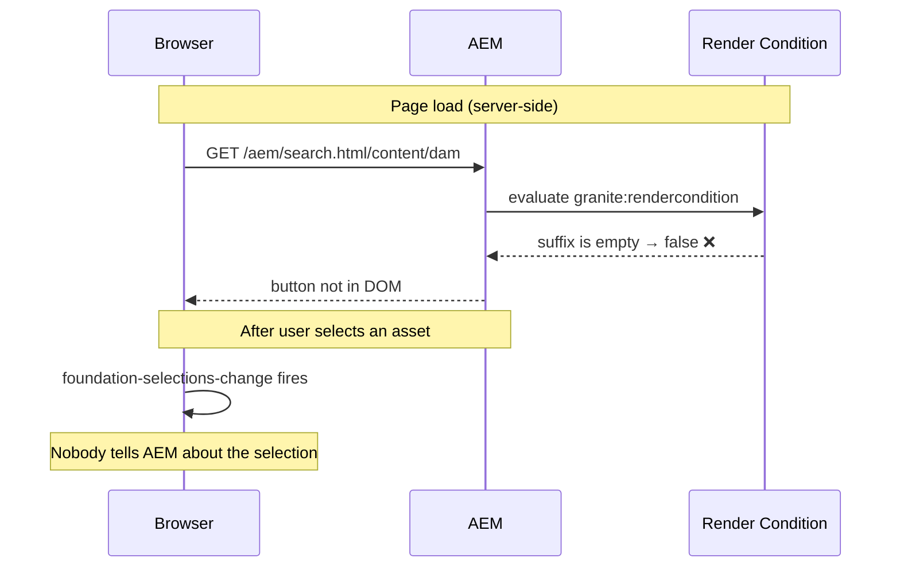
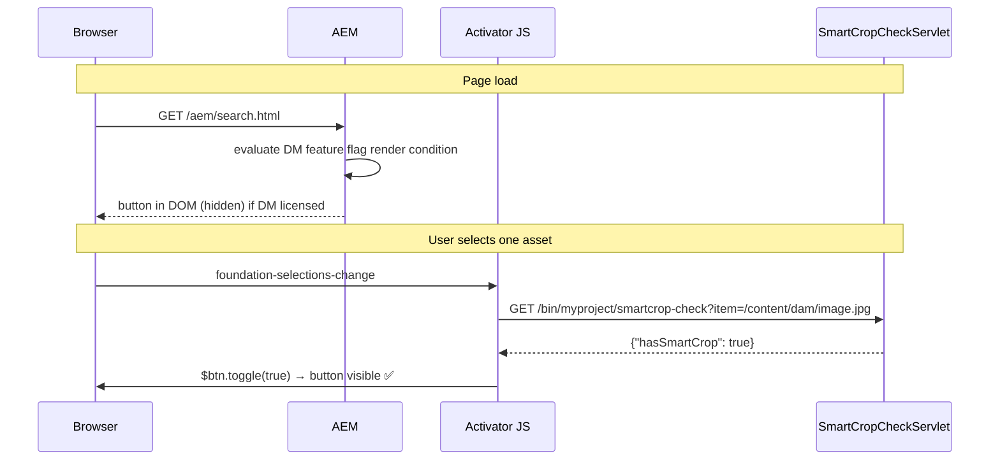

# Omnisearch Selection Bar Actions

The AEM Assets omnisearch (`/aem/search.html`) shows a selection bar when one or more assets are
selected. Adding a custom action button to that bar - and controlling its visibility per-asset - is
more involved than it looks, because the standard render condition mechanism fundamentally cannot
work there.

This page explains why, and how to implement a two-layer solution that works correctly.

---

## The Problem: Render Conditions in Selection Bars

Render conditions are evaluated **server-side at page load**. They answer the question: "should this
element exist in the DOM?" - once, before the user has clicked anything.

In the asset details page (`/aem/assetdetails.html/content/dam/...`), this works fine: the page is
loaded for a specific asset, so `requestPathInfo.suffix` contains the asset path and the render
condition can inspect it.

In the omnisearch page, the selection bar is rendered as part of the **page shell** - before any
search result is displayed, let alone selected. At that point there is no asset path in the request.
Any render condition that tries to read `requestPathInfo.suffix` or look up per-asset data will find
nothing and return `false`.



This means that Adobe's own `SmartCropRenderConditionServlet` - which works perfectly in asset
details - **always returns false** in the omnisearch context. Copying the render condition node
verbatim will never show the button.

### Why `SmartCropRenderConditionServlet` specifically fails

`SmartCropRenderConditionServlet` is registered purely via OSGi `@Component` properties:

```java
"sling.servlet.resourceTypes=dam/gui/components/s7dam/smartcroprenditions/rendercondition",
"sling.servlet.methods=GET"
```

It injects two services: `AssetSmartCropStore` (checks if an asset has smart crop data) and
`S7damImageProcessingProfileService` (checks assigned processing profiles). Both require an asset
resource to operate on.

It also cannot be called directly via HTTP. The path
`/libs/dam/gui/components/s7dam/smartcroprenditions/rendercondition.html` returns 404 because
resource-type-bound servlets only handle requests to resources that **declare** that resource type -
not the component folder itself.

---

## The Solution: Two Layers

The key insight is to split the problem in two:

| Layer | When | What it checks | How |
|-------|------|----------------|-----|
| **Server-side render condition** | Page load | Is DM licensed on this instance? | Feature flag check |
| **Client-side activator** | Every selection change | Does this specific asset have smart crops? | JS calls a custom servlet |

The render condition acts as a system-level gate: if Dynamic Media is not enabled at all, the button
is never in the DOM. When DM is enabled, the button exists but is hidden. The JavaScript activator
then decides, asset-by-asset, whether to show it.



---

## Implementation

### 1. Overlay node - add the action

Create the action node under `/apps/granite/omnisearch/content/metadata/asset/actions/selection/`.
The Sling Resource Merger combines your `/apps/` children with the existing `/libs/` children at
runtime, so you only need to add the new node - not replace the whole selection node.

```xml title="ui.apps/.../apps/granite/omnisearch/content/metadata/asset/actions/selection/smartcrop/.content.xml"
<?xml version="1.0" encoding="UTF-8"?>
<jcr:root xmlns:jcr="http://www.jcp.org/jcr/1.0"
          xmlns:nt="http://www.jcp.org/jcr/nt/1.0"
          xmlns:sling="http://sling.apache.org/jcr/sling/1.0"
          xmlns:granite="http://www.adobe.com/jcr/granite/1.0"
    jcr:primaryType="nt:unstructured"
    granite:class="cq-damadmin-admin-checkout-restricted cq-damadmin-admin-actions-smartcrop-activator"
    granite:rel="aem-assets-admin-actions-edit-activator"
    activeSelectionCount="single"
    icon="cropLightning"
    sling:resourceType="granite/ui/components/coral/foundation/collection/action"
    target=".cq-damadmin-admin-childpages"
    text="Smart Crop"
    variant="actionBar">
    <data
        jcr:primaryType="nt:unstructured"
        href="/libs/dam/gui/content/s7dam/smartcrop/smartcropedit.html"
        pageheading="AEM Assets | Smart Crop Editor"
        type="asset"/>
    <granite:rendercondition
        jcr:primaryType="nt:unstructured"
        sling:resourceType="granite/ui/components/foundation/renderconditions/or">
        <condition1
            jcr:primaryType="nt:unstructured"
            feature="com.adobe.dam.asset.dynamicmedia.feature.flag"
            sling:resourceType="granite/ui/components/foundation/renderconditions/feature"/>
        <condition2
            jcr:primaryType="nt:unstructured"
            feature="com.adobe.dam.asset.scene7.feature.flag"
            sling:resourceType="granite/ui/components/foundation/renderconditions/feature"/>
    </granite:rendercondition>
</jcr:root>
```

The `granite:rendercondition` here is the DM feature flag check - it only asks "is DM licensed on
this AEM instance", not "does this asset have smart crops". That per-asset question is handled
client-side.

You also need to create the intermediate path nodes. FileVault requires them:

```xml title="apps/granite/.content.xml  (and each intermediate directory)"
<?xml version="1.0" encoding="UTF-8"?>
<jcr:root xmlns:jcr="http://www.jcp.org/jcr/1.0" xmlns:sling="http://sling.apache.org/jcr/sling/1.0"
    jcr:primaryType="sling:Folder"/>
```

The `actions` and `selection` intermediate nodes should use `nt:unstructured` to match their type
in `/libs/`:

```xml title="apps/granite/omnisearch/content/metadata/asset/actions/.content.xml"
<?xml version="1.0" encoding="UTF-8"?>
<jcr:root xmlns:jcr="http://www.jcp.org/jcr/1.0" xmlns:nt="http://www.jcp.org/jcr/nt/1.0"
    jcr:primaryType="nt:unstructured"/>
```

#### filter.xml

Use `mode="merge"` so the package does not delete any existing nodes under that path that are not
in your package:

```xml title="ui.apps/src/main/content/META-INF/vault/filter.xml"
<filter root="/apps/granite/omnisearch" mode="merge"/>
```

:::warning
Do not use a narrow filter root like `...selection/smartcrop` directly. The FileVault
`jackrabbit-filter` validator will fail with:

```
Filter root's ancestor '.../actions/selection' is not covered
by any of the specified dependencies nor a valid root.
```

The filter root must be high enough in the tree that all intermediate paths are descendants of it.
:::

---

### 2. Custom check servlet

The servlet takes an `item` query parameter, checks `AssetSmartCropStore`, and returns JSON.
`AssetSmartCropStore` is in the public AEM SDK API (`com.day.cq.dam.api.smartcrop`) so no extra BND
imports are needed.

```java title="core/.../servlets/SmartCropCheckServlet.java"
package com.myproject.core.servlets;

import com.day.cq.dam.api.Asset;
import com.day.cq.dam.api.smartcrop.AssetSmartCropStore;
import lombok.extern.slf4j.Slf4j;
import org.apache.sling.api.SlingHttpServletRequest;
import org.apache.sling.api.SlingHttpServletResponse;
import org.apache.sling.api.resource.Resource;
import org.apache.sling.api.servlets.SlingSafeMethodsServlet;
import org.jetbrains.annotations.NotNull;
import org.osgi.framework.Constants;
import org.osgi.service.component.annotations.Component;
import org.osgi.service.component.annotations.Reference;

import javax.servlet.Servlet;
import java.io.IOException;
import java.io.PrintWriter;
import java.nio.charset.StandardCharsets;

@Slf4j
@Component(
        service = Servlet.class,
        property = {
                Constants.SERVICE_DESCRIPTION + "=Smart Crop Check Servlet",
                "sling.servlet.methods=GET",
                "sling.servlet.paths=/bin/myproject/smartcrop-check",
        }
)
public class SmartCropCheckServlet extends SlingSafeMethodsServlet {

    private static final String PARAM_ITEM = "item";
    private static final String CONTENT_DAM_PREFIX = "/content/dam";
    private static final String RESPONSE_TRUE = "{\"hasSmartCrop\":true}";
    private static final String RESPONSE_FALSE = "{\"hasSmartCrop\":false}";

    @Reference
    private AssetSmartCropStore smartCropStore;

    @Override
    protected void doGet(@NotNull SlingHttpServletRequest request,
                         @NotNull SlingHttpServletResponse response) throws IOException {
        response.setContentType("application/json");
        response.setCharacterEncoding(StandardCharsets.UTF_8.name());
        PrintWriter writer = response.getWriter();

        try {
            String itemPath = request.getParameter(PARAM_ITEM);
            if (!isValidAssetPath(itemPath)) {
                writer.write(RESPONSE_FALSE);
                return;
            }

            Resource resource = request.getResourceResolver().getResource(itemPath);
            if (resource == null) {
                writer.write(RESPONSE_FALSE);
                return;
            }

            Asset asset = resource.adaptTo(Asset.class);
            if (asset == null) {
                writer.write(RESPONSE_FALSE);
                return;
            }

            boolean hasSmartCrop = !smartCropStore.getSmartCrops(asset).isEmpty()
                    || smartCropStore.hasLocalCropDefns(asset);
            writer.write(hasSmartCrop ? RESPONSE_TRUE : RESPONSE_FALSE);
        } catch (RuntimeException e) {
            log.error("Error checking smart crop status for item={}", request.getParameter(PARAM_ITEM), e);
            writer.write(RESPONSE_FALSE);
        }
    }

    private boolean isValidAssetPath(String path) {
        return path != null
                && path.startsWith(CONTENT_DAM_PREFIX)
                && !path.contains("..");
    }
}
```

`getSmartCrops(asset)` returns already-processed smart crop renditions. `hasLocalCropDefns(asset)`
returns true when a smart crop image processing profile is assigned to the asset's folder but
processing has not yet run. Together they cover both cases.

#### Unit tests

```java title="core/.../servlets/SmartCropCheckServletTest.java"
@ExtendWith({MockitoExtension.class, AemContextExtension.class})
class SmartCropCheckServletTest {

    private final AemContext context = new AemContext();

    @Mock
    private AssetSmartCropStore smartCropStore;

    private SmartCropCheckServlet servlet;

    @BeforeEach
    void setUp() {
        servlet = new SmartCropCheckServlet();
        context.registerService(AssetSmartCropStore.class, smartCropStore);
        context.registerInjectActivateService(servlet);
    }

    @Test
    void testDoGet_MissingItem_ReturnsFalse() throws IOException {
        MockSlingHttpServletResponse response = new MockSlingHttpServletResponse();
        servlet.doGet(context.request(), response);
        assertEquals("{\"hasSmartCrop\":false}", response.getOutputAsString());
    }

    @Test
    void testDoGet_InvalidPath_ReturnsFalse() throws IOException {
        context.request().addRequestParameter("item", "/etc/dam/hack");
        MockSlingHttpServletResponse response = new MockSlingHttpServletResponse();
        servlet.doGet(context.request(), response);
        assertEquals("{\"hasSmartCrop\":false}", response.getOutputAsString());
    }

    @Test
    void testDoGet_AssetHasSmartCrops_ReturnsTrue() throws IOException {
        context.create().resource("/content/dam/image.jpg");
        Asset mockAsset = mock(Asset.class);
        context.registerAdapter(Resource.class, Asset.class, mockAsset);
        when(smartCropStore.getSmartCrops(mockAsset)).thenReturn(List.of(mock(SmartCrop.class)));
        context.request().addRequestParameter("item", "/content/dam/image.jpg");
        MockSlingHttpServletResponse response = new MockSlingHttpServletResponse();
        servlet.doGet(context.request(), response);
        assertEquals("{\"hasSmartCrop\":true}", response.getOutputAsString());
    }

    @Test
    void testDoGet_SmartCropStoreThrows_ReturnsFalse() throws IOException {
        context.create().resource("/content/dam/image.jpg");
        Asset mockAsset = mock(Asset.class);
        context.registerAdapter(Resource.class, Asset.class, mockAsset);
        when(smartCropStore.getSmartCrops(mockAsset)).thenThrow(new RuntimeException("store error"));
        context.request().addRequestParameter("item", "/content/dam/image.jpg");
        MockSlingHttpServletResponse response = new MockSlingHttpServletResponse();
        servlet.doGet(context.request(), response);
        assertEquals("{\"hasSmartCrop\":false}", response.getOutputAsString());
    }
}
```

---

### 3. Client-side activator clientlib

Create a clientlib with category `cq.gui.damadmin.omnisearch.coral`. This category is explicitly
listed in the omnisearch page's clientlibs configuration
(`/libs/granite/omnisearch/content/metadata/asset.1.json`, field `clientlibs`), so it loads only on
omnisearch pages - not on the main Assets console or elsewhere.

Using `dam.gui.admin.coral` would also work but loads more broadly. The omnisearch-specific category
avoids any risk of conflicting with Adobe's existing `cq-damadmin-admin-actions-smartcrop-activator`
handler on `/assets.html`.

```xml title="ui.apps/.../clientlibs/clientlib-dam-omnisearch-smartcrop/.content.xml"
<?xml version="1.0" encoding="UTF-8"?>
<jcr:root xmlns:cq="http://www.day.com/jcr/cq/1.0" xmlns:jcr="http://www.jcp.org/jcr/1.0"
    jcr:primaryType="cq:ClientLibraryFolder"
    allowProxy="{Boolean}true"
    categories="[cq.gui.damadmin.omnisearch.coral]"
    dependencies="[dam.gui.actions.coral]"/>
```

```text title="js.txt"
#base=js
smartcrop-activator.js
```

The activator itself:

```js title="js/smartcrop-activator.js"
(function (document, $) {
    "use strict";

    var SERVLET_PATH = "/bin/myproject/smartcrop-check";
    var BTN_SEL = ".cq-damadmin-admin-actions-smartcrop-activator";

    $(document).on("foundation-selections-change", function (e) {
        var $btn = $(BTN_SEL);
        if (!$btn.length) {
            return;
        }

        var $selected = $(e.target).find(".foundation-collection-item.is-selected");
        if ($selected.length !== 1) {
            $btn.hide();
            return;
        }

        var itemPath = $selected.attr("data-foundation-collection-item-id");
        if (!itemPath) {
            $btn.hide();
            return;
        }

        $.getJSON(SERVLET_PATH, { item: itemPath })
            .done(function (data) {
                $btn.toggle(!!data.hasSmartCrop);
            })
            .fail(function () {
                $btn.hide();
            });
    });

}(document, Granite.$));
```

A few notes on the selectors:

- `foundation-selections-change` fires on the collection container (`e.target`). Scope the item
  search to `e.target` rather than `document` in case there are multiple collections on the page.
- `data-foundation-collection-item-id` is the attribute AEM puts on each collection item card/row;
  it holds the JCR path of the asset.
- The button CSS class `cq-damadmin-admin-actions-smartcrop-activator` comes from the `granite:class`
  property on the overlay node - there is no `data-granite-rel` attribute on the rendered button
  element.
- The `activeSelectionCount="single"` on the action node already hides the button for multi-select
  at the Granite UI level. The `$selected.length !== 1` guard in JS is belt-and-suspenders that also
  avoids making a servlet call in that state.

---

## How the Two Layers Interact

```
Page load
  └─ DM feature flag render condition evaluates
       DM licensed?  YES → button rendered in DOM (hidden by default)
                     NO  → button absent from DOM entirely, JS never runs

User selects 1 asset
  └─ foundation-selections-change fires
       └─ JS checks $selected.length === 1? YES
            └─ GET /bin/myproject/smartcrop-check?item=/content/dam/image.jpg
                 └─ SmartCropCheckServlet
                      getSmartCrops(asset).isEmpty() = false → {"hasSmartCrop":true}
                 └─ $btn.toggle(true) → button visible ✅

User selects 2 assets
  └─ foundation-selections-change fires
       └─ $selected.length !== 1 → $btn.hide() 🚫

User deselects all
  └─ selection bar hides (Granite UI built-in behavior)
```

The render condition handles "is this feature available at all on this instance". The JS handles
"is it relevant for the currently selected item". Neither can do the other's job.

---

## Why Not Just Use the Render Condition Servlet Directly?

It seems natural to call `SmartCropRenderConditionServlet` from the JS activator, passing the asset
path as a suffix. This does not work for two reasons:

1. **Wrong URL**: The servlet is registered for resource type
   `dam/gui/components/s7dam/smartcroprenditions/rendercondition`. Calling
   `/libs/dam/gui/components/s7dam/smartcroprenditions/rendercondition.html` returns 404 because the
   node at that path is an `nt:folder`, not a resource with that resource type. Sling resolves
   resource-type-bound servlets from the *resource's declared type*, not the component folder path.

2. **No readable response**: Even if you resolved it via a stub node with the right resource type,
   the servlet sets a request attribute (`RenderCondition.class.getName()`) - not a response body.
   The included JSP outputs nothing. You would get an empty 200 and no way to read the result.

The custom servlet approach is the correct pattern: expose the check as a dedicated endpoint that
returns structured JSON.

---

## Gotchas

**`S7damImageProcessingProfileService` is a private API.** Adobe's render condition servlet injects
this service, but it is not in the public `aem-sdk-api` jar. `AssetSmartCropStore.hasLocalCropDefns()`
covers the same use case (profile assigned to folder) and is public API.

**`nt:unstructured` in FileVault XML values doesn't need the `nt` namespace - but include it
anyway.** The `nt:` prefix in `jcr:primaryType="nt:unstructured"` is an attribute *value*, not an
XML element or attribute name, so technically no namespace declaration is required by the XML spec.
However, FileVault tooling and XML validators expect it, and its absence is confusing.

**The rendered button has no `data-granite-rel` attribute.** The `granite:rel` property on the JCR
node maps to Granite UI's quick-action registration mechanism, not a `data-` attribute on the
rendered `<button>`. Target the button by its `granite:class` CSS class instead.

---

## See also

- [Render Conditions](./render-conditions.mdx) - how Granite UI render conditions work
- [Overlays](./overlays.mdx) - overlaying and extending existing Granite UI components
- [Client Libraries](../client-libraries.mdx) - clientlib categories, loading, and proxy serving
- [Servlets](../backend/servlets.mdx) - Sling servlet registration patterns
