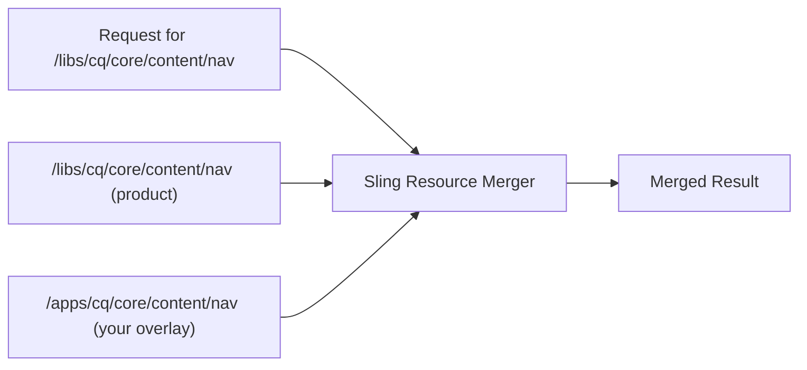
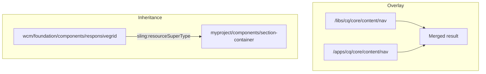

# Overlays

Overlays (powered by the **Sling Resource Merger**) are AEM's mechanism for customising or extending
the product UI **without modifying** the original files under `/libs`. By recreating a file with the
same path under `/apps`, Sling merges your version with the original, letting you add, modify, hide,
or replace individual nodes and properties.

This is how you customise the AEM Touch UI -- navigation items, console columns, dialog fields,
toolbar actions, and more.



## How the Sling Resource Merger Works

The Sling Resource Merger is active by default in AEM. When a resource is requested, Sling checks
both `/apps` and `/libs` (in that order) and **merges** them:

| Scenario | Behaviour |
|----------|----------|
| Node exists only in `/libs` | Used as-is (product default) |
| Node exists only in `/apps` | Added to the merged result |
| Node exists in both `/libs` and `/apps` | `/apps` version wins (properties merged, `/apps` takes precedence) |
| Node in `/apps` has `sling:hideResource=true` | Node is hidden from the merged result |
| Node in `/apps` has `sling:hideChildren` | Specified child nodes are hidden |
| Node in `/apps` has `sling:orderBefore` | Controls the order of the node relative to siblings |

### Merger properties reference

| Property | Type | Purpose |
|----------|------|---------|
| `sling:hideResource` | `Boolean` | Hides this node entirely from the merged result |
| `sling:hideChildren` | `String[]` | Hides specific child nodes by name (e.g., `[child1, child2]`) |
| `sling:hideProperties` | `String[]` | Hides specific properties from the merged result |
| `sling:orderBefore` | `String` | Places this node before the named sibling in the merge order |

---

## Creating an Overlay

### Via CRXDE Lite

1. Navigate to the node you want to overlay in CRXDE Lite (e.g., `/libs/cq/core/content/nav`)
2. Right-click the node and select **Overlay Node**
3. Confirm the target path (`/apps/cq/core/content/nav`)
4. CRXDE creates the matching structure under `/apps`
5. Modify the overlay as needed

### Via your project code

For deployment via your Maven project, recreate the same directory structure under `ui.apps`:

```text
ui.apps/src/main/content/jcr_root/
└── apps/
    └── cq/
        └── core/
            └── content/
                └── nav/
                    └── .content.xml    ← Your overlay
```

Add the path to your `filter.xml`:

```xml title="ui.apps/src/main/content/META-INF/vault/filter.xml"
<filter root="/apps/cq/core/content/nav" mode="merge"/>
```

:::warning
Always use `mode="merge"` in your filter for overlays. Using the default `mode="replace"` would
delete all product nodes not present in your overlay, potentially breaking the UI.
:::

---

## Practical Examples

### Hide main navigation items

Hide unwanted items from the AEM homepage (`http://localhost:4502/aem/start.html`):

```xml title="ui.apps/.../apps/cq/core/content/nav/.content.xml"
<?xml version="1.0" encoding="UTF-8"?>
<jcr:root xmlns:jcr="http://www.jcp.org/jcr/1.0"
          xmlns:nt="http://www.jcp.org/jcr/nt/1.0"
          xmlns:sling="http://sling.apache.org/jcr/sling/1.0"
    jcr:primaryType="nt:unstructured"
    id="root">
    <projects jcr:primaryType="nt:unstructured"
        sling:hideResource="{Boolean}true"/>
    <screens jcr:primaryType="nt:unstructured"
        sling:hideResource="{Boolean}true"/>
    <personalization jcr:primaryType="nt:unstructured"
        sling:hideResource="{Boolean}true"/>
    <commerce jcr:primaryType="nt:unstructured"
        sling:hideResource="{Boolean}true"/>
    <communities jcr:primaryType="nt:unstructured"
        sling:hideResource="{Boolean}true"/>
</jcr:root>
```

To find the node names of navigation items, inspect `/libs/cq/core/content/nav` in CRXDE.

### Add a custom navigation button

Add a "HelpDesk" link to the AEM homepage navigation:

```xml title="ui.apps/.../apps/cq/core/content/nav/.content.xml"
<?xml version="1.0" encoding="UTF-8"?>
<jcr:root xmlns:jcr="http://www.jcp.org/jcr/1.0" xmlns:nt="http://www.jcp.org/jcr/nt/1.0"
    jcr:primaryType="nt:unstructured">
    <helpdesk
        jcr:primaryType="nt:unstructured"
        jcr:title="HelpDesk"
        href="https://support.mycompany.com"
        icon="callCenter"
        order="{Long}1600"
        target="_blank"/>
</jcr:root>
```


Adjust the `order` value to position the button (lower numbers appear first). Inspect
`/libs/cq/core/content/nav` to see the order values of existing items.

### Customise Sites console columns

Add or remove columns in the Sites console list view:

```xml title="ui.apps/.../apps/cq/core/content/sites/jcr:content/views/list/columns/.content.xml"
<?xml version="1.0" encoding="UTF-8"?>
<jcr:root xmlns:jcr="http://www.jcp.org/jcr/1.0"
          xmlns:nt="http://www.jcp.org/jcr/nt/1.0"
          xmlns:sling="http://sling.apache.org/jcr/sling/1.0"
    jcr:primaryType="nt:unstructured">
    <!-- Hide the "Published" column -->
    <published jcr:primaryType="nt:unstructured"
               sling:hideResource="{Boolean}true"/>
    <!-- Add a custom column -->
    <template jcr:primaryType="nt:unstructured"
              jcr:title="Template"
              sortable="{Boolean}true"
              sling:orderBefore="published"/>
</jcr:root>
```

### Overlay a dialog field

Change the default value or behaviour of a product dialog field. For example, modify the Core
Component Image dialog to change a field label:

```xml title="ui.apps/.../apps/core/wcm/components/image/v3/image/_cq_dialog/.content.xml (partial)"
<?xml version="1.0" encoding="UTF-8"?>
<jcr:root xmlns:jcr="http://www.jcp.org/jcr/1.0"
          xmlns:nt="http://www.jcp.org/jcr/nt/1.0"
    jcr:primaryType="nt:unstructured">
    <content jcr:primaryType="nt:unstructured">
        <items jcr:primaryType="nt:unstructured">
            <tabs jcr:primaryType="nt:unstructured">
                <items jcr:primaryType="nt:unstructured">
                    <properties jcr:primaryType="nt:unstructured">
                        <items jcr:primaryType="nt:unstructured">
                            <!-- Only override the specific field you need to change -->
                            <alt jcr:primaryType="nt:unstructured"
                                 fieldLabel="Accessibility Text (required)"
                                 required="{Boolean}true"/>
                        </items>
                    </properties>
                </items>
            </tabs>
        </items>
    </content>
</jcr:root>
```

:::tip
When overlaying dialogs, you only need to include the nodes on the **path** to the field you want
to change. The Sling Resource Merger merges your changes with the original dialog. You do not need
to copy the entire dialog XML.
:::

### Hide dialog fields with `sling:hideChildren`

Remove specific fields from an inherited or overlaid dialog without replacing the entire node:

```xml
<items jcr:primaryType="nt:unstructured"
       sling:hideChildren="[decorative,linkURL]">
    <!-- The "decorative" and "linkURL" fields from /libs will be hidden -->
</items>
```

### Override page properties tabs

Add a custom tab to the page properties dialog:

```xml title="ui.apps/.../apps/myproject/components/page/tabs/socialmedia/.content.xml"
<?xml version="1.0" encoding="UTF-8"?>
<jcr:root xmlns:jcr="http://www.jcp.org/jcr/1.0"
          xmlns:nt="http://www.jcp.org/jcr/nt/1.0"
          xmlns:sling="http://sling.apache.org/jcr/sling/1.0"
    jcr:primaryType="nt:unstructured"
    jcr:title="Social Media"
    sling:resourceType="granite/ui/components/coral/foundation/container"
    sling:orderBefore="cloudservices">
    <items jcr:primaryType="nt:unstructured">
        <ogTitle jcr:primaryType="nt:unstructured"
                 sling:resourceType="granite/ui/components/coral/foundation/form/textfield"
                 fieldLabel="OG Title"
                 name="./ogTitle"/>
        <ogDescription jcr:primaryType="nt:unstructured"
                       sling:resourceType="granite/ui/components/coral/foundation/form/textarea"
                       fieldLabel="OG Description"
                       name="./ogDescription"/>
        <ogImage jcr:primaryType="nt:unstructured"
                 sling:resourceType="granite/ui/components/coral/foundation/form/pathfield"
                 fieldLabel="OG Image"
                 rootPath="/content/dam"
                 name="./ogImage"/>
    </items>
</jcr:root>
```

---

## Toolbar Action Customisation

The AEM page editor toolbar provides actions for each editable component (Edit, Configure, Copy,
Delete, etc.). You can customise these actions via client-side JavaScript.

Available actions can be inspected in the browser console:

```javascript
// List all available toolbar actions
Object.keys(Granite.author.EditorFrame.editableToolbar.config.actions);
```


### Disable the Edit Dialog button for a specific component

Hide the "Configure" (wrench) button for a specific component type:

```javascript title="ui.apps/.../clientlibs/clientlib-authoring/js/disableComponentEditing.js"
(function($document, author) {
    'use strict';

    $document.on('cq-layer-activated', function(ev) {
        if (ev.layer === 'Edit') {
            var originalCondition = author.EditorFrame.editableToolbar.config.actions.CONFIGURE.condition;

            author.EditorFrame.editableToolbar.config.actions.CONFIGURE.condition = function(editable) {
                // Hide the configure button for this specific component
                if (editable &&
                    editable.config &&
                    editable.config.dialog &&
                    editable.config.dialog === '/apps/myproject/components/abstractcomponent/cq:dialog') {
                    return false;
                }
                // Fall back to the original condition for all other components
                return originalCondition.call(this, editable);
            };
        }
    });

})($(document), Granite.author);
```

### Disable the "Convert to Building Block" button

```javascript title="ui.apps/.../clientlibs/clientlib-authoring/js/hideBuildingBlocks.js"
(function($document, author) {
    'use strict';

    $document.on('cq-layer-activated', function(ev) {
        if (ev.layer === 'Edit') {
            author.EditorFrame.editableToolbar.config.actions.BBCONVERT.condition = function() {
                return false;
            };
        }
    });

})($(document), Granite.author);
```

### Add a custom toolbar action

```javascript title="ui.apps/.../clientlibs/clientlib-authoring/js/customToolbarAction.js"
(function($document, author) {
    'use strict';

    $document.on('cq-layer-activated', function(ev) {
        if (ev.layer === 'Edit') {
            // Add a custom "Analytics" action to the toolbar
            author.EditorFrame.editableToolbar.config.actions.ANALYTICS = {
                icon: 'graphBarVertical',
                text: 'View Analytics',
                handler: function(editable) {
                    var path = editable.path;
                    window.open('/mnt/overlay/dam/gui/content/assets/analysisreport.html?path=' + path, '_blank');
                },
                condition: function(editable) {
                    // Only show for page components
                    return editable.type === 'wcm/foundation/components/responsivegrid';
                }
            };
        }
    });

})($(document), Granite.author);
```

### Clientlib for toolbar customisations

All toolbar JavaScript should be loaded via a clientlib with category `cq.authoring.dialog.all` or
`cq.authoring.editor`:

```xml title="ui.apps/.../clientlibs/clientlib-authoring/.content.xml"
<?xml version="1.0" encoding="UTF-8"?>
<jcr:root xmlns:cq="http://www.day.com/jcr/cq/1.0"
          xmlns:jcr="http://www.jcp.org/jcr/1.0"
    jcr:primaryType="cq:ClientLibraryFolder"
    categories="[cq.authoring.dialog.all]"
    allowProxy="{Boolean}true"/>
```

```text title="js.txt"
#base=js
disableComponentEditing.js
hideBuildingBlocks.js
customToolbarAction.js
```

---

## Audio Asset Finder Controller

By default, the AEM Assets side panel doesn't include an audio file filter. You can add one by
registering a custom asset controller via a clientlib (preferred) rather than overlaying the product
JS files.


### Creating the audio controller

The product controllers live at `/libs/cq/gui/components/authoring/editors/clientlibs/core/js/assetController`.
Copy the pattern from `videoController.js` and change the `name` and `mimeType`:

```javascript title="ui.apps/.../clientlibs/clientlib-sidepanel/js/audioController.js"
(function($, ns, channel, window, undefined) {
    'use strict';

    var self = {},
        name = 'Audio';

    self.searchRoot = '/content/dam';
    self.viewInAdminRoot = '/assetdetails.html{+item}';

    var searchPath = self.searchRoot,
        imageServlet = '/bin/wcm/contentfinder/asset/view.html',
        itemResourceType = 'cq/gui/components/authoring/assetfinder/asset';

    self.setUp = function() {};
    self.tearDown = function() {};

    self.loadAssets = function(query, lowerLimit, upperLimit) {
        var param = {
            '_dc': new Date().getTime(),
            'query': query.concat('order:"-jcr:content/jcr:lastModified" '),
            'mimeType': 'audio',
            'itemResourceType': itemResourceType,
            'limit': lowerLimit + '..' + upperLimit,
            '_charset_': 'utf-8'
        };

        return $.ajax({
            type: 'GET',
            dataType: 'html',
            url: Granite.HTTP.externalize(imageServlet) + searchPath,
            data: param
        });
    };

    self.setServlet = function(servlet) { imageServlet = servlet; };
    self.setSearchPath = function(path) { searchPath = path; };
    self.setItemResourceType = function(rt) { itemResourceType = rt; };
    self.resetSearchPath = function() { searchPath = self.searchRoot; };

    // Register as an asset finder tab
    ns.ui.assetFinder.register(name, self);

}(jQuery, Granite.author, jQuery(document), this));
```

### Clientlib setup

```xml title="ui.apps/.../clientlibs/clientlib-sidepanel/.content.xml"
<?xml version="1.0" encoding="UTF-8"?>
<jcr:root xmlns:cq="http://www.day.com/jcr/cq/1.0"
          xmlns:jcr="http://www.jcp.org/jcr/1.0"
    jcr:primaryType="cq:ClientLibraryFolder"
    categories="[cq.authoring.dialog.all]"
    allowProxy="{Boolean}true"/>
```

```text title="js.txt"
#base=js
audioController.js
```

After deployment, a new "Audio" option appears in the asset finder dropdown.

### Enabling drag and drop for audio assets

Configure `_cq_editConfig.xml` to accept audio MIME types on your component:

```xml title="ui.apps/.../components/mycomponent/_cq_editConfig.xml"
<?xml version="1.0" encoding="UTF-8"?>
<jcr:root xmlns:sling="http://sling.apache.org/jcr/sling/1.0"
          xmlns:cq="http://www.day.com/jcr/cq/1.0"
          xmlns:jcr="http://www.jcp.org/jcr/1.0"
          xmlns:nt="http://www.jcp.org/jcr/nt/1.0"
    jcr:primaryType="cq:EditConfig">
    <cq:dropTargets jcr:primaryType="nt:unstructured">
        <file
            jcr:primaryType="cq:DropTargetConfig"
            accept="[application/pdf,audio/.*,video/.*,application/zip]"
            groups="[media]"
            propertyName="./fileReference">
            <parameters
                jcr:primaryType="nt:unstructured"
                sling:resourceType="myproject/components/mycomponent"/>
        </file>
    </cq:dropTargets>
    <cq:listeners
        jcr:primaryType="cq:EditListenersConfig"
        afteredit="REFRESH_PAGE"/>
</jcr:root>
```

The `accept` property uses regex patterns for MIME types. `audio/.*` matches all audio formats
(MP3, WAV, OGG, etc.).

---

## Overlay vs `sling:resourceSuperType`

There are two ways to customise AEM UI elements. Understanding the difference is important:

| Approach | Mechanism | Use when |
|----------|-----------|---------|
| **Overlay** (`/apps` mirrors `/libs`) | Sling Resource Merger | Modifying product UI elements (navigation, consoles, product dialogs) |
| **`sling:resourceSuperType`** | Component inheritance | Creating custom components that extend existing ones |



### When to overlay

- Hiding navigation items, console columns, or toolbar buttons
- Changing labels, default values, or field properties in product dialogs
- Adding custom tabs to page properties
- Modifying admin console behaviour

### When to use inheritance

- Creating custom components that extend Core Components or Foundation Components
- Building container components that extend the responsive grid
- Adding fields to a component dialog while keeping the parent dialog intact

---

## Best Practices

### Keep overlays minimal

Only overlay the **specific nodes and properties** you need to change. The Sling Resource Merger
handles the rest. The less you overlay, the fewer conflicts you'll have on AEM upgrades.

```xml
<!-- ✅ Good: only change one property -->
<alt jcr:primaryType="nt:unstructured"
     fieldLabel="Accessibility Text (required)"
     required="{Boolean}true"/>

<!-- ❌ Bad: copy the entire dialog and change one field -->
<!-- (Don't do this -- it breaks on AEM upgrades) -->
```

### Never overlay clientlibs

Overlaying `/libs` clientlibs (`js.txt`, `css.txt`, or JS/CSS files) is fragile and breaks on AEM
upgrades. Instead, create your own clientlib with the appropriate category and add your custom
code there.

### Use `mode="merge"` in filter.xml

Always use merge mode for overlay paths:

```xml
<filter root="/apps/cq/core/content/nav" mode="merge"/>
```

Using the default `replace` mode would delete product nodes not in your overlay.

### Document your overlays

Overlays are "invisible" -- they only take effect at runtime. Document what each overlay does and
why, so future developers know what was customised.

### Test after AEM upgrades

Adobe regularly updates `/libs` content. After every AEM upgrade or service pack, verify that your
overlays still produce the expected result. Overlays that conflict with new product nodes can cause
subtle UI bugs.

### Use `sling:orderBefore` for positioning

When adding new items (navigation buttons, dialog tabs), use `sling:orderBefore` to control
placement rather than relying on JCR node ordering:

```xml
<myCustomTab jcr:primaryType="nt:unstructured"
             jcr:title="My Tab"
             sling:orderBefore="cloudservices"/>
```

---

## Common Pitfalls

| Pitfall | Solution |
|---------|----------|
| Overlay has no effect | Verify the path matches `/libs` exactly (case-sensitive); check `filter.xml` includes the overlay path |
| Navigation item still visible after hiding | Clear browser cache and the AEM clientlib cache (`/libs/granite/ui/content/dumplibs.rebuild.html`) |
| Overlay breaks after AEM upgrade | Minimise overlays; only overlay what you need; test after every upgrade |
| `filter.xml` with `mode="replace"` deletes product content | Always use `mode="merge"` for overlay paths |
| Dialog overlay doesn't merge correctly | Ensure you replicate the full **node path** from root to the target field (every parent node must exist) |
| Custom navigation button doesn't appear | Check the `order` value; set it between existing items' order values |
| Toolbar action JS doesn't load | Verify clientlib category is `cq.authoring.dialog.all` or `cq.authoring.editor` |
| Overlay only works in CRXDE, not after deploy | Add the overlay path to `filter.xml` and ensure it's included in the content package |

## External Resources

- [Overlays Documentation](https://experienceleague.adobe.com/docs/experience-manager-65/content/implementing/developing/platform/overlays.html)
- [Sling Resource Merger](https://sling.apache.org/documentation/bundles/resource-merger.html)
- [Customising the AEM Sites Console](https://experienceleague.adobe.com/docs/experience-manager-cloud-service/content/implementing/developing/customizing-consoles.html)

## See also

- [Touch UI (Author UI)](./touch-ui.mdx) -- Touch UI architecture
- [Coral UI](./coral-ui.mdx) -- client-side component library
- [Render Conditions](./render-conditions.mdx) -- conditionally show/hide UI elements
- [Custom Dialog Widgets](./custom-dialog-widgets.md) -- dynamic pathfields, asset finder roots, datasources
- [Component Dialogs](../component-dialogs.mdx) -- dialog field types
- [Custom Component Guide](../custom-component.mdx) -- component inheritance
- [Client Libraries](../client-libraries.mdx) -- loading custom JS/CSS
- [Extending the Responsive Grid](./extending-responsive-grid.md) -- container components via inheritance
