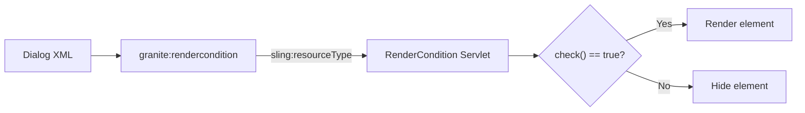

# Render Conditions

Render Conditions control whether a Granite UI element (dialog field, tab, toolbar button, or any
other UI widget) is **shown or hidden** in the AEM Touch UI. They are evaluated server-side before
the UI is rendered, so hidden elements never reach the browser.

This is the primary mechanism for:
- Showing/hiding dialog fields based on **user group membership**
- Conditionally displaying tabs or fields based on **content path or depth**
- Hiding author-only controls on **Publish** instances
- Restricting UI elements by **run mode, permissions, or custom business logic**



## How Render Conditions Work

1. Any Granite UI element can contain a `granite:rendercondition` child node
2. The child node's `sling:resourceType` points to a servlet (or JSP) that evaluates the condition
3. The servlet sets a `SimpleRenderCondition(true/false)` as a request attribute
4. The Granite UI framework reads the attribute and renders or skips the element

The key API classes are:

| Class | Purpose |
|-------|---------|
| `com.adobe.granite.ui.components.rendercondition.RenderCondition` | Interface with a single `check()` method |
| `com.adobe.granite.ui.components.rendercondition.SimpleRenderCondition` | Convenience implementation wrapping a boolean |
| `com.adobe.granite.ui.components.Config` | Reads configuration properties from the render condition's XML node |

---

## Built-in Render Conditions

AEM provides several out-of-the-box render conditions you can use without writing Java code:

### User permissions

Show an element only if the current user has specific permissions on a resource:

```xml
<granite:rendercondition
    jcr:primaryType="nt:unstructured"
    sling:resourceType="granite/ui/components/coral/foundation/renderconditions/privilege"
    path="${requestPathInfo.suffix}"
    privileges="[rep:write]"/>
```

### Group membership

Show an element only for users in a specific group:

```xml
<granite:rendercondition
    jcr:primaryType="nt:unstructured"
    sling:resourceType="granite/ui/components/coral/foundation/renderconditions/group"
    groups="[administrators,content-authors]"
    matchAll="{Boolean}false"/>
```

| Property | Type | Description |
|----------|------|-------------|
| `groups` | `String[]` | Group names to check |
| `matchAll` | `Boolean` | `true` = user must be in ALL groups; `false` (default) = any group |

### Simple expression

Evaluate a simple EL-like expression:

```xml
<granite:rendercondition
    jcr:primaryType="nt:unstructured"
    sling:resourceType="granite/ui/components/coral/foundation/renderconditions/simple"
    expression="${requestPathInfo.suffix != null}"/>
```

### AND / OR combinations

Combine multiple render conditions with boolean logic:

**AND** -- all conditions must be true:

```xml
<granite:rendercondition
    jcr:primaryType="nt:unstructured"
    sling:resourceType="granite/ui/components/coral/foundation/renderconditions/and">
    <condition1
        jcr:primaryType="nt:unstructured"
        sling:resourceType="granite/ui/components/coral/foundation/renderconditions/privilege"
        path="${requestPathInfo.suffix}"
        privileges="[rep:write]"/>
    <condition2
        jcr:primaryType="nt:unstructured"
        sling:resourceType="granite/ui/components/coral/foundation/renderconditions/group"
        groups="[content-authors]"/>
</granite:rendercondition>
```

**OR** -- at least one condition must be true:

```xml
<granite:rendercondition
    jcr:primaryType="nt:unstructured"
    sling:resourceType="granite/ui/components/coral/foundation/renderconditions/or">
    <condition1
        jcr:primaryType="nt:unstructured"
        sling:resourceType="granite/ui/components/coral/foundation/renderconditions/group"
        groups="[administrators]"/>
    <condition2
        jcr:primaryType="nt:unstructured"
        sling:resourceType="granite/ui/components/coral/foundation/renderconditions/group"
        groups="[super-authors]"/>
</granite:rendercondition>
```

### Built-in render conditions reference

| Resource Type | Purpose |
|--------------|---------|
| `.../renderconditions/privilege` | Check JCR permissions on a path |
| `.../renderconditions/group` | Check user group membership |
| `.../renderconditions/simple` | Evaluate a simple expression |
| `.../renderconditions/and` | Boolean AND of child conditions |
| `.../renderconditions/or` | Boolean OR of child conditions |
| `.../renderconditions/not` | Boolean NOT (invert a child condition) |
| `.../renderconditions/emptytext` | Check if a text value is empty |

All live under `granite/ui/components/coral/foundation/renderconditions/`.

---

## Custom Render Conditions

When the built-in conditions don't cover your requirements, write a custom render condition servlet.

### Approach 1: Sling Servlet (recommended)

The cleanest approach -- a proper OSGi servlet with access to all services:

```java title="core/.../servlets/GroupRenderConditionServlet.java"
package com.myproject.core.servlets;

import com.adobe.granite.ui.components.Config;
import com.adobe.granite.ui.components.rendercondition.RenderCondition;
import com.adobe.granite.ui.components.rendercondition.SimpleRenderCondition;
import org.apache.jackrabbit.api.JackrabbitSession;
import org.apache.jackrabbit.api.security.user.Authorizable;
import org.apache.jackrabbit.api.security.user.Group;
import org.apache.jackrabbit.api.security.user.UserManager;
import org.apache.sling.api.SlingHttpServletRequest;
import org.apache.sling.api.SlingHttpServletResponse;
import org.apache.sling.api.resource.Resource;
import org.apache.sling.api.servlets.SlingSafeMethodsServlet;
import org.osgi.service.component.annotations.Component;
import org.slf4j.Logger;
import org.slf4j.LoggerFactory;

import javax.jcr.RepositoryException;
import javax.jcr.Session;
import javax.servlet.Servlet;
import javax.servlet.ServletException;
import java.util.Iterator;

@Component(
    service = Servlet.class,
    property = {
        "sling.servlet.resourceTypes=" + GroupRenderConditionServlet.RESOURCE_TYPE,
        "sling.servlet.methods=GET"
    }
)
public class GroupRenderConditionServlet extends SlingSafeMethodsServlet {

    private static final Logger LOG = LoggerFactory.getLogger(GroupRenderConditionServlet.class);

    // Virtual resource type -- no file on disk, only referenced in dialog XML
    static final String RESOURCE_TYPE = "myproject/renderconditions/group-check";

    @Override
    protected void doGet(SlingHttpServletRequest request, SlingHttpServletResponse response)
            throws ServletException {

        boolean shouldRender = false;

        // Read configuration from the dialog XML node
        Resource conditionResource = request.getResource();
        Config config = new Config(conditionResource);
        String requiredGroup = config.get("group", String.class);

        if (requiredGroup != null) {
            shouldRender = isUserInGroup(request, requiredGroup);
        }

        request.setAttribute(
            RenderCondition.class.getName(),
            new SimpleRenderCondition(shouldRender)
        );
    }

    private boolean isUserInGroup(SlingHttpServletRequest request, String groupName) {
        try {
            Session session = request.getResourceResolver().adaptTo(Session.class);
            if (session instanceof JackrabbitSession) {
                UserManager userManager = ((JackrabbitSession) session).getUserManager();
                Authorizable currentUser = userManager.getAuthorizable(session.getUserID());

                if (currentUser != null) {
                    Iterator<Group> groups = currentUser.memberOf();
                    while (groups.hasNext()) {
                        if (groups.next().getID().equals(groupName)) {
                            return true;
                        }
                    }
                }
            }
        } catch (RepositoryException e) {
            LOG.error("Error checking group membership", e);
        }
        return false;
    }
}
```

**Usage in dialog XML:**

```xml
<myField
    jcr:primaryType="nt:unstructured"
    sling:resourceType="granite/ui/components/coral/foundation/form/textfield"
    fieldLabel="Admin-only field"
    name="./adminNote">
    <granite:rendercondition
        jcr:primaryType="nt:unstructured"
        sling:resourceType="myproject/renderconditions/group-check"
        group="administrators"/>
</myField>
```

### Approach 2: JSP-based (legacy)

For simpler cases or when you need quick scripting. The JSP calls a Java class that implements
`RenderCondition`:

```jsp title="/apps/myproject/renderconditions/path-depth/path-depth.jsp"
<%@include file="/libs/granite/ui/global.jsp" %>
<%@page session="false"
        import="com.adobe.granite.ui.components.rendercondition.RenderCondition,
                com.adobe.granite.ui.components.rendercondition.SimpleRenderCondition,
                com.adobe.granite.ui.components.Config"
%>
<%
    Config cfg = new Config(resource);
    int requiredDepth = cfg.get("minDepth", 0);

    String contentPath = request.getRequestPathInfo().getSuffix();
    boolean shouldRender = false;

    if (contentPath != null) {
        int depth = contentPath.split("/").length - 1;
        shouldRender = depth >= requiredDepth;
    }

    request.setAttribute(RenderCondition.class.getName(), new SimpleRenderCondition(shouldRender));
%>
```

**Usage:**

```xml
<granite:rendercondition
    jcr:primaryType="nt:unstructured"
    sling:resourceType="myproject/renderconditions/path-depth"
    minDepth="{Long}4"/>
```

:::tip
Prefer the servlet approach over JSP. Servlets are testable, support dependency injection, and follow
modern AEM development patterns. JSPs are harder to debug and maintain.
:::

---

## Practical Examples

### Show a field only for content authors (not on templates)

```java title="core/.../servlets/ContentPageRenderCondition.java"
@Component(
    service = Servlet.class,
    property = {
        "sling.servlet.resourceTypes=myproject/renderconditions/content-page-only",
        "sling.servlet.methods=GET"
    }
)
public class ContentPageRenderCondition extends SlingSafeMethodsServlet {

    @Override
    protected void doGet(SlingHttpServletRequest request, SlingHttpServletResponse response)
            throws ServletException {

        // The suffix contains the path of the content being edited
        String contentPath = request.getRequestPathInfo().getSuffix();

        // Show only on content pages, not on template structure pages
        boolean isContentPage = contentPath != null
            && contentPath.startsWith("/content/")
            && !contentPath.contains("/conf/");

        request.setAttribute(
            RenderCondition.class.getName(),
            new SimpleRenderCondition(isContentPage)
        );
    }
}
```

### Show a tab only on specific resource types

```java title="core/.../servlets/ResourceTypeRenderCondition.java"
@Component(
    service = Servlet.class,
    property = {
        "sling.servlet.resourceTypes=myproject/renderconditions/resource-type-check",
        "sling.servlet.methods=GET"
    }
)
public class ResourceTypeRenderCondition extends SlingSafeMethodsServlet {

    @Override
    protected void doGet(SlingHttpServletRequest request, SlingHttpServletResponse response)
            throws ServletException {

        Config config = new Config(request.getResource());
        String[] allowedTypes = config.get("allowedResourceTypes", new String[0]);

        String contentPath = request.getRequestPathInfo().getSuffix();
        boolean shouldRender = false;

        if (contentPath != null && allowedTypes.length > 0) {
            Resource contentResource = request.getResourceResolver().getResource(contentPath);
            if (contentResource != null) {
                String resourceType = contentResource.getResourceType();
                for (String allowed : allowedTypes) {
                    if (allowed.equals(resourceType)) {
                        shouldRender = true;
                        break;
                    }
                }
            }
        }

        request.setAttribute(
            RenderCondition.class.getName(),
            new SimpleRenderCondition(shouldRender)
        );
    }
}
```

**Usage:**

```xml
<advancedTab
    jcr:primaryType="nt:unstructured"
    jcr:title="Advanced"
    sling:resourceType="granite/ui/components/coral/foundation/container">
    <granite:rendercondition
        jcr:primaryType="nt:unstructured"
        sling:resourceType="myproject/renderconditions/resource-type-check"
        allowedResourceTypes="[myproject/components/hero,myproject/components/teaser]"/>
    <items jcr:primaryType="nt:unstructured">
        <!-- fields shown only for hero and teaser components -->
    </items>
</advancedTab>
```

### Show a field only in specific WCM modes

```java title="core/.../servlets/WcmModeRenderCondition.java"
@Component(
    service = Servlet.class,
    property = {
        "sling.servlet.resourceTypes=myproject/renderconditions/wcm-mode",
        "sling.servlet.methods=GET"
    }
)
public class WcmModeRenderCondition extends SlingSafeMethodsServlet {

    @Override
    protected void doGet(SlingHttpServletRequest request, SlingHttpServletResponse response)
            throws ServletException {

        Config config = new Config(request.getResource());
        String[] allowedModes = config.get("modes", new String[]{"EDIT"});

        WCMMode currentMode = WCMMode.fromRequest(request);
        boolean shouldRender = false;

        for (String mode : allowedModes) {
            if (currentMode.name().equalsIgnoreCase(mode)) {
                shouldRender = true;
                break;
            }
        }

        request.setAttribute(
            RenderCondition.class.getName(),
            new SimpleRenderCondition(shouldRender)
        );
    }
}
```

### Show a field based on OSGi configuration

Combine render conditions with OSGi configs for feature flags:

```java title="core/.../servlets/FeatureFlagRenderCondition.java"
@Component(
    service = Servlet.class,
    property = {
        "sling.servlet.resourceTypes=myproject/renderconditions/feature-flag",
        "sling.servlet.methods=GET"
    }
)
public class FeatureFlagRenderCondition extends SlingSafeMethodsServlet {

    @Reference
    private FeatureFlagService featureFlagService;

    @Override
    protected void doGet(SlingHttpServletRequest request, SlingHttpServletResponse response)
            throws ServletException {

        Config config = new Config(request.getResource());
        String featureName = config.get("feature", String.class);

        boolean shouldRender = featureName != null
            && featureFlagService.isEnabled(featureName);

        request.setAttribute(
            RenderCondition.class.getName(),
            new SimpleRenderCondition(shouldRender)
        );
    }
}
```

**Usage:**

```xml
<experimentalField
    jcr:primaryType="nt:unstructured"
    sling:resourceType="granite/ui/components/coral/foundation/form/textfield"
    fieldLabel="Experimental Feature"
    name="./experimentalValue">
    <granite:rendercondition
        jcr:primaryType="nt:unstructured"
        sling:resourceType="myproject/renderconditions/feature-flag"
        feature="enable-experimental-dialog"/>
</experimentalField>
```

---

## Where Render Conditions Can Be Applied

Render conditions work on **any** Granite UI element, not just form fields:

| Element | Use case |
|---------|---------|
| **Dialog fields** | Show/hide individual fields based on permissions |
| **Dialog tabs** | Hide entire tabs for non-admin users |
| **Toolbar buttons** | Show custom actions only for specific roles |
| **Inline edit toolbar** | Conditionally show inline editing options |
| **Page properties tabs** | Hide advanced tabs from content authors |
| **Asset metadata fields** | Show DAM metadata fields by asset type |
| **Column view items** | Conditionally show column items |

### Example: Hiding an entire dialog tab

```xml title="_cq_dialog/.content.xml (excerpt)"
<items jcr:primaryType="nt:unstructured">
    <tabs jcr:primaryType="nt:unstructured"
          sling:resourceType="granite/ui/components/coral/foundation/tabs">
        <items jcr:primaryType="nt:unstructured">
            <!-- Always visible -->
            <general jcr:primaryType="nt:unstructured"
                     jcr:title="General"
                     sling:resourceType="granite/ui/components/coral/foundation/container">
                <items jcr:primaryType="nt:unstructured">
                    <!-- ... general fields ... -->
                </items>
            </general>
            <!-- Only visible to administrators -->
            <advanced jcr:primaryType="nt:unstructured"
                      jcr:title="Advanced"
                      sling:resourceType="granite/ui/components/coral/foundation/container">
                <granite:rendercondition
                    jcr:primaryType="nt:unstructured"
                    sling:resourceType="granite/ui/components/coral/foundation/renderconditions/group"
                    groups="[administrators]"/>
                <items jcr:primaryType="nt:unstructured">
                    <!-- ... admin-only fields ... -->
                </items>
            </advanced>
        </items>
    </tabs>
</items>
```

---

## Passing Configuration to Render Conditions

Use the `Config` class to read properties from the render condition's XML node. Any property set on
the `granite:rendercondition` node is available:

```xml
<granite:rendercondition
    jcr:primaryType="nt:unstructured"
    sling:resourceType="myproject/renderconditions/custom-check"
    group="content-authors"
    minDepth="{Long}3"
    allowedPaths="[/content/myproject,/content/dam/myproject]"
    enabled="{Boolean}true"/>
```

```java title="Reading configuration in the servlet"
Config config = new Config(request.getResource());

String group = config.get("group", String.class);          // "content-authors"
Long minDepth = config.get("minDepth", Long.class);         // 3
String[] paths = config.get("allowedPaths", new String[0]); // ["/content/myproject", ...]
Boolean enabled = config.get("enabled", Boolean.class);     // true
```

Type hints in XML:
- `{Long}3` -- Long integer
- `{Boolean}true` -- Boolean
- `[value1,value2]` -- String array
- Plain string values need no hint

---

## Render Conditions vs `data-sly-test`

| Mechanism | When evaluated | Scope | Security |
|-----------|---------------|-------|----------|
| **Render Condition** | Server-side, before dialog renders | Granite UI (dialogs, admin consoles) | Secure -- hidden elements never reach the browser |
| **`data-sly-test`** | Server-side, during HTL rendering | HTL templates (component rendering) | Secure -- hidden markup never reaches the browser |
| **`granite:hide`** | Build-time, during overlay resolution | Dialog inheritance and overlays | Secure -- permanently removes fields from inherited dialogs |
| **Client-side JS (`showhide`)** | Browser, after dialog loads | Coral UI `show`/`hide` listeners | Not secure -- DOM elements exist but are hidden |

:::warning
**Never use client-side show/hide for security-sensitive fields.** DOM elements hidden via JavaScript
can be revealed with browser DevTools. If a field should not be visible to a user, use a server-side
render condition.
:::

---

## Best Practices

### Use built-in conditions first

Before writing a custom servlet, check if AEM's built-in render conditions cover your need
(privilege, group, simple expression, and/or/not combinators).

### Keep conditions fast

Render conditions execute during dialog rendering. Slow conditions (e.g., external API calls) delay
the dialog opening. Cache results or precompute values in OSGi services.

### Use virtual resource types

The `sling:resourceType` of a render condition servlet doesn't need a physical file. The value is
a virtual identifier resolved by Sling's servlet registration. This keeps your `/apps` tree clean.

### Test render conditions

Test your render condition servlets with AEM Mocks:

```java title="core/.../servlets/GroupRenderConditionServletTest.java"
@ExtendWith(AemContextExtension.class)
class GroupRenderConditionServletTest {

    private final AemContext context = new AemContext();

    @Test
    void shouldRenderForAdministrators() throws Exception {
        // Set up the render condition resource with config
        context.create().resource("/apps/test/rendercondition",
            "sling:resourceType", "myproject/renderconditions/group-check",
            "group", "administrators");

        context.currentResource("/apps/test/rendercondition");

        GroupRenderConditionServlet servlet = new GroupRenderConditionServlet();
        servlet.doGet(context.request(), context.response());

        RenderCondition condition = (RenderCondition) context.request()
            .getAttribute(RenderCondition.class.getName());

        // Assert based on the mock user's group membership
        assertNotNull(condition);
    }
}
```

### Document your render conditions

Render conditions are invisible in the UI -- if a field doesn't appear, authors may not know why.
Add `fieldDescription` hints or documentation explaining which conditions control visibility.

---

## Common Pitfalls

| Pitfall | Solution |
|---------|----------|
| Field disappears and nobody knows why | Add documentation or `fieldDescription` explaining the render condition |
| Condition works in edit mode but not in template editor | Check `requestPathInfo.suffix` -- template paths differ from content paths |
| Condition not evaluated (field always shows) | Verify `sling:resourceType` matches the servlet's registered resource type exactly |
| Condition blocks entire tab when only one field should hide | Place the render condition on the field, not the tab container |
| Servlet has no access to OSGi services | Use `@Reference` on the servlet class (servlets are OSGi components); don't put `@Reference` inside inner classes |
| Render condition evaluated multiple times per dialog | Normal -- Granite UI evaluates conditions for each element individually; keep conditions lightweight |
| Client-side showhide conflicts | Render conditions and `showhide` listeners can conflict; pick one approach per field |

## See also

- [Overlays](./overlays.mdx) -- customising existing Granite UI components
- [Touch UI (Author UI)](./touch-ui.mdx) -- Touch UI architecture
- [Coral UI](./coral-ui.mdx) -- UI component library
- [Component Dialogs](../component-dialogs.mdx) -- dialog field types and structure
- [Servlets](../backend/servlets.mdx) -- servlet registration patterns
- [Sling Models](../backend/sling-models.mdx)
- [Security](../infrastructure/security.mdx) -- access control and permissions
- [HTL Templates](../htl-templates.mdx) -- `data-sly-test` for component-level conditions
