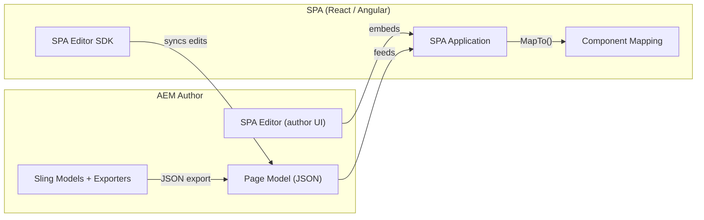
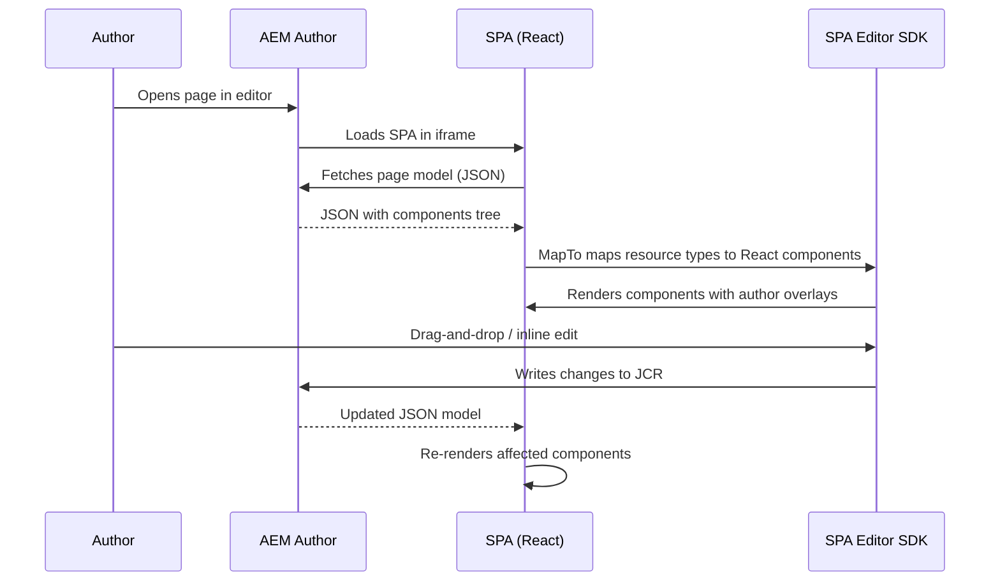
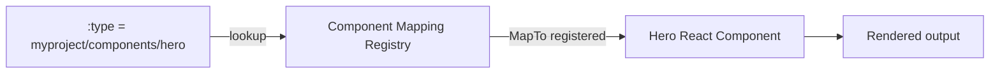
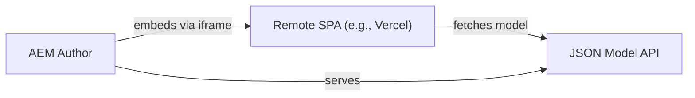

# AEM SPA Editor

The **AEM SPA Editor** enables authors to visually edit Single Page Applications (React or
Angular) directly in the AEM author environment -- drag-and-drop, inline editing, layout
mode, and all the authoring features they know from traditional AEM pages. The SPA
renders from a **JSON model** served by AEM, and the SPA Editor SDK bridges the gap
between the SPA framework and AEM's authoring layer.



---

## How It Works

### Architecture overview



Key principles:

1. AEM serves a **JSON model** of the page (via Sling Model Exporters)
2. The SPA reads the JSON and renders React/Angular components
3. The **SPA Editor SDK** adds authoring overlays (selection, drag targets, placeholders)
4. Edits in the author UI are written to the JCR, the JSON model updates, and the SPA re-renders
5. On publish, the SPA renders from the same JSON without any editor overlays

### JSON model structure

The page model is a nested JSON tree. Each component maps to a node:

```json
{
  ":type": "myproject/components/page",
  ":path": "/content/myproject/en/home",
  ":children": {
    "root": {
      ":type": "wcm/foundation/components/responsivegrid",
      ":items": {
        "hero": {
          ":type": "myproject/components/hero",
          "title": "Welcome",
          "backgroundImage": "/content/dam/myproject/hero.jpg"
        },
        "cards": {
          ":type": "myproject/components/cards",
          ":items": { ... }
        }
      },
      ":itemsOrder": ["hero", "cards"]
    }
  }
}
```

---

## Project Setup

### AEM Project Archetype

The [AEM Project Archetype](https://github.com/adobe/aem-project-archetype) generates
a complete SPA project when you select the frontend module:

```bash
mvn -B archetype:generate \
  -DarchetypeGroupId=com.adobe.aem \
  -DarchetypeArtifactId=aem-project-archetype \
  -DarchetypeVersion=49 \
  -DappTitle="My SPA Project" \
  -DappId="myspa" \
  -DgroupId="com.myproject" \
  -DfrontendModule=react
```

This generates:

```
myspa/
├── core/                  # Java backend (Sling Models, Exporters)
├── ui.apps/               # AEM components, templates, clientlibs
├── ui.content/            # Sample content
├── ui.config/             # OSGi configs
├── ui.frontend/           # React SPA (the frontend module)
│   ├── src/
│   │   ├── components/    # React components mapped to AEM components
│   │   ├── App.js
│   │   └── index.js
│   ├── package.json
│   └── webpack.config.js
└── pom.xml
```

### Key npm packages

| Package                                 | Purpose                                                         |
|-----------------------------------------|-----------------------------------------------------------------|
| `@adobe/aem-react-editable-components`  | React components with editor support (MapTo, EditableComponent) |
| `@adobe/aem-spa-page-model-manager`     | Fetches and caches the page JSON model                          |
| `@adobe/aem-spa-component-mapping`      | Registry that maps AEM resource types to React components       |
| `@adobe/aem-core-components-react-base` | React wrappers for AEM Core Components                          |
| `@adobe/aem-core-components-react-spa`  | SPA-specific Core Component wrappers                            |

```bash
npm install @adobe/aem-react-editable-components \
            @adobe/aem-spa-page-model-manager \
            @adobe/aem-spa-component-mapping
```

---

## Component Mapping with MapTo

The central concept: **`MapTo()`** connects a React component to an AEM resource type.
When the JSON model contains a node with `:type = "myproject/components/hero"`, the SPA
renders the mapped React component.

### Basic mapping

```jsx title="ui.frontend/src/components/Hero/Hero.js"
import React from 'react';
import { MapTo } from '@adobe/aem-react-editable-components';

// Define edit config (controls placeholder behaviour in author mode)
const HeroEditConfig = {
    emptyLabel: 'Hero',
    isEmpty: function(props) {
        return !props || !props.title;
    }
};

const Hero = ({ title, backgroundImage, ctaText, ctaLink }) => (
    <section className="hero" style={{
        backgroundImage: `url(${backgroundImage})`
    }}>
        <div className="hero-content">
            <h1>{title}</h1>
            {ctaText && (
                <a href={ctaLink} className="hero-cta">{ctaText}</a>
            )}
        </div>
    </section>
);

export default MapTo('myproject/components/hero')(Hero, HeroEditConfig);
```

### How MapTo works



1. The JSON model contains a `:type` field for each component
2. `MapTo('myproject/components/hero')(HeroComponent, editConfig)` registers the mapping
3. When the page model manager encounters that resource type, it renders the mapped component
4. The `editConfig` tells the editor how to handle empty states and placeholders

### Edit config options

| Property         | Type     | Description                                                 |
|------------------|----------|-------------------------------------------------------------|
| `emptyLabel`     | string   | Label shown in the placeholder when the component is empty  |
| `isEmpty(props)` | function | Returns `true` if the component should show the placeholder |
| `resourceType`   | string   | Override the resource type (rarely needed)                  |

---

## Container Components

Container components (like the Responsive Grid) hold child components. They receive
`:items` and `:itemsOrder` in the JSON model.

### Mapping a container

```jsx title="ui.frontend/src/components/Container/Container.js"
import React from 'react';
import { MapTo, withComponentMappingContext } from '@adobe/aem-react-editable-components';
import { ResponsiveGrid } from '@adobe/aem-react-editable-components';

// Use the built-in ResponsiveGrid for layout container
MapTo('wcm/foundation/components/responsivegrid')(ResponsiveGrid);
```

### Custom container

For a custom container (e.g., a tabbed section), see the
[Extending the Responsive Grid](./extending-responsive-grid.md) page for a detailed
implementation with `ContainerExporter` and `@Delegate`.

---

## Page Component

The page component is the root of the SPA. It renders the page-level model and all
child containers:

```jsx title="ui.frontend/src/App.js"
import React from 'react';
import { Page, withModel } from '@adobe/aem-react-editable-components';
import { ModelManager } from '@adobe/aem-spa-page-model-manager';

// Import all component mappings so they register
import './components/Hero/Hero';
import './components/Cards/Cards';
import './components/Text/Text';
// ...

// Initialise the model manager
ModelManager.initialize().then(() => {
    // Ready to render
});

function App() {
    return <Page />;
}

// withModel HOC fetches the page model and passes it as props
export default withModel(App);
```

### Entry point

```jsx title="ui.frontend/src/index.js"
import React from 'react';
import ReactDOM from 'react-dom';
import { ModelManager } from '@adobe/aem-spa-page-model-manager';
import App from './App';

ModelManager.initialize().then((pageModel) => {
    ReactDOM.render(
        <App
            cqChildren={pageModel[':children']}
            cqItems={pageModel[':items']}
            cqItemsOrder={pageModel[':itemsOrder']}
            cqPath={pageModel[':path']}
        />,
        document.getElementById('spa-root')
    );
});
```

---

## Backend: Sling Model Exporters

Every AEM component that appears in the SPA needs a **Sling Model Exporter** that
produces the JSON representation:

```java title="core/.../models/HeroModel.java"
import com.adobe.cq.export.json.ComponentExporter;
import com.adobe.cq.export.json.ExporterConstants;
import org.apache.sling.api.SlingHttpServletRequest;
import org.apache.sling.models.annotations.Exporter;
import org.apache.sling.models.annotations.Model;
import org.apache.sling.models.annotations.injectorspecific.ValueMapValue;

@Model(
    adaptables = SlingHttpServletRequest.class,
    adapters = { HeroModel.class, ComponentExporter.class },
    resourceType = HeroModel.RESOURCE_TYPE
)
@Exporter(
    name = ExporterConstants.SLING_MODEL_EXPORTER_NAME,
    extensions = ExporterConstants.SLING_MODEL_EXTENSION
)
public class HeroModel implements ComponentExporter {

    static final String RESOURCE_TYPE = "myproject/components/hero";

    @ValueMapValue(optional = true)
    private String title;

    @ValueMapValue(optional = true)
    private String backgroundImage;

    @ValueMapValue(optional = true)
    private String ctaText;

    @ValueMapValue(optional = true)
    private String ctaLink;

    public String getTitle() { return title; }
    public String getBackgroundImage() { return backgroundImage; }
    public String getCtaText() { return ctaText; }
    public String getCtaLink() { return ctaLink; }

    @Override
    public String getExportedType() {
        return RESOURCE_TYPE;
    }
}
```

The `@Exporter` annotation and `ComponentExporter` interface ensure the model is included
in the page JSON model. The `getExportedType()` method maps back to the `:type` field.

---

## SPA Routing and Navigation

SPAs handle client-side routing. The SPA Editor SDK integrates with React Router:

```jsx title="ui.frontend/src/App.js"
import { BrowserRouter as Router, Route } from 'react-router-dom';
import { ModelManager, ModelClient } from '@adobe/aem-spa-page-model-manager';

// Configure the model manager to fetch models for new routes
const modelClient = new ModelClient();

function App() {
    return (
        <Router>
            <Route
                path="/:pagePath*"
                render={(routeProps) => (
                    <Page
                        cqPath={routeProps.match.url}
                        {...routeProps}
                    />
                )}
            />
        </Router>
    );
}
```

When a user navigates to a new page:

1. React Router handles the URL change
2. `ModelManager` fetches the JSON model for the new page (if not cached)
3. The `Page` component re-renders with the new model
4. In author mode, the editor overlays update automatically

---

## Remote SPA

A **Remote SPA** is a SPA hosted outside AEM (e.g., on Vercel, Netlify, or a custom
CDN) that can still be edited in the AEM SPA Editor:



### Setup

1. Host your SPA on an external server
2. Configure AEM to allow the remote origin (CORS, CSP headers)
3. The SPA fetches the page model from AEM's JSON endpoint
4. The SPA Editor loads the remote SPA in an iframe for authoring

```js
// Configure ModelManager for remote SPA
ModelManager.initialize({
    modelClient: new ModelClient('https://author-p123-e456.adobeaemcloud.com')
});
```

### When to use Remote SPA

| Scenario                           | Remote SPA | Embedded SPA      |
|------------------------------------|------------|-------------------|
| SPA hosted on external CDN         | Yes        | No                |
| SPA needs independent deployment   | Yes        | No                |
| Tight AEM integration needed       | No         | Yes               |
| Multiple teams own different parts | Yes        | No                |
| Maximum authoring fidelity         | No         | Yes (same origin) |

---

## SPA vs Headless vs Edge Delivery

| Aspect            | SPA Editor                             | Headless (GraphQL)                    | Edge Delivery                      |
|-------------------|----------------------------------------|---------------------------------------|------------------------------------|
| **Authoring**     | Visual, in-context                     | No visual editing (external frontend) | Universal Editor or document-based |
| **Frontend**      | React / Angular (AEM-hosted or remote) | Any framework (decoupled)             | Vanilla JS + CSS                   |
| **Content model** | Page model (JSON tree)                 | Content Fragments (structured)        | Content Bus (tables to HTML)       |
| **Rendering**     | Client-side (SPA)                      | Client-side or SSR (custom)           | Edge-side (CDN)                    |
| **Performance**   | Good (but SPA overhead)                | Depends on implementation             | Excellent (100 Lighthouse)         |
| **Complexity**    | High (SDK, mapping, exporters)         | Medium (GraphQL queries)              | Low (HTML, CSS, JS)                |
| **Best for**      | Complex interactive apps               | Multi-channel content delivery        | Marketing sites, docs              |

---

## Authoring Experience

### Edit mode

Authors see the SPA with blue overlays on each editable component. They can:

- Click to select a component
- Use the component toolbar (edit, configure, delete, move)
- Drag components from the side panel
- Inline-edit text components

### Layout mode

Authors can resize components within the responsive grid, just like traditional AEM pages.

### Preview mode

Renders the SPA without editor overlays -- exactly as visitors would see it.

### Placeholder handling

When a component is empty (no content authored yet), the SPA Editor SDK shows a
**placeholder** based on the `emptyLabel` from the edit config. This guides authors to
add content.

```jsx
const TextEditConfig = {
    emptyLabel: 'Text -- click to edit',
    isEmpty: (props) => !props || !props.text || props.text.trim().length === 0
};
```

---

## Common Patterns

### Conditional authoring scaffolding

Show additional markup only in edit mode to help authors:

```jsx
import { AuthoringUtils } from '@adobe/aem-spa-page-model-manager';

const MyComponent = (props) => {
    const isInEditor = AuthoringUtils.isInEditor();

    return (
        <div className="my-component">
            {isInEditor && <div className="author-hint">Drag items here</div>}
            {/* Component content */}
        </div>
    );
};
```

### Mapping Core Components

Reuse AEM Core Component React wrappers:

```jsx
import { TitleV2IsEmptyFn } from '@adobe/aem-core-components-react-base';
import { MapTo } from '@adobe/aem-react-editable-components';

// Map the AEM Core Title component to its React wrapper
const Title = ({ text, type }) => {
    const HeadingTag = type || 'h2';
    return <HeadingTag>{text}</HeadingTag>;
};

MapTo('myproject/components/title')(Title, {
    emptyLabel: 'Title',
    isEmpty: TitleV2IsEmptyFn
});
```

---

## Best Practices

### Map every editable component

Every AEM component that authors should be able to edit needs a `MapTo` registration.
Missing mappings result in blank spots in the editor.

### Keep edit configs accurate

The `isEmpty()` function determines when the placeholder is shown. Make sure it correctly
identifies truly empty components to avoid confusing authors.

### Test in both author and publish modes

The SPA behaves differently in author mode (with editor overlays) vs publish mode (clean
rendering). Test both paths.

### Avoid direct DOM manipulation

The SPA Editor SDK manages component lifecycles. Direct DOM manipulation (e.g., jQuery)
can conflict with the editor overlays and cause rendering glitches.

### Use Sling Model Exporters for all data

Don't fetch data client-side via custom APIs for content that should be editable. All
editable content must flow through the JSON model.

---

## Common Pitfalls

| Pitfall                                                           | Solution                                                                                              |
|-------------------------------------------------------------------|-------------------------------------------------------------------------------------------------------|
| Component renders on publish but not in editor                    | Ensure `MapTo` is imported and executed before the page renders                                       |
| Empty placeholder never disappears                                | Check the `isEmpty()` function -- it may not be checking the right props                              |
| Drag-and-drop doesn't work                                        | Verify the container component is correctly mapped (e.g., `ResponsiveGrid`)                           |
| JSON model is empty or missing components                         | Check that Sling Models implement `ComponentExporter` and have `@Exporter`                            |
| SPA loads but shows blank page in editor                          | Verify the SPA page component in AEM has `sling:resourceSuperType = core/wcm/components/page/v3/page` |
| Client-side routing breaks the editor                             | Ensure `ModelManager.initialize()` completes before rendering routes                                  |
| Styles look different in author vs publish                        | The editor adds wrapper divs; scope your CSS to handle both cases                                     |
| Build fails with `aem-react-editable-components` version mismatch | Pin all `@adobe/aem-*` packages to compatible versions                                                |

---

## External Resources

- [AEM SPA Editor overview](https://experienceleague.adobe.com/docs/experience-manager-cloud-service/content/implementing/developing/hybrid/introduction.html)
- [Getting started with React](https://experienceleague.adobe.com/docs/experience-manager-learn/getting-started-with-aem-headless/spa-editor/react/overview.html)
- [SPA Editor SDK (npm)](https://www.npmjs.com/package/@adobe/aem-react-editable-components)
- [Remote SPA documentation](https://experienceleague.adobe.com/docs/experience-manager-learn/getting-started-with-aem-headless/spa-editor/remote-spa/overview.html)
- [AEM Project Archetype](https://github.com/adobe/aem-project-archetype)

## See also

- [Extending the Responsive Grid](./extending-responsive-grid.md) -- container components and `@Delegate` pattern
- [Sling Models and Services](../backend/sling-models.mdx) -- JSON export and `ComponentExporter`
- [Architecture](../architecture.mdx) -- overall AEM architecture
- [Client Libraries](../client-libraries.mdx) -- frontend bundling
- [Multi-Tenancy UI Frontend](./multi-tenancy-support-ui-frontend.mdx) -- webpack / Vite setup
- [Edge Delivery Services](../infrastructure/helix.mdx) -- alternative delivery model
- [Headless GraphQL](../content/graphql.mdx) -- decoupled content delivery
- [Templates and Policies](../components/templates-policies.md) -- SPA page templates
