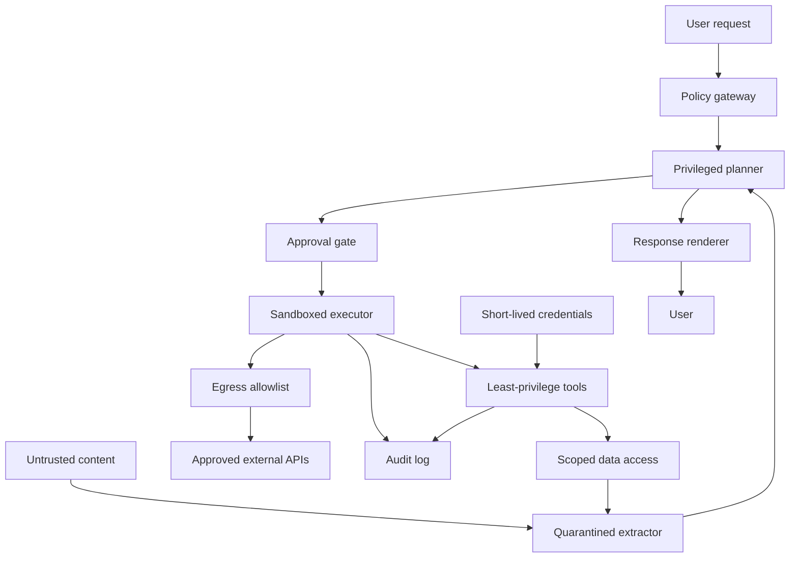

# Agent Security & Sandboxing

Agents change the security problem because they do not just answer questions: they read data, choose tools,
run code, and sometimes change production state. Treat an [agent](./agents.md) as an untrusted program that
can be influenced by every token it reads, including tokens from tools, websites, files, email, tickets,
logs, and package documentation.

Simon Willison's ["lethal trifecta"](https://simonwillison.net/2025/Jun/16/the-lethal-trifecta/) is the
most useful starting model:

1. **Private data access** - email, files, repos, databases, tickets, credentials, memory, or user history.
2. **Exposure to untrusted content** - web pages, retrieved chunks, issue comments, PDFs, emails, tool
   results, MCP tool metadata, or third-party agent skills.
3. **External communication** - HTTP, email, pull requests, chat messages, image loads, DNS, or any tool that
   can send data outside the trust boundary.

If one agent has all three, a prompt injection can turn data access into data exfiltration. The goal is not
"write a better system prompt." The goal is to break at least one side of the triangle with enforced controls.

For a broader checklist, OWASP publishes two lists: the
[Top 10 for LLM Applications 2025](https://genai.owasp.org/llm-top-10/) (summarized in
[AI Safety & Guardrails](./safety.md#owasp-top-10-for-llm-applications-2025)) and the
[Top 10 for Agentic Applications](https://genai.owasp.org/resource/owasp-top-10-for-agentic-applications-for-2026/),
released in December 2025, which covers agent-specific risks such as goal and behavior hijacking, tool
misuse, identity and privilege abuse, memory poisoning, and cascading failures across multi-agent systems.

## Direct and indirect prompt injection

**Direct prompt injection** is hostile user input in the chat itself. **Indirect prompt injection** is hostile
content that arrives through some other channel and is later placed in the model context. The
[OWASP LLM01:2025 Prompt Injection](https://github.com/OWASP/www-project-top-10-for-large-language-model-applications/blob/main/2_0_vulns/LLM01_PromptInjection.md)
write-up explicitly calls out websites and files as indirect sources.

Common indirect sources:

- **Tool outputs** - search results, database rows, logs, CI output, shell output, or API responses.
- **Web pages and documents** - hidden text, comments, metadata, OCR text, PDF layers, or copied snippets.
- **Email and collaboration tools** - an attacker can email the agent's user or file a public issue.
- **Code and package docs** - README files, install scripts, examples, and generated changelogs.
- **MCP descriptions and schemas** - MCP exposes tool `description` and `inputSchema` metadata to the
  model; the [MCP tools spec](https://modelcontextprotocol.io/specification/2026-07-28/server/tools)
  describes tools as model-controlled and recommends human control over tool invocations.
- **Third-party skills and agent plugins** - skill prompts are code-like configuration: review them like
  dependencies, not like harmless prose.

:::caution
Everything returned by a tool is untrusted input. Treat it as data, not instruction. The LLM may not keep
that distinction reliably once both are concatenated into one context window.
:::

## Exfiltration channels to close

Prompt injection becomes an incident when the agent can communicate outward. Block or mediate these channels:

| Channel | Why it matters | Control |
|---|---|---|
| Markdown images and links | Rendered Markdown can trigger browser fetches or entice clicks; OWASP gives an image-link exfiltration scenario for LLM01 | Disable remote image rendering, proxy images, strip links from untrusted output, and require safe-link rewriting |
| Outbound HTTP tools | Search, webhook, fetch, email, chat, PR, and issue tools can send secrets to an attacker-controlled endpoint | Use exact host allowlists, method allowlists, request body limits, and approval for data-sharing calls |
| DNS | Lookups for attacker-controlled domains can carry data in the hostname, even when direct HTTP is blocked | Block DNS by default, use resolver allowlists, log queries, and run sensitive code in no-network sandboxes |
| Generated files | The agent can hide data in commits, artifacts, logs, screenshots, or reports | Scan artifacts, review diffs, and separate read-only analysis from publish steps |
| Cross-tool calls | A malicious low-trust tool result can steer a high-trust tool | Isolate tool sets by trust domain and prevent low-trust contexts from invoking high-impact tools |

Do not rely on the model to avoid these paths. Make the renderer, network layer, and tool runtime enforce the
policy.

## Excessive agency

[OWASP LLM06:2025 Excessive Agency](https://github.com/OWASP/www-project-top-10-for-large-language-model-applications/blob/main/2_0_vulns/LLM06_ExcessiveAgency.md)
defines the failure mode: too much functionality, too much permission, or too much autonomy. The same prompt
injection is far less damaging when the agent can only read a narrow folder than when it can read the whole
home directory, post to Slack, create pull requests, and run arbitrary shell commands.

Design tools so the dangerous part is not delegated to the model:

- Split **read** tools from **write** tools.
- Prefer narrow verbs like `createDraftInvoice` over generic verbs like `runSql` or `callApi`.
- Bind each tool to a server-side authorization check, not a line in the system prompt.
- Use dry-run modes and typed diffs before writes.
- Require human approval for irreversible, external, financial, destructive, or privilege-changing actions.

## MCP, skills, and supply chain risk

MCP makes tools composable, but composability increases the supply-chain surface. The
[MCP security best practices](https://modelcontextprotocol.io/docs/2026-07-28/tutorials/security/security_best_practices)
cover authorization pitfalls such as confused-deputy flows and token passthrough. The OWASP
[MCP Security Cheat Sheet](https://cheatsheetseries.owasp.org/cheatsheets/MCP_Security_Cheat_Sheet.html)
adds practical risks that matter for agents: tool poisoning, rug pulls, over-scoped tokens, untrusted packages,
and local MCP servers with host access.

Specific failure modes:

- **Tool poisoning** - an MCP server hides instructions in tool descriptions or returns normal-looking data
  plus hidden instructions. OWASP describes this as an indirect prompt-injection attack against MCP clients;
  [Invariant Labs](https://invariantlabs.ai/blog/mcp-security-notification-tool-poisoning-attacks)
  published an early demonstration.
- **Rug pull after approval** - a server changes tool descriptions, schemas, or behavior after the user has
  already trusted it.
- **Tool shadowing** - one server's description tells the model how to misuse another server's trusted tools.
- **Compromised packages** - an MCP server, skill, or transitive dependency updates into malware.
- **Credential aggregation** - one server receives broad tokens and becomes a high-value target.

Mitigations:

- Maintain an allowlist of approved servers and skills.
- Pin package versions and tool-definition hashes; re-prompt when definitions change.
- Run local servers in separate sandboxes with scoped filesystem and network access.
- Use short-lived, per-server, least-privilege credentials.
- Log tool registration, definition changes, and every invocation with parameters redacted for secrets.

## Sandboxing options

Sandboxing is defense in depth, not a proof that the agent is safe. Pick the strongest isolation that still
allows the job to finish.

| Isolation layer | Use when | Notes |
|---|---|---|
| Containers | You need repeatable Linux process, filesystem, and cgroup isolation | Docker uses namespaces and cgroups; do not mount the Docker socket into an untrusted agent |
| gVisor | You want stronger-than-container syscall isolation with OCI tooling | gVisor's `runsc` inserts a userspace application kernel between the workload and host kernel |
| Firecracker microVMs | You need VM boundaries with fast startup and low overhead | Firecracker uses KVM microVMs and a jailer for an additional barrier |
| Dev containers | You need reproducible development environments | The Dev Container spec standardizes metadata; it is not by itself a hard security boundary |
| OS sandboxes | You need local command isolation without a full VM | OpenAI [documents Codex](https://developers.openai.com/codex/concepts/sandboxing) using macOS Seatbelt and, on Linux/WSL2, `bubblewrap` plus seccomp; [Landlock](https://www.kernel.org/doc/html/latest/userspace-api/landlock.html) and [seccomp](https://docs.docker.com/engine/security/seccomp/) are kernel primitives you can compose in your own runners |

Verify the actual product, version, and mode before trusting a sandbox. A label such as "workspace-write" or
"sandbox mode" is not enough; check what filesystem writes, network egress, process spawning, and child
process inheritance are technically enforced.

## Minimal Docker sandbox example

The Docker CLI [documents](https://docs.docker.com/reference/cli/docker/container/run/) the flags below:
`--network`, `--read-only`, `--cap-drop`, `--security-opt`, `--user`, `--memory`, `--cpus`, and
`--pids-limit` are all current `docker run` options.

```bash
docker run --rm \
    --network none \
    --read-only \
    --cap-drop ALL \
    --security-opt no-new-privileges=true \
    --user 1000:1000 \
    --memory 512m \
    --cpus 1 \
    --pids-limit 128 \
    python:3.13-slim \
    python -I -c 'print("hello from a constrained sandbox")'
```

This example is intentionally narrow: no network, read-only root filesystem, no Linux capabilities, no new
privileges, non-root UID/GID, and bounded memory, CPU, and process count. For production, also pin images by
digest, scan images, avoid privileged mode, avoid host-path mounts unless they are read-only and scoped, and
apply a custom seccomp/AppArmor/SELinux profile where your platform supports it.

## Injection-resistant design patterns

The 2025 arXiv paper
[Design Patterns for Securing LLM Agents against Prompt Injections](https://arxiv.org/abs/2506.08837)
argues that useful agents can be made safer by constraining what they can do after they ingest untrusted
input. The related CaMeL paper,
[Defeating Prompt Injections by Design](https://arxiv.org/abs/2503.18813), separates trusted control flow
from untrusted data flow and uses capabilities to prevent unauthorized exfiltration.

Useful patterns:

- **Action selector** - the model selects from a fixed set of pre-approved actions and does not receive
  feedback that can alter later actions.
- **Plan then execute** - create the action plan before reading untrusted data; tool results can fill values
  but cannot add new steps.
- **Dual LLM** - a privileged planner never sees raw untrusted content; a quarantined model extracts facts
  from that content without tool authority.
- **CaMeL-style mediation** - track tainted data and enforce policies when tools are called.
- **Context minimization** - remove unneeded user and tool text before later model calls.

These patterns trade generality for security. That is the point: a general-purpose autonomous agent with
private data, untrusted input, and egress cannot provide strong prompt-injection guarantees today.

## Sandboxed architecture



Key boundaries in the diagram:

- The privileged planner gets goals and structured facts, not raw hostile pages or emails.
- The sandboxed executor owns side effects and runs under OS, filesystem, network, and resource limits.
- Secrets are fetched just in time by tools, not pasted into the context window.
- Egress is mediated outside the model.
- Logs capture decisions, tool calls, approvals, and denied actions.

## Practical checklist

Use this before giving an agent new tools or data:

- [ ] Identify the trust boundary for every input source: user, web, email, repo, RAG, MCP, logs, and tools.
- [ ] Decide which side of the lethal trifecta you are breaking: data access, untrusted input, or egress.
- [ ] Remove secrets from prompts, chat history, retrieval chunks, screenshots, and logs.
- [ ] Use short-lived, scoped credentials per tool and per server.
- [ ] Scope filesystem access to the smallest workspace; prefer read-only mounts for analysis.
- [ ] Disable network by default; allow exact hosts, methods, ports, and protocols only when required.
- [ ] Block or proxy Markdown images and untrusted links in model-rendered output.
- [ ] Split read tools from write tools and high-trust tools from low-trust tools.
- [ ] Require approval for destructive, irreversible, financial, external-sharing, or privilege-changing calls.
- [ ] Pin MCP servers, skills, package versions, and tool-definition hashes.
- [ ] Re-review tools when descriptions, schemas, scopes, or publishers change.
- [ ] Validate tool inputs and outputs with schemas; reject extra fields and unexpected free text.
- [ ] Run code execution in containers, gVisor, microVMs, or OS sandboxes with resource limits.
- [ ] Log prompts, tool calls, approvals, denials, egress, and artifact publication with secret redaction.
- [ ] Red-team direct and indirect prompt injection paths before enabling autonomous operation.

## See also

- [AI Agents](./agents.md) - what agent loops and tool use change architecturally
- [AI Safety & Guardrails](./safety.md) - guardrails, prompt injection, red-teaming, and defense in depth
- [Human-in-the-Loop](./human-in-the-loop.md) - approval gates and maker-checker workflows
- [Privacy & Data Handling](./privacy-and-data.md) - PII, secrets, logging, and data residency
- [RAG](./rag.md) - retrieval as both grounding mechanism and injection channel
- [Structured Outputs](./structured-outputs.md) - schema-bound outputs for safer tool and UI integration
- [MCP and A2A in Production](./mcp-and-a2a-in-production.md) - operational guidance for agent protocols
- [Cost, Latency & Model Routing](./cost-and-latency.md) - limiting agent loops, fan-out, and unbounded consumption
