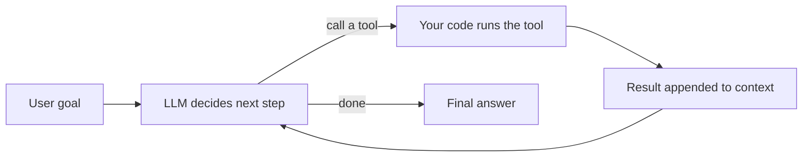
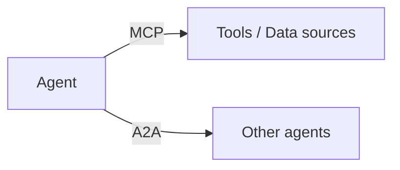

# AI Agents

A useful working definition (Anthropic, via Simon Willison): an agent is an
**LLM autonomously using tools in a loop**. The minimal version is an [LLM](./llm.md), a set of tools,
and a loop that lets the model decide what to do next based on what happened previously. As model
capability improves, agents can navigate nuanced problems and recover from errors with less human
intervention.

**Agentic AI** is the broader umbrella label (popularized 2025--2026) for systems where an LLM plans,
decides, and acts via tools rather than producing a single output. It covers the same territory as
"agents" but reads as an architectural *property* (autonomy, tool use) you can add to existing systems
incrementally, not just a single artifact you build.

## Agent vs chatbot vs workflow

- **Chatbot** -- a single LLM call per user turn; no autonomous action.
- **Workflow** -- a predefined sequence of LLM calls and tool invocations; *the program* controls the flow.
- **Agent** -- *the LLM* controls the flow. The program provides tools and a loop; the model decides what
  to call when.

## Tool use (function calling)

**Tool use** and **function calling** are two names for the same capability: letting an LLM *do things*
in the outside world instead of only generating text. "Function calling" is the developer's view (you
expose functions); "tool use" is the model's view (it picks tools). It is the mechanism that turns a
passive text generator into an agent that can search, query databases, call APIs, send email, or run
code.

**The crucial point: the model never executes anything.** A common misconception is that the LLM "runs"
the tool. It does not:

1. **You define tools** -- a name, description, and input schema (usually JSON Schema) for each function
   the model may use.
2. **The model decides and requests** -- instead of a text answer, it emits a structured call, e.g.
   *"call `get_weather` with `{city: "London"}`"*.
3. **Your code executes** -- your application runs the actual function. The LLM has no access to anything;
   it only *asked*.
4. **You return the result** -- you append the output to the [context](./glossary.md#context-window) and
   call the model again.
5. **The model uses the result** -- it incorporates the data, or requests another tool call.

The model is the *planner*; your code is the *executor*. That separation is also the foundation of
tool-use security: you control exactly which tools exist and what they are permitted to do. Tool use
fixes several of the things [LLMs are bad at](./llm.md#what-llms-are-not-good-at): stale knowledge (call
search), unreliable math (call a calculator), and inability to act (call APIs that change state).

:::tip
Tool descriptions are prompts. The quality of a tool's name and description directly drives whether the
model calls it correctly -- treat them as prompt engineering.
:::

## Multi-agent patterns

Multi-agent systems split cognitive load across specialized components, parallelize work, and reduce
context overload -- but they amplify errors if coordination is poor. A widely cited figure: independent
multi-agent systems amplify errors ~17x versus a single-agent baseline, while a centralized
orchestrator reduces that to ~4x. **The orchestrator layer is error containment, not optional
convenience.**

| Pattern | Shape | When to use |
|---|---|---|
| **Orchestrator-worker** (most common) | A manager decomposes a task and delegates to specialist workers | Complex tasks with distinct, well-defined subtasks |
| **Router** | A lightweight classifier routes each request to one domain agent | Diverse request types; cheapest pattern |
| **Hierarchical** | Multi-level supervisors over domain pods | Enterprise domains with real boundaries and independent scaling |
| **Critic-refiner** | A generator produces output; a critic evaluates and sends it back | Quality matters more than latency (content, code review) |
| **Network / peer** | Agents talk peer-to-peer with no central coordinator | Exploratory tasks; hardest to debug, highest error amplification |

A production-hardened variant of critic-refiner is **maker-checker**: a maker computes a result, an
independent checker verifies it against the same inputs, agreement auto-proceeds, and disagreement
routes to human review. The checker need not be another LLM -- rule-based validation or statistical
sampling qualifies. A pipeline with no checker is a prototype running on live data, not a production
system.

## Protocols: connecting agents to tools and to each other

Two open standards form the connectivity stack for agent networks:

### MCP (Model Context Protocol)

An open standard from Anthropic (November 2024) -- the "USB-C for AI" -- that defines a uniform interface
for LLM applications to discover, connect to, and invoke external tools and data. It solves the
**N x M problem**: before MCP, every client (Claude desktop, Cursor, an internal agent) needed custom
integrations for every tool (Slack, Postgres, GitHub, a private wiki). MCP collapses that to **N + M**:
build a server once, and any MCP-compatible client can use it.

- **Host** -- the LLM application; coordinates clients and enforces security.
- **Client** -- maintains a 1:1 session with one server.
- **Server** -- exposes resources, tools, and prompts; local process or remote service.
- **Transport** -- JSON-RPC 2.0 over stdio (local) or HTTP/SSE (remote).

Because the client/server split is logical, an app can be both -- which is what enables composable,
hierarchical agent systems.

### A2A (Agent2Agent)

An open standard from Google for communication between agents from different frameworks and vendors.
Where MCP is agent-to-tool, A2A is agent-to-agent: an A2A server wraps an agent and exposes it over HTTP;
**Agent Cards** advertise each agent's capabilities for dynamic discovery. Before A2A, multi-agent systems
were framework-locked; A2A lets a LangGraph agent delegate to a CrewAI crew without bespoke glue.

### MCP vs RAG

Both extend an LLM with external information, but they are different categories. [RAG](./rag.md) is
*passive* retrieval pulled into the prompt before generation; MCP is an *active* protocol for retrieval
**and** action. They are complementary -- an MCP server can implement RAG internally, and an agent often
uses both.

## What makes agents hard

- **Long-horizon coherence** -- context windows degrade with length; compaction loses subtle context.
- **Tool selection** -- bloated tool sets confuse models; if a human cannot pick the right tool, neither
  can the model.
- **Trust and verification** -- agents that discover new tools/servers at runtime need governance to
  avoid connecting to untrusted servers; prompt injection is the top agent security risk.
- **Operations** -- every turn fans out to many model and tool calls, so [LLMOps](./tooling.md) (tracing,
  evaluation, cost control) becomes load-bearing. See [Tooling](./tooling.md) for the framework and
  observability landscape.

## See also

- [Large Language Models](./llm.md) -- the model an agent loop is built around
- [Human-in-the-Loop](./human-in-the-loop.md) -- approval gates and maker-checker in production
- [RAG](./rag.md) -- retrieval as a (often tool-driven) way to ground answers
- [Tooling and Frameworks](./tooling.md) -- LangGraph, CrewAI, ADK, MCP servers, observability
- [Cloud vs Local Models](./cloud-vs-local.md) -- where agent models run
- [AI Glossary](./glossary.md) -- definitions of agent, tool use, MCP, A2A, and more
