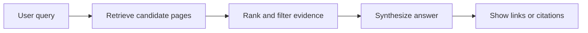

# AI Search, GEO & llms.txt

AI search is not one system. Google AI Overviews, ChatGPT search, Perplexity, Claude search, Gemini, and
copilot-style assistants all combine retrieval, ranking, synthesis, and citation in different ways. The
practical goal for a documentation site is simple: publish accurate, crawlable, semantically structured
content that answer engines can quote without inventing missing context.

:::warning
Do not optimize for rumors. If a provider has not documented that it uses a file, crawler, or markup, treat
it as an experiment, not an SEO requirement.
:::

## How AI answer engines retrieve and cite

Most AI answer experiences use a pipeline like this:



Retrieval may come from a provider's search index, live web fetches, a vertical index, or a private corpus.
Synthesis turns snippets or documents into prose. Citations are then attached either during generation or
after generation by matching claims back to sources.

For Google Search, the official guidance is that AI features use Google's existing search and quality systems.
Google says there is no separate "AI index" you submit to; follow normal technical SEO, make content helpful,
allow Googlebot to crawl it, and control previews with standard Search controls. AI Overviews and AI Mode can
surface links when the system finds web pages that support or extend the generated answer.

For other answer engines, the documented crawlers below indicate how content may enter search or answer
surfaces. They do not prove that a page will be cited. Ranking, freshness, query intent, user location, and
provider-specific evaluation still matter.

## GEO and AEO: useful names, weak evidence

**GEO** usually means *Generative Engine Optimization*. **AEO** usually means *Answer Engine Optimization*.
Both labels point at the same operational question: can an AI answer system find, understand, trust, and cite
your content?

The honest state of evidence:

- There is no universal GEO ranking factor shared by providers.
- Many public playbooks are extrapolated from SEO, retrieval, and content design rather than provider docs.
- Google explicitly frames optimization for generative AI features as standard Search best practice, not a
  separate trick layer.
- The most defensible work is still basic: clear pages, stable URLs, semantic HTML, structured data where it
  matches visible content, fast server responses, and sources that back claims.

GEO is a useful checklist label. It is not a substitute for publishing better content or measuring actual
referral traffic.

## AI crawler and user-agent reference

The names below are official user-agent tokens or product tokens documented by the vendors as of 2026-09-24.
Check vendor docs before changing production `robots.txt`, because crawler names and policies change.

| Provider | Token | What it is for | Training? |
|---|---|---|---|
| OpenAI | `GPTBot` | Web crawler for content that may improve OpenAI models | Yes, per OpenAI docs |
| OpenAI | `OAI-SearchBot` | Search crawler for surfacing websites in ChatGPT search | No, per OpenAI docs |
| OpenAI | `ChatGPT-User` | User-triggered fetches when a ChatGPT user asks for or uses a page | No automated training crawler |
| Anthropic | `ClaudeBot` | Web crawler for Anthropic model training | Yes, per Anthropic docs |
| Anthropic | `Claude-SearchBot` | Search indexing for Claude search surfaces | Search, not training |
| Anthropic | `Claude-User` | User-triggered fetches from Claude | User-requested fetches |
| Perplexity | `PerplexityBot` | Perplexity crawler for search and answer results | Perplexity says it is not for foundation-model training |
| Perplexity | `Perplexity-User` | User-triggered fetches from Perplexity | User-requested fetches; Perplexity says it generally ignores `robots.txt` |
| Google | `Google-Extended` | `robots.txt` product token controlling some Gemini and Vertex AI uses | Product token, not a crawler |

`Google-Extended` is the odd one: Google's docs describe it as a standalone product token, not a crawler
that appears in logs. Blocking it does not block Googlebot, Search indexing, or Search ranking. If you want
Google Search visibility, do not block Googlebot by accident.

:::note
`robots.txt` is advisory crawler policy, not access control. Anything private must require authentication or
authorization. Do not rely on `robots.txt` to protect confidential content.
:::

## A cautious robots.txt example

This example blocks documented training crawlers while allowing documented search and user-requested agents.
It is a policy choice, not a universal recommendation.

```text
# Block model-training crawlers.
User-agent: GPTBot
Disallow: /

User-agent: ClaudeBot
Disallow: /

# Google-Extended is a product token, not a crawler user agent in logs.
User-agent: Google-Extended
Disallow: /

# Allow search and answer-surface crawlers.
User-agent: OAI-SearchBot
Allow: /

User-agent: Claude-SearchBot
Allow: /

User-agent: PerplexityBot
Allow: /

# Allow user-triggered fetches.
User-agent: ChatGPT-User
Allow: /

User-agent: Claude-User
Allow: /

User-agent: Perplexity-User
Allow: /

User-agent: *
Allow: /
```

If you use a CDN or web application firewall, also check IP verification guidance from the provider. Attackers
can spoof a user-agent string.

## Where llms.txt fits

[`llms.txt`](https://llmstxt.org/) is a proposed Markdown file, usually published at `/llms.txt`, that gives
LLMs a curated map of the most useful pages on a site. The proposal is not a web standard and is not an
access-control mechanism.

The proposed shape is intentionally simple:

```markdown
# Example Docs
> Concise summary of what the site covers and who it is for.

## Core guides
- [Getting started](https://example.com/docs/getting-started.md): Install and first successful run.
- [API reference](https://example.com/docs/api.md): Stable API surface and examples.

## Optional
- [Changelog](https://example.com/changelog.md): Release history for humans and agents.
```

Important details:

- Start with one H1 title.
- Add a short blockquote summary.
- Use H2 sections containing Markdown links with short descriptions.
- Prefer canonical absolute URLs.
- Keep `/llms.txt` curated; use `/llms-full.txt` when you want to publish a larger, more exhaustive dump.

Major search and AI providers have not made `llms.txt` a confirmed ranking or citation input. Google Search
Central has said Google Search does not use `llms.txt` for ranking or AI features. Publishing one may still
help developer tools, agents, or site-specific workflows that choose to read it, but it should not replace
`robots.txt`, `sitemap.xml`, semantic HTML, or structured data.

## Content practices that actually help

### Use clean semantic HTML

Answer engines extract main content more reliably when pages use a single meaningful H1, nested headings,
paragraphs, lists, tables, captions, and descriptive link text. See [Semantic HTML](../building-for-the-web/semantic-html.mdx)
for the HTML side of this.

### Add structured data when it matches the page

Structured data can help search systems understand entities, breadcrumbs, articles, products, FAQs, and other
visible content. It is not a magic AI citation switch. Mark up facts that are also visible to users, and keep
JSON-LD synchronized with the rendered page.

### Serve crawlable content

If important content only appears after client-side JavaScript, some crawlers and user-triggered fetchers may
miss it. Documentation sites should prefer server-rendered or statically generated HTML with stable URLs,
fast responses, and useful metadata. See [Web Performance](../building-for-the-web/web-performance.md) and
[Docusaurus](../building-for-the-web/docusaurus.md).

### Write answerable pages

AI answer systems favor pages that can support direct answers: clear definitions, scoped headings, examples,
limitations, and citations. This overlaps with good [Content Modeling](../building-for-the-web/content-modeling.md):
one page should have one primary job and enough context to stand alone.

## Measuring AI referral traffic

Measurement is still imperfect. Start with:

- Web analytics referrers such as `chat.openai.com`, `chatgpt.com`, `perplexity.ai`, `claude.ai`,
  `gemini.google.com`, and `copilot.microsoft.com`.
- Server logs for documented crawler user agents and verified IP ranges where providers publish them.
- Search Console for Google Search traffic. Google does not currently expose every AI feature as a clean,
  separate referrer in all reports.
- Landing-page analysis: compare pages cited or linked in AI answers with pages receiving unusual direct or
  referral traffic.

Do not overfit on one dashboard. AI products can open pages in embedded browsers, strip referrers, summarize
without a click, or send traffic through changing domains.

## Verification sources

- [Google Search Central - AI Features and Your Website](https://developers.google.com/search/docs/appearance/ai-features)
- [Google Search Central - Optimizing for generative AI features](https://developers.google.com/search/docs/fundamentals/ai-optimization-guide)
- [OpenAI - Overview of OpenAI crawlers](https://developers.openai.com/api/docs/bots)
- [Anthropic Support - Claude crawler controls](https://support.claude.com/en/articles/8896518-does-anthropic-crawl-data-from-the-web-and-how-can-site-owners-block-the-crawler)
- [Perplexity Docs - Perplexity crawlers](https://docs.perplexity.ai/docs/resources/perplexity-crawlers)
- [Google Search Central - Google crawlers and Google-Extended](https://developers.google.com/crawling/docs/crawlers-fetchers/google-common-crawlers#google-extended)
- [llms.txt proposal](https://llmstxt.org/)

## See also

- [RAG](./rag.md) - retrieval-augmented generation behind many answer systems
- [Knowledge Management with LLMs](./knowledge-management.md) - where llms.txt fits in knowledge workflows
- [AI Safety & Guardrails](./safety.md) - citations do not remove hallucination risk
- [Privacy & Data Handling](./privacy-and-data.md) - crawler policy is not data protection
- [Semantic HTML](../building-for-the-web/semantic-html.mdx) - markup that machines and humans can understand
- [Web Performance](../building-for-the-web/web-performance.md) - fast pages are easier to crawl and use
- [Content Modeling](../building-for-the-web/content-modeling.md) - structure content so answers have context
