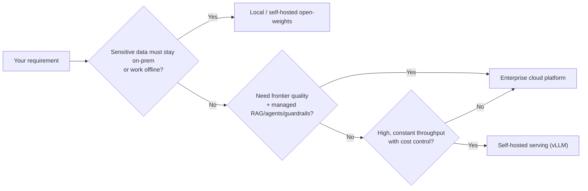

# Cloud vs Local Models

One of the first architectural decisions for any AI application is **where the model runs**. The two
poles are managed cloud platforms (you call an API, the provider hosts everything) and local / self-hosted
[open-weights models](./glossary.md#open-weights) (you download the weights and run them on your own
hardware). Most serious systems end up somewhere on the spectrum between them.

## The core trade-off

| Dimension | Enterprise cloud | Local / self-hosted |
|---|---|---|
| Model quality ceiling | Highest (frontier: Claude, GPT, Gemini) | Strong open-weights, usually a step behind frontier |
| Data residency / privacy | Leaves your network (subject to contracts) | Stays on your hardware; works offline |
| Setup effort | Minutes (API key) | Hardware + ops; more for production serving |
| Cost model | Per token / per API call; scales to zero | Hardware capex or fixed GPU rental; cheap per token at volume |
| Scaling | Provider's problem | Your problem (GPUs, autoscaling) |
| Customization | Prompting, RAG, light fine-tuning | Full control: any model, fine-tune, quantize |
| Best when | Bursty traffic, fast time-to-value, need managed services | Privacy/offline needs, high constant volume, full control |

## Enterprise cloud options

The cloud platforms are largely ways to *access* [foundation models](./glossary.md#foundation-model) via
API, plus managed [RAG](./rag.md), [agent](./agents.md), and guardrail services on top.

- **Amazon Bedrock** -- one API for models from Anthropic (Claude), Meta (Llama), Mistral, Cohere, and
  Amazon (Nova/Titan), plus **Knowledge Bases** (managed RAG), **Agents**, **Guardrails**, and **Flows**.
  Serverless, per-token pricing.
- **Amazon SageMaker AI** -- build, train, and fully control custom models; own the entire ML lifecycle
  (feature store, training jobs, model registry, monitoring). Serverful, per-hour pricing.
- **Azure AI / Microsoft Foundry** -- Microsoft's managed AI platform and agent service, integrated with
  the Azure ecosystem and OpenAI models.
- **Google Vertex AI** -- Gemini models, Agent Builder, and Vector Search on Google Cloud.

### Bedrock vs SageMaker (the most common AWS question)

A useful one-liner: **Bedrock** = use pre-trained models as-is or with light fine-tuning and get managed
RAG/agents/guardrails. **SageMaker AI** = build, train, and fully control custom models.

| | Bedrock | SageMaker AI |
|---|---|---|
| Primary purpose | Consume + lightly adapt foundation models | Build, train, deploy custom models |
| Target users | Developers, product engineers | Data scientists, ML engineers |
| Infrastructure | Serverless | Serverful (granular compute) |
| Pricing | Per token / API call | Per compute hour + storage |
| Model ownership | Provider-managed | Your models, your weights |

Most production AI systems use **both**: Bedrock Agents + Knowledge Bases + Guardrails for the
conversational layer, with SageMaker endpoints serving custom domain models (fraud, recommendations)
called as tools. Rule of thumb on cost: bursty or unpredictable traffic favors serverless (Bedrock);
constant high volume favors dedicated capacity (SageMaker endpoints, or self-hosting).

## Local model usage

Running open-weights models (Llama, Mistral, Qwen, DeepSeek, Phi, Gemma) yourself keeps data on your
hardware, works offline, and removes per-token cost -- at the price of owning the hardware and operations.
The tooling has matured to the point where a laptop can run useful models.

| Tool | What it is | Best for |
|---|---|---|
| **Ollama** | Simple CLI + local API server for open-weights models | Easiest local setup; dev and scripting |
| **LM Studio** | Desktop GUI for discovering, downloading, and chatting with models | Non-CLI users; quick experimentation |
| **llama.cpp** | High-performance C/C++ inference engine (GGUF format) | Maximum control; runs on CPU and modest GPUs |
| **GPT4All** | Desktop app + ecosystem for local chat | Friendly offline assistant |
| **OpenWebUI** | Self-hosted web chat UI (often paired with Ollama) | A private ChatGPT-style interface |
| **vLLM** | High-throughput GPU serving engine | Production self-hosting at scale |

The practical limit is **VRAM**: pick the largest parameter count that fits your GPU memory, which is
where quantization comes in.

### Quantization and QLoRA make local models practical {#quantization-and-qlora}

[Quantization](./glossary.md#quantization) replaces model weights with lower-precision approximations to
cut memory use (and sometimes speed up inference). Modern 4-bit formats (NF4 with double quantization)
have minimal quality loss for most tasks while shrinking footprint dramatically -- a 3.8B model drops from
~15 GB at FP32 to ~2.2 GB at 4-bit, which is what lets it fit on a consumer GPU.

[QLoRA](./glossary.md#qlora) builds on this: quantize the base model to 4-bit, freeze it, and train small
[LoRA](./glossary.md#lora) adapters on top. It is the standard recipe for fine-tuning a moderate-size LLM
on a single consumer GPU -- domain adaptation without renting a cluster. See
[RAG vs fine-tuning](./rag.md#rag-vs-fine-tuning) for when adaptation is worth it at all (usually:
RAG for facts, fine-tune for style).

### Worked local setups

- **Build your own app** -- run a model with Ollama or LM Studio and call it from a tiny app you write:
  [Build a Local LLM App](./local-llm-app.md).
- **Local coding assistant** -- an offline, self-hosted GitHub Copilot alternative (Ollama + Continue.dev):
  [How to set up a local and offline Copilot alternative](../other/local-llm-for-coding.md).

## A practical default

- **Prototyping or low/bursty volume, no strict data-residency need** -- start with a managed cloud API.
  Fastest to value, frontier quality, scales to zero.
- **Sensitive data, offline requirements, or heavy local experimentation** -- run open-weights models
  locally with Ollama or LM Studio; quantize to fit your hardware.
- **High, constant production throughput** -- self-host with vLLM (or dedicated cloud endpoints) for
  predictable cost control.
- **Hybrid is normal** -- frontier cloud models for hard reasoning, smaller local/self-hosted models on
  hot, latency-sensitive, or privacy-sensitive paths.

## See also

- [Cost, Latency & Model Routing](./cost-and-latency.md) -- when local wins on cost and privacy
- [Privacy & Data Handling](./privacy-and-data.md) -- data residency and on-prem inference
- [Large Language Models](./llm.md) -- foundation, frontier, and open-weights distinctions
- [RAG](./rag.md) -- managed (Bedrock Knowledge Bases) vs self-hosted retrieval
- [Tooling and Frameworks](./tooling.md) -- model serving and LLMOps
- [Build a Local LLM App](./local-llm-app.md) -- run Ollama/LM Studio and call it from your own app
- [Local & offline Copilot alternative](../other/local-llm-for-coding.md) -- a hands-on Ollama setup
- [AI Glossary](./glossary.md) -- open-weights, quantization, QLoRA, foundation model, and more
