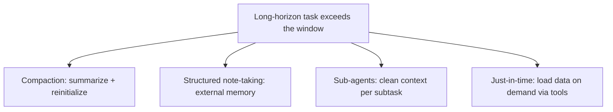

# Context & Prompt Engineering

Everything an [LLM](./llm.md) knows for a single response either lives in its frozen weights or is placed
in its **context** for that call. Because the model is stateless, managing what goes into the context is one
of the highest-leverage things you do when building LLM applications. This page covers the context window as
a resource, how prompt engineering grew into context engineering, and the techniques that keep long-running
[agents](./agents.md) coherent.

## Context is a finite, engineered budget

The **[context window](./glossary.md#context-window)** is the maximum block of [tokens](./glossary.md#token)
a model can attend to at once. The defining property to internalize: **an LLM is stateless** -- it remembers
nothing between calls. The system prompt, the conversation so far, retrieved documents, and tool outputs all
have to be placed inside the context of *each* call. A chatbot "remembers" earlier messages only because you
resend them every turn.

A typical production prompt assembles several pieces into one window:

- **System prompt / instructions** -- who the model is and how it should behave.
- **Conversation history** -- previous turns, re-sent every time.
- **Retrieved data** -- chunks pulled in by [RAG](./rag.md) for grounding.
- **Tool definitions and results** -- what the model may call and what it returned.
- **The user's current query.**

Treating the window as a hard budget is the core insight, because:

- **It costs money and time.** Every token is an input token you pay for and that adds latency on every call.
- **More is not better.** Models recall less reliably as the window fills -- the "lost in the middle" effect.
- **It fills up.** Long runs eventually exceed the window, forcing you to drop or summarize older content.

So the engineering question is never "how much can I stuff in?" but "what is the *minimum, most relevant* set
of tokens that lets the model do this task well?"

## Context vs training knowledge

| | Training knowledge | Context |
|---|---|---|
| Source | Baked into weights during training | Supplied at inference time |
| Freshness | Frozen at the training cutoff | As current as what you put in |
| Specificity | Generic, world-scale | Your data, this user, this task |
| How to change it | Retrain / fine-tune (expensive) | Change the prompt (free, instant) |

This split is *why* [RAG](./rag.md) exists: rather than retraining on your documents, retrieve the relevant
pieces and place them in the context at inference time.

## From prompt engineering to context engineering

**[Prompt engineering](./glossary.md#prompt-engineering)** is the original discipline: writing and organizing
instructions -- especially system prompts -- for optimal output. Often declared "dead", it is in practice more
important than ever, just rebranded to capture a wider scope.

**[Context engineering](./glossary.md#context-engineering)** is the successor for the agentic era: curating
and maintaining the optimal set of tokens across *many turns* of inference, not just one. The progression:

- **Blind prompting** -- a short task description typed into a chat box.
- **Prompt engineering** -- thoughtful design of structure and context for a specific task.
- **Context engineering** -- architecting the *full* context across all turns (system prompt, tools, MCP,
  retrieved data, message history, memory), with eval pipelines to measure whether tactics work.

> Good context engineering means finding the smallest possible set of high-signal tokens that maximize the
> likelihood of some desired outcome.

### Techniques

- **System prompt at the "right altitude"** -- concrete enough to guide, flexible enough to allow heuristics.
  Avoid both brittle if/else logic and vague hand-waving.
- **Token-efficient, unambiguous tools** -- bloated, overlapping tool sets are the most common failure mode.
- **Curated few-shot examples** -- a few diverse canonical examples beat exhaustive edge-case enumeration.
- **Structured I/O** -- delimiters, JSON schemas, and explicit field types reduce ambiguity.

## Context rot: the constraint behind the techniques

**[Context rot](./glossary.md#context-rot)** is the empirical phenomenon that as the number of tokens grows,
the model's ability to accurately recall information from the context *decreases* -- "needle-in-a-haystack
degradation". Two causes stack:

1. **O(n^2) attention.** Every token attends to every other token, so the attention budget gets stretched
   thin as context grows.
2. **Training-data distribution.** Short sequences dominate training data, so models have less experience
   with context-wide dependencies.

The consequence: bigger context windows are not a solution. Context is a finite resource with diminishing
returns, and performance is a gradient, not a cliff. A practitioner framing calls the productive range the
"Smart Zone" (first ~100k tokens) and the degraded range the "Dumb Zone".

## Long-horizon techniques

When a task outgrows a single clean window, four techniques (which combine well) keep an agent coherent:

| Technique | What it does | Best for |
|---|---|---|
| **[Context compaction](./glossary.md#context-compaction)** | Summarize a near-full conversation and reinitialize with the summary | Conversational flow with extensive back-and-forth |
| **[Structured note-taking](./glossary.md#structured-note-taking)** | Agent writes to a persistent store outside the window and reads it back | Iterative work with clear milestones |
| **[Sub-agent architecture](./glossary.md#sub-agent)** | A lead agent delegates to sub-agents that explore in clean windows and return distilled summaries | Complex research where parallel exploration pays off |
| **[Just-in-time context](./glossary.md#just-in-time-context)** | Keep lightweight references (paths, queries, links); load data on demand via tools | Codebases and file systems where structure carries signal |

- **Compaction** keeps architectural decisions, unresolved bugs, and key details while discarding redundant
  tool outputs. Maximize recall first, then improve precision. Clearing stale tool results is its
  safest, lightest-touch form.
- **Structured note-taking** is as simple as a `NOTES.md` scratchpad the agent reads and writes -- the
  approach behind agents that sustain multi-hour tasks across context resets.
- **Sub-agents** isolate detailed search context so the lead agent only synthesizes distilled results.
- **Just-in-time retrieval** mirrors human cognition: we navigate file systems and bookmarks rather than
  memorizing a corpus. The trade-off is that runtime exploration is slower than pre-computed retrieval, so
  hybrid strategies (some data up front, exploration at runtime) are the default for capable agents. This is
  the trend pulling agent design [away from pure pre-inference RAG](./knowledge-management.md).

## See also

- [Large Language Models](./llm.md) -- statelessness is why everything must be in-context
- [AI Agents](./agents.md) -- the systems these long-horizon techniques serve
- [RAG](./rag.md) -- one technique within context engineering
- [Knowledge Management with LLMs](./knowledge-management.md) -- persistent synthesis vs ephemeral retrieval
- [Evaluation and LLMOps](./evaluation-and-llmops.md) -- measuring whether context tactics actually work
- [AI Glossary](./glossary.md) -- context window, context rot, compaction, sub-agents, and more
