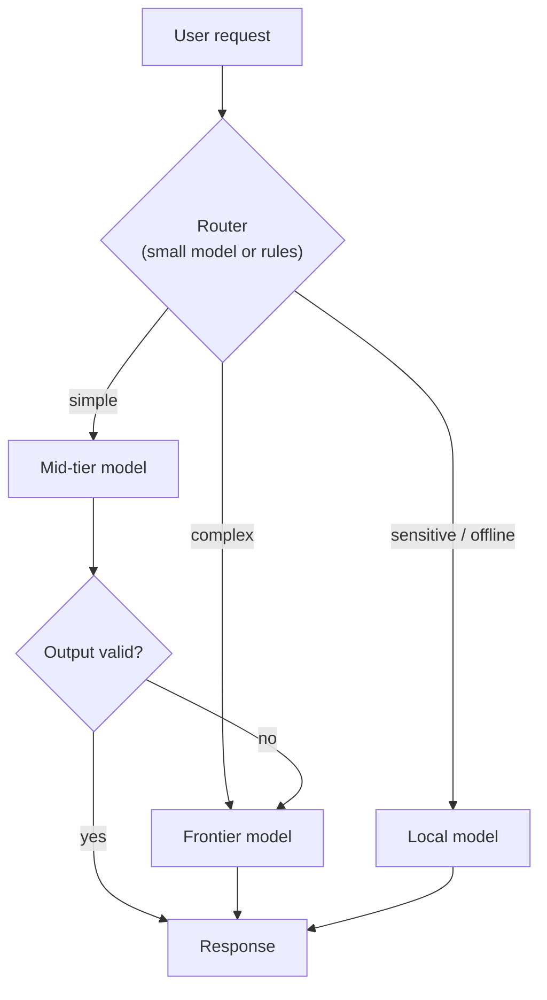

# Cost, Latency & Model Routing

Every [LLM](./llm.md) call has a price and a wait time. Both scale with context size, model tier, and how
many times you call the model in a single user request -- especially in [agent](./agents.md) loops where one
user message can fan out to dozens of tool-use rounds. This page is the practical economics layer behind
[context engineering](./context-engineering.md) and [cloud vs local](./cloud-vs-local.md): how to spend
less, respond faster, and route work to the right model without guessing.

## What drives cost

Cost is almost always **tokens in + tokens out**, multiplied by the provider's per-million-token rate for
that model tier. Input and output are priced separately; output is often more expensive per token.

| Cost driver | Why it matters |
|---|---|
| **Context size** | System prompt, history, [RAG](./rag.md) chunks, tool definitions, and tool results all count as input tokens on every call |
| **Output length** | Long answers, verbose tool schemas, and chain-of-thought all add output tokens |
| **Call count** | [Agents](./agents.md) and multi-step chains multiply cost; a 5-round agent loop is at least 5× one chat turn |
| **Model tier** | Frontier models (Claude Opus, GPT-4 class) can be 10–50× mid-tier models for the same token count |
| **Tool fan-out** | Each tool result is appended to context and re-sent on the next model call |

:::tip
Measure cost **per successful user outcome**, not per call. A cheap model that fails twice and retries can
cost more than one frontier call that succeeds.
:::

## What drives latency

Latency is time-to-first-token (streaming) plus time-to-complete. The dominant factors:

- **Model size and load** -- larger models and busy shared APIs add queue time.
- **Context length** -- more tokens to prefill before generation starts.
- **Sequential steps** -- agent loops and RAG (retrieve → rerank → generate) stack latency linearly unless parallelized.
- **Geography** -- round-trip to a distant region adds tens to hundreds of milliseconds per call.

Users feel latency most in interactive UI; batch and background jobs can tolerate seconds. Design routing
with that split in mind (see [AI in Products](./ai-in-products.md)).

## Model tiers: a practical default

You rarely need one model for everything. A common three-tier layout:

| Tier | Typical use | Examples |
|---|---|---|
| **Frontier** | Hard reasoning, ambiguous tasks, final synthesis, complex agent planning | Claude Opus/Sonnet, GPT-4 class, Gemini Pro |
| **Mid** | Most user-facing chat, RAG answers, code generation at scale | Claude Haiku/Sonnet, GPT-4o mini, Gemini Flash |
| **Small / local** | Classification, routing, extraction, high-volume or offline paths | Haiku, small open-weights via [Ollama](./local-llm-app.md), on-device models |

Rules of thumb:

- **Route easy work down, hard work up.** Use a cheap model to classify intent or extract fields; call frontier only when the cheap model flags uncertainty or the task requires it.
- **Do not use frontier for bulk.** Summarizing 10,000 tickets with Opus-class pricing is a budget incident; mid-tier or batch APIs exist for a reason.
- **Local wins on volume and privacy**, not always on quality -- see [Cloud vs Local Models](./cloud-vs-local.md).

## Model routing patterns

**Classifier → handler.** A small model (or rules) picks intent; a specialized prompt or model handles each branch. Cheapest when intents are distinct and classifiable.

**Cascade / fallback chain.** Try mid-tier first; if confidence is low, validation fails, or the user escalates, retry with frontier. Good when most requests are easy but edge cases need quality.

**Parallel + merge.** Run two models on the same task and compare or vote -- expensive, use only for high-stakes checks (see [human-in-the-loop](./human-in-the-loop.md)).

**Agent-specific routing.** Planner on frontier, workers on mid-tier; or restrict tool-heavy subtasks to models with strong function-calling at lower cost.

## Reducing cost without sacrificing quality

These levers appear repeatedly across production systems, in rough order of ROI:

1. **Shrink the context** -- drop stale tool results, summarize history, retrieve fewer [RAG](./rag.md) chunks. See [Context Engineering](./context-engineering.md).
2. **Prompt caching** -- providers cache repeated prefix tokens (system prompt, long docs) at a discount on subsequent calls. Structure prompts so stable content comes first.
3. **Cheaper retrieval** -- smaller [embedding](./embeddings.md) models, fewer chunks, hybrid search before reranking.
4. **Batch APIs** -- non-interactive work at lower per-token rates with higher latency tolerance.
5. **Structured outputs** -- shorter, schema-bound responses instead of rambling prose ([Structured Outputs](./structured-outputs.md)).
6. **Fewer agent rounds** -- tighter tools, clearer instructions, and human approval gates on expensive loops ([Human-in-the-Loop](./human-in-the-loop.md)).
7. **Eval-driven trimming** -- use [evaluation](./evaluation-and-llmops.md) to prove a cheaper model is good enough before switching tier.

## Caching strategies

| Cache type | What it caches | Best for |
|---|---|---|
| **Prompt / prefix cache** | Identical leading tokens across requests | Stable system prompts, long RAG context reused across users |
| **Semantic cache** | Similar queries → stored answers | FAQ-style support, repeated internal questions |
| **Result cache** | Exact input hash → output | Deterministic extraction, classification with fixed schemas |

Semantic caches need invalidation when underlying data changes -- treat them like any other cache with TTL
or event-driven busting, not a permanent truth store.

## Observability

You cannot optimize what you do not measure. At minimum, log per request:

- Model ID and tier
- Input/output token counts and estimated cost
- Latency (time to first token, time to complete)
- Route taken (which tier, fallback triggered or not)

Wire this into your [LLMOps](./evaluation-and-llmops.md) stack (LangSmith, Phoenix, Helicone, provider
dashboards). Set budgets and alerts before production traffic, not after the first surprise invoice.

## See also

- [Context & Prompt Engineering](./context-engineering.md) -- the context budget that drives both cost and latency
- [Cloud vs Local Models](./cloud-vs-local.md) -- where models run and the capex vs opex trade-off
- [Structured Outputs](./structured-outputs.md) -- shorter, validatable responses
- [AI in Products](./ai-in-products.md) -- when users need fast streaming vs tolerant background jobs
- [Evaluation & LLMOps](./evaluation-and-llmops.md) -- proving a cheaper tier is safe to ship
- [Which Pattern When?](./which-pattern-when.md) -- capstone guide for combining patterns
- [Debugging LLM Apps](./debugging-llm-apps.md) -- when cost or latency spikes in production
- [AI Glossary](./glossary.md) -- model routing, prompt caching, and related terms
