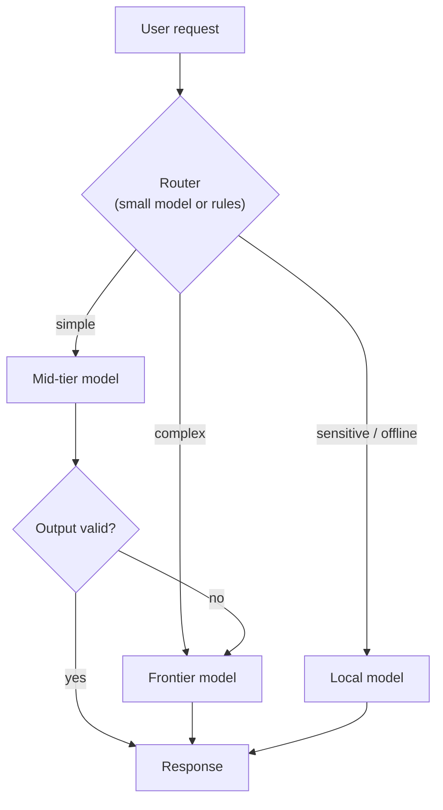

# Cost, Latency & Model Routing

Every [LLM](./llm.md) call has a price and a wait time. Both scale with context size, model tier, and how
many times you call the model in a single user request - especially in [agent](./agents.md) loops where one
user message can fan out to dozens of tool-use rounds. This page is the practical economics layer behind
[context engineering](./context-engineering.md) and [cloud vs local](./cloud-vs-local.md): how to spend
less, respond faster, and route work to the right model without guessing.

## What drives cost

Cost is almost always **tokens in + tokens out**, multiplied by the provider's per-million-token rate for
that model tier. Input and output are priced separately; output is often more expensive per token.

| Cost driver | Why it matters |
|---|---|
| **Context size** | System prompt, history, [RAG](./rag.md) chunks, tool definitions, and tool results all count as input tokens on every call |
| **Output length** | Long answers, verbose tool schemas, and visible or provider-internal reasoning all add output/reasoning tokens |
| **Call count** | [Agents](./agents.md) and multi-step chains multiply cost; a 5-round agent loop is at least 5× one chat turn |
| **Model tier** | Provider flagship/frontier models can cost many times more than mid-tier models for the same token count |
| **Tool fan-out** | Each tool result is appended to context and re-sent on the next model call |

:::tip
Measure cost **per successful user outcome**, not per call. A cheap model that fails twice and retries can
cost more than one frontier call that succeeds.
:::

## What drives latency

Latency is time-to-first-token (streaming) plus time-to-complete. The serving internals are covered in
[Serving LLMs at Scale](./llm-serving.md); from the API consumer side, track the experience users feel:

- **Model size and load** - larger models and busy shared APIs add queue time.
- **Context length** - more tokens to prefill before generation starts.
- **Sequential steps** - agent loops and RAG (retrieve → rerank → generate) stack latency linearly unless parallelized.
- **Geography** - round-trip to a distant region adds tens to hundreds of milliseconds per call.

| Metric | Meaning | Watch with |
|---|---|---|
| **TTFT** | Time to first token or first streamed event | p50, p95, p99 |
| **TPOT / ITL** | Time per output token, also called inter-token latency | p50, p95, p99 |
| **End-to-end latency** | User request start to final token or complete response | p50, p95, p99 |
| **Throughput** | Completed requests/s and output tokens/s | Model, route, tenant |

Users feel latency most in interactive UI; batch and background jobs can tolerate seconds. Design routing
with that split in mind (see [AI in Products](./ai-in-products.md)).

### Streaming and perceived latency

Streaming does not make the model do less work, but it can reduce perceived latency by showing progress at
TTFT instead of waiting for the full answer. Design the UI around partial output: show a clear loading state
before TTFT, stream text or structured events as they arrive, and keep cancellation visible for long
generations. Measure both TTFT and end-to-end latency because a great TTFT can still hide a slow, expensive
answer.

## Model tiers: a practical default

You rarely need one model for everything. A common three-tier layout:

| Tier | Typical use | Examples |
|---|---|---|
| **Frontier** | Hard reasoning, ambiguous tasks, final synthesis, complex agent planning | Claude Opus/Sonnet, OpenAI GPT flagship models, Gemini Pro |
| **Mid** | Most user-facing chat, RAG answers, code generation at scale | Claude Haiku/Sonnet, OpenAI mini models, Gemini Flash |
| **Small / local** | Classification, routing, extraction, high-volume or offline paths | Small hosted models, small open-weights via [Ollama](./local-llm-app.md), on-device models |

Rules of thumb:

- **Route easy work down, hard work up.** Use a cheap model to classify intent or extract fields; call frontier only when the cheap model flags uncertainty or the task requires it.
- **Do not use frontier for bulk.** Summarizing 10,000 tickets with Opus-class pricing is a budget incident; mid-tier or batch APIs exist for a reason.
- **Local wins on volume and privacy**, not always on quality - see [Cloud vs Local Models](./cloud-vs-local.md).

## Model routing patterns

**Classifier → handler.** A small model (or rules) picks intent; a specialized prompt or model handles each branch. Cheapest when intents are distinct and classifiable.

**Cascade / fallback chain.** Try mid-tier first; if confidence is low, validation fails, or the user escalates, retry with frontier. Good when most requests are easy but edge cases need quality.

**Parallel + merge.** Run two models on the same task and compare or vote - expensive, use only for high-stakes checks (see [human-in-the-loop](./human-in-the-loop.md)).

**Agent-specific routing.** Planner on frontier, workers on mid-tier; or restrict tool-heavy subtasks to models with strong function-calling at lower cost.


```mermaid
flowchart TB
    request["User request"] --> route{"Router<br/>(small model or rules)"}
    route -->|simple| mid["Mid-tier model"]
    route -->|complex| frontier["Frontier model"]
    route -->|sensitive / offline| local["Local model"]
    mid --> validate{"Output valid?"}
    validate -->|no| frontier
    validate -->|yes| done["Response"]
    frontier --> done
    local --> done
```

## Reducing cost without sacrificing quality

These levers appear repeatedly across production systems, in rough order of ROI:

1. **Shrink the context** - drop stale tool results, summarize history, retrieve fewer [RAG](./rag.md) chunks. See [Context Engineering](./context-engineering.md).
2. **Prompt caching** - providers cache repeated prefix tokens (system prompt, long docs); cache writes may
   cost more, but cache hits are discounted on subsequent calls. Structure prompts so stable content comes first.
3. **Cheaper retrieval** - smaller [embedding](./embeddings.md) models, fewer chunks, hybrid search before reranking.
4. **Batch APIs** - non-interactive work at lower per-token rates with higher latency tolerance.
5. **Structured outputs** - shorter, schema-bound responses instead of rambling prose ([Structured Outputs](./structured-outputs.md)).
6. **Fewer agent rounds** - tighter tools, clearer instructions, and human approval gates on expensive loops ([Human-in-the-Loop](./human-in-the-loop.md)).
7. **Eval-driven trimming** - use [evaluation](./evaluation-and-llmops.md) to prove a cheaper model is good enough before switching tier.

## Rate limits and retries

Provider limits usually combine request and token budgets. OpenAI's
[rate-limit docs](https://developers.openai.com/api/docs/guides/rate-limits) document RPM, RPD, TPM, TPD,
and related limits, while Anthropic's
[rate-limit docs](https://platform.claude.com/docs/en/api/rate-limits) document RPM, input tokens per
minute (ITPM), and output tokens per minute (OTPM). A `429` can mean a short-lived throttle, an acceleration
limit, or an account/billing limit, so inspect both HTTP status and the provider error body.

OpenAI's rate-limit docs render the wait header as `Retry-After`; Anthropic's docs render it as
`retry-after`. Treat HTTP header lookup case-insensitively. Retry only transient throttles or server errors,
cap attempts, and avoid replaying a streaming request after partial output unless the operation is
idempotent.

```python
import random
import time
from datetime import datetime, timezone
from email.utils import parsedate_to_datetime

import requests

RETRYABLE_STATUS = {429, 500, 502, 503, 504}


def retry_after_seconds(value):
    if not value:
        return None
    try:
        return max(0.0, float(value))
    except ValueError:
        try:
            retry_at = parsedate_to_datetime(value)
            return max(0.0, (retry_at - datetime.now(timezone.utc)).total_seconds())
        except (TypeError, ValueError, OverflowError):
            return None


def post_json_with_retry(url, payload, headers, max_attempts=5):
    for attempt in range(max_attempts):
        r = requests.post(url, json=payload, headers=headers, timeout=60)
        if r.ok:
            return r.json()
        if r.status_code not in RETRYABLE_STATUS or attempt == max_attempts - 1:
            r.raise_for_status()

        wait = retry_after_seconds(r.headers.get("retry-after"))
        if wait is None:
            wait = random.uniform(0.0, min(30.0, 1.0 * (2**attempt)))
        time.sleep(wait)

    raise RuntimeError("unreachable")
```

## Batch APIs for offline work

If the user does not need an immediate response, use provider batch endpoints instead of synchronous calls.
OpenAI's [Batch API](https://developers.openai.com/api/docs/guides/batch) documents asynchronous jobs with a
24-hour completion window and a 50% cost discount. Anthropic's
[Message Batches API](https://platform.claude.com/docs/en/build-with-claude/batch-processing) documents
asynchronous Messages requests, most batches finishing in less than 1 hour, access to results after
completion or 24 hours, and usage charged at 50% of standard API prices. Good fits: nightly evals, bulk
classification, embeddings, migrations, and backfills.

## Caching strategies

| Cache type | What it caches | Best for |
|---|---|---|
| **Prompt / prefix cache** | Identical leading tokens across requests | Stable system prompts, long RAG context reused across users |
| **Semantic cache** | Similar queries → stored answers | FAQ-style support, repeated internal questions |
| **Result cache** | Exact input hash → output | Deterministic extraction, classification with fixed schemas |

Semantic caches need invalidation when underlying data changes - treat them like any other cache with TTL
or event-driven busting, not a permanent truth store.

### Prompt-cache-friendly request layout

Prompt caches reuse a matching prefix, so layout matters:

- Put static instructions, policy, examples, long shared documents, and stable tool definitions first.
- Put user-specific, time-sensitive, and retrieved content last.
- Keep tool names, descriptions, schemas, ordering, and structured-output schemas stable between calls.
- Append conversation turns instead of inserting timestamps, random IDs, or request-specific notes before a
  cacheable prefix.

OpenAI [prompt caching](https://developers.openai.com/api/docs/guides/prompt-caching) is enabled by default
for supported models; its docs say GPT-5.6 and later require a minimum cacheable prompt length of 1,024
tokens, while earlier models vary by request settings. Anthropic
[prompt caching](https://platform.claude.com/docs/en/build-with-claude/prompt-caching) uses `cache_control`
for automatic caching or explicit cache breakpoints; its docs say the cached prefix is `tools`, `system`,
and `messages` in that order, with a 5-minute default lifetime and a 1-hour option at additional cost.

## Observability

You cannot optimize what you do not measure. At minimum, log per request:

- Model ID and tier
- Input/output token counts and estimated cost
- Latency (time to first token, time to complete)
- Route taken (which tier, fallback triggered or not)

Wire this into your [LLMOps](./evaluation-and-llmops.md) stack (LangSmith, Phoenix, Helicone, provider
dashboards). Set budgets and alerts before production traffic, not after the first surprise invoice.

## See also

- [Context & Prompt Engineering](./context-engineering.md) - the context budget that drives both cost and latency
- [Serving LLMs at Scale](./llm-serving.md) - prefill, decode, TTFT, TPOT, batching, and prefix reuse
- [Cloud vs Local Models](./cloud-vs-local.md) - where models run and the capex vs opex trade-off
- [Structured Outputs](./structured-outputs.md) - shorter, validatable responses
- [AI in Products](./ai-in-products.md) - when users need fast streaming vs tolerant background jobs
- [Evaluation & LLMOps](./evaluation-and-llmops.md) - proving a cheaper tier is safe to ship
- [Which Pattern When?](./which-pattern-when.md) - capstone guide for combining patterns
- [Debugging LLM Apps](./debugging-llm-apps.md) - when cost or latency spikes in production
- [AI Glossary](./glossary.md) - model routing, prompt caching, and related terms
