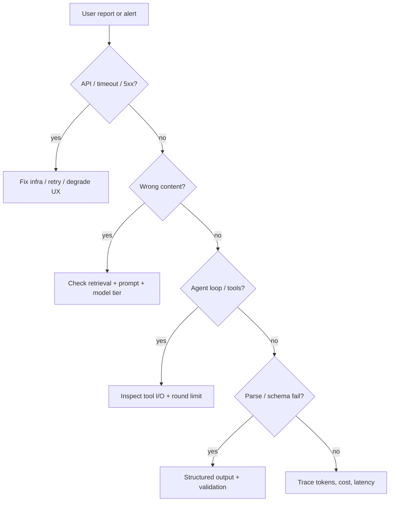

# Debugging LLM Apps

[LLM](./llm.md) applications fail in ways traditional software does not: the same input can produce different
output, "bugs" look like bad judgment, and the fault may sit in the prompt, retrieval, tools, model tier, or
user data -- not your business logic. This page is a **production runbook**: classify the symptom, inspect
the right layer, and avoid fixing random prompts when the problem is elsewhere. Pair it with
[Evaluation & LLMOps](./evaluation-and-llmops.md) for prevention and [Which Pattern When?](./which-pattern-when.md)
for architecture choices.

## Step zero: classify the failure

| Symptom class | Likely layers | First checks |
|---|---|---|
| **Infrastructure** | API, network, quotas | Status codes, rate limits, timeouts, provider status |
| **Wrong or hallucinated content** | Prompt, RAG, model tier | Retrieved chunks, citations, eval set regression |
| **Unparseable / schema errors** | Structured output, tools | Validator errors, repair loop logs |
| **Agent stuck or looping** | Tools, agent instructions | Round count, repeated tool calls, context size |
| **Slow or expensive** | Routing, context, agent depth | Token counts, model ID, retrieval size |
| **Unsafe or policy violation** | Safety, injection, tools | User input, retrieved text, tool permissions |
| **Intermittent** | Nondeterminism, routing, cache | Temperature, fallback tier, stale cache |

Write down which class you are in before changing code. Mixed symptoms are common -- fix infrastructure first,
then content quality.

## What to collect for every incident

Minimum debug bundle (most [LLMOps](./evaluation-and-llmops.md) tools capture this):

- Request ID, timestamp, user/tenant (redacted per [privacy](./privacy-and-data.md))
- Model ID and parameters (temperature, max tokens)
- Full prompt messages **or** hash + stored trace if PII-heavy
- For [RAG](./rag.md): query, retrieved chunk IDs/scores, reranker output
- For [agents](./agents.md): each tool name, input, output, latency per round
- Token counts and estimated cost
- Final output and any validation errors

If you cannot reproduce without this, you are guessing.

## Wrong answers (chat and RAG)

### 1. Is it hallucination or missing context?

- **No relevant retrieval** -- empty or low-score chunks → indexing, chunking, embedding model, or query rewrite
- **Relevant chunks retrieved but ignored** -- prompt burying context, [context rot](./context-engineering.md),
  or model tier too weak → reorder prompt, summarize chunks, upgrade tier on hard queries
- **Answer contradicts sources** -- [groundedness](./glossary.md#groundedness) failure → cite-or-refuse instructions,
  eval faithfulness scorers, reranker

### 2. Did retrieval poison the answer?

[Prompt injection](./safety.md) via documents is common in RAG. Check whether retrieved text contains
instructions. Mitigate: source trust tiers, sanitization, separate system vs document channels.

### 3. Regression or drift?

Compare against a fixed [eval set](./evaluation-and-llmops.md). If yesterday passed and today fails:
prompt/version change, model swap, embedding reindex incomplete, or corpus update.

**Quick fixes (in order):** better chunks → reranker → prompt/citations → model tier → eval gate before deploy.

## Structured output and tool failures

From [Structured Outputs](./structured-outputs.md):

- Log **validation errors** verbatim -- missing fields, wrong enum, extra keys
- Check whether native schema mode is enabled or you are prompt-only JSON
- One repair retry is normal; repeated failure → schema too large or ambiguous instructions
- Tool failures: wrong arguments often mean bad tool **descriptions** (treat as prompt engineering)

## Agent loops

Symptoms: never finishes, repeats the same tool, or cost spikes.

| Observation | Likely cause | Fix |
|---|---|---|
| Same tool, same args repeatedly | No exit condition; tool error swallowed | Max rounds; surface tool errors to model; fix tool |
| Explores forever | Goal too vague | Narrow task; structured plan step; sub-agent with summary |
| Wrong tool chosen | Tool sprawl / overlap | Fewer tools; clearer names and descriptions |
| Context exceeded mid-loop | Tool outputs too large | Truncate/summarize results; [compaction](./context-engineering.md) |

Always cap **max iterations** and log when the cap hits -- that is a product signal, not just a safety net.
High-impact tools still need [human-in-the-loop](./human-in-the-loop.md).

## Latency and cost spikes

See [Cost, Latency & Model Routing](./cost-and-latency.md):

- Sudden cost ↑ -- new traffic, agent loop, larger context, wrong model ID, cache miss
- p95 latency ↑ -- longer prompts, retrieval slowness, queue on provider, sequential agent steps

Dashboards: tokens/request, cost/request, rounds/agent session, retrieval latency, model tier mix.

## Safety and abuse

- Spike in refusals -- policy or guardrail change
- Unexpected harmful output -- jailbreak or injection; check full trace including retrieved content
- Tool exfiltration -- agent fetched data it should not; tighten tool queries and ACLs

Cross-reference [Safety & Guardrails](./safety.md) and [Privacy & Data Handling](./privacy-and-data.md).

## Local vs cloud

| Issue | Cloud | Local / self-hosted |
|---|---|---|
| OOM / crash | N/A (provider) | Quantization, smaller model, GPU RAM |
| Stale model behavior | Provider update | Pin model file/version; document in runbook |
| CORS / browser | API key exposure risk | [Local LLM app](./local-llm-app.md) proxy pattern |

## Fix workflow (do not skip steps)

1. **Reproduce** with saved trace or minimal fixture
2. **Isolate layer** -- disable RAG, then tools, then swap model tier
3. **One change at a time** -- LLM stacks punish shotgun edits
4. **Add eval case** so the bug does not return silently
5. **Document** in team runbook or postmortem

## When to escalate vs patch

- **Patch in prompt** -- single edge case, clear missing instruction
- **Fix retrieval/tools** -- systematic wrong facts or actions
- **Change architecture** -- chronic loop/cost issues ([Which Pattern When?](./which-pattern-when.md))
- **Human queue** -- high-stakes errors until eval proves fix ([Human-in-the-Loop](./human-in-the-loop.md))

## See also

- [Evaluation & LLMOps](./evaluation-and-llmops.md) -- evals and traces before incidents happen
- [Which Pattern When?](./which-pattern-when.md) -- avoid wrong architecture early
- [RAG](./rag.md) -- retrieval production levers
- [AI Agents](./agents.md) -- tool use and multi-agent failure modes
- [Structured Outputs](./structured-outputs.md) -- validation and repair
- [AI in Products](./ai-in-products.md) -- user-visible failure states
- [AI Glossary](./glossary.md) -- groundedness, context rot, and related terms
