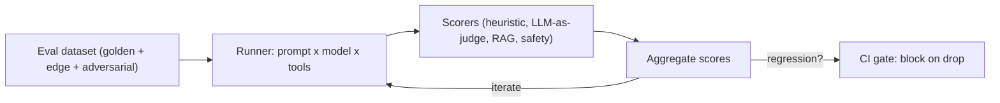

# Evaluation & LLMOps

You cannot ship an LLM application the way you ship ordinary code, because its output is non-deterministic --
the same input can produce different output. Evaluation answers "is it good enough, often enough?" and
**[LLMOps](./glossary.md#llmops)** is the discipline of operating the whole system in production. This page
is the deep dive behind the [LLMOps overview on the Tooling page](./tooling.md#llmops-tying-it-together).

## LLM evaluation

**LLM evaluation** ("eval") measures whether an LLM application actually does its job - the equivalent of a
test suite for a system you cannot test with `assertEquals`. It replaces "did it return exactly X?" with "is
the output good enough by these criteria, often enough?"

An eval is built from three parts:

1. **A dataset** - representative inputs, optionally paired with reference answers. Curate it from real or
   realistic cases, including edge cases and known failures.
2. **A predict function** - the thing under test: your prompt, chain, or [agent](./agents.md).
3. **Scorers** - functions that grade each output. The result is *aggregate scores* across the dataset, not
   a single pass/fail.

### Kinds of scorers

| Scorer type | Examples | When to use |
|---|---|---|
| Deterministic / heuristic | exact match, regex, JSON-schema validity, latency, cost | Objective, cheap checks |
| **[LLM-as-judge](./glossary.md#llm-as-judge)** | a second LLM rates against a rubric (helpfulness, correctness, tone) | Open-ended output with no single right answer |
| Reference-based | semantic similarity / factual overlap vs a golden answer | When known-good answers exist |
| RAG-specific | **[groundedness](./glossary.md#groundedness)** / faithfulness, context relevance, answer relevance | Did the answer stick to retrieved sources or [hallucinate](./llm.md#hallucination)? |
| Safety | refusal rate, toxicity, PII leakage | Overlaps with [guardrails](./safety.md) |

LLM-as-judge is powerful but must be **calibrated against human judgment** - treat the judge as a model that
itself needs validation.

## Eval-driven development

Build the eval *first*, then iterate the application against it - the LLM analogue of test-driven
development. Every prompt tweak, model swap, or retrieval change is judged by whether eval scores improve,
not by eyeballing a few outputs. **Golden traces** (known-good example runs) act as regression tests. This is
what separates "I read some outputs and they looked fine" from a defensible quality story.

## Harness engineering

**[Harness engineering](./glossary.md#harness-engineering)** is building the evaluation and execution
scaffolding that turns a non-deterministic model into a testable, observable, comparable system. A harness
consists of: eval datasets, a runner, judges, a diff/regression view, trace capture (every model and tool
call recorded), and CI integration that blocks deploys when metrics regress.

Two reasons the field coined a new word instead of "tests":

1. **Non-determinism is the default.** A unit test asserts equality; a harness asserts statistical properties
   over many runs, so it must resample and aggregate.
2. **The system under test is dynamic.** Prompt, model, tools, retrieval index, and even tokenizer all
   change. The harness pins them as a versioned bundle and re-evaluates when any changes.

Put differently: prompt engineering optimizes the input; harness engineering optimizes your ability to *know
whether the optimization worked*. For [agents](./agents.md), a single harness over the top-level prompt is
too coarse - you need harnesses at the tool-selection, planner, and final-answer levels, all backed by
replayable traces.

## LLMOps

**LLMOps** is the operational discipline of running LLM apps and agents in production: the LLM-flavored
sibling of [MLOps](./glossary.md#mlops). The central shift is from *retraining* as the core loop to
*prompt + retrieval + tool* changes as the core loop.

| Concern | Classical MLOps | LLMOps |
|---|---|---|
| Primary artifact | model weights | prompt + tools + model + RAG index |
| Versioning unit | model checkpoint | prompt x model x tool spec |
| Failure mode | distribution drift | hallucination, jailbreak, agent stall |
| Evaluation | accuracy / AUC vs labels | groundedness, helpfulness, safety (often LLM-as-judge) |
| Latency | usually static | tail-sensitive, scales with token count |
| Cost profile | training-heavy, serving-cheap | training-free, serving-expensive per token |

LLMOps covers: model + prompt versioning (pin model + tokenizer + system prompt as one artifact), prompt
management (registry, A/B testing, rollback), evaluation in CI and in production, cost/latency optimization
(token budgeting, caching, model cascading from small to large), monitoring (input/output drift, refusal
rate, groundedness, p50/p95 latency, per-tenant cost), and incident response runbooks for non-deterministic
failures.

### Evaluation runs continuously, not once

Eval is not a pre-launch gate. Wire it into the production loop:

- **In CI** - run the eval on every change so a prompt edit cannot silently regress quality before shipping.
- **In production** - sample live traffic and score it continuously to catch **quality drift** as real
  inputs diverge from your test set.

## The MLOps foundation underneath

When the model is custom rather than a hosted LLM, classical **[MLOps](./glossary.md#mlops)** applies. Its
maturity is often described in three levels (Google Cloud's model):

- **Level 0 - Manual.** Notebook-driven, manual handoffs, infrequent releases, minimal monitoring. Failure
  mode: silent model staleness and training-serving skew.
- **Level 1 - Pipeline automation.** Continuous training triggered by new data, with a feature store, data
  validation, and metadata/lineage tracking.
- **Level 2 - CI/CD automation.** Automated testing, building, and deployment of pipelines, with a model
  registry, ML metadata store, and orchestrator closing the loop.

The key MLOps failure modes - training-serving skew, model staleness, and unmanaged infrastructure debt --
are exactly what monitoring and testing exist to prevent. LLMOps inherits all of them and adds prompt
versioning, RAG/embedding pipelines, token economics, and eval harnesses on top.

## See also

- [Tooling and Frameworks](./tooling.md) - the observability and eval tool landscape (LangSmith, MLflow, Ragas)
- [Cost, Latency & Model Routing](./cost-and-latency.md) - measuring and optimizing production spend
- [Structured Outputs](./structured-outputs.md) - deterministic scorers for schema-valid output
- [AI Agents](./agents.md) - why agents make every LLMOps concern harder
- [RAG](./rag.md) - what groundedness/faithfulness scorers evaluate
- [AI Safety & Guardrails](./safety.md) - safety scorers and red-teaming inputs
- [Debugging LLM Apps](./debugging-llm-apps.md) - incident response when evals miss a failure
- [Which Pattern When?](./which-pattern-when.md) - architecture choices evals should reflect
- [AI Glossary](./glossary.md) - LLM-as-judge, groundedness, harness engineering, MLOps, and more
