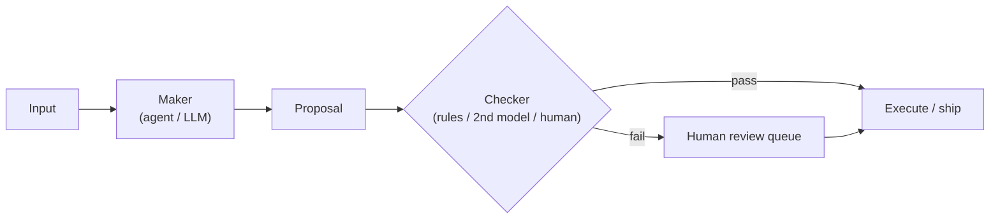

# Human-in-the-Loop

[Agents](./agents.md) that call tools can send email, modify databases, deploy code, and charge customers.
**Human-in-the-loop (HITL)** design decides when the model may act alone, when a person must approve, and
how you record what happened. It connects [AI in Products](./ai-in-products.md) trust UX, [AI Safety](./safety.md),
and production [agent](./agents.md) patterns -- without requiring ML expertise.

## Why autonomy needs bounds

Fully autonomous agents optimize for task completion, not your risk appetite. Failure modes include:

- Wrong but confident tool calls (delete prod, email the wrong customer)
- [Prompt injection](./safety.md) steering an agent through a trusted channel
- Cascading errors in [multi-agent](./agents.md#multi-agent-patterns) systems amplified ~17× without an orchestrator

HITL is not "AI is bad" -- it is **risk management**: automate the boring parts, keep humans on the hook
for irreversible or high-impact decisions.

## The autonomy spectrum

| Level | Behavior | Example |
|---|---|---|
| **Suggest only** | Model proposes; user executes every action | Draft reply, user clicks Send |
| **Confirm before act** | Model prepares tool call; user approves once | "Deploy to staging?" [Approve] [Edit] [Cancel] |
| **Act with audit** | Model executes; human reviews log after | Auto-tag tickets; supervisor samples queue |
| **Fully autonomous** | Model acts within pre-approved policy | Read-only search, internal summarization of public docs |

Most production systems mix levels by action type -- not one global setting.

## Maker-checker

A production-hardened pattern (also referenced in [Agents](./agents.md)):

1. **Maker** -- [agent](./agents.md) or model produces a result or proposed action.
2. **Checker** -- independent verification against the same inputs (second model, rule engine, or human).
3. **Agreement** -- auto-proceed only when both pass.
4. **Disagreement** -- route to human review or safe fallback.

The checker need not be another LLM. Schema validation, diff against golden output, policy rules, and
statistical sampling all qualify. A pipeline with no checker is a prototype on live data.

## When to require approval

Use explicit gates before:

- **Irreversible actions** -- delete, publish externally, financial transactions
- **Broad blast radius** -- production deploy, mass email, ACL changes
- **Low model confidence** -- router or self-reported uncertainty above threshold
- **Policy edge cases** -- content near [guardrail](./safety.md) boundaries
- **First use of a new tool or skill** -- until evals prove reliability ([Evaluation & LLMOps](./evaluation-and-llmops.md))

Skip approval for read-only, idempotent, or easily reversible steps -- but still **log** them.

## Confidence and escalation

Models do not ship reliable calibrated confidence scores out of the box. Practical proxies:

- **Structured self-assessment** -- `{ "answer": "...", "confidence": "low|medium|high" }` with validation
  ([Structured Outputs](./structured-outputs.md)); treat as hint, not truth
- **Router uncertainty** -- classifier below threshold → escalate tier or human
- **Validation failure** -- schema or business rule fails → repair loop then human ([Structured Outputs](./structured-outputs.md))
- **User escalation** -- always visible "This is wrong" / "Get a human"

Escalation queues need SLAs and tooling -- not a mailbox nobody reads.

## UX for approval

From [AI in Products](./ai-in-products.md):

- Show **what will happen** in plain language, not raw JSON tool payloads
- Allow **edit before approve** -- user fixes parameters without re-prompting the whole agent
- **Batch related approvals** -- five file deletes → one confirmation with list
- **Do not train users to click through** -- if everything requires approve, autonomy failed upstream

Background HITL: agent completes work, human reviews a summary queue (content moderation, expense reports).

## Audit trails

For accountability and debugging, log at minimum:

- User and session identity
- Model and prompt version (or skill/rule IDs)
- Tools invoked with inputs and outputs (redacted per [Privacy & Data Handling](./privacy-and-data.md))
- Approval decisions (who, when, approve/reject/edit)
- Final outcome

Retention and access control on these logs are compliance concerns, not afterthoughts.

## Cost and latency trade-offs

Humans add latency and staffing cost. Mitigate with:

- HITL only on high-risk branches ([Cost & Latency](./cost-and-latency.md) -- cheap models for draft, human for sign-off)
- Sampling instead of 100% review once error rates are low
- [Evals](./evaluation-and-llmops.md) to shrink the set of cases that reach humans over time

## See also

- [AI Agents](./agents.md) -- tool use, multi-agent patterns, maker-checker intro
- [AI in Products](./ai-in-products.md) -- approval UX and trust
- [Structured Outputs](./structured-outputs.md) -- validation before auto-proceed
- [AI Safety & Guardrails](./safety.md) -- attacks that HITL helps contain
- [Evaluation & LLMOps](./evaluation-and-llmops.md) -- reducing human load safely
- [AI Glossary](./glossary.md) -- human-in-the-loop and related terms
