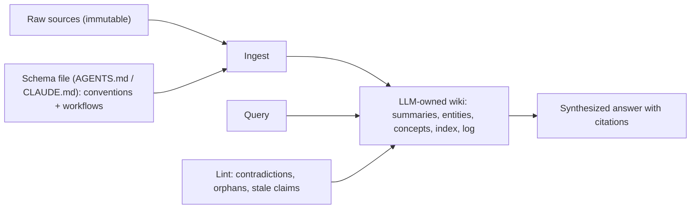

# Knowledge Management with LLMs

Using LLMs to build and maintain organized knowledge -- personal, team, or organizational -- comes down to one
design axis: **where does the LLM's synthesized knowledge live, and who maintains it?** This page maps the
patterns on that axis and when to use each. It is the conceptual companion to [RAG](./rag.md),
[Embeddings](./embeddings.md), and [Context & Prompt Engineering](./context-engineering.md).

## The axis: persistent synthesis vs ephemeral retrieval

| Pattern | Where synthesis lives | Persistence | Who maintains | Cost per query |
|---|---|---|---|---|
| [RAG](./glossary.md#rag) | Nowhere -- re-derived each query | None | Embedding refresh on doc change | Retrieval + inference |
| [Just-in-time context](./glossary.md#just-in-time-context) | Agent's working context only | Single conversation | Agent navigates with tools | Tool calls + inference |
| [Structured note-taking](./glossary.md#structured-note-taking) | External notes file | Bounded -- agent decides | The agent itself | Note read/write |
| [LLM-wiki pattern](./glossary.md#llm-wiki) | Persistent interlinked Markdown | Indefinite | LLM via ingest/lint workflows | Index lookup + page reads |
| [llms.txt](./glossary.md#llms-txt) | Site root, by publisher | Indefinite, low frequency | Site owner (or tooling) | Single file fetch |
| [Agent skills](./skills.md) | Skill directory (`SKILL.md`) | None -- workflow, not knowledge | Skill author / team | On-demand load when task matches |

Reading top to bottom, each row makes synthesis more persistent and shifts maintenance further from the
query and closer to the source. Every architecture choice is implicitly choosing *where the maintenance
burden lives*.

## The patterns

### RAG -- ephemeral retrieval

[RAG](./rag.md) re-derives knowledge from scratch on every query: embed the corpus, embed the query, pull
top-k chunks, generate. Maintenance lives in the embedding pipeline (re-embed when documents change). The LLM
has zero accumulated synthesis -- every question starts over. Best for a large, static corpus with diverse
query patterns where low cost-per-query at scale matters.

### Just-in-time retrieval

Instead of pre-loading everything, the agent keeps lightweight references (file paths, stored queries, links)
and uses tools to load data on demand. It mirrors human cognition -- we navigate file systems and bookmarks
rather than memorizing a corpus -- and folder hierarchies, naming conventions, and timestamps become signal.
Best for codebases and structured environments. See
[Context Engineering](./context-engineering.md#long-horizon-techniques).

### Structured note-taking

The agent writes to a persistent store *outside* the context window and reads it back later -- as simple as a
`NOTES.md` scratchpad or a to-do list. It conserves the attention budget by offloading state to disk, letting
agents sustain multi-hour tasks across context resets. Best for iterative work with clear milestones.

### The LLM-wiki pattern

An LLM incrementally builds and maintains a structured, interlinked Markdown wiki between you and your raw
sources. Unlike naive RAG, it **compiles knowledge once and keeps it current** -- cross-references are already
in place, contradictions already flagged, synthesis already reflecting everything ingested.

Three layers (raw sources, the LLM-owned wiki, and a schema file describing conventions) and three operations
(ingest, query, lint). The reason it works where human wikis fail: the hard part of a knowledge base is not
reading or thinking, it is **bookkeeping** -- updating cross-references, keeping summaries current, noting
contradictions across dozens of pages. Humans abandon wikis because maintenance grows faster than value;
LLMs do not get bored and can touch 15 files in one pass, so maintenance cost approaches zero. Its spiritual
ancestor is the **[memex](./glossary.md#memex)**, Vannevar Bush's 1945 vision of a personal, curated
knowledge store with associative trails -- the maintenance problem was the unsolved part, and LLMs are the
missing piece.

> This very documentation section was generated this way: adapted by an LLM from a structured source vault
> into interlinked, cross-referenced pages.

### llms.txt

A proposed standard: publish a Markdown file at `/llms.txt` that gives an LLM-friendly overview and index of
a website, with an optional section whose links can be skipped when a shorter context is needed. It differs
from `robots.txt` (access control) and `sitemap.xml` (exhaustive, often too large for a context window) by
being a *curated, LLM-readable* overview for inference-time consumption. Maintenance moves to the publisher,
who curates once.

## When to use which

- **RAG** -- large static corpus, diverse queries, low cost-per-query at scale (support bots, document Q&A).
- **Just-in-time** -- codebases and file systems where structure carries semantic signal (coding agents).
- **Structured note-taking** -- iterative multi-hour tasks with clear milestones.
- **LLM-wiki** -- knowledge bases queried repeatedly where synthesis benefits from accumulating (research
  notes, project memory, due diligence).
- **llms.txt** -- at the publisher boundary, to invite LLM consumption with curated structure.
- **[Agent skills](./skills.md)** -- repeatable agent workflows (deploy, review, commit format) loaded on
  demand; they orchestrate work rather than store synthesized knowledge.

These are not mutually exclusive. A coding agent might combine just-in-time retrieval, structured
note-taking, and a small wiki-like config file; an enterprise system might use RAG over a corpus plus
per-session note-taking plus llms.txt for external sites it consults.

## The field-wide pivot

Anthropic documents a shift away from purely embedding-based pre-inference retrieval toward just-in-time
retrieval for agents. RAG is not going away -- it remains right for large static corpora needing fast
retrieval at scale -- but for agent workflows over structured environments, the field is converging on
hybrids that lean on just-in-time retrieval and external memory rather than pre-inference embedding lookup.

## See also

- [RAG](./rag.md) -- the ephemeral-retrieval baseline these patterns build on or react against
- [Embeddings Deep Dive](./embeddings.md) -- the substrate under the RAG row of the axis
- [Context & Prompt Engineering](./context-engineering.md) -- just-in-time, compaction, note-taking, sub-agents
- [Agent Skills](./skills.md) -- on-demand workflow packages for coding agents
- [AI Agents](./agents.md) -- where the just-in-time shift is happening
- [AI Glossary](./glossary.md) -- LLM-wiki, llms.txt, just-in-time context, memex, and more
