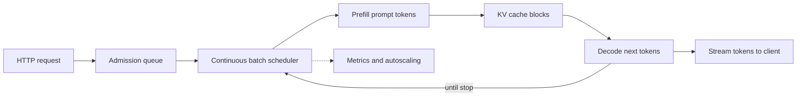

# Serving LLMs at Scale

Serving an [LLM](./llm.md) is not just "put a model behind an API." A production server must schedule
prefill work, decode work, [KV cache](./glossary.md#attention) memory, GPU bandwidth, queueing, retries,
and user-facing [latency](./cost-and-latency.md) objectives at the same time. This page is the systems view
behind [Cloud vs Local Models](./cloud-vs-local.md) and [Build a Local LLM App](./local-llm-app.md).

## The two phases: prefill and decode

Transformer inference has two very different phases:

| Phase | What happens | Bottleneck | User-visible metric |
|---|---|---|---|
| **Prefill** | Process the full prompt and build KV cache entries for every prompt token | Mostly compute-bound matrix work | Time to first token (TTFT) |
| **Decode** | Generate one new token per active sequence, repeatedly reading old KV cache | Often memory-bandwidth-bound | Time per output token (TPOT / inter-token latency) |

Long prompts make prefill expensive. Long answers make decode expensive. Mixed traffic is hard because one
large prefill can block many small decode steps unless the server scheduler is designed for it.



## KV cache memory sizing

The KV cache stores key and value vectors for every layer and every token kept in context. A useful lower
bound for decoder-only models is:

```text
kv_bytes = 2 × layers × kv_heads × head_dim × bytes_per_elem × tokens × batch
```

Where:

- `2` is for keys plus values.
- `layers` is the number of transformer blocks.
- `kv_heads` is the number of key/value heads, not necessarily the number of query heads.
- `head_dim` is usually `hidden_size / attention_heads`.
- `bytes_per_elem` is 2 for FP16/BF16 KV, 1 for FP8 KV, and so on.
- `tokens × batch` is the total live context across active sequences.

### Worked example: Qwen2.5-7B-Instruct

The Hugging Face `config.json` for
[Qwen/Qwen2.5-7B-Instruct](https://huggingface.co/Qwen/Qwen2.5-7B-Instruct/resolve/main/config.json)
lists `num_hidden_layers: 28`, `hidden_size: 3584`, `num_attention_heads: 28`, and
`num_key_value_heads: 4`. That gives `head_dim = 3584 / 28 = 128`.

For BF16 or FP16 KV cache, 32,768 live tokens, and batch size 8:

```text
2 × 28 × 4 × 128 × 2 × 32768 × 8 = 15,032,385,536 bytes ≈ 14.0 GiB
```

This is cache memory only. It does not include weights, activations, allocator overhead, fragmentation, or
CUDA graphs. It is still the number that often decides whether a deployment can admit another request.

### Why GQA matters

Grouped-query attention (GQA) uses fewer key/value heads than query heads. In the example above,
`attention_heads / kv_heads = 28 / 4 = 7`, so the KV cache is about 7× smaller than it would be with one
KV head per query head. Multi-query attention is the extreme version where all query heads share one KV
head.

## Scheduler techniques

### Continuous batching

Classic batching waits for a fixed batch and runs it to completion. Continuous batching keeps an active set
of requests on the GPU, admits new requests as old ones finish, and interleaves decode steps. It improves
GPU utilization for online traffic, but the scheduler must protect latency SLOs instead of only maximizing
tokens per second.

### PagedAttention

vLLM's [PagedAttention paper](https://arxiv.org/abs/2309.06180) introduced a virtual-memory-like KV cache:
tokens live in fixed-size blocks instead of one large contiguous allocation per sequence. That reduces
wasted memory from fragmentation and makes continuous batching practical for many concurrent sequences.

### Prefix caching

Prefix caching reuses already-computed KV blocks when requests share the same leading tokens. It helps
chatbots with stable system prompts, agents with stable tool definitions, RAG apps with repeated documents,
and retries. vLLM V1 documents prefix caching as enabled by default, and the CLI still documents
`--enable-prefix-caching` for explicit setups.

Keep stable content first and dynamic content last. The same layout also improves provider-side prompt
caching; see [Cost, Latency & Model Routing](./cost-and-latency.md).

### Chunked prefill

Chunked prefill splits a long prompt into smaller prefill chunks so decode steps from existing users can
run between chunks. vLLM documents chunked prefill as a tuning lever for balancing TTFT, TPOT, and GPU
utilization in long-context workloads. It is especially useful when short chats and long RAG prompts share
the same serving pool.

### Speculative decoding

Speculative decoding proposes several future tokens and lets the target model verify them in fewer forward
passes. Current vLLM docs cover several proposer families:

- **Draft model** - a smaller model proposes tokens; the large target model accepts the matching prefix.
- **EAGLE** - a learned feature-level proposer family for speculative decoding.
- **N-gram** - a lightweight proposer that looks for repeated n-grams in the prompt or context.
- **MTP** - multi-token prediction when the target model architecture exposes native multi-token heads.

The win depends on acceptance rate, draft overhead, target model size, and current load. Benchmark it on
your own prompts before enabling it globally.

## Quantization for serving

[Quantization](./glossary.md#quantization) reduces weight memory and often improves throughput. Common
serving choices:

- **FP8** - useful on hardware with fast FP8 support; may be used for weights and sometimes KV cache.
- **INT4 AWQ / GPTQ** - weight-only 4-bit formats for fitting larger models or increasing concurrency.
- **GGUF** - llama.cpp's local format; see [Build a Local LLM App](./local-llm-app.md) for local usage.

Quantization changes quality, kernel choice, and supported hardware. Validate task quality and latency
together; a smaller memory footprint is not useful if it breaks your eval set.

## Parallelism and topology

| Technique | What it splits | Use when |
|---|---|---|
| **Tensor parallelism** | Matrix/tensor operations inside a layer across GPUs | Weights or compute do not fit on one GPU |
| **Pipeline parallelism** | Layers across stages | Very large models or multi-node deployments |
| **Data parallelism** | Whole model replicas | Traffic is high enough to fill multiple replicas |
| **Prefill/decode disaggregation** | Prefill workers and decode workers | TTFT and TPOT need separate scaling or isolation |

Disaggregated prefill/decode moves prompt processing and token generation onto separate workers and
transfers KV cache between them. vLLM documents this as experimental disaggregated prefilling, and PyTorch
has published a vLLM-based disaggregated inference architecture. It is operationally more complex than one
replica per model, so start with unified serving unless you have clear latency pressure.

## Serving engines

| Engine | Best fit | Notes |
|---|---|---|
| **[vLLM](https://docs.vllm.ai/)** | High-throughput OpenAI-compatible serving | PagedAttention, continuous batching, LoRA, quantization, benchmarks |
| **[SGLang](https://github.com/sgl-project/sglang)** | Structured generation and high-performance serving | OpenAI-compatible server, RadixAttention-style prefix reuse |
| **[TensorRT-LLM](https://docs.nvidia.com/tensorrt-llm/index.html)** | NVIDIA-optimized production serving | Tensor/pipeline parallelism, inflight batching, engine compilation |
| **[llama.cpp server](https://github.com/ggml-org/llama.cpp/blob/master/tools/server/README.md)** | Local or edge GGUF serving | `llama-server` exposes OpenAI-compatible endpoints |
| **[Ollama](https://ollama.com/blog/openai-compatibility)** | Developer laptops and prototypes | Simple model management plus OpenAI-compatible local API |
| **[Hugging Face TGI](https://huggingface.co/docs/text-generation-inference/)** | Existing TGI deployments | Hugging Face docs say TGI is in maintenance mode; prefer vLLM or SGLang for new work |

OpenAI-compatible endpoints matter because they let apps, gateways, and SDKs switch between managed APIs
and self-hosted engines with minimal client changes.

## vLLM quick start

This example uses flags documented by vLLM's CLI reference and serves an OpenAI-compatible API on port 8000:

```bash
vllm serve Qwen/Qwen2.5-7B-Instruct \
    --host 0.0.0.0 \
    --port 8000 \
    --max-model-len 32768 \
    --gpu-memory-utilization 0.90 \
    --tensor-parallel-size 1 \
    --enable-prefix-caching
```

Then call the chat endpoint:

```bash
curl http://localhost:8000/v1/chat/completions \
    -H "Content-Type: application/json" \
    -d '{
        "model": "Qwen/Qwen2.5-7B-Instruct",
        "messages": [
            {"role": "user", "content": "Explain KV cache in one sentence."}
        ],
        "temperature": 0.2,
        "max_tokens": 128
    }'
```

Use `vllm serve --help=all` for the exact flags supported by your installed version.

## LoRA multi-adapter serving

[LoRA](./glossary.md#lora) adapters let one base model serve multiple task- or tenant-specific variants.
vLLM documents `--enable-lora` and `--lora-modules name=path` for registering adapters on the
OpenAI-compatible server; clients then select the adapter by sending its registered name as the `model`.

Capacity-plan adapters like real workloads. Each active adapter consumes memory and may reduce batching
efficiency when many tenants request different adapters at once.

## Autoscaling and capacity planning

Plan around the user experience, not a single tokens-per-second number:

- **Throughput** - requests/s and output tokens/s at a given prompt and output distribution.
- **Goodput** - completed requests/s that meet SLOs, not merely completed requests/s.
- **TTFT SLO** - how quickly the user sees the first streamed token.
- **TPOT / ITL SLO** - steady token cadence after streaming begins.
- **Queue time** - time spent waiting before prefill starts.

Higher batching improves throughput until it hurts TTFT or TPOT. Larger `max_model_len` increases product
capability but reserves more KV cache. More replicas reduce queueing but may lower batch efficiency. The
right answer is workload-specific: chat, code completion, RAG, and batch summarization all have different
arrival rates, prompt lengths, and output lengths.

## Metrics to monitor

Track percentiles, not just averages:

- TTFT p50/p95/p99, TPOT or inter-token latency p50/p95/p99, and end-to-end latency.
- Prompt tokens, generated tokens, live tokens, and tokens/s.
- Queue depth, waiting time, running requests, and preempted or rejected requests.
- KV cache usage, cache hit rate, prefix-cache hit rate, and OOM events.
- GPU utilization, memory utilization, memory bandwidth, and network transfer for disaggregated serving.
- Error rate by status code, retry rate, and client disconnects.
- Cost per successful request or per successful user outcome.

## Benchmark your deployment

Benchmark the server you will actually run, with prompts that match production. vLLM's current benchmark
CLI includes `vllm bench serve` for online serving benchmarks:

```bash
vllm bench serve \
    --backend openai-chat \
    --base-url http://127.0.0.1:8000 \
    --endpoint /v1/chat/completions \
    --model Qwen/Qwen2.5-7B-Instruct \
    --dataset-name random \
    --num-prompts 200 \
    --max-concurrency 16
```

Synthetic data is useful for smoke tests. Before launch, replay a sampled production trace or an
eval dataset with the same prompt lengths, output lengths, streaming settings, and rate limits you expect
in production.

## See also

- [Cost, Latency & Model Routing](./cost-and-latency.md) - latency metrics, prompt caching, rate limits, and batch APIs
- [Cloud vs Local Models](./cloud-vs-local.md) - when to self-host instead of calling a managed API
- [Build a Local LLM App](./local-llm-app.md) - Ollama, LM Studio, and OpenAI-compatible local calls
- [Model Selection](./model-selection.md) - choosing a model before sizing the serving stack
- [Fine-Tuning](./fine-tuning.md) - LoRA and adapter workflows that affect serving
- [Evaluation & LLMOps](./evaluation-and-llmops.md) - evals and monitoring before production rollout
- [AI Glossary](./glossary.md) - inference, vLLM, quantization, LoRA, and related terms
