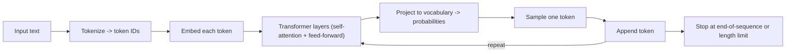

# Large Language Models (LLMs)

A **large language model** is a neural network trained on huge amounts of text to predict the next
[token](./glossary.md#token) in a sequence. "Large" refers both to the parameter count (billions to
trillions of learned weights) and to the training corpus (often terabytes of text). Modern LLMs --
Claude, GPT, Gemini, Llama, Mistral, Qwen, DeepSeek -- share the same recipe: a **transformer**
trained to predict the next token, then aligned via [post-training](#how-an-llm-is-built) to behave
like a useful assistant.

This page is the entry point for the AI section. From here, follow the links into
[Agents](./agents.md), [RAG](./rag.md), [Tooling](./tooling.md), and
[Cloud vs Local Models](./cloud-vs-local.md), or skim the [Glossary](./glossary.md).

## How an LLM produces text

Generation is a loop over a single operation: predict the next token.

1. **Tokenize** the input into integer token IDs. Token boundaries are learned subword units, so they
   rarely match whole words.
2. **Embed** each token ID into a vector.
3. **Run through transformer layers.** Each layer applies self-attention (every token can look at every
   prior token in the [context window](./glossary.md#context-window)) followed by a feed-forward network.
4. **Project to probabilities** over the whole vocabulary.
5. **Sample one token** (controlled by [temperature](./glossary.md#temperature), top-p, etc.).
6. **Append and repeat** until an end-of-sequence token or a length limit.

This is *autoregressive* generation: the model has no plan for the whole answer; it produces one token,
then re-runs everything with that token appended. Chat formats, tool use, and agents are all scaffolding
around this loop.

## How an LLM is built

Modern LLMs are produced in three sequential stages.

1. **Pre-training** -- self-supervised next-token prediction on a web-scale corpus. Produces a
   *base model* that is fluent but not yet helpful. This is the compute-dominant phase.
2. **Mid-training** -- continued training on higher-quality, structured data (instructions, code, math).
   Begins shaping the model toward useful behavior.
3. **Post-training** -- alignment to human preferences. Combines supervised fine-tuning (teaching the
   assistant format via chat templates) with preference learning (RLHF / DPO). Produces the
   *instruct / chat model* end users actually talk to.

Adapters can be layered on top without retraining the base: [PEFT](./glossary.md#peft),
[LoRA](./glossary.md#lora), and [QLoRA](./glossary.md#qlora). See
[Cloud vs Local Models](./cloud-vs-local.md) for running and adapting open-weights models yourself.

## What LLMs are good at

- Language understanding and generation across genres and styles.
- Translation, summarization, classification.
- Code generation, refactoring, and explanation.
- Multi-step reasoning when guided ([chain-of-thought](./glossary.md#chain-of-thought), scratchpads,
  [agents](./agents.md)).
- *In-context learning*: adapting from examples in the prompt, with no retraining.

## What LLMs are not good at

| Weakness | Mitigation |
|---|---|
| Up-to-date facts (knowledge is frozen at training time) | [RAG](./rag.md) |
| Reliable arithmetic and counting | [Tool use](./agents.md) / code execution |
| Calibrated confidence ([hallucination](#hallucination)) | Retrieval grounding, citations, **guardrails**, review |
| Long-horizon planning without scaffolding | [Multi-agent patterns](./agents.md), structured workflows |
| Cost-stable inference at high throughput | Caching, smaller models on hot paths, batching |

## Hallucination

A **hallucination** is fluent, confident, *wrong* output -- fabricated facts, invented citations,
made-up API parameters. It is not a bug to be patched away; it is a direct consequence of how LLMs
work. The model is trained to predict the most *probable-sounding* next token, not to be truthful, and
it has no built-in notion of fact versus fiction and no way to "look something up". When the true answer
is weakly represented in its weights, a confident fabrication is often more probable-sounding than
"I don't know".

The practical response is layered mitigation rather than a promise to eliminate it: grounding with
[RAG](./rag.md), [tool use](./agents.md) for authoritative data, required citations, evaluation that
scores groundedness, **guardrails**, and human review for sensitive outputs.

## Core terminology

| Term | Meaning |
|---|---|
| [Token](./glossary.md#token) | The atomic unit the model reads and writes; a learned subword |
| [Context window](./glossary.md#context-window) | The max tokens the model can attend to at once (thousands to millions) |
| [Parameters](./glossary.md#parameters) | The learned weights; size correlates with capability and cost |
| [Temperature](./glossary.md#temperature) | Sampling parameter for randomness; 0 = deterministic |
| [Foundation model](./glossary.md#foundation-model) | A general pre-trained base not yet specialized for a use case |
| [Frontier model](./glossary.md#frontier-model) | The current capability ceiling -- usually closed-source |
| [Open-weights model](./glossary.md#open-weights) | A model whose weights are downloadable and self-hostable |
| Instruct / chat model | A foundation model after post-training; the variant users talk to |

## Foundation models: rent, don't build

A **foundation model** is a large model trained on broad data that serves as a reusable base you adapt
to many tasks. LLMs are the best-known foundation models, but the category also includes image,
multimodal, and embedding models. The central economic fact of AI engineering: **you almost never train
a foundation model -- you rent or adapt one.** Training one costs millions in compute; the value you add
is in the application layer. Reach for the cheapest adaptation that works, in this order:

1. **Prompting / context** -- change behavior by changing the input. Free, instant.
2. **[RAG](./rag.md)** -- inject your data at inference time for grounding and freshness.
3. **Fine-tuning / [LoRA](./glossary.md#lora)** -- adjust weights for a domain or style when prompting
   and retrieval are not enough.
4. **Pre-training from scratch** -- almost never the right call outside a major lab.

## The model landscape

- **Frontier closed models** -- Claude (Anthropic), GPT (OpenAI), Gemini (Google).
- **Open-weights families** -- Llama (Meta), Mistral, Qwen (Alibaba), DeepSeek, Phi (Microsoft).
- **Cloud-vendor families** -- Amazon Nova / Titan (AWS).
- **Specialized** -- embedding models, rerankers, and small instruction-tuned models for on-device use.

The production choice is rarely "best model" but "best model *for this task at this cost*": frontier
models for hard reasoning, mid-tier for high-volume tasks, small models for latency-sensitive or
on-device paths. See [Cloud vs Local Models](./cloud-vs-local.md) for where each kind runs.

## Where LLMs sit in a production stack

A useful LLM application is rarely just *the model*. It is the model plus:

- **Prompting / context engineering** -- what you put into the context window.
- **[Retrieval (RAG)](./rag.md)** -- external knowledge fetched at inference.
- **Fine-tuning / LoRA** -- domain adaptation when prompting and retrieval are not enough.
- **[Agents](./agents.md) / multi-agent systems** -- tool-use loops and coordination.
- **Guardrails** -- safety and policy enforcement.
- **[LLMOps](./tooling.md)** -- evaluation, monitoring, cost control, and versioning in production.

See [Cost, Latency & Model Routing](./cost-and-latency.md) for token economics and tier choice, and
[Structured Outputs](./structured-outputs.md) when your stack needs machine-parseable responses.

## See also

- [AI Agents](./agents.md) -- wrapping LLMs in tool-use loops
- [RAG](./rag.md) -- augmenting an LLM with external knowledge
- [Cost, Latency & Model Routing](./cost-and-latency.md) -- per-token cost and model tiers
- [AI in Products](./ai-in-products.md) -- shipping LLM features to users
- [Tooling and Frameworks](./tooling.md) -- the ecosystem around the model
- [Cloud vs Local Models](./cloud-vs-local.md) -- where and how to run a model
- [AI Glossary](./glossary.md) -- quick definitions of the terms above
- [Which Pattern When?](./which-pattern-when.md) -- where LLMs fit in a larger architecture
