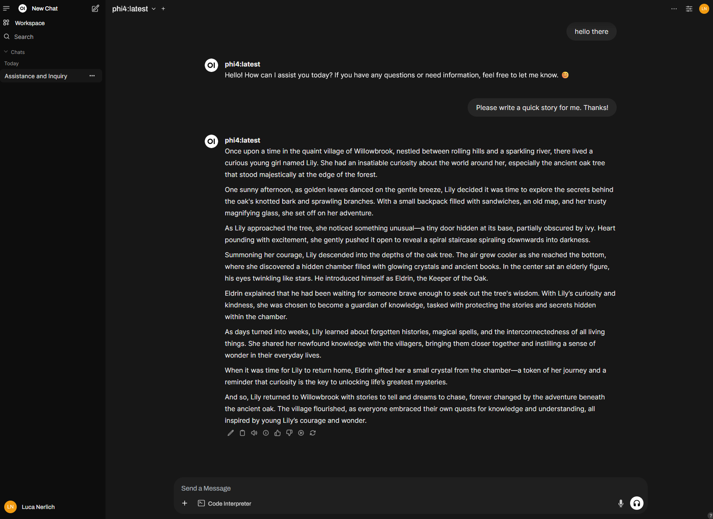
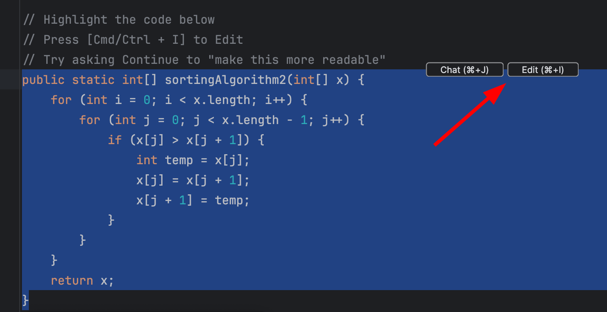
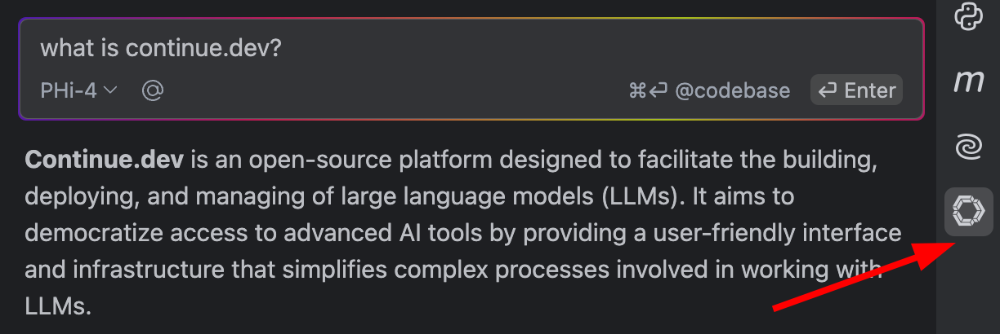

# How to set up a local & offline GitHub Copilot alternative

This guide sets up a local **coding assistant** inside your editor. If you instead want to run a local model
and call it from your own app, see [Build a Local LLM App](./local-llm-app.md), and
[Cloud vs Local Models](./cloud-vs-local.md) for when local makes sense.

## Local models are viable now

As of mid-2026, local models have closed much of the gap with frontier APIs for day-to-day coding tasks.
Vicki Boykis documents this well in [Running local models is good now](https://vickiboykis.com/2026/06/15/running-local-models-is-good-now/) (2026-06-15):
on an M2 Mac with 64 GB RAM she runs agentic coding workflows -- refactoring notebooks, generating unit tests,
bootstrapping repos -- at roughly **~75% the accuracy and speed of frontier models**, without a cloud API call.
For agentic coding she highlights **Gemma 4 26B A4B** and **Gemma 4 12B QAT**; she has also used **Qwen 3 MOE**
and **Qwen 2.5 Coder**, which remain practical local options for this setup.

The remaining limitations are real: inference is slower than a remote API, context windows are capped by your
RAM, and results still warrant a second opinion on tricky problems. But for privacy-sensitive work or
offline development, the tooling is now good enough to use daily.

## Ollama + Continue Dev

1. Install ollama
    - https://ollama.com/download
2. Install the continue.dev Plugin for JetBrains or VSCode
    - https://plugins.jetbrains.com/plugin/22707-continue
    - https://marketplace.visualstudio.com/items?itemName=Continue.continue
3. Optionally, use [OpenWebUI](https://docs.openwebui.com) via Docker as an Interface for Chatting

:::warning
Keep Ollama, LM Studio, and Open WebUI bound to localhost unless you add authentication and network controls.
Ollama binds to `127.0.0.1:11434` by default, but `OLLAMA_HOST=0.0.0.0:11434` exposes it. LM Studio API
tokens are off by default. Open WebUI authentication is on by default through `WEBUI_AUTH=True`; do not set
`WEBUI_AUTH=False` on a shared or exposed instance. See the full security note in
[Build a Local LLM App](./local-llm-app.md).
:::

:::note
Coding assistants can fill context quickly with files, diffs, and repo maps. Ollama's effective context window
now depends on version and VRAM; configure it with `OLLAMA_CONTEXT_LENGTH`, API `num_ctx`, or a Modelfile only
after checking memory. See [Build a Local LLM App](./local-llm-app.md) and
[Serving LLMs at Scale](./llm-serving.md).
:::

## Model Setup

1. Quick Tab Completion
    ```bash
    ollama pull qwen2.5-coder:1.5b
    ```
    - https://ollama.com/library/qwen2.5-coder
    - [Open weights](https://huggingface.co/collections/Qwen/qwen25-coder-66eaa22e6f99801bf65b0c2f)
2. Indexing and Codebase Search
    ```bash
    ollama pull nomic-embed-text
    ```
3. General Purpose Reasoning Model
    ```bash
    ollama pull phi4
    ```
    - https://ollama.com/library/phi4
    - [MIT License](https://ollama.com/library/phi4/blobs/fa8235e5b48f)
    - Alternatively use *Gemma 4* (strong mid-2026 recommendation, especially on Apple Silicon with 32 GB+ RAM):
        - https://ollama.com/library/gemma4
        - `gemma4:26b` for the 26B variant, `gemma4:12b` for the lighter 12B variant
      ```bash
      ollama pull gemma4:26b
      # or the lighter variant
      ollama pull gemma4:12b
      ```
    - Or *Qwen 3 MOE* -- mixture-of-experts, punches above its weight on coding:
        - https://ollama.com/library/qwen3
      ```bash
      ollama pull qwen3:30b-a3b
      ```
4. Optional reranking model
    - Continue's [reranking docs](https://docs.continue.dev/customize/model-roles/reranking) document Voyage,
      Cohere, LLM-based reranking, and Hugging Face Text Embeddings Inference (TEI).
    - They explicitly warn that the LLM fallback does **not** work with local models such as Ollama because too
      many parallel requests are required.
    - For a local setup, run a TEI reranker separately and use the `huggingface-tei` config shown below, or omit
      the reranker until you have a measured need for it.
5. Update continue.dev `config.yaml` -> [see here](#suggested-continuedev-config)
6. Run ollama api locally
    ```bash
    ollama serve
    ```
    - https://ollama.com/library/nomic-embed-text
    - [Apache License](https://ollama.com/library/nomic-embed-text/blobs/c71d239df917)

## [Open Web UI](https://github.com/open-webui/open-webui)



Nvidia GPU

```bash
docker run -d -p 3000:8080 --gpus all --add-host=host.docker.internal:host-gateway -v open-webui:/app/backend/data --name open-webui --restart always ghcr.io/open-webui/open-webui:cuda
```

Other

```bash
docker run -d -p 3456:8080 --add-host=host.docker.internal:host-gateway -v open-webui:/app/backend/data --name open-webui --restart always ghcr.io/open-webui/open-webui:main
```

### Docker Compose

Below docker connects to ollama running natively on windows and not via docker.

```yaml
services:
    open-webui:
        image: ghcr.io/open-webui/open-webui:cuda
        container_name: open-webui
        volumes:
            - ./data:/app/backend/data
        ports:
            - 3456:8080
        environment:
            - 'OLLAMA_BASE_URL=http://host.docker.internal:11434'
        extra_hosts:
            - host.docker.internal:host-gateway
        restart: always
        deploy:
            resources:
                reservations:
                    devices:
                        -   driver: nvidia
                            count: all
                            capabilities: [ gpu ]

volumes:
    open-webui: { }
```

## Usage

Use directly in your editor



or via the chat-sidebar tab



## Suggested continue.dev config

- Unix: `~/.continue/config.yaml`
- Windows: `%USERPROFILE%\.continue\config.yaml`

:::note
Continue's current codebase/documentation awareness guide says the old `@Codebase` and `@Docs` context
providers are deprecated in favor of Agent mode tools, project rules, and MCP servers. Continue's deprecated
codebase reference also covers `@Folder`. Use built-in file/search/repo-map tools and `.continue/rules` for
project context; use MCP servers such as Context7 or custom internal docs servers when documentation retrieval
must be tool-backed.
:::

```yaml title="~/.continue/config.yaml"
name: Local Ollama
version: 0.0.1
schema: v1

models:
    - name: Gemma 4 26B
      provider: ollama
      model: gemma4:26b
      roles:
          - chat
          - edit
          - apply
    - name: Qwen 3 MOE
      provider: ollama
      model: qwen3:30b-a3b
      roles:
          - chat
          - edit
          - apply
    - name: Phi-4
      provider: ollama
      model: phi4
      roles:
          - chat
          - edit
          - apply
    - name: Qwen2.5-Coder
      provider: ollama
      model: qwen2.5-coder:1.5b
      roles:
          - autocomplete
    - name: Nomic Embed Text
      provider: ollama
      model: nomic-embed-text
      roles:
          - embed
    - name: BGE Reranker via TEI
      provider: huggingface-tei
      model: tei
      apiBase: http://localhost:8080
      apiKey: tei
      roles:
          - rerank

rules:
    - Always respond in English.
    - Always provide clear, concise, and accurate answers.
    - Support a software developer with explanations, code, best practices, and debugging help.

prompts:
    - name: test
      description: Generate unit tests for the highlighted code.
      prompt: |
          Write a comprehensive set of unit tests for the provided code. Ensure to include setup, execution of correctness checks with important edge cases, and teardown. Present the tests as plain text output.
    - name: refactor
      description: Improve the code's structure for better readability.
      prompt: |
          Refactor the provided code to improve its structure and readability without altering its functionality. Include a detailed explanation of your changes and reasoning.
    - name: optimize
      description: Enhance code performance with a detailed explanation of changes and trade-offs.
      prompt: |
          Optimize the provided code for performance while maintaining its current behavior. Describe any trade-offs involved in your optimization process.
    - name: explain
      description: Analyze and explain the code's functionality and potential improvements.
      prompt: |
          Explain the logic and functionality of the provided code. Discuss any potential inefficiencies or unnecessary computations that could be improved for better performance.
    - name: document
      description: Create clear and concise function documentation using the correct language format.
      prompt: |
          Write language-specific documentation for the provided function. Use appropriate formats like Javadoc for Java or JSDoc for JavaScript. Ensure clarity and conciseness in your explanation.

context:
    - provider: diff
    - provider: file
    - provider: code
    - provider: currentFile
    - provider: terminal
    - provider: open
    - provider: repo-map
    - provider: tree
    - provider: problems
    - provider: os
    - provider: web
    - provider: url
    - provider: docs # legacy @Docs; see the deprecation note above

docs:
    - name: aem.live
      startUrl: https://www.aem.live/docs
      favicon: https://www.aem.live/favicon.ico
    - name: AEMaaCS
      startUrl: https://experienceleague.adobe.com/de/docs/experience-manager-cloud-service
      favicon: https://experienceleague.adobe.com/favicon.ico
    - name: lucanerlich
      startUrl: https://lucanerlich.com
    - name: react
      startUrl: https://react.dev/
    - name: typescript
      startUrl: https://www.typescriptlang.org/
    - name: react spectrum
      startUrl: https://react-spectrum.adobe.com/index.html
```

## See also

- [Build a Local LLM App](./local-llm-app.md) - Ollama, LM Studio, Open WebUI, and local API security
- [Cloud vs Local Models](./cloud-vs-local.md) - choosing local, self-hosted, or managed models
- [Serving LLMs at Scale](./llm-serving.md) - context length, KV cache, batching, and serving trade-offs
- [Multimodal & Voice](./multimodal-and-voice.md) - images, documents, audio, and realtime voice agents
