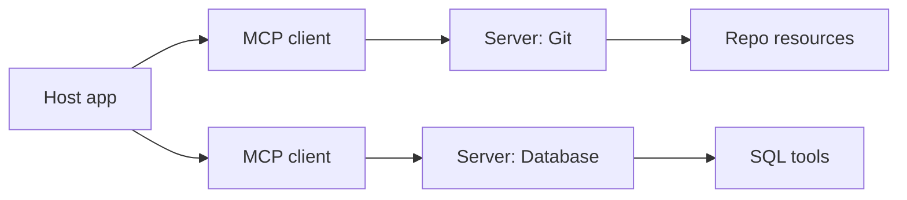

# MCP & A2A in Production

MCP and A2A solve different integration problems. **MCP** connects an LLM host to tools, resources,
and prompts. **A2A** connects one agentic system to another without exposing either agent's internal
memory, tools, or implementation. Use them when a protocol boundary is worth the extra governance.
For a single app with a few local functions, ordinary function calling or an API call is often enough.

:::warning
Protocol support does not make a server trustworthy. Treat tool descriptions, Agent Cards, registry
metadata, and remote outputs as untrusted supply-chain inputs until you have reviewed, pinned, and
monitored them.
:::

## MCP architecture recap

The latest MCP specification page currently resolves to revision
[2026-07-28](https://modelcontextprotocol.io/specification). In that revision, MCP is a stateless
JSON-RPC protocol between three roles:

- **Host** - the LLM application, IDE, chat app, or agent runtime that owns user consent and policy.
- **Client** - a connector inside the host. Each client talks to exactly one MCP server.
- **Server** - a focused integration that exposes context and capabilities.



The server primitives are deliberately split by control plane:

- [**Tools**](https://modelcontextprotocol.io/specification/2026-07-28/server/tools) are
  model-controlled functions such as `query_database` or `create_issue`.
- [**Resources**](https://modelcontextprotocol.io/specification/2026-07-28/server/resources) are
  application-selected context items, identified by URIs.
- [**Prompts**](https://modelcontextprotocol.io/specification/2026-07-28/server/prompts) are
  user-invoked prompt templates.

Client-side features changed materially in 2026. [Elicitation](https://modelcontextprotocol.io/specification/2026-07-28/client/elicitation)
lets a server request extra user input through the client; sensitive secrets must use URL mode rather
than in-band form mode. [Sampling](https://modelcontextprotocol.io/specification/2026-07-28/client/sampling)
and [roots](https://modelcontextprotocol.io/specification/2026-07-28/client/roots) remain in the
spec, but both are deprecated as of `2026-07-28`. New implementations should avoid building around
them.

## MCP transports

The current standard transports are [stdio](https://modelcontextprotocol.io/specification/2026-07-28/basic/transports/stdio)
and [Streamable HTTP](https://modelcontextprotocol.io/specification/2026-07-28/basic/transports/streamable-http).
The older HTTP+SSE transport from `2024-11-05` is deprecated; Streamable HTTP replaced it in
`2025-03-26`, and the `2026-07-28` revision removed the GET stream endpoint and protocol-level
sessions.

| Transport | Best fit | Production notes |
|---|---|---|
| stdio | Local tools launched by the host | The client starts a subprocess and exchanges newline-delimited JSON-RPC. Keep command allowlists tight and sandbox file/process access. |
| Streamable HTTP | Remote or multi-client servers | Each JSON-RPC request is its own POST to one MCP endpoint. Responses are JSON or a request-scoped SSE stream. Validate `Origin`, use auth, and bind local servers to localhost. |

In modern MCP, every request carries protocol version and client capabilities in `_meta`; HTTP also
mirrors required metadata in headers such as `MCP-Protocol-Version`, `Mcp-Method`, and for calls like
`tools/call`, `Mcp-Name`. Do not rely on a connection being a security boundary.

## Minimal MCP server with the Python SDK

The current official Python SDK documents `from mcp.server import MCPServer` for servers and
`from mcp import Client` for clients. This is a complete stdio-runnable server file:

```python
from mcp.server import MCPServer

mcp = MCPServer("Demo")


@mcp.tool()
def add(a: int, b: int) -> int:
    """Add two numbers."""
    return a + b
```

Run it with the SDK CLI:

```bash
uv add "mcp[cli]"
uv run mcp run server.py --transport stdio
```

## MCP authorization

MCP authorization is optional, but when an HTTP MCP server supports it, the
[2026-07-28 authorization spec](https://modelcontextprotocol.io/specification/2026-07-28/basic/authorization)
defines an OAuth-based flow:

1. The MCP server acts as an OAuth 2.1 resource server.
2. The authorization server must implement OAuth 2.1 security measures.
3. MCP servers must publish OAuth 2.0 Protected Resource Metadata
   ([RFC 9728](https://datatracker.ietf.org/doc/html/rfc9728)); clients must use it for authorization
   server discovery.
4. Authorization servers must provide OAuth 2.0 Authorization Server Metadata
   ([RFC 8414](https://datatracker.ietf.org/doc/html/rfc8414)) or OpenID Connect Discovery; clients
   must support both discovery mechanisms.
5. Clients must send a `resource` parameter in authorization and token requests using Resource
   Indicators for OAuth 2.0 ([RFC 8707](https://www.rfc-editor.org/rfc/rfc8707.html)).
6. Servers must validate that presented access tokens were issued for that MCP server and must reject
   tokens meant for other resources.

Current client registration choices are defined in the
[client registration section](https://modelcontextprotocol.io/specification/2026-07-28/basic/authorization/client-registration):
pre-registration if already available, Client ID Metadata Documents when the authorization server
supports them, Dynamic Client Registration only as a deprecated fallback, and manual user-provided
client information if none of those work.

:::note
For stdio, the MCP authorization spec says not to use the HTTP OAuth flow. Local stdio servers should
obtain credentials from environment or host-managed configuration instead.
:::

### Token passthrough and confused deputies

The [MCP security best practices](https://modelcontextprotocol.io/docs/2026-07-28/tutorials/security/security_best_practices)
explicitly call token passthrough an anti-pattern: an MCP server must not accept a token issued for
some other resource and simply forward it downstream. That breaks audience separation, audit trails,
and resource-server controls.

Confused-deputy issues arise when an MCP proxy uses a static third-party OAuth client ID while allowing
many MCP clients to register dynamically. The mitigation is per-client consent before forwarding to the
third-party authorization flow, exact redirect URI validation, CSRF protection, and careful consent-cookie
binding.

## MCP operational security

### Sessions and subscriptions

Current MCP is stateless at the protocol level. Long-lived change streams are request-scoped
`subscriptions/listen` responses, not ambient sessions. If your product maintains web sessions,
refresh tokens, or cached tool grants around MCP, secure those as application state: short lifetimes,
server-side invalidation, rate limits, audit logs, and tenant-aware authorization on every request.

### Local stdio risks

Direct stdio is simple, but a host or proxy that can spawn arbitrary local commands is powerful. The
MCP security guide says stdio is not inherently vulnerable, but proxy architectures can turn client-side
bugs into local code execution if a malicious party can control what process the proxy starts. Use a
fixed allowlist of commands, least-privilege OS users, container or sandbox boundaries, and logs for every
spawned server.

### Tool poisoning and rug pulls

Tool descriptions are prompt material. The MCP tools spec warns clients to treat tool annotations as
untrusted unless they come from trusted servers. Security researchers at
[Invariant Labs](https://invariantlabs.ai/blog/mcp-security-notification-tool-poisoning-attacks) also
showed tool poisoning and rug-pull patterns where a server's tool description changes after initial
approval. Defenses include:

- show full tool names, descriptions, schemas, and arguments to reviewers;
- hash or sign tool definitions and alert on diffs;
- pin package versions, container digests, or remote server versions;
- separate high-risk tools into smaller approval scopes;
- prevent one server's description from influencing another server's credentials or tools.

### Registries and review

The [official MCP Registry](https://modelcontextprotocol.io/registry) is in preview, not general
availability. It is a metadata registry for publicly accessible MCP servers; it does not host private
servers, and its own trust model focuses on namespace authentication and metadata. Treat registry entries
as discovery leads, not as approval. Review source, maintainer identity, package provenance, required
environment variables, scopes, and update cadence before installing.

### Context, observability, and versions

Keep tool sets small. Exposing every integration at once increases prompt size, tool-selection errors, and
blast radius. Prefer task-specific profiles such as "read-only repo search" or "ticket triage" over one
omnibus server.

Trace every model call, MCP request, tool result, user confirmation, authorization challenge, and tool-list
hash. MCP [versioning](https://modelcontextprotocol.io/specification/2026-07-28/basic/versioning) is
per request; servers return `UnsupportedProtocolVersionError` with supported versions when the requested
version is not available. Capture that in logs so client fallback does not hide protocol drift.

## A2A in production

A2A latest currently points to released version
[1.0.0](https://a2a-protocol.org/latest/specification/). It is an open protocol for communication between
opaque agents, with a canonical protobuf data model and protocol bindings for JSON-RPC, gRPC, and
HTTP+JSON/REST. Google created A2A, and the
[Linux Foundation announced](https://www.linuxfoundation.org/press/linux-foundation-launches-the-agent2agent-protocol-project-to-enable-secure-intelligent-communication-between-ai-agents)
the A2A project under its governance in June 2025.

### Agent Cards

A2A discovery starts with an Agent Card. The recommended well-known URL is
`https://{agent-server-domain}/.well-known/agent-card.json`, and the A2A IANA section registers
`agent-card.json` as the well-known suffix. The card describes identity, supported interfaces,
capabilities, security requirements, default input and output media types, and skills.

```json
{
    "name": "Research Agent",
    "description": "Finds public sources and returns cited summaries.",
    "version": "1.0.0",
    "supportedInterfaces": [{
        "url": "https://agent.example.com/a2a/v1",
        "protocolBinding": "HTTP+JSON",
        "protocolVersion": "1.0"
    }],
    "capabilities": {"streaming": true, "pushNotifications": false},
    "defaultInputModes": ["text/plain"],
    "defaultOutputModes": ["text/plain"],
    "skills": [{
        "id": "public-research",
        "name": "Public Research",
        "description": "Searches public material and produces a short cited answer.",
        "tags": ["research", "citations"],
        "examples": ["Summarize current browser support for Web Serial."],
        "inputModes": ["text/plain"],
        "outputModes": ["text/plain"]
    }]
}
```

### Tasks, messages, parts, and artifacts

A2A's basic unit of work is the **Task**. Clients send **Messages** with a `role` and one or more
**Parts**. Parts can hold text, structured data, inline bytes, or a URL reference. The concrete outputs of
a task are **Artifacts**. The spec recommends returning task outputs as artifacts rather than relying on
transient status messages.

Tasks can be short request/response operations or long-running work. Clients can poll with Get Task,
stream task updates, subscribe to a task, or configure push notifications when the Agent Card declares
those capabilities. Clients must not assume every status message is persisted in task history.

### Bindings, auth, and versioning

A2A standard bindings are JSON-RPC, gRPC, and HTTP+JSON/REST. The REST binding uses
`application/a2a+json`, endpoints such as `POST /message:send`, `POST /message:stream`, and task URLs
such as `GET /tasks/{id}`. Streaming uses Server-Sent Events. Agents declare all supported interfaces in
`AgentCard.supportedInterfaces`, and all supported bindings must provide equivalent functionality.

Authentication is outside the message body and follows standard web practice. Agent Cards declare
`securitySchemes` and `securityRequirements`; requests carry credentials in binding-appropriate headers or
metadata. Production A2A must use encrypted transports, validate authorization for every task operation,
limit task lists to the caller's access boundary, and avoid logging credentials or personal data. Clients
send `A2A-Version` as a header or service parameter; version values use `Major.Minor`, such as `1.0`.

## Choosing MCP, A2A, or neither

Use **MCP** when an LLM host needs a governed way to discover and invoke tools, resources, and prompt
templates. Use **A2A** when one independently operated agent needs to delegate to another agent while the
remote agent remains opaque. Use both when an A2A-facing agent internally uses MCP tools.

Do **not** add either protocol only because it is fashionable. A plain API is simpler when the caller is
known, the operation set is stable, and no agent discovery is needed. Direct model function calling is
simpler when the tools are local to one application. A human workflow is safer when the action is rare,
high-impact, or hard to reverse.

## See also

- [AI Agents](./agents.md) - how agent loops, tool use, MCP, and A2A fit together
- [Agent Security](./agent-security.md) - prompt injection, tool poisoning, and approval gates
- [Tooling and Frameworks](./tooling.md) - the wider agent framework and LLMOps landscape
- [MDN MCP Server](./mdn-mcp-server.md) - an example of a public, read-only MCP server
- [AI Glossary](./glossary.md#mcp) - MCP and related protocol vocabulary
