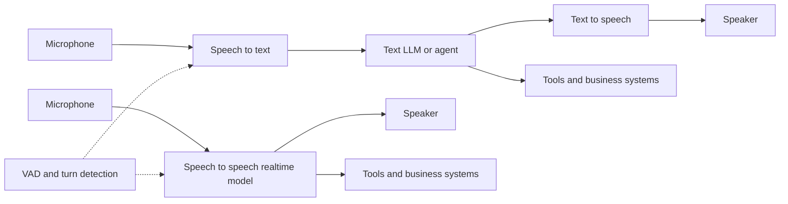

# Multimodal & Voice

Multimodal AI systems accept or produce more than plain text: images, page renders, screenshots, charts, audio, and speech. The important design choice is not only "which model?" but also **where each modality is converted** and **what evidence the model actually sees**.

## Mental model

A multimodal system usually falls into one of three shapes:

1. **Native multimodal model** - one model directly consumes images, audio, video frames, or page images and produces text or speech. This preserves non-text evidence such as layout, charts, handwriting, UI state, tone, and interruptions.
2. **Pipeline** - specialized systems convert modalities first, for example OCR -> text, STT -> text, or TTS -> audio. This is easier to inspect and swap, but every stage can lose information.
3. **Hybrid** - use OCR or ASR for exact text, plus a vision or realtime model for layout, context, screenshots, and natural conversation.

Use native multimodal models when the non-text signal matters. Use pipelines when you need deterministic intermediate artifacts, exact transcripts, policy checks, or independent component evaluation.

## Image input

Vision-language models can answer questions about photos, diagrams, receipts, forms, charts, and UI screenshots. OpenAI's current [Images and vision guide](https://developers.openai.com/api/docs/guides/images-vision) documents the Responses API `input_image` block, URL images, Base64 data URLs, file IDs, and model-specific `detail` controls.

:::warning
Images are input tokens. OpenAI documents patch-based and tile-based image tokenization, model-specific detail levels, and an image cost calculator. A higher-resolution screenshot can cost more, hit rate limits sooner, or be rejected by patch limits. Always budget images separately from the surrounding prompt.
:::

For OpenAI vision requests, `detail` is the main preprocessing control. Supported values depend on the model and include `low`, `high`, `original`, and `auto`; omitted detail defaults to `auto`. Use lower detail for coarse classification and higher or original detail when small text, coordinates, or dense UI details matter. Even `original` can still be resized to meet model limits.

A minimal Responses API image request:

```bash
curl https://api.openai.com/v1/responses \
    -H "Authorization: Bearer $OPENAI_API_KEY" \
    -H "Content-Type: application/json" \
    -d '{
        "model": "gpt-6-astra",
        "input": [
            {
                "role": "user",
                "content": [
                    {"type": "input_text", "text": "Describe the main issue shown in this screenshot."},
                    {
                        "type": "input_image",
                        "image_url": "https://example.com/screenshot.png",
                        "detail": "auto"
                    }
                ]
            }
        ]
    }'
```

### Charts and screenshots

Charts and screenshots are useful because layout, color, axes, annotations, cursor position, and disabled UI states may matter. Crop to the relevant region, prefer source data for exact chart values, and include enough surrounding UI context to avoid interpreting the right label in the wrong panel.

OpenAI explicitly lists small text, graph styles, spatial reasoning, and counting as vision limitations. Treat vision answers as approximate unless verified against source data.

## Document and PDF understanding

PDF understanding is not the same thing as OCR:

- **OCR-first** systems extract text and sometimes bounding boxes. They are best for exact text extraction, search indexes, page references, and compliance workflows.
- **Visual PDF understanding** renders pages or page regions as images and lets a vision model inspect text, tables, images, charts, and layout together.
- **Hybrid document AI** extracts text and layout, keeps page images, and routes each question to the evidence type that can answer it best.

Anthropic's [PDF support docs](https://platform.claude.com/docs/en/build-with-claude/pdf-support) describe asking Claude about text, pictures, charts, and tables in PDFs. They also note that dense PDFs can fill the context window and that, for some Amazon Bedrock Converse flows, enabling citations is required for full visual PDF understanding instead of text extraction only.

Use OCR when the answer must quote exact text. Use page-image understanding when a question depends on visual layout, charts, scanned content, or tables whose meaning is not preserved by plain text extraction.

## Multimodal RAG

Text-only RAG often fails on PDFs because the answer may live in a chart, table layout, screenshot, or scanned page. Store OCR chunks for exact search, rendered page images for layout-heavy pages, table data when you can extract it reliably, and captions or model-generated summaries only as auxiliary metadata.

ColPali-style retrieval is one important pattern. The [ColPali project](https://github.com/illuin-tech/colpali) describes constructing multi-vector embeddings in visual space from page images, avoiding brittle layout-recognition and OCR-only pipelines. The [ColPali v1.3 model card](https://huggingface.co/vidore/colpali-v1.3) describes a visual document retriever based on PaliGemma and ColBERT-style late interaction.

Multimodal embeddings are another pattern. Google's [multimodal embeddings docs](https://cloud.google.com/vertex-ai/generative-ai/docs/embeddings/get-multimodal-embeddings) describe image and text vectors in the same semantic space, enabling searches such as text-to-image and image-to-video; the same docs list `gemini-embedding-2` as accepting interleaved inputs across image, text, document, audio, and video.

:::tip
Keep the original artifact. If retrieval returns an OCR chunk, also keep the page number and page image. If retrieval returns a page image, keep the source PDF and OCR text. This lets the answerer verify the visual evidence before responding.
:::

## Image generation is different from image understanding

Image understanding models analyze input images and return text, tool calls, or structured outputs. Image generation models create or edit pixels. OpenAI separates these workflows in its Images and vision guide: Responses or Chat Completions for analysis, and the Images API or an image generation tool for generation and editing.

Do not evaluate a model's ability to draw a chart as evidence that it can read chart values, or vice versa. Generation quality and visual reasoning quality are separate capabilities.

## Speech-to-text and text-to-speech

Speech pipelines split the problem into inspectable parts:

- **Speech-to-text (STT)** turns a file, microphone stream, or phone call into text. OpenAI's file transcription guide recommends `gpt-transcribe` for recorded speech and points realtime streams to the realtime transcription API.
- **LLM or agent** decides what to do with the transcript, calls tools, checks policy, and writes a response.
- **Text-to-speech (TTS)** turns the response into audio. OpenAI's TTS guide documents the `speech` endpoint, voices, streaming output, and a policy requirement to disclose that generated voices are AI-generated.

Pipelines are easier to log, redact, and test. They are also vulnerable to errors compounding across stages: a missed negation in STT can cause a confident but wrong spoken answer.

## Voice agents

Voice agents add realtime constraints to ordinary agent design. OpenAI's current [Voice agents guide](https://developers.openai.com/api/docs/guides/voice-agents) distinguishes native speech systems such as GPT-Live or the Realtime API from chained voice pipelines. Gemini's [Live API](https://ai.google.dev/gemini-api/docs/live-api) documents low-latency realtime voice and vision interactions with Gemini over stateful WebSocket connections.



### Cascaded voice pipeline

A cascaded pipeline is STT -> LLM -> TTS. Choose it when you need transcripts, deterministic policy checks, component-level vendor choice, or easy fallback between models. Measure microphone capture, STT latency, LLM time to first token, tool latency, TTS first audio latency, playback buffering, and end-to-end time to useful spoken answer.

### Speech-to-speech realtime model

A speech-to-speech model keeps audio inside a realtime session. OpenAI's [Realtime API](https://developers.openai.com/api/docs/guides/realtime) describes speech-to-speech agents where the model works directly with audio, maintains conversation state, and can call tools. Its guide documents WebRTC for browser clients and WebSocket for server control. Gemini Live documents WSS as the protocol and supports continuous audio, images, and text input with audio output.

Choose native speech when natural turn taking, low first-audio latency, barge-in, and continuous conversation matter more than inspecting every intermediate text stage.

## Turn detection, VAD, and barge-in

Voice UX succeeds or fails on turn timing. OpenAI's [VAD guide](https://developers.openai.com/api/docs/guides/realtime-vad) documents server VAD and semantic VAD, including silence thresholds and `interrupt_response` for conversation mode. Gemini Live documents barge-in as a key feature. LiveKit Agents documents framework support for streaming audio pipelines, turn detection, and interruptions.

Design for VAD thresholds, barge-in, backchannels, and overlap. Too sensitive interrupts the user; too conservative creates awkward silence. A short "one moment" can hide tool latency, but must not confirm an action before the tool succeeds.

## Telephony

Phone calls add codecs, caller ID, DTMF, transfers, and regulatory duties. OpenAI's [Telephony and SIP guide](https://developers.openai.com/api/docs/guides/voice-sip) documents SIP trunks, incoming call webhooks, direct SIP, and server audio bridges. LiveKit Agents also documents telephony support through LiveKit SIP integration.

Treat SIP headers as caller metadata, not authorization. Authenticate the caller through your own business flow before exposing account data or performing actions.

## Frameworks

Use a framework when you need production media plumbing instead of a demo loop:

- [LiveKit Agents](https://docs.livekit.io/agents/) - realtime voice, video, and physical AI agents, with WebRTC rooms, STT-LLM-TTS pipelines, interruptions, turn detection, tracing, deployment, and telephony.
- [Pipecat](https://docs.pipecat.ai/) - an open source ecosystem for voice and multimodal AI agents that can see, hear, and speak, with client SDKs and deployment options.

Frameworks do not remove product responsibility. You still own prompts, permissions, data retention, evals, operator handoff, and user consent.

## Evaluation

Evaluate modalities independently and together:

- **Vision** - exact text extraction, chart answers, UI state recognition, object counting, refusal on unsupported tasks, and citation to the page or screenshot region.
- **Documents** - retrieval recall by page, answer faithfulness, quote accuracy, table correctness, and behavior on scanned or rotated pages.
- **STT** - word error rate, domain term accuracy, names, numbers, accents, noise, and language switches.
- **TTS** - intelligibility, pronunciation, latency, voice consistency, disclosure, and user preference.
- **Voice agent** - task success, tool correctness, turn timing, barge-in, dropped audio, unwanted silence, and recovery after interruptions.

Replay fixed audio and screenshot fixtures before every launch. For live systems, store enough event traces to diagnose latency and task failures without retaining more personal data than necessary.

## Safety and privacy

Multimodal systems collect more sensitive data than text chat. A camera frame can reveal faces, screens, addresses, documents, health data, children, or bystanders. Audio can reveal identity, emotion, location, and background conversations.

:::danger
Do not deploy voice or vision features without consent, retention rules, and access controls. For privacy basics, see [Privacy & Data Handling](./privacy-and-data.md). For safety controls, see [AI Safety & Guardrails](./safety.md).
:::

Practical controls: disclose AI-generated voices and recordings, get consent for recording and human review, avoid using voice as a biometric authenticator unless you have a dedicated biometric security program, redact screenshots before logging, keep raw media only when needed, rate-limit realtime sessions, protect ephemeral token endpoints, and human-review high-impact actions.

## Vision failure modes

Vision models hallucinate too. Common failures include reading tiny or rotated text incorrectly, approximating counts, inferring chart values from axis shape, missing off-screen screenshot context, treating edited images as evidence, and over-explaining UI screenshots without knowing application state.

Ask for confidence, crop better evidence, retrieve the source data where possible, and verify high-impact answers against OCR, structured data, or human review.

## See also

- [Privacy & Data Handling](./privacy-and-data.md) - consent, retention, PII, and data residency
- [AI Safety & Guardrails](./safety.md) - guardrails and defense in depth
- [RAG](./rag.md) - retrieval patterns and grounding
- [Embeddings](./embeddings.md) - vector search foundations
- [Serving LLMs at Scale](./llm-serving.md) - latency, KV cache, batching, and serving trade-offs
- [Cloud vs Local Models](./cloud-vs-local.md) - where to run multimodal and voice workloads
- [Evaluation & LLMOps](./evaluation-and-llmops.md) - regression tests and monitoring
- [AI Glossary](./glossary.md) - modality, embeddings, RAG, guardrails, and related terms
