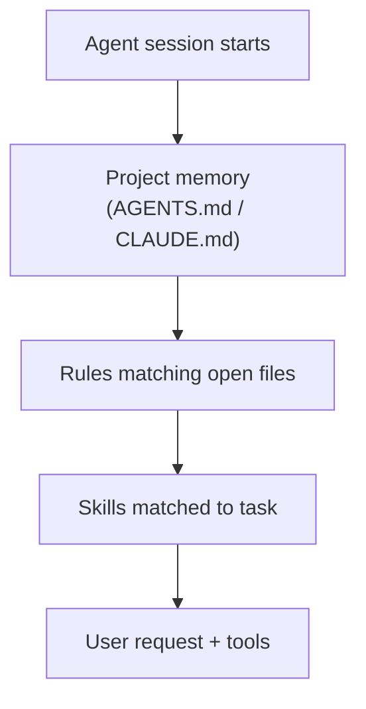

# Project Memory & Rules

Coding [agents](./agents.md) need persistent instructions: how this repo is structured, which commands to
run, naming conventions, and security boundaries. That context lives in **project memory files** and
**rules** - always-on (or glob-scoped) configuration distinct from on-demand [Agent Skills](./skills.md).
Getting the split right keeps agents aligned without blowing the [context budget](./context-engineering.md).

## The configuration stack

| Layer | Typical files | Loaded | Best for |
|---|---|---|---|
| **Project memory** | `AGENTS.md`, `CLAUDE.md`, `GEMINI.md` | Every relevant session | Repo map, build/test commands, architecture summary |
| **Rules** (Cursor) | `.cursor/rules/*.mdc` | By always-apply or file glob | Short coding standards, framework conventions |
| **Skills** | `.cursor/skills/`, `.claude/skills/` | On demand when task matches | Multi-step workflows (deploy, review ritual) |
| **User rules** | Cursor/IDE settings | Global to your editor | Personal preferences not shared with the team |

Skills are covered in [Agent Skills](./skills.md). This page focuses on memory and rules.



## Project memory files

**`AGENTS.md`** (and tool-specific variants like **`CLAUDE.md`**) is a markdown file at the repo root (or
paths your tool discovers) that tells the agent how to work in *this* project. Common sections:

- **Overview** - what the repo is, main packages, tech stack
- **Commands** - how to install, build, test, lint (`pnpm build`, not `npm`)
- **Conventions** - branch naming, commit style, where configs live
- **Boundaries** - what not to touch, security-sensitive areas
- **Pointers** - links to deeper docs instead of duplicating them

Treat it like onboarding for a new senior engineer: enough to orient, not a copy of the entire wiki.
The [LLM-wiki pattern](./knowledge-management.md) scales when memory outgrows one file - memory file
points to the wiki; skills pull detailed workflows on demand.

### What belongs in memory vs skills

| Put in memory | Put in skills |
|---|---|
| "Always use pnpm" | "Run the 5-step PR review checklist" |
| "Tests live under `tests/`" | "Deploy to staging with validation script" |
| "Never commit secrets" | "Generate release notes from git log since tag" |
| Repo layout and entry points | Procedures with many steps or optional scripts |

If content is long and only needed sometimes, it is a skill candidate.

## Cursor rules (`.mdc`)

Rules are markdown files with YAML frontmatter in `.cursor/rules/` (or user-level `~/.cursor/rules/`):

```markdown
---
description: TypeScript conventions for this repo
globs: "**/*.ts,**/*.tsx"
alwaysApply: false
---

- Use `import type` for type-only imports
- Prefer explicit return types on exported functions
```

| Frontmatter | Effect |
|---|---|
| `alwaysApply: true` | Injected into every conversation in the project |
| `globs` | Applied when matching files are open or in context |
| `alwaysApply: false` + no globs | "Apply intelligently" (legacy pattern; consider migrating to skills) |

**Keep rules short** - under ~50 lines when possible. Rules compete for the same window as conversation,
retrieved [RAG](./rag.md) chunks, and tool results. Long rule files cause [context rot](./context-engineering.md).

Use rules for **stable conventions**; use [skills](./skills.md) for **procedures**.

## Monorepos and scoping

In large repos:

- Root `AGENTS.md` describes the monorepo; package-level `AGENTS.md` or rules scoped with globs to
  `packages/foo/**`
- Nested `.cursor/skills/` under `apps/web/` auto-scope skills to that tree (Cursor)
- Avoid duplicating the same rule in five packages - shared rule with broad globs or one memory file with
  a package index

## Writing effective memory

1. **Commands must be copy-paste accurate** - wrong test command wastes agent turns.
2. **Prefer pointers over paste** - "See `docs/architecture.md`" beats inlining stale architecture.
3. **Update when reality diverges** - stale memory is worse than none; agents confidently follow wrong paths.
4. **Version-control with the code** - memory and rules are team contracts, like CI config.
5. **Align with [AI-Assisted Development](./ai-assisted-development.md)** - deep modules and vertical slices
   in memory help agents stay in the Smart Zone.

## Migrating and deduplicating

Over time teams accumulate overlapping rules, memory, and skills:

- Cursor **`/migrate-to-skills`** converts eligible dynamic rules and slash commands to skills
- Audit for duplicate instructions across `AGENTS.md`, rules, and skills - one source of truth per concern
- Move workflow checklists from always-on rules into skills with good descriptions

## See also

- [Agent Skills](./skills.md) - on-demand workflows and SKILL.md format
- [Context & Prompt Engineering](./context-engineering.md) - why lean memory matters
- [Knowledge Management with LLMs](./knowledge-management.md) - AGENTS.md in the LLM-wiki pattern
- [AI-Assisted Software Development](./ai-assisted-development.md) - architecture patterns for agent-friendly repos
- [Privacy & Data Handling](./privacy-and-data.md) - do not embed secrets in memory files
- [AI Glossary](./glossary.md) - project memory and related terms
