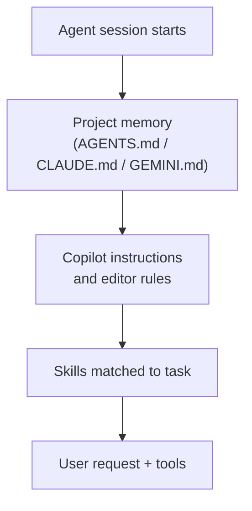

# Project Memory & Rules

Coding [agents](./agents.md) need persistent instructions: how this repo is structured, which commands to
run, naming conventions, and security boundaries. That context lives in **project memory files** and
**rules** - always-on (or glob-scoped) configuration distinct from on-demand [Agent Skills](./skills.md).
Getting the split right keeps agents aligned without blowing the [context budget](./context-engineering.md).

:::warning
Treat these files as executable influence over an agent. Wrong commands, stale paths, or vague policies make
agents confidently do the wrong thing. Keep examples copy-paste accurate and update memory when the project
changes.
:::

## The configuration stack

| Layer | Typical files | Loaded | Best for |
|---|---|---|---|
| **Project memory** | `AGENTS.md`, `CLAUDE.md`, `GEMINI.md` | Every relevant session | Repo map, build/test commands, architecture summary |
| **GitHub Copilot instructions** | `.github/copilot-instructions.md`, `.github/instructions/*.instructions.md` | Repository-wide or path-scoped | Copilot Chat, IDE, CLI, and coding-agent guidance |
| **Rules** | `.cursor/rules/*.mdc`, `.windsurf/rules/*.md` | Always, glob, model decision, or manual | Short coding standards, framework conventions |
| **Skills** | `.agents/skills/`, `.cursor/skills/`, `.claude/skills/` | On demand when task matches | Multi-step workflows (deploy, review ritual) |
| **User rules** | Editor or CLI settings | Global to your account/tool | Personal preferences not shared with the team |

Skills are covered in [Agent Skills](./skills.md). This page focuses on memory and rules.


```mermaid
flowchart TB
    session["Agent session starts"] --> memory["Project memory<br/>(AGENTS.md / CLAUDE.md / GEMINI.md)"]
    memory --> instructions["Copilot instructions<br/>and editor rules"]
    instructions --> skills["Skills matched to task"]
    skills --> task["User request + tools"]
```

## Project memory files

**`AGENTS.md`** and tool-specific variants such as **`CLAUDE.md`** and **`GEMINI.md`** are Markdown files
that tell an agent how to work in *this* project. Common sections:

- **Overview** - what the repo is, main packages, tech stack
- **Commands** - how to install, build, test, lint (`pnpm build`, not `npm`)
- **Conventions** - branch naming, commit style, where configs live
- **Boundaries** - what not to touch, security-sensitive areas
- **Pointers** - links to deeper docs instead of duplicating them

Treat them like onboarding for a new senior engineer: enough to orient, not a copy of the entire wiki.
The [LLM-wiki pattern](./knowledge-management.md) scales when memory outgrows one file - memory file
points to the wiki; skills pull detailed workflows on demand.

### What belongs in memory vs skills

| Put in memory | Put in skills |
|---|---|
| "Always use pnpm" | "Run the 5-step PR review checklist" |
| "Tests live under `tests/`" | "Deploy to staging with validation script" |
| "Never commit secrets" | "Generate release notes from git log since tag" |
| Repo layout and entry points | Procedures with many steps or optional scripts |

If content is long and only needed sometimes, it is a skill candidate.

## GitHub Copilot custom instructions

GitHub documents several instruction scopes for Copilot: personal instructions, organization instructions,
repository instructions, path-specific instruction files, and Copilot CLI instructions. The support matrix
varies by surface, so prefer the documented file for the surface you are targeting.

| Scope | File or setting | Notes |
|---|---|---|
| Personal | GitHub or IDE settings | Personal preferences for the signed-in user |
| Organization | Organization-level Copilot settings | Shared policy for repositories owned by the organization |
| Repository-wide | `.github/copilot-instructions.md` | Broad project guidance for Copilot in supported IDE and GitHub surfaces |
| Path-specific | `.github/instructions/*.instructions.md` | Markdown instruction files with YAML frontmatter such as `applyTo` |
| Copilot CLI | CLI custom-instruction files | CLI docs also describe advanced fields such as `excludeAgent`; do not assume every IDE honors them |

A small path-specific instruction file:

```markdown
---
applyTo: "src/**/*.ts"
---

# TypeScript instructions

- Use `import type` for type-only imports.
- Keep exported functions explicitly typed.
- Run the project's documented TypeScript or build command after changing public APIs.
```

`applyTo` is a glob that decides when the file applies. Keep the body short and concrete: a path-specific
instruction file should be a local convention, not a second architecture document.

### AGENTS.md and Copilot

`AGENTS.md` is now a cross-tool convention, but support is not identical everywhere:

| Copilot surface | Verified support status |
|---|---|
| GitHub Copilot coding agent | GitHub's 2025 changelog says the coding agent supports `AGENTS.md` custom instructions. |
| GitHub Copilot CLI | GitHub's Copilot CLI docs cover custom instruction files and agent customization; use the CLI docs for exact precedence. |
| VS Code Copilot Chat | VS Code documents `.github/copilot-instructions.md` and `.instructions.md` files. I did not find official VS Code docs saying ordinary Copilot Chat reads `AGENTS.md` directly; delegating to the GitHub coding agent from VS Code uses that agent's server-side behavior. |

Practical default: keep shared, vendor-neutral onboarding in `AGENTS.md`, then add thin tool-specific files
that import or summarize it only when the tool officially supports that pattern.

## Claude Code memory

Claude Code's memory docs center on human-authored `CLAUDE.md` plus commands for inspecting and editing
memory. The safe hierarchy to document for teams is:

| Layer | Typical location | Use |
|---|---|---|
| Managed / enterprise | Admin-managed policy or managed settings | Non-negotiable organization rules |
| Project | `./CLAUDE.md` or `./.claude/CLAUDE.md` | Team-shared project context, checked in when appropriate |
| User | `~/.claude/CLAUDE.md` | Personal preferences across projects |
| Local project | `CLAUDE.local.md` | Legacy/local-only pattern; current guidance favors user memory plus imports instead of new `CLAUDE.local.md` usage |

Claude Code supports `@path` imports inside memory files, for example:

```markdown
# Project instructions

@./docs/architecture.md
@./AGENTS.md

## Claude-specific notes

Use the project's documented build command before proposing a merge.
```

Imports are for maintainability, not token savings: imported content still becomes context. Use them to keep
ownership clear, not to hide a thousand lines of instructions.

The `/memory` command lets users inspect and edit memory. Claude's current docs and product material also
describe auto memory: Claude can retain learned preferences or project facts across sessions. Treat auto
memory as editable working state, not as policy. Put team contracts in version-controlled files.

Claude Code also documents `.claude/rules/` for modular rule files. Where your installed version supports
path-scoped rules, use YAML frontmatter such as:

```markdown
---
paths:
    - "src/api/**/*.ts"
---

# API rules

- Validate external input before it reaches business logic.
- Keep error responses consistent across endpoints.
```

Because this area has changed quickly, verify rule loading with `/memory` or the Claude Code docs for the
version your team uses.

## Gemini CLI and Windsurf

**Gemini CLI** uses `GEMINI.md` as its default context file. Its docs describe a hierarchy that includes
user-level context, workspace/project context, and subdirectory context. You can change the context filename,
which is the documented way to make Gemini CLI read `AGENTS.md` instead:

```json
{
    "context": {
        "fileName": "AGENTS.md"
    }
}
```

Gemini CLI also supports `@file` imports and `/memory show` or `/memory reload` commands for inspecting and
refreshing loaded context.

**Windsurf** separates Memories from Rules. Durable team guidance belongs in rules, usually
`.windsurf/rules/*.md`. Current Windsurf docs describe activation modes such as:

| Mode | Meaning |
|---|---|
| `always_on` | Include the whole rule every time |
| `glob` | Include the rule when matching files are in scope |
| `model_decision` | Show the description and let Cascade decide whether to load the rule |
| `manual` | Load only when explicitly invoked |

Keep always-on rules sparse. Prefer `glob` or model-decision rules for language-specific or directory-specific
conventions.

## Cursor rules (`.mdc`)

Project rules are markdown files with YAML frontmatter in `.cursor/rules/`. User rules are managed from
Cursor's Customize settings rather than committed as repo files:

```markdown
---
description: TypeScript conventions for this repo
globs: "**/*.ts,**/*.tsx"
alwaysApply: false
---

- Use `import type` for type-only imports
- Prefer explicit return types on exported functions
```

| Frontmatter | Effect |
|---|---|
| `alwaysApply: true` | Injected into every conversation in the project |
| `globs` | Applied when matching files are open or in context |
| `description` + no `globs` | Agent decides whether the rule is relevant |
| `alwaysApply: false` + no `description` or `globs` | Manual only; include it by @-mentioning the rule |

**Keep rules short** - under ~50 lines when possible. Rules compete for the same window as conversation,
retrieved [RAG](./rag.md) chunks, and tool results. Long rule files cause [context rot](./context-engineering.md).

Use rules for **stable conventions**; use [skills](./skills.md) for **procedures**.

## Monorepos and scoping

In large repos:

- Root `AGENTS.md` describes the monorepo; package-level memory files or rules scope to `packages/foo/**`.
- Nested `.cursor/skills/` under `apps/web/` auto-scope skills to that tree in Cursor.
- Avoid duplicating the same rule in five packages - shared rule with broad globs or one memory file with
  a package index.

## Writing effective memory

1. **Commands must be copy-paste accurate** - wrong test command wastes agent turns.
2. **Prefer pointers over paste** - "See `docs/architecture.md`" beats inlining stale architecture.
3. **Update when reality diverges** - stale memory is worse than none; agents confidently follow wrong paths.
4. **Version-control with the code** - memory and rules are team contracts, like CI config.
5. **Align with [AI-Assisted Development](./ai-assisted-development.md)** - deep modules and vertical slices
   in memory help agents stay in the Smart Zone heuristic.

## Migrating and deduplicating

Over time teams accumulate overlapping rules, memory, and skills:

- Cursor **`/migrate-to-skills`** converts eligible dynamic rules and slash commands to skills.
- Audit for duplicate instructions across `AGENTS.md`, tool-specific memory, rules, and skills - one source
  of truth per concern.
- Move workflow checklists from always-on rules into skills with good descriptions.

## Sources

- [GitHub Docs - About customizing GitHub Copilot responses](https://docs.github.com/en/copilot/concepts/prompting/response-customization)
- [GitHub Docs - Repository custom instructions for Copilot in your IDE](https://docs.github.com/en/copilot/how-tos/configure-custom-instructions-in-your-ide/add-repository-instructions-in-your-ide)
- [GitHub Docs - Copilot custom instructions support](https://docs.github.com/en/copilot/reference/custom-instructions-support)
- [GitHub Docs - Adding custom instructions for Copilot CLI](https://docs.github.com/en/copilot/how-tos/copilot-cli/customize-copilot/add-custom-instructions)
- [GitHub Changelog - Copilot coding agent supports AGENTS.md](https://github.blog/changelog/2025-08-28-copilot-coding-agent-now-supports-agents-md-custom-instructions/)
- [VS Code Docs - Customize AI responses in VS Code](https://code.visualstudio.com/docs/copilot/copilot-customization)
- [Claude Code Docs - How Claude remembers your project](https://code.claude.com/docs/en/memory)
- [Claude Code Docs - Explore the .claude directory](https://code.claude.com/docs/en/claude-directory)
- [Gemini CLI Docs - Provide context with GEMINI.md](https://github.com/google-gemini/gemini-cli/blob/main/docs/cli/gemini-md.md)
- [Windsurf Docs - Cascade Memories and Rules](https://docs.windsurf.com/windsurf/cascade/memories)

## See also

- [Agent Skills](./skills.md) - on-demand workflows and SKILL.md format
- [Context & Prompt Engineering](./context-engineering.md) - why lean memory matters
- [Knowledge Management with LLMs](./knowledge-management.md) - AGENTS.md in the LLM-wiki pattern
- [AI-Assisted Software Development](./ai-assisted-development.md) - architecture patterns for agent-friendly repos
- [Privacy & Data Handling](./privacy-and-data.md) - do not embed secrets in memory files
- [AI Glossary](./glossary.md) - project memory and related terms
