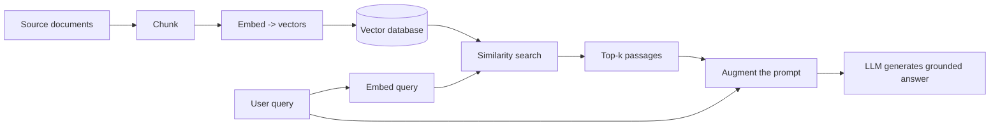

# RAG (Retrieval-Augmented Generation)

**RAG** improves an [LLM](./llm.md)'s output by retrieving relevant information from an authoritative
external source *before* generation, rather than relying solely on the model's frozen training data. It
is the primary defense against [hallucination](./llm.md#hallucination) and a cost-effective alternative
to fine-tuning for domain or organizational specificity.

## The standard pipeline

1. **Create external data.** Convert documents into [embeddings](./glossary.md#embedding) via an
   embedding model and store them in a [vector database](./glossary.md#vector-database).
2. **Retrieve relevant info.** Embed the user query and run a similarity search
   ([cosine similarity](./glossary.md#cosine-similarity)) against the store.
3. **Augment the prompt.** Insert the retrieved passages alongside the user query.
4. **Keep it fresh.** Re-embed source documents as they change (async or batch).

## Why it matters

RAG mitigates four well-known LLM failure modes: presenting false information when it does not know,
returning out-of-date or generic answers, drawing on non-authoritative sources, and confusing
terminology across domains. It also adds **source attribution**, which builds trust and lets developers
swap sources, restrict by permissions, and troubleshoot retrievals.

## RAG vs fine-tuning {#rag-vs-fine-tuning}

These are the two canonical ways to make a foundation model work for a specific domain. They differ in
**where the domain knowledge lives**.

- **RAG** keeps the model untouched. Knowledge lives in an external [vector database](./glossary.md#vector-database);
  relevant chunks are retrieved at inference time and injected into the prompt. Updates are cheap. Best
  for facts that change.
- **Fine-tuning** modifies the model itself by continued training on domain data. Knowledge and behavior
  get baked into the weights (full fine-tuning, or parameter-efficient variants like
  [LoRA](./glossary.md#lora) / [QLoRA](./glossary.md#qlora)). Updates are expensive. Best for style,
  tone, format, and behavior.

| | RAG | Fine-tuning |
|---|---|---|
| Model weights | unchanged | modified |
| Knowledge location | external store | inside the model |
| Update cost | cheap (re-embed) | expensive (retrain) |
| Best for | facts, current data, citations | style, tone, format, behavior |
| Cost profile | inference-heavy | training-heavy |
| Risk modes | retrieval misses, context overflow | catastrophic forgetting, overfitting |

In practice they are combined more often than chosen between: **fine-tune for style, RAG for facts.**

## Embeddings: the layer RAG depends on

An **embedding** is a dense numeric vector (typically 384--4096 dimensions) representing a piece of text,
image, or audio, chosen so that semantically similar inputs end up close together in vector space. The
output quality of a whole RAG system is bounded by the embedding model's ability to put related text near
each other.

- **Dense and semantic.** Unlike sparse keyword vectors, embeddings capture meaning - the classic
  example is `king - man + woman ~= queen`.
- **Context-dependent.** Modern transformer embeddings give "bank" a different vector in "river bank"
  versus "financial bank".
- **A working default for English RAG (2026):** OpenAI `text-embedding-3-small` (cheap, well-behaved) or
  `bge-small-en-v1.5` (self-hostable). Use the **MTEB** leaderboard as a starting filter, not as truth;
  build a small eval set from real queries and measure retrieval recall@k yourself.

## Vector databases

A [vector database](./glossary.md#vector-database) stores, indexes, and efficiently searches
high-dimensional embeddings. Where traditional databases excel at *exact* matches, vector DBs excel at
**similarity** searches - "give me the rows whose vector is closest to this one". The key efficiency
primitive is **approximate nearest neighbor (ANN)** search, which checks a carefully selected subset of
candidates instead of all vectors, trading a small amount of accuracy for a large speedup. Common
options: Pinecone (hosted), pgvector (Postgres extension), OpenSearch, Weaviate, Milvus, and Chroma
(lightweight, good for prototypes). See [Tooling](./tooling.md) for how these fit the broader stack.

## Production levers (in order of ROI)

- **Add hybrid retrieval first.** Dense embeddings miss exact strings ("error code ABC-1234"); keyword
  search misses paraphrases. Combine dense + sparse (BM25) with rank fusion. This is the single
  highest-ROI fix for weak RAG.
- **Rerank the top results.** Run a cross-encoder reranker (e.g. Cohere `rerank-3`, `bge-reranker-large`)
  over the top ~50 candidates. Often a bigger win than swapping the embedding model.
- **Mind chunking.** Match chunk size to the embedding model's natural window; wildly larger or smaller
  chunks degrade quality.
- **Respect query/document asymmetry.** Many models need different prefixes or input-types for queries
  versus documents. Forgetting this halves recall.
- **Quantize once it works.** Store vectors as `int8` or `halfvec` for 4x+ storage reduction with a small
  recall hit. See [quantization](./glossary.md#quantization).
- **Plan for re-embedding.** Embeddings drift as content grows, and switching embedding models requires
  re-embedding the whole corpus. Treat the embedding model as a versioned artifact.

## The trend: just-in-time retrieval in agents

Pure pre-inference embedding retrieval is giving way to hybrid approaches in [agent](./agents.md) design:
agents keep lightweight references and load data on demand via [tools](./agents.md#tool-use-function-calling).
RAG is not going away, but "some data up front, exploration at runtime" is becoming the default.

## See also

- [Large Language Models](./llm.md) - the model RAG grounds
- [AI Agents](./agents.md) - retrieval as a tool; MCP vs RAG
- [Tooling and Frameworks](./tooling.md) - LangChain / LlamaIndex, vector DBs, evaluation
- [Cloud vs Local Models](./cloud-vs-local.md) - managed RAG (Bedrock Knowledge Bases) vs local RAG
- [AI Glossary](./glossary.md) - embedding, vector database, reranking, semantic search, and more
