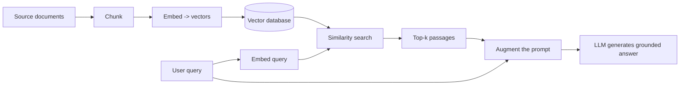

# RAG (Retrieval-Augmented Generation)

**RAG** improves an [LLM](./llm.md)'s output by retrieving relevant information from an authoritative
external source *before* generation, rather than relying solely on the model's frozen training data. It
is a primary mitigation (not a guarantee) against [hallucination](./llm.md#hallucination) and a cost-effective alternative
to fine-tuning for domain or organizational specificity.

## The standard pipeline

```mermaid
flowchart LR
    docs["Source documents"] --> chunk["Chunk"]
    chunk --> embed["Embed -> vectors"]
    embed --> store[("Vector database")]
    query["User query"] --> qembed["Embed query"]
    qembed --> search["Similarity search"]
    store --> search
    search --> topk["Top-k passages"]
    topk --> prompt["Augment the prompt"]
    query --> prompt
    prompt --> llm["LLM generates grounded answer"]
```

1. **Create external data.** Convert documents into [embeddings](./glossary.md#embedding) via an
   embedding model and store them in a [vector database](./glossary.md#vector-database).
2. **Retrieve relevant info.** Embed the user query and run a similarity search
   ([cosine similarity](./glossary.md#cosine-similarity)) against the store.
3. **Augment the prompt.** Insert the retrieved passages alongside the user query.
4. **Keep it fresh.** Re-embed source documents as they change (async or batch).

## Why it matters

RAG mitigates four well-known LLM failure modes: presenting false information when it does not know,
returning out-of-date or generic answers, drawing on non-authoritative sources, and confusing
terminology across domains. It can also add **source attribution**, which builds trust and lets developers
swap sources, restrict by permissions, and troubleshoot retrievals.

## RAG vs fine-tuning {#rag-vs-fine-tuning}

These are the two canonical ways to make a foundation model work for a specific domain. They differ in
**where the domain knowledge lives**.

- **RAG** keeps the model untouched. Knowledge lives in an external [vector database](./glossary.md#vector-database);
  relevant chunks are retrieved at inference time and injected into the prompt. Updates are cheap. Best
  for facts that change.
- **Fine-tuning** modifies the model itself by continued training on domain data. Knowledge and behavior
  get baked into the weights (full fine-tuning, or parameter-efficient variants like
  [LoRA](./glossary.md#lora) / [QLoRA](./glossary.md#qlora)). Updates are expensive. Best for style,
  tone, format, and behavior.

| | RAG | Fine-tuning |
|---|---|---|
| Model weights | unchanged | modified |
| Knowledge location | external store | inside the model |
| Update cost | cheap (re-embed) | expensive (retrain) |
| Best for | facts, current data, citations | style, tone, format, behavior |
| Cost profile | inference-heavy | training-heavy |
| Risk modes | retrieval misses, context overflow | catastrophic forgetting, overfitting |

In practice they are combined more often than chosen between: **fine-tune for style, RAG for facts.**

## Embeddings: the layer RAG depends on

An **embedding** is a dense numeric vector (typically 384--4096 dimensions) representing a piece of text,
image, or audio, chosen so that semantically similar inputs end up close together in vector space. The
output quality of a whole RAG system is bounded by the embedding model's ability to put related text near
each other.

- **Dense and semantic.** Unlike sparse keyword vectors, embeddings capture meaning - the classic
  example is `king - man + woman ~= queen`.
- **Context-dependent.** Modern transformer embeddings give "bank" a different vector in "river bank"
  versus "financial bank".
- **A working default for English RAG (2026):** OpenAI `text-embedding-3-small` (cheap, well-behaved) or
  `bge-small-en-v1.5` (self-hostable). Use the **MTEB** leaderboard as a starting filter, not as truth;
  build a small eval set from real queries and measure retrieval recall@k yourself.

## Vector databases

A [vector database](./glossary.md#vector-database) stores, indexes, and efficiently searches
high-dimensional embeddings. Where traditional databases excel at *exact* matches, vector DBs excel at
**similarity** searches - "give me the rows whose vector is closest to this one". The key efficiency
primitive is **approximate nearest neighbor (ANN)** search, which checks a carefully selected subset of
candidates instead of all vectors, trading a small amount of accuracy for a large speedup. Common
options: Pinecone (hosted), pgvector (Postgres extension), OpenSearch, Weaviate, Milvus, and Chroma
(lightweight, good for prototypes). The index trade-offs, pgvector syntax, and metadata-filtering pitfalls
belong on [Embeddings Deep Dive](./embeddings.md#vector-indexes-and-filtering); this page focuses on how
retrieval fits the RAG system. See [Tooling](./tooling.md) for how these fit the broader stack.

## Chunking strategies {#chunking-strategies}

Chunking decides what retrieval can ever find. There is no universal chunk size; tune on real questions and
measure retrieval plus answer quality.

| Strategy | How it works | Use when | Watch out |
|---|---|---|---|
| Fixed-size with overlap | Split by tokens or characters and repeat some boundary text | Fast baseline, homogeneous prose | Cuts headings, tables, and code in awkward places |
| Recursive / structure-aware | Split by Markdown headings, HTML sections, paragraphs, functions, or classes before falling back to size | Docs, code, legal text, web pages | Needs parsers and source-specific rules |
| Semantic chunking | Split where embedding/topic similarity changes | Long narrative docs with topic shifts | More expensive and harder to reproduce |
| Parent-child / small-to-big | Retrieve small child chunks, then pass the containing section or page to the model | Precise retrieval with enough context to answer | Requires stable parent IDs and deduplication |
| Contextual retrieval | Prepend an LLM-written, document-aware context snippet to each chunk before embedding | Enterprise docs where chunks lose local meaning | Adds indexing cost; verify context does not introduce facts |
| Late chunking | Encode a long document first, then pool token spans into chunk embeddings | Long-context embedding models and cross-chunk references | Model/API support varies; benchmark before adopting |

[Anthropic's Contextual Retrieval](https://www.anthropic.com/engineering/contextual-retrieval) describes
adding 50--100 tokens of chunk-specific context before embedding and BM25 indexing. In Anthropic's internal
top-20 retrieval-failure metric, contextual embeddings reduced failures by 35%, contextual embeddings plus
contextual BM25 by 49%, and contextual retrieval plus reranking by 67%. [Jina's late chunking work](https://jina.ai/blog/late-chunking/)
describes pooling chunk vectors after a long-context embedding pass. Both address the same failure mode:
isolated chunks often lose the document context needed to retrieve or interpret them.

Practical defaults:

- Keep chunks aligned to meaning first, size second. Prefer headings, list items, code symbols, and table
  boundaries over blind token counts.
- Use overlap sparingly. It helps with boundary facts but increases duplicate retrieval and index cost.
- Store stable metadata (`source_id`, `section`, `tenant_id`, `version`, permissions) with every chunk.
- Retrieve small, answer with enough context. Parent-child retrieval is often cleaner than making every
  chunk huge.

## Evaluation metrics {#evaluation-metrics}

Evaluate the retriever separately from the final answer, then run end-to-end tests. Build a small judged
dataset from real questions; synthetic data can fill gaps, but human-reviewed examples catch failure modes
that synthetic generators miss. See [Evaluation and LLMOps](./evaluation-and-llmops.md) and
[Eval Datasets and Synthetic Data](./eval-datasets-and-synthetic-data.md).

Retrieval metrics:

- **recall@k** - fraction of known-relevant documents found in the top k.
- **precision@k** - fraction of the top k results that are relevant.
- **hit rate** - whether at least one relevant result appears in the top k.
- **MRR** - mean reciprocal rank of the first relevant result; rewards putting the first hit early.
- **nDCG** - normalized discounted cumulative gain; a graded ranking score that rewards highly relevant
  results near the top.

Generation metrics:

- **faithfulness / groundedness** - answer claims are supported by retrieved context.
- **response relevance** - answer addresses the user question.
- **context precision / context recall** - retrieved context is useful and complete enough for the answer.
- **citation accuracy** - cited chunks actually support the cited claims.

Tools such as [Ragas](https://docs.ragas.io/) expose metrics named Faithfulness, Response Relevancy
(`AnswerRelevancy` in code examples), Context Precision, and Context Recall. Treat LLM-as-judge metrics as
diagnostics, not a substitute for golden-answer tests and human review on high-risk flows.

## Production levers

- **Add hybrid retrieval first.** Dense embeddings miss exact strings ("error code ABC-1234"); keyword
  search misses paraphrases. Combine dense + sparse (BM25) with rank fusion. This is often one of the
  highest-leverage fixes for weak RAG.
- **Rerank the top results.** Run a cross-encoder reranker (e.g. Cohere `rerank-v4.0-pro`, `bge-reranker-large`)
  over the top ~50 candidates. Often a bigger win than swapping the embedding model.
- **Mind chunking.** Match chunk size to the embedding model's natural window; wildly larger or smaller
  chunks degrade quality.
- **Respect query/document asymmetry.** Many models need different prefixes or input-types for queries
  versus documents. Forgetting this can severely reduce recall.
- **Quantize once it works.** Store vectors as `halfvec` for ~2x storage reduction or `int8` for ~4x with a
  small recall hit. See [quantization](./glossary.md#quantization).
- **Plan for re-embedding.** Re-embed changed documents as the corpus evolves, and re-embed the whole corpus
  when switching embedding models. Treat the embedding model as a versioned artifact.

## The trend: just-in-time retrieval in agents

Pure pre-inference embedding retrieval is giving way to hybrid approaches in [agent](./agents.md) design:
agents keep lightweight references and load data on demand via [tools](./agents.md#tool-use-function-calling).
RAG is not going away, but "some data up front, exploration at runtime" is becoming the default.

## See also

- [Large Language Models](./llm.md) - the model RAG grounds
- [AI Agents](./agents.md) - retrieval as a tool; MCP vs RAG
- [Tooling and Frameworks](./tooling.md) - LangChain / LlamaIndex, vector DBs, evaluation
- [Embeddings Deep Dive](./embeddings.md) - embedding models, vector indexes, quantization, and filtering
- [Eval Datasets and Synthetic Data](./eval-datasets-and-synthetic-data.md) - building judged retrieval sets
- [Cloud vs Local Models](./cloud-vs-local.md) - managed RAG (Bedrock Knowledge Bases) vs local RAG
- [AI Glossary](./glossary.md) - embedding, vector database, reranking, semantic search, and more
