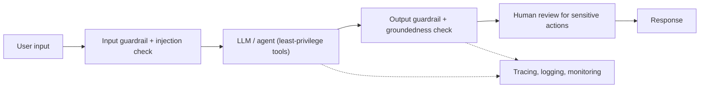

# AI Safety & Guardrails

LLMs [hallucinate](./llm.md#hallucination), can be manipulated into harmful output, and act on tools in the
real world. Safety is therefore not a single filter but a layered, defense-in-depth discipline. This page
covers guardrails (what they are and where they fall short), the attack surface, red-teaming, and how the
pieces fit together in production.

## Guardrails

**[Guardrails](./glossary.md#guardrails)** are systems -- rule-based or ML-based -- that decide whether a
given text (a user query or a model response) is allowed or forbidden under a specified policy. They
operationalize normative principles by evaluating inputs and outputs for policy compliance, keeping system
behavior within ethical, legal, and safety boundaries.

The field evolved from rule-based filters, to trained classifiers for fixed harm types (toxicity, hate
speech), to modern **instruction-tuned guardrails** that frame safety as instruction-following and accept a
policy description alongside the input. Two architectural patterns dominate:

- **Multi-class single-pass** (e.g. Llama Guard) -- process the input alongside the full policy taxonomy in
  one forward pass, returning a label plus violating categories.
- **Binary per-category** (e.g. ShieldGemma, Granite Guardian) -- one call per risk category, evaluating
  each policy independently.

Major open-source families: **Llama Guard** (Meta), **ShieldGemma** (Google), **Granite Guardian** (IBM),
and **Aegis** (NVIDIA). Managed options include **Bedrock Guardrails** (see
[Cloud vs Local Models](./cloud-vs-local.md#enterprise-cloud-options)).

### What guardrails get right -- and wrong

They reach strong **precision** on in-distribution policies and cover the bulk of widely recognized hazards
(violence, sexual content, hate, self-harm, illegal activity). But the current generation has documented
limits -- worth knowing so you do not over-trust a single guardrail:

1. **Recall is the bottleneck.** Guardrails systematically favor precision (few false positives) at the cost
   of missing genuinely unsafe content.
2. **Poor generalization to unseen policies.** Moving from a standard taxonomy to a domain-specific one can
   drop F1 by 24+ points -- sometimes below the model's own non-safety-tuned base model.
3. **Prompt extension is not enough.** Bolting new categories onto the policy prompt tends to either not
   improve recall or trade recall for large false-positive spikes.
4. **Domain-specific risks are nearly invisible.** In financial-services red-teaming, evaluated guardrails
   caught roughly a third or less of unsafe queries even with extended taxonomies.

Mitigations split into training-time (e.g. perturbing policies during training so the model attends to the
supplied policy text rather than memorizing one taxonomy) and deployment-time (multi-layer strategies,
governance, disclaimers, human review).

## The attack surface: prompt injection and jailbreaking

**[Prompt injection](./glossary.md#prompt-injection)** and **[jailbreaking](./glossary.md#jailbreaking)**
are attacks meant to override the limitations imposed on an LLM system to elicit harmful or undesirable
output. A common method disguises a malicious instruction as normal input and manipulates the system into
ignoring its original instructions.

- It is a **method, not an outcome** -- it describes *how* an attack happens, not *what* the harmful content
  is. Attackers often use injection to *achieve* some other category of violation.
- **Indirect prompt injection** compromises LLM-integrated apps via malicious content hidden in *retrieved*
  data -- a direct risk for any [RAG](./rag.md) or [agent](./agents.md) system that ingests untrusted text.
- The **OWASP Top 10 for LLM Applications** ranks prompt injection as the #1 risk class. It is also largely
  *not* covered by general content guardrails -- dedicated detectors (e.g. Meta's Prompt Guard) exist for it.

For agents this compounds: a single user turn fans out to many tool calls, and an injected instruction can
trigger real-world actions. Constrain what tools exist and what they may do, and treat tool inputs/outputs
as untrusted (see [Agents](./agents.md#what-makes-agents-hard)).

## Red-teaming

**[Red-teaming](./glossary.md#red-teaming)** is a safety evaluation method where evaluators continuously and
adversarially probe a system to discover new failure modes -- in contrast to *static benchmarks* that test
against a fixed set of examples.

- **Adaptive** -- evaluators steer exploration using the risk taxonomy and the intended use case; multi-turn
  attacks can grow progressively complex.
- **Complementary to benchmarks** -- red-teaming data should be frozen into static benchmarks for regression
  testing and to accumulate institutional domain expertise over time.
- **Diverse participants matter** -- security backgrounds drive injection attempts, AI engineers know model
  failure modes, domain experts know which questions probe real regulatory boundaries.

Red-teaming inputs slot directly into the same eval runner described in
[Evaluation and LLMOps](./evaluation-and-llmops.md).

## Defense in depth

No single control is sufficient. A responsible deployment layers them:

- **Input side** -- guardrail classification plus prompt-injection detection on untrusted text.
- **Model/agent side** -- least-privilege tools, explicit user consent for sensitive actions, and grounding
  via [RAG](./rag.md) to reduce hallucination.
- **Output side** -- output guardrails, groundedness/faithfulness checks, and citations.
- **Process side** -- governance (logging, escalation, manual review, access suspension), continuous
  monitoring, and frameworks like the **NIST AI Risk Management Framework** (Govern / Map / Measure / Manage).

Safety is ultimately a sociotechnical problem: it depends on the context the system operates in, not just the
model. Evaluate risk holistically -- in context, with humans in the loop where the stakes warrant it.

## See also

- [Large Language Models](./llm.md#hallucination) -- hallucination, the failure safety mitigations contain
- [AI Agents](./agents.md) -- why agentic systems compound safety concerns
- [RAG](./rag.md) -- grounding as a safety mitigation; also an injection vector
- [Evaluation and LLMOps](./evaluation-and-llmops.md) -- safety scorers and continuous monitoring
- [Cloud vs Local Models](./cloud-vs-local.md) -- managed guardrail services
- [AI Glossary](./glossary.md) -- guardrails, prompt injection, jailbreaking, red-teaming, and more
