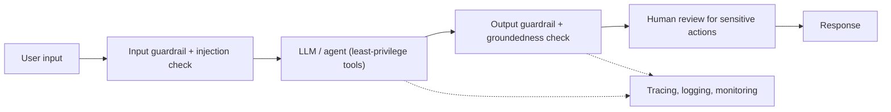

# AI Safety & Guardrails

LLMs [hallucinate](./llm.md#hallucination), can be manipulated into harmful output, and act on tools in the
real world. Safety is therefore not a single filter but a layered, defense-in-depth discipline. This page
covers guardrails (what they are and where they fall short), the attack surface, red-teaming, and how the
pieces fit together in production.

## Guardrails

**[Guardrails](./glossary.md#guardrails)** are systems - rule-based or ML-based - that decide whether a
given text (a user query or a model response) is allowed or forbidden under a specified policy. They
operationalize normative principles by evaluating inputs and outputs for policy compliance, keeping system
behavior within ethical, legal, and safety boundaries.

The field evolved from rule-based filters, to trained classifiers for fixed harm types (toxicity, hate
speech), to modern **instruction-tuned guardrails** that frame safety as instruction-following and accept a
policy description alongside the input. Two architectural patterns dominate:

- **Multi-class single-pass** (e.g. Llama Guard) - process the input alongside the full policy taxonomy in
  one forward pass, returning a label plus violating categories.
- **Binary per-category** (e.g. ShieldGemma, Granite Guardian) - one call per risk category, evaluating
  each policy independently.

Major open-source families: **Llama Guard** (Meta), **ShieldGemma** (Google), **Granite Guardian** (IBM),
and NVIDIA **NemoGuard / Nemotron** content-safety models such as
[Llama 3.1 NemoGuard 8B ContentSafety NIM](https://docs.nvidia.com/nim/llama-3-1-nemoguard-8b-contentsafety/latest/index.html).
NVIDIA's **Aegis** name refers to the
[Aegis / Nemotron content-safety dataset](https://huggingface.co/datasets/nvidia/Aegis-AI-Content-Safety-Dataset-2.0),
not to the programmable guardrail framework. That framework is
[NeMo Guardrails](https://docs.nvidia.com/nemo/guardrails/latest/), a rails library and microservice for
LLM applications. Managed options include **Bedrock Guardrails** (see
[Cloud vs Local Models](./cloud-vs-local.md#enterprise-cloud-options)).

### What guardrails get right - and wrong

They reach strong **precision** on in-distribution policies and cover the bulk of widely recognized hazards
(violence, sexual content, hate, self-harm, illegal activity). But the current generation has documented
limits - worth knowing so you do not over-trust a single guardrail:

1. **Recall is the bottleneck.** Guardrails systematically favor precision (few false positives) at the cost
   of missing genuinely unsafe content.
2. **Poor generalization to unseen policies.** The ACL 2026 paper
   [Domain Generalizable AI Guardrails with Augmented Policy Training](https://aclanthology.org/2026.acl-long.748/)
   finds that fine-tuned guardrails can overfit their training policies and adapt poorly to new domains.
3. **Prompt extension is not enough.** Bolting new categories onto the policy prompt tends to either not
   improve recall or trade recall for large false-positive spikes.
4. **Domain-specific risks are nearly invisible.** In the financial-services study
   [Understanding and Mitigating Risks of Generative AI in Financial Services](https://arxiv.org/abs/2504.20086),
   off-the-shelf guardrails show low recall on domain-specific unsafe queries, even when prompts are expanded.
   Measure recall on your own domain red-team set before relying on one.

Mitigations split into training-time (e.g. perturbing policies during training so the model attends to the
supplied policy text rather than memorizing one taxonomy) and deployment-time (multi-layer strategies,
governance, disclaimers, human review).

## The attack surface: prompt injection and jailbreaking

**[Prompt injection](./glossary.md#prompt-injection)** and **[jailbreaking](./glossary.md#jailbreaking)**
are attacks meant to override the limitations imposed on an LLM system to elicit harmful or undesirable
output. A common method disguises a malicious instruction as normal input and manipulates the system into
ignoring its original instructions.

- It is a **method, not an outcome** - it describes *how* an attack happens, not *what* the harmful content
  is. Attackers often use injection to *achieve* some other category of violation.
- **Indirect prompt injection** compromises LLM-integrated apps via malicious content hidden in *retrieved*
  data - a direct risk for any [RAG](./rag.md) or [agent](./agents.md) system that ingests untrusted text.
- The **OWASP Top 10 for LLM Applications 2025** lists **LLM01:2025 Prompt Injection** as the #1 risk
  class. It is also largely *not* covered by general content guardrails - dedicated detectors (e.g. Meta's
  Prompt Guard) exist for it.

For agents this compounds: a single user turn fans out to many tool calls, and an injected instruction can
trigger real-world actions. Constrain what tools exist and what they may do, and treat tool inputs/outputs
as untrusted (see [Agents](./agents.md#what-makes-agents-hard) and the dedicated
[Agent Security](./agent-security.md) page).

## OWASP Top 10 for LLM Applications (2025)

Prompt injection is only the first entry. The archived
[OWASP Top 10 for LLM Applications 2025](https://genai.owasp.org/resource/owasp-top-10-for-llm-applications-2025/)
and its [source files](https://github.com/OWASP/www-project-top-10-for-large-language-model-applications/tree/main/2_0_vulns)
are a useful checklist for threat modeling any LLM feature:

| ID and name | Site coverage |
|---|---|
| **LLM01:2025 Prompt Injection** | [Agent Security](./agent-security.md), [RAG](./rag.md), and this page |
| **LLM02:2025 Sensitive Information Disclosure** | [Privacy & Data Handling](./privacy-and-data.md) |
| **LLM03:2025 Supply Chain** | [Agent Security](./agent-security.md) and [Model Selection](./model-selection.md) |
| **LLM04:2025 Data and Model Poisoning** | [Eval Datasets & Synthetic Data](./eval-datasets-and-synthetic-data.md), [Fine-Tuning](./fine-tuning.md), and [RAG](./rag.md) |
| **LLM05:2025 Improper Output Handling** | [Structured Outputs](./structured-outputs.md) |
| **LLM06:2025 Excessive Agency** | [Agent Security](./agent-security.md) and [Human-in-the-Loop](./human-in-the-loop.md) |
| **LLM07:2025 System Prompt Leakage** | [Privacy & Data Handling](./privacy-and-data.md) and [Prompt Engineering](./prompt-engineering.md) |
| **LLM08:2025 Vector and Embedding Weaknesses** | [Embeddings](./embeddings.md) and [RAG](./rag.md) |
| **LLM09:2025 Misinformation** | [Large Language Models](./llm.md), [RAG](./rag.md), and [Evaluation and LLMOps](./evaluation-and-llmops.md) |
| **LLM10:2025 Unbounded Consumption** | [Cost, Latency & Model Routing](./cost-and-latency.md) |

Two entries are easy to underestimate. **Improper output handling** (LLM05) is classic injection with a new
source: treat model output like user input before rendering HTML, running shell commands, or building
queries. **System prompt leakage** (LLM07) is a design smell rather than a filter problem: never put
credentials, internal URLs, or authorization rules in a prompt and assume they stay secret.

OWASP has also published a separate
[Top 10 for Agentic Applications 2026](https://genai.owasp.org/resource/owasp-top-10-for-agentic-applications-for-2026/);
use it alongside [Agent Security](./agent-security.md) when tools can plan, act, or delegate.

## Red-teaming

**[Red-teaming](./glossary.md#red-teaming)** is a safety evaluation method where evaluators continuously and
adversarially probe a system to discover new failure modes - in contrast to *static benchmarks* that test
against a fixed set of examples.

- **Adaptive** - evaluators steer exploration using the risk taxonomy and the intended use case; multi-turn
  attacks can grow progressively complex.
- **Complementary to benchmarks** - red-teaming data should be frozen into static benchmarks for regression
  testing and to accumulate institutional domain expertise over time.
- **Diverse participants matter** - security backgrounds drive injection attempts, AI engineers know model
  failure modes, domain experts know which questions probe real regulatory boundaries.

Red-teaming inputs slot directly into the same eval runner described in
[Evaluation and LLMOps](./evaluation-and-llmops.md).

## Defense in depth

No single control is sufficient. A responsible deployment layers them:

```mermaid
flowchart LR
    user["User input"] --> inguard["Input guardrail + injection check"]
    inguard --> app["LLM / agent (least-privilege tools)"]
    app --> outguard["Output guardrail + groundedness check"]
    outguard --> review["Human review for sensitive actions"]
    review --> resp["Response"]
    app -.-> trace["Tracing, logging, monitoring"]
    outguard -.-> trace
```

- **Input side** - guardrail classification plus prompt-injection detection on untrusted text.
- **Model/agent side** - least-privilege tools, explicit user consent for sensitive actions, and grounding
  via [RAG](./rag.md) to reduce hallucination.
- **Output side** - output guardrails, groundedness/faithfulness checks, and citations.
- **Process side** - governance (logging, escalation, manual review, access suspension), continuous
  monitoring, and frameworks like the **NIST AI Risk Management Framework** (Govern / Map / Measure / Manage).

Safety is ultimately a sociotechnical problem: it depends on the context the system operates in, not just the
model. Evaluate risk holistically - in context, with [humans in the loop](./human-in-the-loop.md) where the
stakes warrant it.

## See also

- [Large Language Models](./llm.md#hallucination) - hallucination, the failure safety mitigations contain
- [AI Agents](./agents.md) - why agentic systems compound safety concerns
- [Agent Security](./agent-security.md) - indirect prompt injection, tool poisoning, exfiltration, and sandboxing
- [Privacy & Data Handling](./privacy-and-data.md) - PII, logging, and data residency (distinct from attacks)
- [Human-in-the-Loop](./human-in-the-loop.md) - approval and audit for high-impact actions
- [RAG](./rag.md) - grounding as a safety mitigation; also an injection vector
- [Evaluation and LLMOps](./evaluation-and-llmops.md) - safety scorers and continuous monitoring
- [Cloud vs Local Models](./cloud-vs-local.md) - managed guardrail services
- [AI Glossary](./glossary.md) - guardrails, prompt injection, jailbreaking, red-teaming, and more
