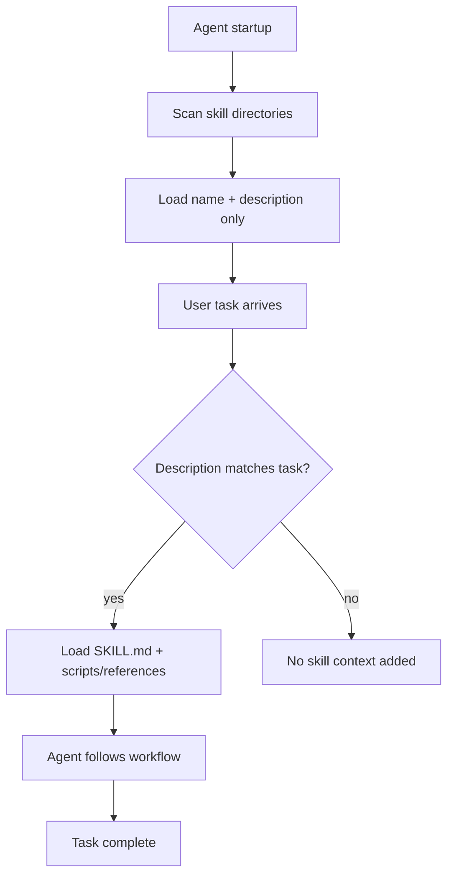

# Agent Skills

**Agent Skills** are portable, version-controlled workflow packages that teach a coding agent *how* to
perform a specific task - deploy to staging, run a security audit, write commit messages in your team's
format, or follow a multi-step review ritual. They sit alongside [rules](./skills.md#skills-vs-related-mechanisms),
project memory files, and [MCP](./agents.md#mcp-model-context-protocol) servers as one of the main ways you
shape agent behavior without rewriting the base model.

The pattern is converging on an open standard ([agentskills.io](https://agentskills.io)) with a shared
`SKILL.md` format. Cursor, Claude Code, Claude.ai, Codex, Gemini CLI, and Copilot CLI all implement it
with minor platform differences in discovery paths and invocation.

## What agent skills are

A skill is a folder containing at minimum a `SKILL.md` file. The file has YAML frontmatter (`name`,
`description`) and markdown instructions the agent follows when the skill applies. Optional subdirectories
hold scripts, reference docs, and templates that the agent loads only when needed.

The key architectural property is **progressive disclosure** applied to [context engineering](./context-engineering.md):

1. **At startup**, the agent scans skill directories and loads only each skill's **name and description**
   (roughly 100 tokens per skill).
2. **On each task**, the agent checks whether any skill's description matches the user's request, open
   files, or workflow.
3. **When a skill matches**, the agent loads the full `SKILL.md` (and any referenced scripts or docs).
4. **When no skill matches**, nothing extra enters the context - unlike always-on rules or project memory.



Skills are **reusable across conversations**, **shareable via git**, and **composable** with other agent
extensions. A team can commit project skills to the repository so every developer's agent follows the same
deployment checklist or code review ritual.

## Skills vs related mechanisms

Skills overlap conceptually with several other ways you configure coding agents. The distinction that matters
in practice is *when* content enters the context and *what* it is for.

| Mechanism | Format | When loaded | Best for |
|---|---|---|---|
| **Skills** | `SKILL.md` in a named folder | On demand when task matches | Multi-step workflows, procedures |
| **Rules** (Cursor) | `.mdc` with frontmatter | Automatically by glob or always-apply | Short conventions, coding standards |
| **Project memory** | [`AGENTS.md`](./project-memory-and-rules.md), `CLAUDE.md` | Every relevant session | Repo-wide conventions, architecture |
| **[MCP](./agents.md#mcp-model-context-protocol) servers** | Tool protocol | Tool definitions in context | External APIs, databases, services |
| **System prompts** | Inline / config | Every call | Base behavior, not reusable workflows |

A few rules of thumb:

- **Rules** answer "how should code in this repo look?" Skills answer "how do I run this workflow?"
- **Project memory** is always present context; skills are loaded only when relevant.
- **MCP** connects agents to *external systems*; skills encode *internal procedures* the agent follows.
- **[SPDD prompts](./glossary.md#spdd)** and skills both treat instructions as version-controlled artifacts,
  but SPDD targets delivery specs; skills target repeatable agent workflows.

For where synthesized knowledge lives versus ephemeral retrieval, see [Knowledge Management with
LLMs](./knowledge-management.md). Skills sit on the ephemeral side: they do not accumulate knowledge
themselves, but they orchestrate how an agent uses tools, files, and memory during a task.

## Multi-tool support

The `SKILL.md` format is shared; discovery paths and invocation differ by platform.

| Tool | Project paths | Personal paths | How to invoke |
|---|---|---|---|
| **Cursor** | `.cursor/skills/`, `.agents/skills/`, nested monorepo dirs | `~/.cursor/skills/`, `~/.agents/skills/` | Auto, `/skill-name`, `@` attach |
| **Claude Code** | `.claude/skills/` | `~/.claude/skills/` | Auto via Skill tool, `/skill-name` |
| **Claude.ai** | Upload via Customize > Skills | Account-level | Auto when description matches |
| **Codex** | `.codex/skills/` | `~/.codex/skills/` | Platform skill tool |
| **Gemini CLI** | Project skill dirs | User home equivalents | `activate_skill` tool |
| **Copilot CLI** | Plugin-bundled skills | Installed plugins | `skill` tool |

Cursor also loads `.claude/skills/` and `.codex/skills/` for compatibility, so a skill checked into
`.claude/skills/` may work in Cursor without duplication. Nested project directories (e.g.
`apps/web/.cursor/skills/`) auto-scope skills to files under that subtree - useful in monorepos.

External references: [Cursor Agent Skills docs](https://cursor.com/docs/skills), [Anthropic skills
repository](https://github.com/anthropics/skills) (includes the `skill-creator` skill for guided authoring).

## Directory layout and scoping

Each skill is a directory. The folder name containing `SKILL.md` is the skill's identity (category folders
above it are organizational only):

```
my-skill/
├── SKILL.md              # Required - instructions + frontmatter
├── scripts/              # Optional - executable helpers
├── references/           # Optional - docs loaded on demand
└── assets/               # Optional - templates, schemas, static files
```

Category grouping is supported - tools walk skill roots recursively:

```
.cursor/skills/
├── shipping/
│   └── deploy-staging/
│       └── SKILL.md
└── review/
    └── security-audit/
        └── SKILL.md
```

### Scoping when a skill applies

Three mechanisms limit which tasks surface a skill:

**`paths` frontmatter** - glob patterns. The skill appears only when the agent works with matching files:

```markdown
---
name: react-component-patterns
description: Conventions for writing React components in this codebase.
paths:
  - "**/*.tsx"
  - "packages/ui/**/*.ts"
---
```

**Nested project directories** - skills under `apps/web/.cursor/skills/` apply when working in `apps/web/`
(Cursor). Equivalent to `paths` scoping without setting frontmatter.

**`disable-model-invocation: true`** - the skill loads only when you explicitly invoke it (e.g. `/skill-name`).
Use for workflows you want full control over, like destructive operations or optional rituals.

## SKILL.md format

Every skill requires a `SKILL.md` with YAML frontmatter and a markdown body:

```markdown
---
name: write-commit-message
description: Generate descriptive commit messages from staged changes. Use when the user asks for help writing commit messages or reviewing staged diffs.
---

# Write Commit Message

## Instructions

1. Run `git diff --staged` to see staged changes.
2. Analyze the diff: what changed, why, and any breaking changes.
3. Draft a message following the project's commit format.
4. Present the message for the user to copy or edit.
```

### Frontmatter fields

| Field | Required | Description |
|---|---|---|
| `name` | Yes | Skill identifier. Lowercase letters, numbers, hyphens only. Should match the parent folder name. |
| `description` | Yes | What the skill does and when to use it. Primary trigger mechanism for automatic invocation. |
| `paths` | No | Glob patterns scoping the skill to matching files. Comma-separated string or YAML list. |
| `disable-model-invocation` | No | When `true`, explicit invocation only (slash command behavior). |
| `metadata` | No | Arbitrary key-value pairs for tooling or organization. |

:::tip
The `description` field is the trigger. Write in **third person**, include both **WHAT** the skill does and
**WHEN** to use it, and add concrete trigger terms ("commit message", "staged diff", "PR review"). Vague
descriptions like "helps with documents" rarely match reliably.
:::

### Authoring rules

- **Keep `SKILL.md` under ~500 lines.** Move detailed reference material to `references/`.
- **Concise over exhaustive.** The agent is already capable; add only what it would not know (your team's
  conventions, your repo's scripts, your checklist).
- **One job per skill.** If the description needs "and also", split into two skills.
- **Scripts over embedded code** for deterministic or repetitive steps - reference `scripts/foo.py` rather
  than pasting the full script into markdown.
- **Keep references one level deep** - link from `SKILL.md` to `references/foo.md`, not chains of nested
  references.

## How to use skills

### Automatic invocation

By default, agents read available skill metadata and decide whether a skill applies to the current task.
Matching depends on the user's message, open files, and (where supported) `paths` scoping. Simple one-step
requests may not trigger a skill even when the description fits - complex, multi-step tasks match more
reliably.

### Explicit invocation

When you know which workflow you want:

- **Cursor:** type `/` followed by the skill name (e.g. `/write-commit-message`), or type `@` and attach the
  skill as context.
- **Claude Code:** type `/skill-name` or ask Claude to use a specific skill; the agent invokes it via the
  Skill tool.
- **Claude.ai:** skills with matching descriptions activate when your request fits; upload skills via
  Customize > Skills.

Set `disable-model-invocation: true` on skills that should **never** auto-load (migrations, releases,
destructive operations).

### Built-in authoring helpers

Rather than writing a skill from scratch:

- **Cursor:** type `/create-skill` in Agent chat for guided scaffolding.
- **Claude Code:** install the `skill-creator` skill from [Anthropic's skills repo](https://github.com/anthropics/skills)
  and ask it to help you build or refine a skill (including description optimization and evals).

## How to create your own

### Phase 1: Discovery

Before writing files, decide:

1. **Purpose** - what single workflow does this skill automate?
2. **Scope** - personal (`~/.cursor/skills/`) or project (`.cursor/skills/` in the repo)?
3. **Triggers** - what user phrases, file types, or situations should activate it?
4. **Output** - what does "done" look like? Any required format or template?
5. **Dependencies** - scripts, MCP tools, or reference docs needed?

### Phase 2: Design

1. Draft a **name** (lowercase, hyphens, max 64 characters).
2. Write a **description** with WHAT + WHEN + trigger terms.
3. Outline **sections** (quick start, checklist, examples, edge cases).
4. Identify **supporting files** (`scripts/`, `references/`, `assets/`).

### Phase 3: Implementation

1. Create the skill directory under the appropriate skills root.
2. Write `SKILL.md` with frontmatter and instructions.
3. Add scripts and reference files; link them from `SKILL.md`.
4. For project skills, commit to the repository so the team shares them.

### Phase 4: Verification

Test with realistic prompts - not toy one-liners:

- [ ] Skill triggers on a representative user request
- [ ] Skill does **not** trigger on unrelated tasks (avoid over-triggering)
- [ ] Explicit `/skill-name` invocation works
- [ ] Referenced scripts run and paths resolve correctly
- [ ] `SKILL.md` stays under 500 lines

If the skill **under-triggers**, broaden the description with more trigger terms. If it **over-triggers**,
narrow the description or add `paths` scoping.

## Worked example: commit message helper

**Directory structure:**

```
write-commit-message/
└── SKILL.md
```

**`SKILL.md`:**

```markdown
---
name: write-commit-message
description: Generate descriptive commit messages from staged git changes. Use when the user asks for help writing commit messages, reviewing staged diffs, or preparing a commit.
---

# Write Commit Message

## Instructions

1. Run `git diff --staged` to inspect staged changes.
2. If nothing is staged, tell the user and suggest `git add`.
3. Identify the change type: feat, fix, refactor, docs, chore, etc.
4. Write a subject line (max 72 chars) in imperative mood.
5. Add a body if the change needs context (what and why, not how).
6. Present the message in a fenced code block for easy copying.

## Format

Use Conventional Commits unless the project uses a different standard:

\`\`\`
<type>(<scope>): <subject>

<body>
\`\`\`

## Examples

**Input:** Staged change adds JWT login endpoint.

**Output:**
\`\`\`
feat(auth): add JWT-based login endpoint

Validate tokens in middleware; return 401 on expiry.
\`\`\`
```

**Using it:**

- *Automatic:* "Help me write a commit message for my staged changes" - the agent matches the description
  and follows the workflow.
- *Explicit:* `/write-commit-message` - loads the skill even if auto-matching would miss it (especially
  useful with `disable-model-invocation: true`).

## Common patterns

### Template pattern

Provide an output skeleton the agent fills in:

```markdown
## Report structure

\`\`\`markdown
# [Title]

## Summary
[One paragraph]

## Findings
- Finding with evidence

## Recommendations
1. Actionable step
\`\`\`
```

### Workflow pattern

Numbered steps with a checklist the agent tracks:

```markdown
## Deployment workflow

- [ ] Run `scripts/validate.py`
- [ ] Run `scripts/deploy.sh staging`
- [ ] Smoke-test the staging URL
- [ ] Confirm with user before production
```

### Examples pattern

Input/output pairs for style-sensitive tasks (commit messages, PR comments, user-facing copy):

```markdown
**Input:** Fixed timezone bug in reports.
**Output:** `fix(reports): correct date formatting in timezone conversion`
```

### Feedback loop pattern

Validate output before proceeding:

```markdown
1. Make changes
2. Run `python scripts/validate.py output/`
3. If validation fails, fix and re-run
4. Proceed only when validation passes
```

### Conditional workflow

Branch on task type:

```markdown
1. Is this a new file or an edit?
   - **New file** → follow "Creation workflow"
   - **Edit** → follow "Editing workflow"
```

## Anti-patterns

- **Vague descriptions** - "Helps with documents" will not trigger reliably; name file types and tasks.
- **Overloaded skills** - one skill for "deploy, review, and write docs" should be three skills.
- **Time-sensitive instructions** without a deprecated section - use "Current method" / "Legacy (deprecated)".
- **Deep reference chains** - `SKILL.md` → `a.md` → `b.md` → `c.md` leads to partial reads.
- **Windows-style paths** - use `scripts/helper.py`, not `scripts\helper.py`.
- **Duplicating general knowledge** - do not explain what PDFs are; say which library and command to use.

## Sharing and team adoption

- **Project skills in git** - commit `.cursor/skills/` or `.claude/skills/` so the whole team gets the same
  workflows on clone.
- **Import from GitHub** - Cursor Settings → Rules → Add Rule → Remote Rule (GitHub URL).
- **Migrate legacy rules** - in Cursor 2.4+, run `/migrate-to-skills` to convert dynamic rules and slash
  commands into skills. Rules with `alwaysApply: true` or specific globs are not migrated (they have explicit
  triggering that differs from skill behavior).

View discovered skills in Cursor via Settings → Rules → Agent Decides section.

## See also

- [Context & Prompt Engineering](./context-engineering.md) - progressive disclosure and the context budget skills operate within
- [Project Memory & Rules](./project-memory-and-rules.md) - always-on AGENTS.md and Cursor rules vs on-demand skills
- [AI-Assisted Development](./ai-assisted-development.md) - alignment-before-generation methodologies that skills support
- [Knowledge Management with LLMs](./knowledge-management.md) - persistent synthesis vs on-demand workflow context
- [AI Agents](./agents.md) - the agent loops that execute skill workflows
- [Tooling and Frameworks](./tooling.md) - MCP, orchestration frameworks, and observability
- [AI Glossary](./glossary.md) - agent skill and related terms
