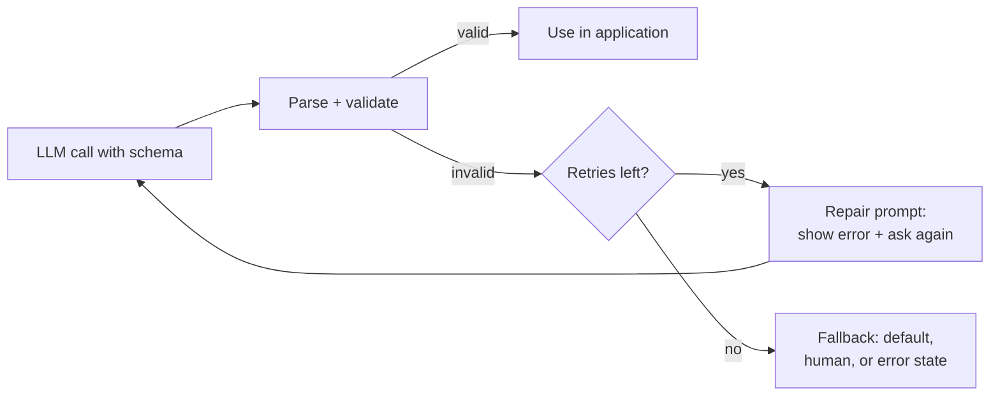

# Structured Outputs

Most production [LLM](./llm.md) features do not need paragraphs - they need **data**: a classification label,
a list of extracted fields, a tool argument object, or a config patch your code can parse and act on.
**Structured outputs** are the discipline of making that contract explicit, validated, and recoverable when
the model drifts. This is reliability engineering, not prompt trivia.

## Why structure matters

Free-form text forces you to regex or hope. Structured output lets you:

- **Parse deterministically** - `JSON.parse` or schema validation instead of fragile string extraction.
- **Compose in pipelines** - downstream code, databases, and [agents](./agents.md) consume typed data.
- **Evaluate objectively** - schema validity and field-level checks are cheap [eval scorers](./evaluation-and-llmops.md).
- **Reduce tokens** - a compact object beats a verbose explanation when the consumer is code.

The failure mode you are designing against: the model returns almost-JSON, wraps output in markdown fences,
adds a preamble ("Sure! Here is the JSON:"), or hallucinates a field your schema does not allow.

## Three layers of structure

| Layer | Mechanism | Who enforces |
|---|---|---|
| **Prompt-only** | "Return only valid JSON matching …" in the instruction | You parse and retry; weakest |
| **Native structured output** | Provider API constrains generation to a JSON Schema (OpenAI `text.format` / `response_format`, Anthropic structured outputs, etc.) | Model + API |
| **[Tool / function calling](./agents.md#tool-use-function-calling)** | Model emits a structured tool call; your code executes | Schema on the tool definition |

Prefer native structured output or tool calling for anything that touches production logic. Prompt-only
JSON works for prototypes and low-stakes internal tools. JSON mode only guarantees syntactically valid JSON;
JSON Schema structured outputs are the layer that enforces schema adherence.

## JSON Schema as the contract

Define the shape you expect explicitly:

```json
{
  "type": "object",
  "properties": {
    "sentiment": { "type": "string", "enum": ["positive", "negative", "neutral"] },
    "confidence": {
      "type": "number",
      "description": "Score from 0 to 1; validate the range in application code."
    },
    "summary": {
      "type": "string",
      "description": "Short plain-language summary; enforce length in application code."
    }
  },
  "required": ["sentiment", "confidence", "summary"],
  "additionalProperties": false
}
```

Design schemas for **machine consumption**:

- Use `enum` where the set of values is fixed.
- Set `additionalProperties: false` when stray keys indicate hallucination.
- Keep required fields meaningful. Some provider strict modes require every object property to appear in
  `required`; represent optional values with a `null` union there.
- Split large outputs into multiple calls or nested objects rather than one giant schema.

:::note
This example avoids `minimum`, `maximum`, and `maxLength` because OpenAI strict structured outputs use a
subset of JSON Schema. Validate value ranges, lengths, regexes, and formats after parsing unless your
specific provider documents hard support for those keywords.
:::

## Provider caveats {#provider-caveats}

Structured mode reduces parse failures, but it does not remove runtime checks:

- **Refusals are not your schema.** OpenAI documents explicit refusal handling for structured outputs; in
  current APIs a refusal can appear as a `refusal` field or content item instead of your JSON object. Check
  for refusal before parsing.
- **Truncation can still happen.** If output stops because of a token cap or length finish reason, JSON may
  be incomplete even when the request used a schema. Check the provider status or finish reason before
  accepting the object.
- **OpenAI strict mode is a JSON Schema subset.** The supported subset requires `additionalProperties: false`
  and all object properties listed in `required`; model optional fields as `["string", "null"]` or another
  nullable union. OpenAI's documented unsupported keywords include `minLength`, `maxLength`, `minimum`,
  `maximum`, `pattern`, and `format`.
- **Anthropic schemas still need validation.** Anthropic's tool/structured-output docs use JSON Schema-style
  `input_schema`, but public docs do not provide the same strict keyword support matrix as OpenAI. Treat
  constraints such as `minLength`, `pattern`, and `format` as contracts your code validates, not as the only
  enforcement layer.
- **First request latency is real.** OpenAI documents additional latency when a new schema is first processed;
  subsequent calls with the same schema are cached. Keep schemas stable and pre-warm critical paths.

## Validation and repair loops

Even with structured modes, validate every response before use:



**Repair prompt pattern:** append the validation error and the invalid output; ask the model to fix only
what failed. Often succeeds in one retry without a full re-generation.

**Fallback pattern:** after N failures, return a safe default, queue for [human review](./human-in-the-loop.md),
or degrade the feature ([AI in Products](./ai-in-products.md)).

Cap retries (typically 1--2) to control [cost and latency](./cost-and-latency.md).

## Structured output vs tool use

They overlap but serve different roles:

- **Structured output** - the *answer* is data (classification, extraction, generated config).
- **Tool use** - the model *requests an action*; your code runs it and may return structured results back.

Many agent frameworks implement "respond with this JSON schema" as a special tool. For a single-shot
extraction task, structured output is simpler; for "search, then format," tool use is natural.

## Patterns that work in production

### Extraction

Pull fields from unstructured text (invoice lines, support ticket metadata). Schema with required fields +
enums; validate types; repair on missing required keys.

### Classification and routing

Small schema: `{ "intent": "...", "confidence": 0.0--1.0 }`. Feed `intent` into
[model routing](./cost-and-latency.md#model-routing-patterns).

### Agent state

Pass structured state between steps (plan steps, open questions, file paths) instead of prose summaries --
pairs well with [context compaction](./context-engineering.md).

### Generated UI or config

Model outputs component props or feature-flag patches. Validate against schema **and** run a sandbox test
before applying - structure does not imply correctness.

## Common mistakes

- **Huge schemas in one shot** - split into stages (extract entities, then relations).
- **No validation** - trusting raw model output in SQL, shell, or payment flows.
- **Unbounded strings** - use `maxLength` or post-truncate with explicit handling.
- **Mixing instructions and data** - system prompt asks for JSON; user message also contains JSON examples
  that confuse the parser. Separate concerns clearly.

## See also

- [AI Agents](./agents.md) - tool calling as structured action requests
- [Evaluation & LLMOps](./evaluation-and-llmops.md) - schema validity as an eval scorer
- [Cost, Latency & Model Routing](./cost-and-latency.md) - shorter structured responses save tokens
- [AI in Products](./ai-in-products.md) - error states when structure fails
- [AI Glossary](./glossary.md) - structured output and related terms
