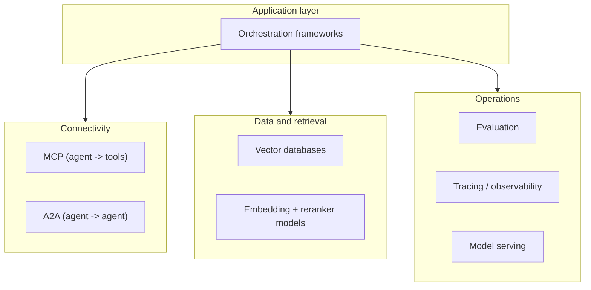

# Tooling and Frameworks

The model is only one part of a working AI application. Around it sits a fast-moving ecosystem of
orchestration frameworks, connectivity protocols, storage, and operations tooling. This page maps the
landscape so you can pick deliberately rather than by default.

## Orchestration frameworks

Frameworks provide building blocks for [agents](./agents.md) and multi-agent systems -- they do **not**
provide a production system. The gap from prototype to handling real traffic (integrations,
observability, failure handling, evaluation) is typically 3--6 months of engineering regardless of
framework.

| Framework | Orchestration model | State | Cross-framework | Best for |
|---|---|---|---|---|
| **LangGraph** (LangChain) | Graph (nodes + edges) | Explicit, checkpointed | No | Complex multi-phase workflows with human approval gates |
| **LlamaIndex** | Data / index-centric | Pluggable | No | RAG-heavy apps and data connectors |
| **CrewAI** | Role-based | Task outputs, sequential | No | Fastest prototyping; clearly-defined sequential workflows |
| **AutoGen / AG2** (Microsoft) | Conversational (message-passing) | In-memory history | No | Code generation and research dialogue (expensive at scale) |
| **OpenAI Agents SDK** | Handoff-based | Ephemeral context | No | OpenAI ecosystem with clean handoffs |
| **Google ADK** | Hierarchical trees | Pluggable backends | Yes (A2A) | Multimodal and cross-framework agent ecosystems |
| **Claude Agent SDK** (Anthropic) | Tool-use | Conversation history | No | Safety and auditability |

A few rules of thumb:

- **State management is the most common production failure.** LangGraph checkpoints every transition, so
  state survives failures and can resume; CrewAI/AutoGen/OpenAI SDK have weaker recovery stories.
- **CrewAI is fastest to a demo** ("a working multi-agent system in under 20 lines") but rigid at scale.
- **Google ADK is the only one with native A2A**, making it the pick for heterogeneous, multi-team agent
  ecosystems.
- **AutoGen's conversational model is expensive** -- a 4-agent, 5-round debate is 20+ LLM calls minimum.

## Connectivity protocols

Two open standards (covered in detail under [Agents](./agents.md#protocols-connecting-agents-to-tools-and-to-each-other))
form the connectivity stack:

- **MCP (Model Context Protocol)** -- agent to tools/data. Build a tool server once; any MCP-compatible
  client (Cursor, Claude, internal agents) can use it. Official Python and TypeScript SDKs.
- **A2A (Agent2Agent)** -- agent to agent across frameworks and vendors, with Agent Cards for capability
  discovery.

## Data and retrieval

The [RAG](./rag.md) stack has its own tooling:

- **Vector databases** -- Pinecone (hosted), pgvector (Postgres extension), OpenSearch, Weaviate, Milvus,
  Chroma (lightweight prototyping). See [vector database](./glossary.md#vector-database).
- **Embedding models** -- OpenAI `text-embedding-3-*`, Cohere `embed-v3`, Voyage `voyage-3`, and
  open-source `bge-*` / `e5` families. The [MTEB](https://huggingface.co/spaces/mteb/leaderboard)
  leaderboard is a starting filter.
- **Rerankers** -- cross-encoders (Cohere `rerank-3`, `bge-reranker-large`) that re-score the top
  candidates and often beat swapping the embedding model.

## Evaluation and observability

LLM output is non-deterministic, so you cannot ship it like ordinary code. You need a harness that scores
outputs and traces every call.

- **Tracing / observability** -- LangSmith, Langfuse, Arize Phoenix, or OpenTelemetry-based tracing.
  Agent-level tracing (not just app monitoring) is required to debug reasoning failures across chains.
- **Evaluation frameworks** -- LangSmith datasets, MLflow LLM Evaluate, Ragas (RAG-specific), DeepEval.
  Score **groundedness / faithfulness**, helpfulness, and safety -- often with LLM-as-judge.
- **Prompt registries** -- LangSmith prompt hub, MLflow prompt registry, or in-house. Treat prompts as
  versioned, testable assets.

## Model serving

How you run the model depends on whether you rent or self-host (see
[Cloud vs Local Models](./cloud-vs-local.md)):

- **Managed APIs** -- Anthropic, OpenAI, plus the cloud platforms (Bedrock, Azure / Microsoft Foundry,
  Vertex AI).
- **Self-hosted, throughput-oriented** -- vLLM or NVIDIA Triton for high-concurrency GPU serving.
- **Self-hosted, local / desktop** -- Ollama, LM Studio, llama.cpp for development and offline use.

## LLMOps: tying it together

**LLMOps** is the operational discipline of running LLM apps and agents in production -- the LLM-flavored
sibling of MLOps. The shift from classical MLOps is from *retraining* as the central loop to
*prompt + retrieval + tool* changes as the central loop.

| Concern | Classical MLOps | LLMOps |
|---|---|---|
| Primary artifact | model weights | prompt + tools + model + RAG index |
| Versioning unit | model checkpoint | prompt x model x tool spec |
| Failure mode | distribution drift | hallucination, jailbreak, agent stall |
| Evaluation | accuracy / AUC vs labels | groundedness, helpfulness, safety (often LLM-as-judge) |
| Cost profile | training-heavy, serving-cheap | training-free, serving-expensive per token |

LLMOps covers model + prompt versioning, evaluation suites, cost/latency optimization (token budgeting,
caching, model cascading), monitoring (drift, refusal rate, groundedness, p95 latency, per-tenant cost),
and incident response for non-deterministic failures. See [Cost, Latency & Model Routing](./cost-and-latency.md)
for the economics layer. Agents make every one of these harder, because a single user turn fans out to many
model and tool calls.

## See also

- [Cost, Latency & Model Routing](./cost-and-latency.md) -- token economics, caching, and model routing
- [Structured Outputs](./structured-outputs.md) -- schema validity as an eval scorer
- [AI Agents](./agents.md) -- what these frameworks orchestrate
- [RAG](./rag.md) -- the retrieval stack these data tools serve
- [Cloud vs Local Models](./cloud-vs-local.md) -- managed platforms vs self-hosted serving
- [Large Language Models](./llm.md) -- the model at the center
- [AI Glossary](./glossary.md) -- LLMOps, MCP, vector database, reranking, and more
