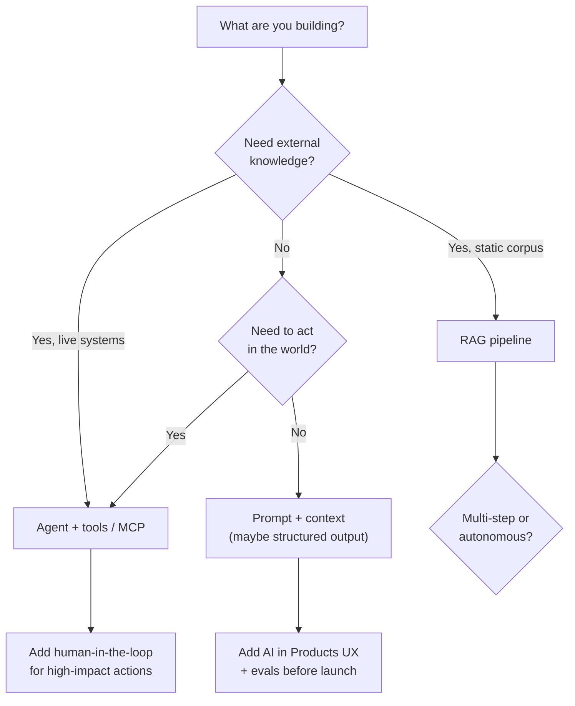

# Which Pattern When?

The [AI section](./llm.md) covers many patterns. In production you combine them - rarely "just an LLM" or "just
RAG." This page is a **capstone decision guide**: where to start, what to add next, and what to skip. It
assumes you have skimmed [Large Language Models](./llm.md) and points to deep dives rather than repeating them.

## If you want to…

| Goal | Start here | Usually add | Often skip (at first) |
|---|---|---|---|
| **Answer questions over your docs** | [RAG](./rag.md) | [Embeddings](./embeddings.md), [structured outputs](./structured-outputs.md) for citations/metadata | [Agents](./agents.md) until retrieval works |
| **Build a support or internal Q&A bot** | [RAG](./rag.md) + [AI in Products](./ai-in-products.md) | [Evaluation & LLMOps](./evaluation-and-llmops.md), [privacy](./privacy-and-data.md) | Multi-agent systems |
| **Automate multi-step work (search, act, repeat)** | [Agents](./agents.md) | [MCP](./agents.md#mcp-model-context-protocol) tools, [human-in-the-loop](./human-in-the-loop.md) | Pure chat without tools |
| **Use AI inside your dev workflow** | [AI-Assisted Development](./ai-assisted-development.md) | [Project memory & rules](./project-memory-and-rules.md), [Agent Skills](./skills.md) | Custom fine-tuning |
| **Ship a feature users see in your product** | [AI in Products](./ai-in-products.md) | [Structured outputs](./structured-outputs.md), [cost & latency](./cost-and-latency.md) | Autonomous agents without approval |
| **Keep sensitive data on-prem** | [Cloud vs Local](./cloud-vs-local.md) | [Local LLM app](./local-llm-app.md), [privacy](./privacy-and-data.md) | Sending full corpus to frontier APIs |
| **Control spend at scale** | [Cost, Latency & Model Routing](./cost-and-latency.md) | [Context engineering](./context-engineering.md), evals | Frontier model for every request |
| **Make outputs machine-parseable** | [Structured Outputs](./structured-outputs.md) | Validation/repair loops, eval scorers | Free-form prose to regex later |
| **Operate safely in production** | [Safety](./safety.md) + [Privacy & Data](./privacy-and-data.md) | [Human-in-the-loop](./human-in-the-loop.md), red-teaming via [evals](./evaluation-and-llmops.md) | Guardrails as the only layer |
| **Debug wrong or broken behavior** | [Debugging LLM Apps](./debugging-llm-apps.md) | Traces from [LLMOps](./evaluation-and-llmops.md) | Rewriting the whole prompt blindly |

## Core decision: what kind of problem is it?

**Knowledge problem** - model does not know your facts → [RAG](./rag.md), [knowledge management](./knowledge-management.md) patterns, or tools that fetch live data.

**Action problem** - model must do things, not just text → [Agents](./agents.md) with narrow tools and [HITL](./human-in-the-loop.md) on destructive steps.

**Format problem** - downstream code needs JSON/fields → [Structured outputs](./structured-outputs.md), not "please return JSON."

**Process problem** - team repeats the same agent ritual → [Skills](./skills.md) or [project memory](./project-memory-and-rules.md), not a longer system prompt every time.

## RAG vs agent vs chat

| Pattern | Shape | Choose when | Watch out for |
|---|---|---|---|
| **Chat** | Single model call per turn | Transformation, drafting, classification with small context | Stale knowledge, no actions |
| **RAG** | Retrieve → generate | Large doc corpus, FAQ, grounding requirements | Bad chunks, injection via retrieved text |
| **Agent** | Model + tools in a loop | Dynamic plans, APIs, code execution, multi-step research | Cost, latency, runaway loops, tool sprawl |
| **Workflow** | Fixed steps (your code controls) | Known pipeline, compliance, predictable cost | Less flexible than agents |

Hybrid is normal: **RAG inside an agent** (retrieve then act), or **router** that picks chat vs RAG vs agent
per request ([cost & latency](./cost-and-latency.md#model-routing-patterns)).

## Adaptation ladder (cheapest first)

From [LLMs](./llm.md#foundation-models-rent-dont-build) - try in order; stop when quality is good enough:

1. **Prompt / context** - instructions, examples, [context engineering](./context-engineering.md)
2. **[RAG](./rag.md)** - fresh, private knowledge at inference
3. **[Project memory / rules / skills](./project-memory-and-rules.md)** - repeatable team conventions and workflows
4. **Fine-tuning / LoRA** - domain style or format the model resists via prompting (see [RAG vs fine-tuning](./rag.md#rag-vs-fine-tuning))
5. **Pre-training** - almost never

For coding agents, (3) often beats (4).

## Configuration stack for coding agents

| Need | Use |
|---|---|
| Repo orientation, build commands | `AGENTS.md` / [project memory](./project-memory-and-rules.md) |
| File-type conventions | Cursor [rules](./project-memory-and-rules.md) |
| Multi-step rituals (release, review) | [Agent skills](./skills.md) |
| External systems (Jira, DB) | [MCP](./agents.md#mcp-model-context-protocol) servers |

Do not duplicate the same checklist in memory, rules, *and* skills - one source of truth per concern.

## Production checklist (any pattern)

Before launch, you should have answers for:

- [ ] **Eval or test set** - representative inputs + pass criteria ([Evaluation & LLMOps](./evaluation-and-llmops.md))
- [ ] **Cost/latency budget** - model tier, max tokens, max agent rounds ([Cost & Latency](./cost-and-latency.md))
- [ ] **Failure UX** - API down, refusal, wrong answer ([AI in Products](./ai-in-products.md))
- [ ] **Data handling** - what leaves your network ([Privacy & Data](./privacy-and-data.md))
- [ ] **Safety** - injection surface, tool permissions ([Safety](./safety.md))
- [ ] **Runbook** - how to diagnose incidents ([Debugging LLM Apps](./debugging-llm-apps.md))

## Common anti-patterns

- **Agent first** - jumping to agents before retrieval and prompts work
- **Frontier everywhere** - no routing; invoice surprises ([Cost & Latency](./cost-and-latency.md))
- **Guardrails only** - no HITL on money/deletes/publish ([Human-in-the-Loop](./human-in-the-loop.md))
- **Eval never** - shipping on vibes ([Evaluation & LLMOps](./evaluation-and-llmops.md))
- **Giant system prompt** - everything in one blob instead of skills, RAG, and tools ([Context Engineering](./context-engineering.md))

## Suggested reading order

**New to LLMs:** [LLM](./llm.md) → [Context Engineering](./context-engineering.md) → this page → your goal row in the table above.

**Building a product feature:** [AI in Products](./ai-in-products.md) → [Structured Outputs](./structured-outputs.md) → [RAG](./rag.md) or [Agents](./agents.md) → [Eval & LLMOps](./evaluation-and-llmops.md).

**Using AI as an engineer:** [AI-Assisted Development](./ai-assisted-development.md) → [Project Memory & Rules](./project-memory-and-rules.md) → [Agent Skills](./skills.md).

**Operating in production:** [Evaluation & LLMOps](./evaluation-and-llmops.md) → [Debugging LLM Apps](./debugging-llm-apps.md) → [Cost & Latency](./cost-and-latency.md).

## See also

- [Debugging LLM Apps](./debugging-llm-apps.md) - when something breaks in prod
- [Knowledge Management with LLMs](./knowledge-management.md) - RAG vs wiki vs just-in-time
- [Tooling and Frameworks](./tooling.md) - frameworks and observability
- [AI Glossary](./glossary.md) - terms across all patterns
