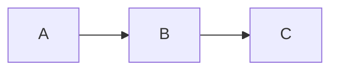
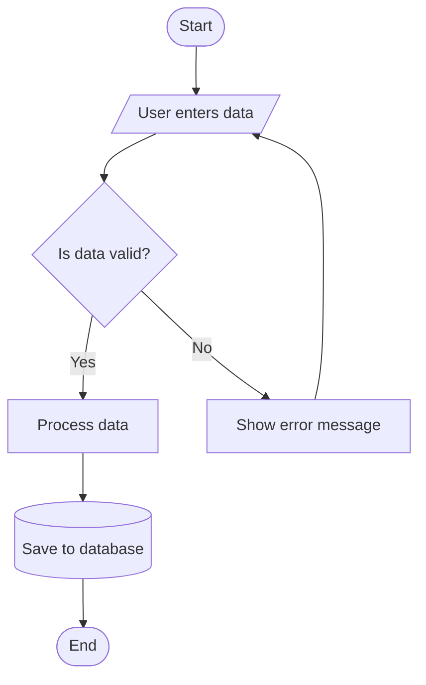
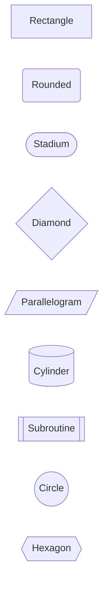
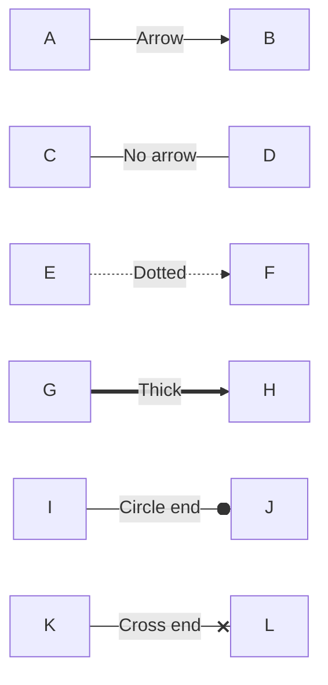
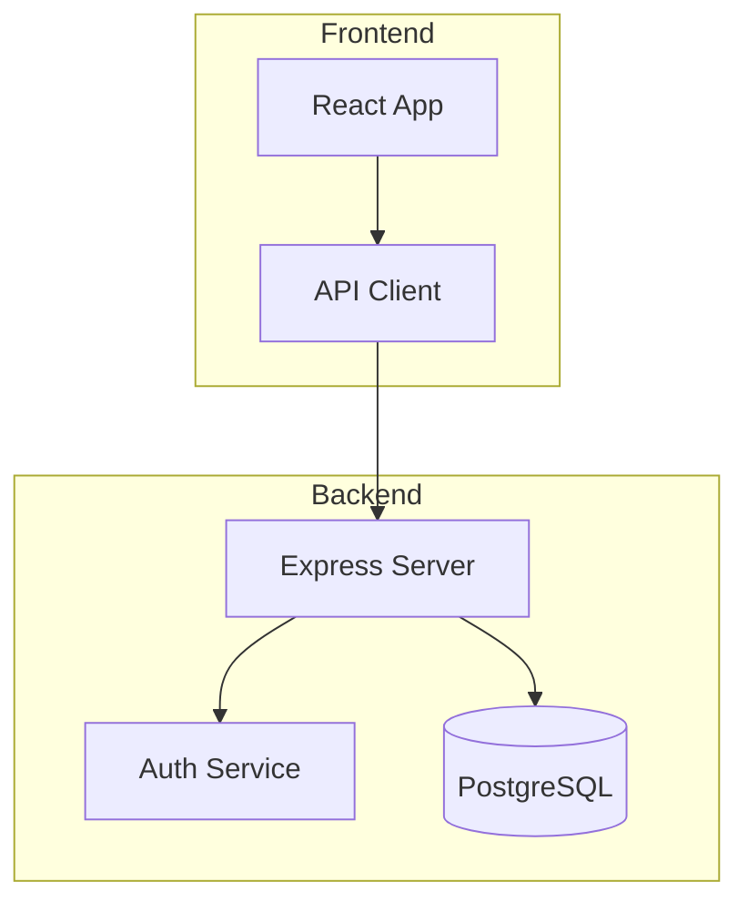
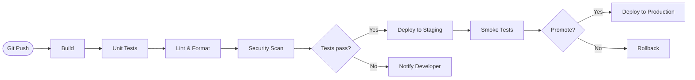
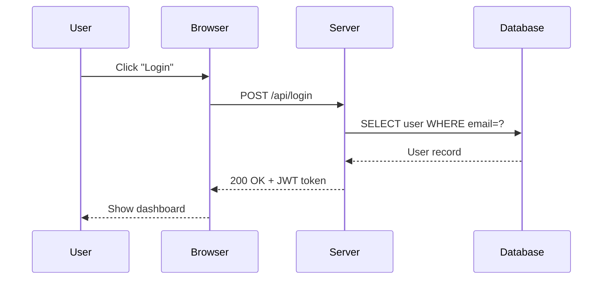
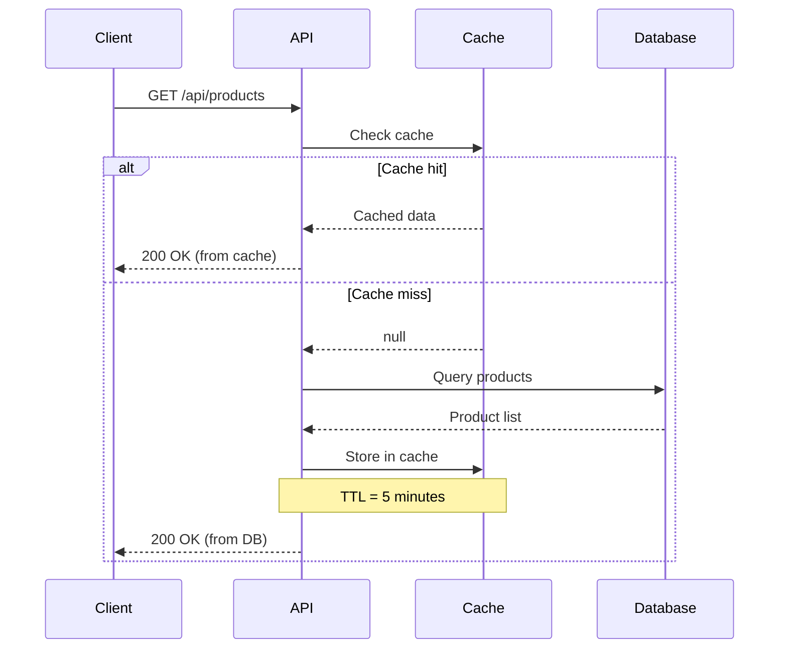
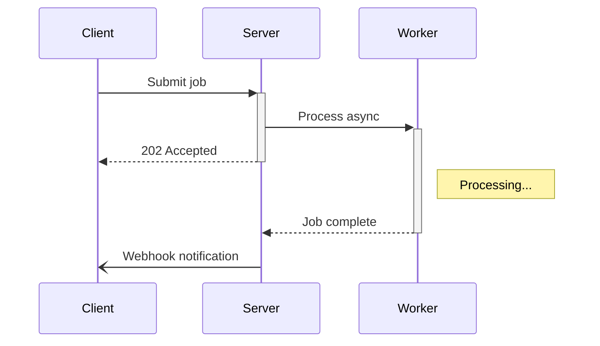
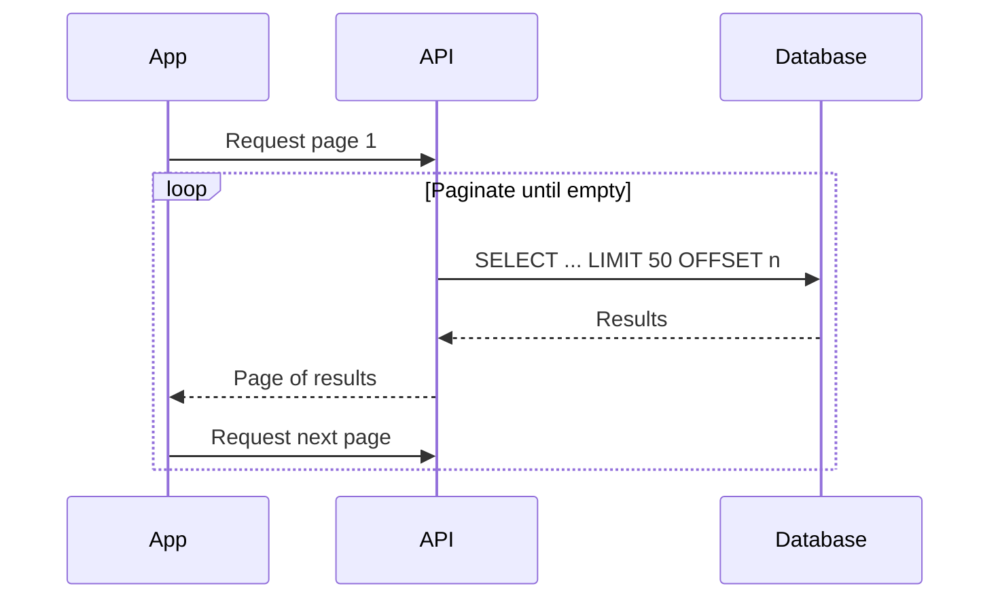

# Mermaid Diagrams Guide

[Mermaid](https://mermaid.js.org/) is a JavaScript-based diagramming tool that renders diagrams from
plain-text definitions inside Markdown code blocks. Instead of switching to a visual editor, exporting an
image, and embedding it, you describe the diagram in text and it renders automatically.

This guide covers every commonly used diagram type with practical, copy-pasteable examples.

## Getting Started

In Docusaurus, you create a Mermaid diagram with a fenced code block using the `mermaid` language
identifier:

````markdown

````

This renders as:


:::tip
Mermaid diagrams are **text-based and version-controlled**. They live alongside your documentation in Git,
making them easy to review, diff, and update. No external image files needed.
:::

---

## Flowcharts

Flowcharts are the most common diagram type. They show processes, decisions, and directional flows.

### Direction

The first keyword sets the layout direction:

| Keyword | Direction |
|---------|-----------|
| `graph TD` or `graph TB` | Top to bottom |
| `graph BT` | Bottom to top |
| `graph LR` | Left to right |
| `graph RL` | Right to left |

### Basic flowchart


Source:

````markdown

````

### Node shapes

| Syntax | Shape | Use for |
|--------|-------|---------|
| `A[Text]` | Rectangle | Process / action |
| `A(Text)` | Rounded rectangle | General step |
| `A([Text])` | Stadium / pill | Start / end |
| `A{Text}` | Diamond | Decision |
| `A[/Text/]` | Parallelogram | Input / output |
| `A[\Text\]` | Reverse parallelogram | Manual input |
| `A[(Text)]` | Cylinder | Database / storage |
| `A[[Text]]` | Subroutine | Predefined process |
| `A((Text))` | Circle | Connector / event |
| `A>Text]` | Asymmetric | Flag / signal |
| `A{{Text}}` | Hexagon | Preparation |

### All node shapes in one diagram


Source:

````markdown

````

### Link types



Source:

````markdown

````

| Syntax | Style |
|--------|-------|
| `-->` | Arrow |
| `---` | Line (no arrow) |
| `-.->` | Dotted arrow |
| `==>` | Thick arrow |
| `--o` | Circle end |
| `--x` | Cross end |
| `-- text -->` or `-->|text|` | Label on link |

### Subgraphs

Group related nodes into named sections:



Source:

````markdown

````

### Practical example: CI/CD pipeline


Source:

````markdown

````

---

## Sequence Diagrams

Sequence diagrams show interactions between participants (systems, services, users) over time.

### Basic sequence



Source:

````markdown

````

### Arrow types

| Syntax | Style |
|--------|-------|
| `->>` | Solid message arrow |
| `-->>` | Dashed message arrow, commonly used for replies |
| `-x` | Solid with cross (lost message) |
| `--x` | Dashed with cross |
| `-)` | Solid with open arrow (async) |
| `--)` | Dashed with open arrow |

### Notes, loops, and alternatives



Source:

````markdown

````

### Activation (lifelines)

Show when a participant is actively processing:



Source:

````markdown

````

### Loops



Source:

````markdown

````

### Practical example: OAuth 2.0 flow

```mermaid
sequenceDiagram
    participant User
    participant App
    participant AuthServer as Auth Server
    participant Resource as Resource Server

    User->>App: Click "Login with Google"
    App->>AuthServer: Redirect to /authorize
    AuthServer->>User: Show consent screen
    User->>AuthServer: Grant permission
    AuthServer->>App: Redirect with auth code
    App->>AuthServer: POST /token (code + secret)
    AuthServer-->>App: Access token + Refresh token
    App->>Resource: GET /api/data (Bearer token)
    Resource-->>App: Protected data
    App-->>User: Display data
```

Source:

````markdown
```mermaid
sequenceDiagram
    participant User
    participant App
    participant AuthServer as Auth Server
    participant Resource as Resource Server

    User->>App: Click "Login with Google"
    App->>AuthServer: Redirect to /authorize
    AuthServer->>User: Show consent screen
    User->>AuthServer: Grant permission
    AuthServer->>App: Redirect with auth code
    App->>AuthServer: POST /token (code + secret)
    AuthServer-->>App: Access token + Refresh token
    App->>Resource: GET /api/data (Bearer token)
    Resource-->>App: Protected data
    App-->>User: Display data
```
````

---

## Class Diagrams

Class diagrams show the structure of a system: classes, attributes, methods, and relationships.

### Basic class diagram

```mermaid
classDiagram
    class Animal {
        +String name
        +int age
        +makeSound() void
        +move() void
    }

    class Dog {
        +String breed
        +fetch() void
        +makeSound() void
    }

    class Cat {
        +boolean isIndoor
        +purr() void
        +makeSound() void
    }

    Animal <|-- Dog : extends
    Animal <|-- Cat : extends
```

Source:

````markdown
```mermaid
classDiagram
    class Animal {
        +String name
        +int age
        +makeSound() void
        +move() void
    }

    class Dog {
        +String breed
        +fetch() void
        +makeSound() void
    }

    class Cat {
        +boolean isIndoor
        +purr() void
        +makeSound() void
    }

    Animal <|-- Dog : extends
    Animal <|-- Cat : extends
```
````

### Visibility modifiers

| Prefix | Meaning |
|--------|---------|
| `+` | Public |
| `-` | Private |
| `#` | Protected |
| `~` | Package/internal |

### Relationship types

```mermaid
classDiagram
    classA --|> classB : Inheritance
    classC --* classD : Composition
    classE --o classF : Aggregation
    classG --> classH : Association
    classI ..> classJ : Dependency
    classK ..|> classL : Realization
```

Source:

````markdown
```mermaid
classDiagram
    classA -|> classB : Inheritance
    classC -* classD : Composition
    classE -o classF : Aggregation
    classG --> classH : Association
    classI ..> classJ : Dependency
    classK ..|> classL : Realization
```
````

| Syntax | Relationship |
|--------|-------------|
| `<\|--` | Inheritance (extends) |
| `*--` | Composition (owns, lifecycle-bound) |
| `o--` | Aggregation (has, independent lifecycle) |
| `-->` | Association (uses) |
| `..>` | Dependency (depends on) |
| `..\|>` | Realization (implements) |

### Practical example: repository pattern

```mermaid
classDiagram
    class UserRepository {
        <<interface>>
        +findById(id: String) User
        +findAll() List~User~
        +save(user: User) User
        +delete(id: String) void
    }

    class JpaUserRepository {
        -EntityManager em
        +findById(id: String) User
        +findAll() List~User~
        +save(user: User) User
        +delete(id: String) void
    }

    class UserService {
        -UserRepository repo
        +getUser(id: String) UserDTO
        +createUser(dto: CreateUserDTO) UserDTO
    }

    class User {
        +String id
        +String email
        +String name
        +LocalDateTime createdAt
    }

    UserRepository <|.. JpaUserRepository
    UserService --> UserRepository
    JpaUserRepository --> User
```

Source:

````markdown
```mermaid
classDiagram
    class UserRepository {
        <<interface>>
        +findById(id: String) User
        +findAll() List~User~
        +save(user: User) User
        +delete(id: String) void
    }

    class JpaUserRepository {
        -EntityManager em
        +findById(id: String) User
        +findAll() List~User~
        +save(user: User) User
        +delete(id: String) void
    }

    class UserService {
        -UserRepository repo
        +getUser(id: String) UserDTO
        +createUser(dto: CreateUserDTO) UserDTO
    }

    class User {
        +String id
        +String email
        +String name
        +LocalDateTime createdAt
    }

    UserRepository <|.. JpaUserRepository
    UserService --> UserRepository
    JpaUserRepository --> User
```
````

---

## State Diagrams

State diagrams show the possible states of a system and the transitions between them.

### Basic state diagram

```mermaid
stateDiagram-v2
    [*] --> Draft
    Draft --> InReview : Submit
    InReview --> Approved : Approve
    InReview --> Draft : Request changes
    Approved --> Published : Publish
    Published --> Archived : Archive
    Archived --> Draft : Restore
    Published --> Draft : Unpublish
    Archived --> [*]
```

Source:

````markdown
```mermaid
stateDiagram-v2
    [*] --> Draft
    Draft --> InReview : Submit
    InReview --> Approved : Approve
    InReview --> Draft : Request changes
    Approved --> Published : Publish
    Published --> Archived : Archive
    Archived --> Draft : Restore
    Published --> Draft : Unpublish
    Archived --> [*]
```
````

### Composite states

```mermaid
stateDiagram-v2
    [*] --> Idle

    state Processing {
        [*] --> Validating
        Validating --> Transforming : Valid
        Validating --> Failed : Invalid
        Transforming --> Saving
        Saving --> [*]
    }

    Idle --> Processing : Start job
    Processing --> Idle : Complete
    Processing --> Error : Exception
    Error --> Idle : Reset
```

Source:

````markdown
```mermaid
stateDiagram-v2
    [*] --> Idle

    state Processing {
        [*] --> Validating
        Validating --> Transforming : Valid
        Validating --> Failed : Invalid
        Transforming --> Saving
        Saving --> [*]
    }

    Idle --> Processing : Start job
    Processing --> Idle : Complete
    Processing --> Error : Exception
    Error --> Idle : Reset
```
````

### Practical example: order lifecycle

```mermaid
stateDiagram-v2
    [*] --> Placed

    Placed --> PaymentPending : Awaiting payment
    PaymentPending --> Paid : Payment received
    PaymentPending --> Cancelled : Timeout / Cancel

    Paid --> Picking : Send to warehouse
    Picking --> Packed : Items packed
    Packed --> Shipped : Carrier collected
    Shipped --> Delivered : Delivery confirmed

    Delivered --> [*]
    Cancelled --> [*]

    Shipped --> ReturnRequested : Customer returns
    ReturnRequested --> Returned : Return received
    Returned --> Refunded : Refund issued
    Refunded --> [*]
```

Source:

````markdown
```mermaid
stateDiagram-v2
    [*] --> Placed

    Placed --> PaymentPending : Awaiting payment
    PaymentPending --> Paid : Payment received
    PaymentPending --> Cancelled : Timeout / Cancel

    Paid --> Picking : Send to warehouse
    Picking --> Packed : Items packed
    Packed --> Shipped : Carrier collected
    Shipped --> Delivered : Delivery confirmed

    Delivered --> [*]
    Cancelled --> [*]

    Shipped --> ReturnRequested : Customer returns
    ReturnRequested --> Returned : Return received
    Returned --> Refunded : Refund issued
    Refunded --> [*]
```
````

---

## Entity Relationship Diagrams

ER diagrams model database schemas and the relationships between tables.

### Basic ER diagram

```mermaid
erDiagram
    USER ||--o{ ORDER : places
    ORDER ||--|{ ORDER_LINE : contains
    PRODUCT ||--o{ ORDER_LINE : "is in"
    USER {
        string id PK
        string email
        string name
        datetime created_at
    }
    ORDER {
        string id PK
        string user_id FK
        datetime order_date
        string status
        decimal total
    }
    ORDER_LINE {
        string id PK
        string order_id FK
        string product_id FK
        int quantity
        decimal unit_price
    }
    PRODUCT {
        string id PK
        string name
        string description
        decimal price
        int stock
    }
```

Source:

````markdown
```mermaid
erDiagram
    USER ||--o{ ORDER : places
    ORDER ||--|{ ORDER_LINE : contains
    PRODUCT ||--o{ ORDER_LINE : "is in"
    USER {
        string id PK
        string email
        string name
        datetime created_at
    }
    ORDER {
        string id PK
        string user_id FK
        datetime order_date
        string status
        decimal total
    }
    ORDER_LINE {
        string id PK
        string order_id FK
        string product_id FK
        int quantity
        decimal unit_price
    }
    PRODUCT {
        string id PK
        string name
        string description
        decimal price
        int stock
    }
```
````

### Relationship cardinality

| Syntax | Meaning |
|--------|---------|
| `\|\|--\|\|` | One to one |
| `\|\|--o{` | One to many |
| `o{--o{` | Many to many |
| `\|\|--o\|` | One to zero or one |

The symbols read as:

| Symbol | Meaning |
|--------|---------|
| `\|\|` | Exactly one |
| `o\|` | Zero or one |
| `\|{` | One or more |
| `o{` | Zero or more |

---

## Gantt Charts

Gantt charts visualize project timelines, task durations, and dependencies.

```mermaid
gantt
    title Project Timeline
    dateFormat YYYY-MM-DD
    excludes weekends

    section Planning
        Requirements           :done,    req,  2025-01-06, 5d
        Architecture design    :done,    arch, after req,   3d
        Technical review       :done,    rev,  after arch,  2d

    section Development
        Backend API            :active,  api,  after rev,   10d
        Frontend UI            :active,  ui,   after rev,   12d
        Database schema        :         db,   after rev,   5d

    section Testing
        Integration tests      :         int,  after api,   5d
        UAT                    :         uat,  after ui,    5d

    section Deployment
        Staging deploy         :         stg,  after int,   2d
        Production deploy      :crit,    prod, after uat,   1d
```

Source:

````markdown
```mermaid
gantt
    title Project Timeline
    dateFormat YYYY-MM-DD
    excludes weekends

    section Planning
        Requirements           :done,    req,  2025-01-06, 5d
        Architecture design    :done,    arch, after req,   3d
        Technical review       :done,    rev,  after arch,  2d

    section Development
        Backend API            :active,  api,  after rev,   10d
        Frontend UI            :active,  ui,   after rev,   12d
        Database schema        :         db,   after rev,   5d

    section Testing
        Integration tests      :         int,  after api,   5d
        UAT                    :         uat,  after ui,    5d

    section Deployment
        Staging deploy         :         stg,  after int,   2d
        Production deploy      :crit,    prod, after uat,   1d
```
````

### Task status markers

| Marker | Meaning |
|--------|---------|
| `done` | Completed task (filled) |
| `active` | Currently in progress (highlighted) |
| `crit` | Critical path (red) |
| *(none)* | Future task |

### Date formats

```text
2025-01-15           Specific date
after taskId         After another task completes
5d                   Duration in days
2025-01-15, 10d      Start date + duration
2025-01-15, 2025-01-25  Start and end dates
```

---

## Pie Charts

Simple proportional data visualization.

```mermaid
pie title Website Traffic Sources
    "Organic Search" : 45
    "Direct" : 25
    "Social Media" : 15
    "Referral" : 10
    "Email" : 5
```

Source:

````markdown
```mermaid
pie title Website Traffic Sources
    "Organic Search" : 45
    "Direct" : 25
    "Social Media" : 15
    "Referral" : 10
    "Email" : 5
```
````

---

## Gitgraph Diagrams

Visualize Git branching strategies and merge flows.

```mermaid
gitGraph
    commit id: "initial"
    commit id: "add-readme"

    branch develop
    checkout develop
    commit id: "dev-setup"
    commit id: "add-ci"

    branch feature/auth
    checkout feature/auth
    commit id: "auth-model"
    commit id: "auth-api"
    commit id: "auth-tests"

    checkout develop
    merge feature/auth id: "merge-auth"

    branch feature/dashboard
    checkout feature/dashboard
    commit id: "dashboard-ui"
    commit id: "dashboard-api"

    checkout develop
    merge feature/dashboard id: "merge-dashboard"

    checkout main
    merge develop id: "release-v1.0" tag: "v1.0.0"
```

Source:

````markdown
```mermaid
gitGraph
    commit id: "initial"
    commit id: "add-readme"

    branch develop
    checkout develop
    commit id: "dev-setup"
    commit id: "add-ci"

    branch feature/auth
    checkout feature/auth
    commit id: "auth-model"
    commit id: "auth-api"
    commit id: "auth-tests"

    checkout develop
    merge feature/auth id: "merge-auth"

    branch feature/dashboard
    checkout feature/dashboard
    commit id: "dashboard-ui"
    commit id: "dashboard-api"

    checkout develop
    merge feature/dashboard id: "merge-dashboard"

    checkout main
    merge develop id: "release-v1.0" tag: "v1.0.0"
```
````

---

## Mind Maps

Hierarchical brainstorming and concept mapping.

```mermaid
mindmap
    root((Web Application))
        Frontend
            React
            TypeScript
            CSS Modules
            Testing
                Jest
                Cypress
        Backend
            Node.js
            Express
            Authentication
                JWT
                OAuth
            Database
                PostgreSQL
                Redis Cache
        Infrastructure
            Docker
            CI/CD
                GitHub Actions
            Monitoring
                Grafana
                Prometheus
        Documentation
            API Docs
            User Guide
            Architecture
```

Source:

````markdown
```mermaid
mindmap
    root((Web Application))
        Frontend
            React
            TypeScript
            CSS Modules
            Testing
                Jest
                Cypress
        Backend
            Node.js
            Express
            Authentication
                JWT
                OAuth
            Database
                PostgreSQL
                Redis Cache
        Infrastructure
            Docker
            CI/CD
                GitHub Actions
            Monitoring
                Grafana
                Prometheus
        Documentation
            API Docs
            User Guide
            Architecture
```
````

---

## Timeline Diagrams

Show events or milestones along a timeline.

```mermaid
timeline
    title Product Roadmap 2025
    section Q1
        January : Requirements gathering
                : Team onboarding
        February : Architecture design
                 : Prototype
        March : MVP development
              : Internal testing
    section Q2
        April : Beta release
              : User feedback
        May : Iteration
            : Performance tuning
        June : Public launch
             : Marketing campaign
    section Q3
        July : Feature expansion
        August : Mobile app
        September : Analytics dashboard
```

Source:

````markdown
```mermaid
timeline
    title Product Roadmap 2025
    section Q1
        January : Requirements gathering
                : Team onboarding
        February : Architecture design
                 : Prototype
        March : MVP development
              : Internal testing
    section Q2
        April : Beta release
              : User feedback
        May : Iteration
            : Performance tuning
        June : Public launch
             : Marketing campaign
    section Q3
        July : Feature expansion
        August : Mobile app
        September : Analytics dashboard
```
````

---

## Quadrant Charts

Position items on a 2D matrix (like priority/effort or impact/urgency).

```mermaid
quadrantChart
    title Feature Prioritization
    x-axis Low Effort --> High Effort
    y-axis Low Impact --> High Impact

    quadrant-1 Do First
    quadrant-2 Plan Carefully
    quadrant-3 Consider Dropping
    quadrant-4 Quick Wins

    Search feature: [0.8, 0.9]
    Dark mode: [0.2, 0.5]
    Export to PDF: [0.6, 0.7]
    Emoji picker: [0.3, 0.2]
    SSO login: [0.7, 0.8]
    Font options: [0.15, 0.15]
    Auto-save: [0.25, 0.85]
    API v2: [0.9, 0.6]
```

Source:

````markdown
```mermaid
quadrantChart
    title Feature Prioritization
    x-axis Low Effort --> High Effort
    y-axis Low Impact --> High Impact

    quadrant-1 Do First
    quadrant-2 Plan Carefully
    quadrant-3 Consider Dropping
    quadrant-4 Quick Wins

    Search feature: [0.8, 0.9]
    Dark mode: [0.2, 0.5]
    Export to PDF: [0.6, 0.7]
    Emoji picker: [0.3, 0.2]
    SSO login: [0.7, 0.8]
    Font options: [0.15, 0.15]
    Auto-save: [0.25, 0.85]
    API v2: [0.9, 0.6]
```
````

---

## User Journey Diagrams

Map out user experiences through a system, tracking satisfaction at each step.

```mermaid
journey
    title User Onboarding Experience
    section Discovery
        Visit landing page: 5: User
        Read features: 4: User
        Watch demo video: 5: User
    section Sign Up
        Click sign up: 5: User
        Fill in form: 3: User
        Email verification: 2: User
        Complete profile: 3: User
    section First Use
        See dashboard: 4: User
        Create first project: 4: User
        Invite team member: 3: User
        Complete tutorial: 5: User
```

Source:

````markdown
```mermaid
journey
    title User Onboarding Experience
    section Discovery
        Visit landing page: 5: User
        Read features: 4: User
        Watch demo video: 5: User
    section Sign Up
        Click sign up: 5: User
        Fill in form: 3: User
        Email verification: 2: User
        Complete profile: 3: User
    section First Use
        See dashboard: 4: User
        Create first project: 4: User
        Invite team member: 3: User
        Complete tutorial: 5: User
```
````

The number (1-5) represents satisfaction: 1 = frustrated, 5 = delighted. This helps identify
pain points in the user experience.

---

## Tips and Best Practices

### Keep diagrams focused

A diagram that tries to show everything shows nothing. Each diagram should communicate **one idea**.
If your flowchart has more than 15-20 nodes, consider splitting it into multiple diagrams.

### Use meaningful node IDs

```text
# Hard to read
A --> B --> C --> D

# Self-documenting
Request --> Validate --> Process --> Respond
```

### Use aliases for long participant names

```mermaid
sequenceDiagram
    participant FE as Frontend App
    participant GW as API Gateway
    participant Auth as Auth Service
    participant DB as PostgreSQL

    FE->>GW: Request
    GW->>Auth: Validate token
    Auth-->>GW: Valid
    GW->>DB: Query
    DB-->>GW: Results
    GW-->>FE: Response
```

Source:

````markdown
```mermaid
sequenceDiagram
    participant FE as Frontend App
    participant GW as API Gateway
    participant Auth as Auth Service
    participant DB as PostgreSQL

    FE->>GW: Request
    GW->>Auth: Validate token
    Auth-->>GW: Valid
    GW->>DB: Query
    DB-->>GW: Results
    GW-->>FE: Response
```
````

### Escape special characters

Node labels with special characters need double quotes:

```text
A["Step 1: Initialize"]
B["Process (main)"]
C["Total = $100"]
```

Edge labels with special characters also need quotes:

```text
A -->|"O(n) complexity"| B
```

### Avoid common mistakes

| Mistake | Problem | Fix |
|---------|---------|-----|
| Spaces in node IDs | Parsing error | Use `camelCase` or underscores |
| `end` as a node ID | Conflicts with `subgraph end` keyword | Use `endNode` or `processEnd` |
| Missing direction keyword | Diagram may not render | Always start with `graph TD`, `graph LR`, etc. |
| Very long labels | Diagram becomes unreadable | Use short labels + a legend or notes |
| Too many nodes | Visual clutter | Split into multiple diagrams |

### Validate the exact target renderer

The Mermaid Live Editor is useful for quick experiments, but it is not a substitute for rendering in
the tool that will publish the diagram. Mermaid versions, enabled diagram types, sanitization rules, and
configuration can differ between Docusaurus, GitHub, GitLab, and editor extensions. Keep the rendered
diagram and its adjacent source example identical, then run this site's production build before publishing:

```bash
pnpm build
```

The build parses rendered Mermaid blocks, but it does not parse ordinary `markdown` source examples. When
you update one, copy the tested definition to the other in the same change.

### Make diagrams accessible

Do not make a diagram the sole way to convey important information. Introduce it with a useful heading,
explain the conclusion in nearby prose, and give dense diagrams a caption or a short text alternative.
Use meaningful labels instead of anonymous node IDs, keep color from being the only signal, and check both
light and dark themes. Mermaid supports accessibility directives for diagram types that implement them:

```mermaid
flowchart LR
    accTitle: Sign-in request flow
    accDescr: The browser submits credentials to the application, which validates them and returns a session.
    Browser --> Application --> Session
```

For diagrams with operational or security meaning, add a textual sequence or table as well. This also makes
the content searchable and understandable when SVG rendering is unavailable.

### Treat diagram input as untrusted

Do not interpolate user-controlled text into a Mermaid definition. Mermaid configuration can enable HTML
labels and other features that change the browser attack surface; retain the renderer's secure defaults
unless you have reviewed a specific requirement. If application data must become a diagram, validate and
escape it first, and render it in the same environment in which users will view it.

### Diagram type selection guide

| You want to show... | Use |
|---------------------|-----|
| A process or decision flow | [Flowchart](#flowcharts) |
| Interactions between systems over time | [Sequence diagram](#sequence-diagrams) |
| Code structure and relationships | [Class diagram](#class-diagrams) |
| Object lifecycle and transitions | [State diagram](#state-diagrams) |
| Database schema | [ER diagram](#entity-relationship-diagrams) |
| Project schedule | [Gantt chart](#gantt-charts) |
| Proportional data | [Pie chart](#pie-charts) |
| Git branching strategy | [Gitgraph](#gitgraph-diagrams) |
| Brainstorming / concepts | [Mind map](#mind-maps) |
| Project milestones | [Timeline](#timeline-diagrams) |
| Priority matrix | [Quadrant chart](#quadrant-charts) |
| User experience mapping | [User journey](#user-journey-diagrams) |

---

## Mermaid in Docusaurus

This site uses `@docusaurus/theme-mermaid` to render Mermaid diagrams. The configuration in
`docusaurus.config.ts` enables it:

```typescript
const config = {
    markdown: {
        mermaid: true,
    },
    themes: ['@docusaurus/theme-mermaid'],
    themeConfig: {
        mermaid: {
            theme: { light: 'default', dark: 'dark' },
        },
    },
};

export default config;
```

Diagrams automatically adapt to the site's light/dark theme. No additional configuration is needed
per diagram.

### Where Mermaid works

| Platform | Support |
|----------|---------|
| Docusaurus (with theme) | This site's configured renderer |
| GitHub Markdown | Native Mermaid rendering; supported syntax can differ from this site |
| GitLab Markdown | Native rendering on supported GitLab versions; verify the instance configuration |
| Notion | No equivalent built-in Mermaid code-block renderer; use an integration or an exported image |
| VS Code | Via an extension, whose Mermaid version and settings determine support |
| Confluence | Via an installed app/plugin |

### Diagram types not covered here

This guide focuses on broadly useful diagram types that work well in documentation. Mermaid also offers
architecture (C4-style), block, requirement, XY, Sankey, and Kanban diagrams. Consult the
[syntax reference](https://mermaid.js.org/intro/syntax-reference.html), then verify that your target
renderer supports the specific diagram type before standardizing on it.

### Responsive diagrams

Wide diagrams are hard to read on small screens. Prefer several focused diagrams over one dense canvas,
use short labels, and test the result at narrow viewport widths. For a diagram that needs more space, use
Mermaid configuration only after checking its impact in Docusaurus; renderer-level configuration can affect
every diagram on the page.

### Live editor

Use the [Mermaid Live Editor](https://mermaid.live/) to prototype diagrams before adding them to your
documentation. It provides real-time rendering, syntax validation, and export to SVG/PNG.

## External Resources

- [Mermaid Official Documentation](https://mermaid.js.org/intro/)
- [Mermaid Live Editor](https://mermaid.live/)
- [Docusaurus Mermaid Plugin](https://docusaurus.io/docs/markdown-features/diagrams)
- [GitHub Mermaid Support](https://github.blog/2022-02-14-include-diagrams-markdown-files-mermaid/)
