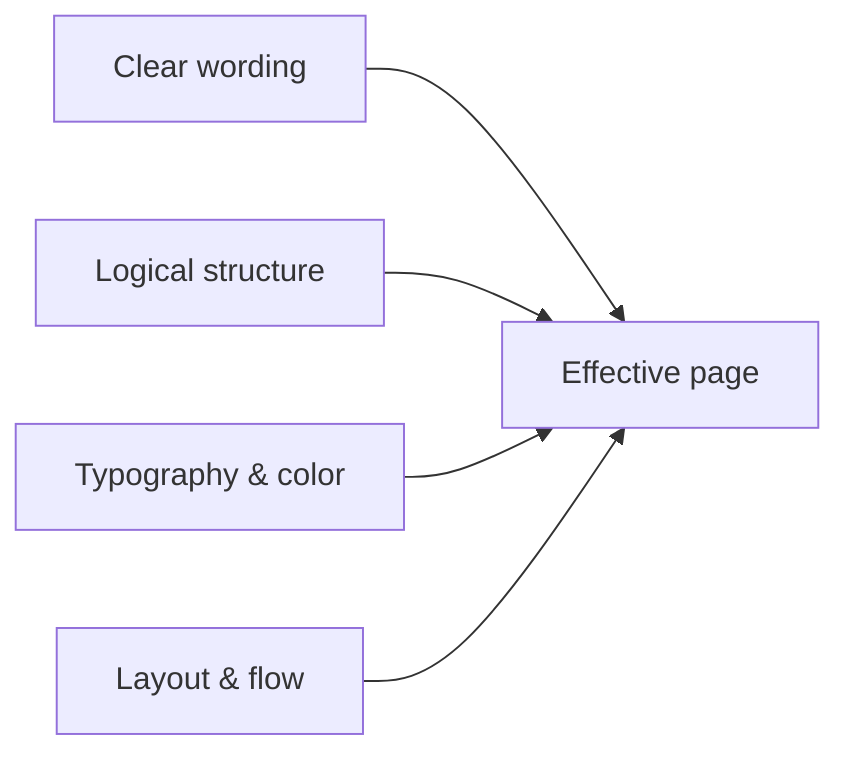

# Website Content and Presentation

This section is about **what visitors see and read**: wording, layout of ideas, visual emphasis, and color choices that support comprehension. It complements [**Content Modeling**](../content-modeling.md) (schema and CMS structure) and [**Semantic HTML**](../semantic-html.mdx) (meaningful markup). Strong content modeling and markup still fail if paragraphs are dense, calls to action compete with each other, or contrast is too low to read comfortably.

Throughout this section, **Do** blocks show patterns worth copying; **Don't** blocks show common failures (sometimes simplified for clarity).

## Goals for web content

| Goal | What it means in practice |
|------|---------------------------|
| **Scannable** | Headings, lists, and short paragraphs let people orient themselves before reading in depth. |
| **Focused** | Each view has a clear primary purpose; secondary paths stay visible but subordinate. |
| **Consistent** | Patterns for titles, buttons, and terminology repeat across the site so users learn the interface once. |
| **Inclusive** | Color contrast, typography, and structure work for low vision, zoom users, and keyboard navigation -- not only mouse users with ideal monitors. |

## Chapters in this section

1. [**Readability and typography**](./readability-and-typography.md) -- plain language, microcopy basics, line measure, body type sizing.
2. [**Structure and hierarchy**](./structure-and-hierarchy.md) -- headings, landmarks, lists, page hierarchy, visual focus, calls to action, whitespace.
3. [**Forms and interactions**](./forms-and-interactions.md) -- link text, navigation, form field labels and errors, mobile-first DOM order.
4. [**Microcopy and error states**](./microcopy-and-error-states.md) -- buttons, validation messages, empty states, loading, success, 404 pages.
5. [**Color and contrast**](./color-and-contrast.md) -- WCAG targets, design tokens, dark mode, identifying links beyond colour.
6. [**Images and media**](./images-and-media.md) -- meaningful alt text, decorative images, captions, video, audio.
7. [**Information architecture**](./information-architecture.md) -- site navigation, breadcrumbs, taxonomies, search UX, URL design.

## Page-level checklist

Use this before shipping or when auditing an existing page.

| Area | Checks |
|------|--------|
| **Copy** | First sentence answers the user's question; jargon defined or linked; errors say how to fix. |
| **Structure** | One `h1`; heading levels do not skip; sections titled descriptively. |
| **Measure & type** | Comfortable line length; body ~16px+; line-height ~1.4--1.6. |
| **Focus** | One clear primary action per major region; secondary actions visually subordinate. |
| **Color** | Text and UI meet contrast targets; focus visible; dark theme re-checked. |
| **Links & media** | Links identifiable without colour alone; meaningful `alt`; captions when needed. |

## Related reading

- [**Content Modeling**](../content-modeling.md) -- types, fields, and CMS-level structure
- [**Semantic HTML**](../semantic-html.mdx) -- meaningful elements and accessibility hooks
- [**Web Performance**](../web-performance.md) -- speed, images, and Core Web Vitals
- [**CSS: Colors and Typography**](../../css/beginners-guide/04-colors-and-typography.md) -- fonts, units, and color in stylesheets
